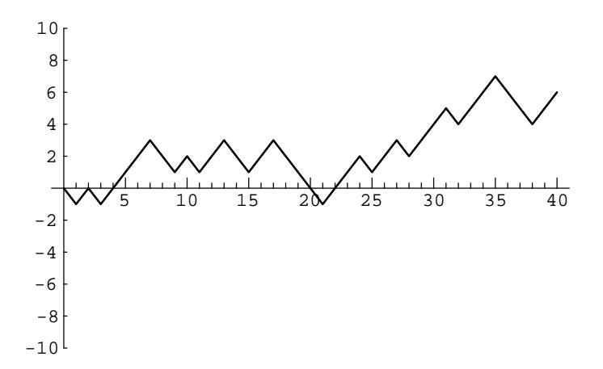
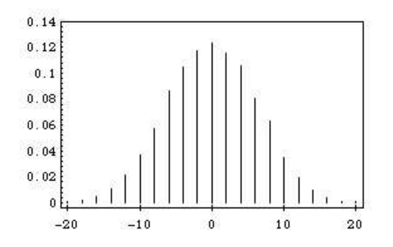
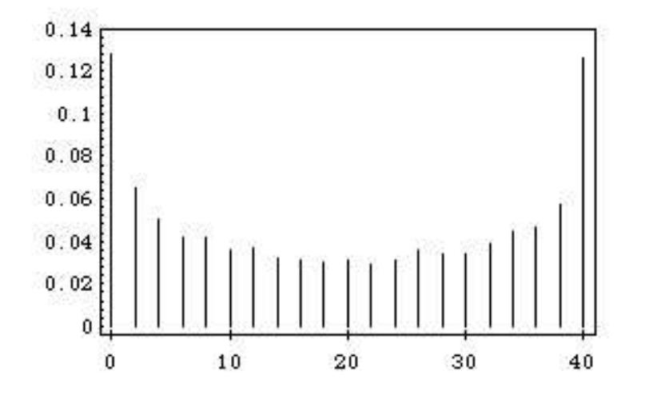
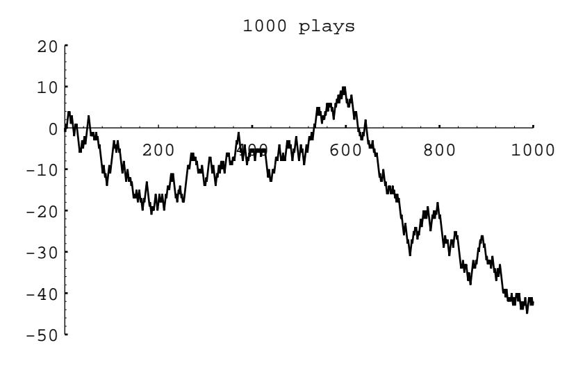
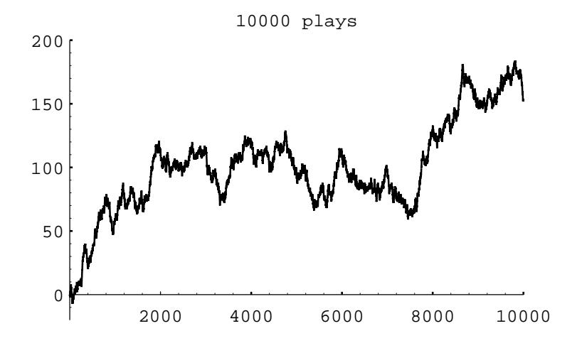

Figure 1.1: Peter's winnings in 40 plays of heads or tails.

One can understand this calculation as follows: The probability that no 6 turns up on the first toss is  $(5/6)$ . The probability that no 6 turns up on either of the first two tosses is  $(5/6)^2$ . Reasoning in the same way, the probability that no 6 turns up on any of the first four tosses is  $(5/6)^4$ . Thus, the probability of at least one 6 in the first four tosses is  $1 - (5/6)^4$ . Similarly, for the second bet, with 24 rolls, the probability that de Méré wins is  $1 - (35/36)^{24} = .491$ , and for 25 rolls it is  $1 - (35/36)^{25} = .506$ .

Using the rule of thumb mentioned above, it would require 27,000 rolls to have a reasonable chance to determine these probabilities with sufficient accuracy to assert that they lie on opposite sides of .5. It is interesting to ponder whether a gambler can detect such probabilities with the required accuracy from gambling experience. Some writers on the history of probability suggest that de Méré was, in fact, just interested in these problems as intriguing probability problems.

**Example 1.4** (Heads or Tails) For our next example, we consider a problem where the exact answer is difficult to obtain but for which simulation easily gives the qualitative results. Peter and Paul play a game called *heads or tails*. In this game, a fair coin is tossed a sequence of times—we choose 40. Each time a head comes up Peter wins 1 penny from Paul, and each time a tail comes up Peter loses 1 penny to Paul. For example, if the results of the 40 tosses are

## ТНТННННТТНТТННТТТТНННТННГНННТНННТТТНН.

Peter's winnings may be graphed as in Figure 1.1.

Peter has won 6 pennies in this particular game. It is natural to ask for the probability that he will win j pennies; here j could be any even number from  $-40$ to 40. It is reasonable to guess that the value of  $\dot{\gamma}$  with the highest probability is  $j = 0$ , since this occurs when the number of heads equals the number of tails. Similarly, we would guess that the values of  $j$  with the lowest probabilities are  $j = \pm 40.$ 

A second interesting question about this game is the following: How many times in the 40 tosses will Peter be in the lead? Looking at the graph of his winnings (Figure 1.1), we see that Peter is in the lead when his winnings are positive, but we have to make some convention when his winnings are  $0$  if we want all tosses to contribute to the number of times in the lead. We adopt the convention that, when Peter's winnings are 0, he is in the lead if he was ahead at the previous toss and not if he was behind at the previous toss. With this convention, Peter is in the lead 34 times in our example. Again, our intuition might suggest that the most likely number of times to be in the lead is  $1/2$  of 40, or 20, and the least likely numbers are the extreme cases of 40 or 0.

It is easy to settle this by simulating the game a large number of times and keeping track of the number of times that Peter's final winnings are  $j$ , and the number of times that Peter ends up being in the lead by  $k$ . The proportions over all games then give estimates for the corresponding probabilities. The program **HTSimulation** carries out this simulation. Note that when there are an even number of tosses in the game, it is possible to be in the lead only an even number of times. We have simulated this game 10,000 times. The results are shown in Figures 1.2 and 1.3. These graphs, which we call spike graphs, were generated using the program **Spikegraph**. The vertical line, or spike, at position  $x$  on the horizontal axis, has a height equal to the proportion of outcomes which equal  $x$ . Our intuition about Peter's final winnings was quite correct, but our intuition about the number of times Peter was in the lead was completely wrong. The simulation suggests that the least likely number of times in the lead is 20 and the most likely is 0 or 40. This is indeed correct, and the explanation for it is suggested by playing the game of heads or tails with a large number of tosses and looking at a graph of Peter's winnings. In Figure 1.4 we show the results of a simulation of the game, for  $1000$  tosses and in Figure 1.5 for  $10,000$  tosses.

In the second example Peter was ahead most of the time. It is a remarkable fact, however, that, if play is continued long enough, Peter's winnings will continue to come back to 0, but there will be very long times between the times that this happens. These and related results will be discussed in Chapter 12.  $\Box$ 

In all of our examples so far, we have simulated equiprobable outcomes. We illustrate next an example where the outcomes are not equiprobable.

**Example 1.5** (Horse Races) Four horses (Acorn, Balky, Chestnut, and Dolby) have raced many times. It is estimated that Acorn wins 30 percent of the time, Balky 40 percent of the time, Chestnut 20 percent of the time, and Dolby 10 percent of the time.

We can have our computer carry out one race as follows: Choose a random number x. If  $x < .3$  then we say that Acorn won. If  $.3 \leq x < .7$  then Balky wins. If  $.7 \leq x < .9$  then Chestnut wins. Finally, if  $.9 \leq x$  then Dolby wins.

The program **HorseRace** uses this method to simulate the outcomes of  $n$  races. Running this program for  $n = 10$  we found that Acorn won 40 percent of the time, Balky 20 percent of the time, Chestnut 10 percent of the time, and Dolby 30 percent

Figure 1.2: Distribution of winnings.

Figure 1.3: Distribution of number of times in the lead.  $\,$ 

Figure 1.4: Peter's winnings in  $1000$  plays of heads or tails.

Figure 1.5: Peter's winnings in 10,000 plays of heads or tails.