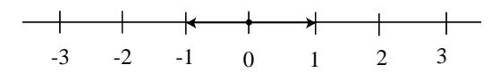
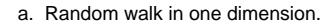
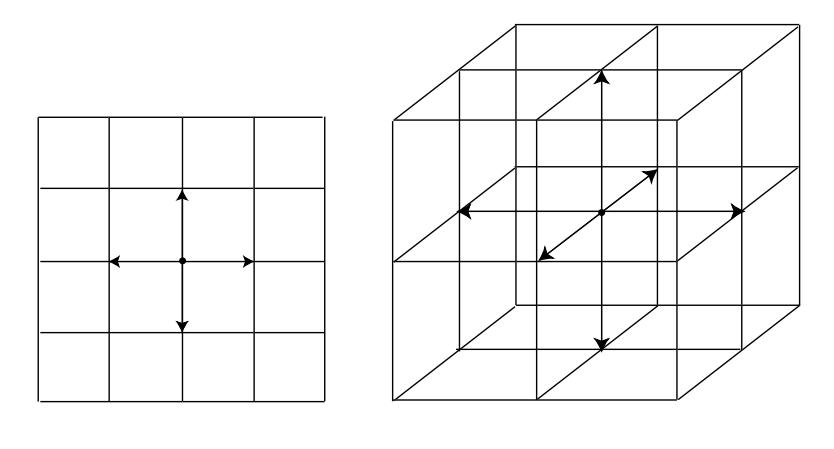

## 1.1. SIMULATION OF DISCRETE PROBABILITIES

- 3 In the early 1600s, Galileo was asked to explain the fact that, although the number of triples of integers from 1 to 6 with sum 9 is the same as the number of such triples with sum 10, when three dice are rolled, a 9 seemed to come up less often than a 10—supposedly in the experience of gamblers.
  - (a) Write a program to simulate the roll of three dice a large number of times and keep track of the proportion of times that the sum is 9 and the proportion of times it is 10.
  - (b) Can you conclude from your simulations that the gamblers were correct?
- 4 In raquetball, a player continues to serve as long as she is winning; a point is scored only when a player is serving and wins the volley. The first player to win 21 points wins the game. Assume that you serve first and have a probability .6 of winning a volley when you serve and probability .5 when your opponent serves. Estimate, by simulation, the probability that you will win a game.
- 5 Consider the bet that all three dice will turn up sixes at least once in  $n$  rolls of three dice. Calculate  $f(n)$ , the probability of at least one triple-six when three dice are rolled  $n$  times. Determine the smallest value of  $n$  necessary for a favorable bet that a triple-six will occur when three dice are rolled  $n$  times. (DeMoivre would say it should be about  $216 \log 2 = 149.7$  and so would answer 150—see Exercise 1.2.17. Do you agree with him?)
- 6 In Las Vegas, a roulette wheel has 38 slots numbered 0, 00, 1, 2, ..., 36. The 0 and 00 slots are green and half of the remaining 36 slots are red and half are black. A croupier spins the wheel and throws in an ivory ball. If you bet 1 dollar on red, you win 1 dollar if the ball stops in a red slot and otherwise you lose 1 dollar. Write a program to find the total winnings for a player who makes 1000 bets on red.
- 7 Another form of bet for roulette is to bet that a specific number (say 17) will turn up. If the ball stops on your number, you get your dollar back plus 35 dollars. If not, you lose your dollar. Write a program that will plot your winnings when you make 500 plays of roulette at Las Vegas, first when you bet each time on red (see Exercise 6), and then for a second visit to Las Vegas when you make 500 plays betting each time on the number 17. What differences do you see in the graphs of your winnings on these two occasions?
- 8 An astute student noticed that, in our simulation of the game of heads or tails (see Example 1.4), the proportion of times the player is always in the lead is very close to the proportion of times that the player's total winnings end up 0. Work out these probabilities by enumeration of all cases for two tosses and for four tosses, and see if you think that these probabilities are, in fact, the same.
- **9** The *Labouchere system* for roulette is played as follows. Write down a list of numbers, usually 1, 2, 3, 4. Bet the sum of the first and last,  $1 + 4 = 5$ , on

red. If you win, delete the first and last numbers from your list. If you lose, add the amount that you last bet to the end of your list. Then use the new list and bet the sum of the first and last numbers (if there is only one number, bet that amount). Continue until your list becomes empty. Show that, if this happens, you win the sum,  $1+2+3+4=10$ , of your original list. Simulate this system and see if you do always stop and, hence, always win. If so, why is this not a foolproof gambling system?

- 10 Another well-known gambling system is the martingale doubling system. Suppose that you are betting on red to turn up in roulette. Every time you win, bet 1 dollar next time. Every time you lose, double your previous bet. Suppose that you use this system until you have won at least 5 dollars or you have lost more than 100 dollars. Write a program to simulate this and play it a number of times and see how you do. In his book The Newcomes, W. M. Thackeray remarks "You have not played as yet? Do not do so; above all avoid a martingale if you do."10 Was this good advice?
- 11 Modify the program **HTSimulation** so that it keeps track of the maximum of Peter's winnings in each game of 40 tosses. Have your program print out the proportion of times that your total winnings take on values  $0, 2, 4, \ldots, 40$ . Calculate the corresponding exact probabilities for games of two tosses and four tosses.
- 12 In an upcoming national election for the President of the United States, a pollster plans to predict the winner of the popular vote by taking a random sample of 1000 voters and declaring that the winner will be the one obtaining the most votes in his sample. Suppose that 48 percent of the voters plan to vote for the Republican candidate and 52 percent plan to vote for the Democratic candidate. To get some idea of how reasonable the pollster's plan is, write a program to make this prediction by simulation. Repeat the simulation 100 times and see how many times the pollster's prediction would come true. Repeat your experiment, assuming now that 49 percent of the population plan to vote for the Republican candidate; first with a sample of 1000 and then with a sample of 3000. (The Gallup Poll uses about 3000.) (This idea is discussed further in Chapter 9, Section 9.1.)
- 13 The psychologist Tversky and his colleagues11 say that about four out of five people will answer (a) to the following question:

A certain town is served by two hospitals. In the larger hospital about 45 babies are born each day, and in the smaller hospital 15 babies are born each day. Although the overall proportion of boys is about 50 percent, the actual proportion at either hospital may be more or less than 50 percent on any day.

 $^{10}$  W. M. Thackerey, The Newcomes (London: Bradbury and Evans, 1854-55).

&lt;sup>11See K. McKean, "Decisions, Decisions," Discover, June 1985, pp. 22-31. Kevin McKean, Discover Magazine, ©1987 Family Media, Inc. Reprinted with permission. This popular article reports on the work of Tverksy et. al. in Judgement Under Uncertainty: Heuristics and Biases (Cambridge: Cambridge University Press, 1982).

At the end of a year, which hospital will have the greater number of days on which more than 60 percent of the babies born were boys?

- (a) the large hospital
- (b) the small hospital
- (c) neither—the number of days will be about the same.

Assume that the probability that a baby is a boy is  $.5$  (actual estimates make this more like .513). Decide, by simulation, what the right answer is to the question. Can you suggest why so many people go wrong?

- 14 You are offered the following game. A fair coin will be tossed until the first time it comes up heads. If this occurs on the *j*th toss you are paid  $2j$  dollars. You are sure to win at least 2 dollars so you should be willing to pay to play this game—but how much? Few people would pay as much as 10 dollars to play this game. See if you can decide, by simulation, a reasonable amount that you would be willing to pay, per game, if you will be allowed to make a large number of plays of the game. Does the amount that you would be willing to pay per game depend upon the number of plays that you will be allowed?
- 15 Tversky and his colleagues12 studied the records of 48 of the Philadelphia 76ers basketball games in the 1980–81 season to see if a player had times when he was hot and every shot went in, and other times when he was cold and barely able to hit the backboard. The players estimated that they were about 25 percent more likely to make a shot after a hit than after a miss. In fact, the opposite was true—the 76ers were 6 percent more likely to score after a miss than after a hit. Tyersky reports that the number of hot and cold streaks was about what one would expect by purely random effects. Assuming that a player has a fifty-fifty chance of making a shot and makes 20 shots a game, estimate by simulation the proportion of the games in which the player will have a streak of 5 or more hits.
- 16 Estimate, by simulation, the average number of children there would be in a family if all people had children until they had a boy. Do the same if all people had children until they had at least one boy and at least one girl. How many more children would you expect to find under the second scheme than under the first in 100,000 families? (Assume that boys and girls are equally likely.)
- 17 Mathematicians have been known to get some of the best ideas while sitting in a cafe, riding on a bus, or strolling in the park. In the early 1900s the famous mathematician George Pólya lived in a hotel near the woods in Zurich. He liked to walk in the woods and think about mathematics. Pólya describes the following incident:

15 

 $12$ ibid.

b. Random walk in two dimensions. c. Random walk in three dimensions.

Figure 1.6: Random walk.