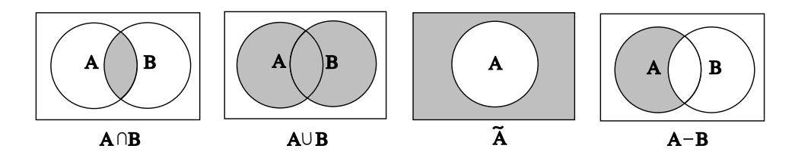

we see that

$$
2m(C) + 2m(C) + m(C) = 1
$$
,

which implies that  $5m(C) = 1$ . Hence,

$$
m(A) = \frac{2}{5}
$$
,  $m(B) = \frac{2}{5}$ ,  $m(C) = \frac{1}{5}$ .

Let E be the event that either A or C wins. Then  $E = \{A, C\}$ , and

$$
P(E) = m(A) + m(C) = \frac{2}{5} + \frac{1}{5} = \frac{3}{5} .
$$

In many cases, events can be described in terms of other events through the use of the standard constructions of set theory. We will briefly review the definitions of these constructions. The reader is referred to Figure 1.7 for Venn diagrams which illustrate these constructions.

Let A and B be two sets. Then the union of A and B is the set

$$
A \cup B = \{x \mid x \in A \text{ or } x \in B\}.
$$

The intersection of  $A$  and  $B$  is the set

$$
A \cap B = \{x \mid x \in A \text{ and } x \in B\}.
$$

The difference of  $A$  and  $B$  is the set

$$
A - B = \{x \mid x \in A \text{ and } x \notin B\}.
$$

The set A is a subset of B, written  $A \subset B$ , if every element of A is also an element of  $B$ . Finally, the complement of  $A$  is the set

$$
A = \{x \mid x \in \Omega \text{ and } x \notin A\} .
$$

The reason that these constructions are important is that it is typically the case that complicated events described in English can be broken down into simpler events using these constructions. For example, if  $A$  is the event that "it will snow tomorrow and it will rain the next day,"  $B$  is the event that "it will snow tomorrow," and C is the event that "it will rain two days from now," then A is the intersection of the events  $B$  and  $C$ . Similarly, if  $D$  is the event that "it will snow tomorrow or it will rain the next day," then  $D = B \cup C$ . (Note that care must be taken here, because sometimes the word "or" in English means that exactly one of the two alternatives will occur. The meaning is usually clear from context. In this book, we will always use the word "or" in the inclusive sense, i.e.,  $A$  or  $B$  means that at least one of the two events  $A, B$  is true.) The event  $B$  is the event that "it will not snow tomorrow." Finally, if  $E$  is the event that "it will snow tomorrow but it will not rain the next day," then  $E = B - C$ .

Figure 1.7: Basic set operations.

## Properties

**Theorem 1.1** The probabilities assigned to events by a distribution function on a sample space  $\Omega$  satisfy the following properties:

- 1.  $P(E) \geq 0$  for every  $E \subset \Omega$ .
- 2.  $P(\Omega) = 1$ .
- 3. If  $E \subset F \subset \Omega$ , then  $P(E) \leq P(F)$ .
- 4. If A and B are disjoint subsets of  $\Omega$ , then  $P(A \cup B) = P(A) + P(B)$ .
- 5.  $P(\tilde{A}) = 1 P(A)$  for every  $A \subset \Omega$ .

**Proof.** For any event E the probability  $P(E)$  is determined from the distribution  $m$  by

$$
P(E) = \sum_{\omega \in E} m(\omega) ,
$$

for every  $E \subset \Omega$ . Since the function m is nonnegative, it follows that  $P(E)$  is also nonnegative. Thus, Property 1 is true.

Property 2 is proved by the equations

$$
P(\Omega) = \sum_{\omega \in \Omega} m(\omega) = 1.
$$

Suppose that  $E \subset F \subset \Omega$ . Then every element  $\omega$  that belongs to E also belongs to  $F$ . Therefore,

$$
\sum_{\omega \in E} m(\omega) \leq \sum_{\omega \in F} m(\omega) ,
$$

since each term in the left-hand sum is in the right-hand sum, and all the terms in both sums are non-negative. This implies that

$$
P(E) \le P(F) ,
$$

and Property 3 is proved.

## 1.2. DISCRETE PROBABILITY DISTRIBUTIONS

Suppose next that A and B are disjoint subsets of  $\Omega$ . Then every element  $\omega$  of  $A \cup B$  lies either in A and not in B or in B and not in A. It follows that

$$
P(A \cup B) = \sum_{\omega \in A \cup B} m(\omega) = \sum_{\omega \in A} m(\omega) + \sum_{\omega \in B} m(\omega)
$$
  
=  $P(A) + P(B)$ ,

and Property 4 is proved.

Finally, to prove Property 5, consider the disjoint union

$$
\Omega = A \cup A
$$

Since  $P(\Omega) = 1$ , the property of disjoint additivity (Property 4) implies that

$$
1 = P(A) + P(\tilde{A}),
$$

whence  $P(\tilde{A}) = 1 - P(A)$ .

It is important to realize that Property 4 in Theorem 1.1 can be extended to more than two sets. The general finite additivity property is given by the following theorem.

**Theorem 1.2** If  $A_1, \ldots, A_n$  are pairwise disjoint subsets of  $\Omega$  (i.e., no two of the  $A_i$ 's have an element in common), then

$$
P(A_1 \cup \cdots \cup A_n) = \sum_{i=1}^n P(A_i) .
$$

**Proof.** Let  $\omega$  be any element in the union

$$
A_1\cup\cdots\cup A_n.
$$

Then  $m(\omega)$  occurs exactly once on each side of the equality in the statement of the theorem.  $\Box$ 

We shall often use the following consequence of the above theorem.

**Theorem 1.3** Let  $A_1, \ldots, A_n$  be pairwise disjoint events with  $\Omega = A_1 \cup \cdots \cup A_n$ , and let  $E$  be any event. Then

$$
P(E) = \sum_{i=1}^{n} P(E \cap A_i) .
$$

**Proof.** The sets  $E \cap A_1, \ldots, E \cap A_n$  are pairwise disjoint, and their union is the set  $E$ . The result now follows from Theorem 1.2.  $\Box$ 

 $\Box$ 

**Corollary 1.1** For any two events  $A$  and  $B$ ,

$$
P(A) = P(A \cap B) + P(A \cap B) .
$$

 $\Box$ 

Property 4 can be generalized in another way. Suppose that  $A$  and  $B$  are subsets of  $\Omega$  which are not necessarily disjoint. Then:

**Theorem 1.4** If A and B are subsets of  $\Omega$ , then

$$
P(A \cup B) = P(A) + P(B) - P(A \cap B) . \tag{1.1}
$$

**Proof.** The left side of Equation 1.1 is the sum of  $m(\omega)$  for  $\omega$  in either A or B. We must show that the right side of Equation 1.1 also adds  $m(\omega)$  for  $\omega$  in A or B. If  $\omega$ is in exactly one of the two sets, then it is counted in only one of the three terms on the right side of Equation 1.1. If it is in both  $A$  and  $B$ , it is added twice from the calculations of  $P(A)$  and  $P(B)$  and subtracted once for  $P(A \cap B)$ . Thus it is counted exactly once by the right side. Of course, if  $A \cap B = \emptyset$ , then Equation 1.1 reduces to Property 4. (Equation 1.1 can also be generalized; see Theorem 3.8.)  $\Box$ 

## **Tree Diagrams**

**Example 1.10** Let us illustrate the properties of probabilities of events in terms of three tosses of a coin. When we have an experiment which takes place in stages such as this, we often find it convenient to represent the outcomes by a *tree diagram* as shown in Figure 1.8.

A  $path$  through the tree corresponds to a possible outcome of the experiment. For the case of three tosses of a coin, we have eight paths  $\omega_1, \omega_2, \ldots, \omega_8$  and, assuming each outcome to be equally likely, we assign equal weight,  $1/8$ , to each path. Let E be the event "at least one head turns up." Then  $E$  is the event "no heads turn up." This event occurs for only one outcome, namely,  $\omega_8 = TTT$ . Thus,  $E = \{TTT\}$  and we have

$$
P(\tilde{E}) = P({\text{TTT}}) = m({\text{TTT}}) = \frac{1}{8}.
$$

By Property 5 of Theorem 1.1,

$$
P(E) = 1 - P(\tilde{E}) = 1 - \frac{1}{8} = \frac{7}{8}
$$

Note that we shall often find it is easier to compute the probability that an event does not happen rather than the probability that it does. We then use Property 5 to obtain the desired probability.