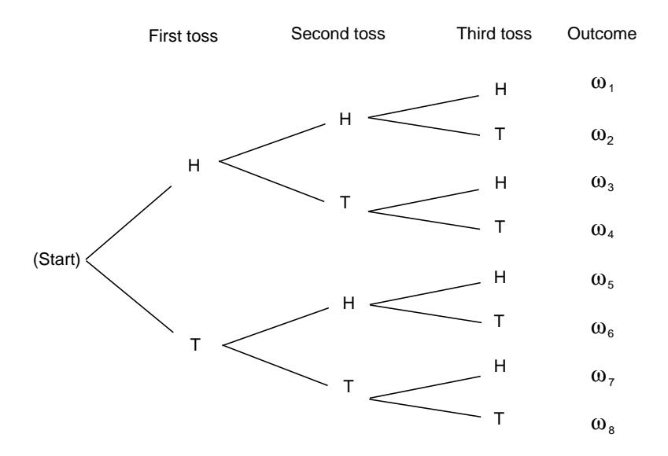

Figure 1.8: Tree diagram for three tosses of a coin.

Let  $A$  be the event "the first outcome is a head," and  $B$  the event "the second" outcome is a tail." By looking at the paths in Figure 1.8, we see that

$$
P(A) = P(B) = \frac{1}{2}.
$$

Moreover,  $A \cap B = {\omega_3, \omega_4}$ , and so  $P(A \cap B) = 1/4$ . Using Theorem 1.4, we obtain

$$
P(A \cup B) = P(A) + P(B) - P(A \cap B)
$$
  
=  $\frac{1}{2} + \frac{1}{2} - \frac{1}{4} = \frac{3}{4}$ .

Since  $A \cup B$  is the 6-element set,

$$
A \cup B = \{HHH, HHT, HTH, HTT, TTH, TTT\},
$$

we see that we obtain the same result by direct enumeration.

 $\Box$ 

In our coin tossing examples and in the die rolling example, we have assigned an equal probability to each possible outcome of the experiment. Corresponding to this method of assigning probabilities, we have the following definitions.

## **Uniform Distribution**

**Definition 1.3** The *uniform distribution* on a sample space  $\Omega$  containing *n* elements is the function  $m$  defined by

$$
m(\omega) = \frac{1}{n}
$$

for every  $\omega \in \Omega$ .

 $\Box$ 

It is important to realize that when an experiment is analyzed to describe its possible outcomes, there is no single correct choice of sample space. For the experiment of tossing a coin twice in Example 1.2, we selected the 4-element set  $\Omega = \{HH, HT, TH, TT\}$  as a sample space and assigned the uniform distribution function. These choices are certainly intuitively natural. On the other hand, for some purposes it may be more useful to consider the 3-element sample space  $\overline{\Omega} = \{0, 1, 2\}$ in which  $0$  is the outcome "no heads turn up," 1 is the outcome "exactly one head turns up," and 2 is the outcome "two heads turn up." The distribution function  $\bar{m}$ on  $\overline{\Omega}$  defined by the equations

$$
\bar{m}(0) = \frac{1}{4}
$$
,  $\bar{m}(1) = \frac{1}{2}$ ,  $\bar{m}(2) = \frac{1}{4}$ 

is the one corresponding to the uniform probability density on the original sample space  $\Omega$ . Notice that it is perfectly possible to choose a different distribution function. For example, we may consider the uniform distribution function on  $\Omega$ , which is the function  $\bar{q}$  defined by

$$
\overline{q}(0) = \overline{q}(1) = \overline{q}(2) = \frac{1}{3}.
$$

Although  $\bar{q}$  is a perfectly good distribution function, it is not consistent with observed data on coin tossing.

**Example 1.11** Consider the experiment that consists of rolling a pair of dice. We take as the sample space  $\Omega$  the set of all ordered pairs  $(i, j)$  of integers with  $1 \leq i \leq 6$ and  $1 \leq j \leq 6$ . Thus,

$$
\Omega = \{ (i, j) : 1 \le i, j \le 6 \} .
$$

(There is at least one other "reasonable" choice for a sample space, namely the set of all unordered pairs of integers, each between 1 and 6. For a discussion of why we do not use this set, see Example 3.14.) To determine the size of  $\Omega$ , we note that there are six choices for i, and for each choice of i there are six choices for j, leading to 36 different outcomes. Let us assume that the dice are not loaded. In mathematical terms, this means that we assume that each of the 36 outcomes is equally likely, or equivalently, that we adopt the uniform distribution function on  $\Omega$  by setting

$$
m((i,j)) = \frac{1}{36}, \qquad 1 \le i, j \le 6.
$$

What is the probability of getting a sum of 7 on the roll of two dice—or getting a sum of 11? The first event, denoted by  $E$ , is the subset

$$
E = \{(1,6), (6,1), (2,5), (5,2), (3,4), (4,3)\}.
$$

A sum of 11 is the subset  $F$  given by

$$
F = \{(5,6), (6,5)\}.
$$

Consequently,

$$
P(E) = \sum_{\omega \in E} m(\omega) = 6 \cdot \frac{1}{36} = \frac{1}{6},
$$
  
$$
P(F) = \sum_{\omega \in F} m(\omega) = 2 \cdot \frac{1}{36} = \frac{1}{18}.
$$

What is the probability of getting neither *snakeeyes* (double ones) nor *boxcars* (double sixes)? The event of getting either one of these two outcomes is the set

$$
E = \{(1,1), (6,6)\}.
$$

Hence, the probability of obtaining neither is given by

$$
P(\tilde{E}) = 1 - P(E) = 1 - \frac{2}{36} = \frac{17}{18} .
$$

In the above coin tossing and the dice rolling experiments, we have assigned an equal probability to each outcome. That is, in each example, we have chosen the uniform distribution function. These are the natural choices provided the coin is a fair one and the dice are not loaded. However, the decision as to which distribution function to select to describe an experiment is not a part of the basic mathematical theory of probability. The latter begins only when the sample space and the distribution function have already been defined.

## Determination of Probabilities

It is important to consider ways in which probability distributions are determined in practice. One way is by *symmetry*. For the case of the toss of a coin, we do not see any physical difference between the two sides of a coin that should affect the chance of one side or the other turning up. Similarly, with an ordinary die there is no essential difference between any two sides of the die, and so by symmetry we assign the same probability for any possible outcome. In general, considerations of symmetry often suggest the uniform distribution function. Care must be used here. We should not always assume that, just because we do not know any reason to suggest that one outcome is more likely than another, it is appropriate to assign equal probabilities. For example, consider the experiment of guessing the sex of a newborn child. It has been observed that the proportion of newborn children who are boys is about .513. Thus, it is more appropriate to assign a distribution function which assigns probability .513 to the outcome boy and probability .487 to the outcome girl than to assign probability  $1/2$  to each outcome. This is an example where we use statistical observations to determine probabilities. Note that these probabilities may change with new studies and may vary from country to country. Genetic engineering might even allow an individual to influence this probability for a particular case.

## Odds

Statistical estimates for probabilities are fine if the experiment under consideration can be repeated a number of times under similar circumstances. However, assume that, at the beginning of a football season, you want to assign a probability to the event that Dartmouth will beat Harvard. You really do not have data that relates to this year's football team. However, you can determine your own personal probability

by seeing what kind of a bet you would be willing to make. For example, suppose that you are willing to make a 1 dollar bet giving 2 to 1 odds that Dartmouth will win. Then you are willing to pay 2 dollars if Dartmouth loses in return for receiving 1 dollar if Dartmouth wins. This means that you think the appropriate probability for Dartmouth winning is  $2/3$ .

Let us look more carefully at the relation between odds and probabilities. Suppose that we make a bet at r to 1 odds that an event  $E$  occurs. This means that we think that it is r times as likely that  $E$  will occur as that  $E$  will not occur. In general, r to s odds will be taken to mean the same thing as  $r/s$  to 1, i.e., the ratio between the two numbers is the only quantity of importance when stating odds.

Now if it is  $r$  times as likely that  $E$  will occur as that  $E$  will not occur, then the probability that E occurs must be  $r/(r+1)$ , since we have

$$
P(E) = r P(\tilde{E})
$$

and

$$
P(E) + P(\tilde{E}) = 1.
$$

In general, the statement that the odds are  $r$  to  $s$  in favor of an event  $E$  occurring is equivalent to the statement that

$$
P(E) = \frac{r/s}{(r/s) + 1}
$$
$$
= \frac{r}{r+s}.
$$

If we let  $P(E) = p$ , then the above equation can easily be solved for  $r/s$  in terms of p; we obtain  $r/s = p/(1-p)$ . We summarize the above discussion in the following definition.

**Definition 1.4** If  $P(E) = p$ , the *odds* in favor of the event E occurring are r: s (r to s) where  $r/s = p/(1-p)$ . If r and s are given, then p can be found by using the equation  $p = r/(r + s)$ .  $\Box$ 

**Example 1.12** (Example 1.9 continued) In Example 1.9 we assigned probability  $1/5$  to the event that candidate C wins the race. Thus the odds in favor of C winning are  $1/5$ :  $4/5$ . These odds could equally well have been written as 1: 4,  $2:8$ , and so forth. A bet that C wins is fair if we receive 4 dollars if C wins and pay 1 dollar if C loses.  $\Box$ 

## **Infinite Sample Spaces**

If a sample space has an infinite number of points, then the way that a distribution function is defined depends upon whether or not the sample space is countable. A sample space is *countably infinite* if the elements can be counted, i.e., can be put in one-to-one correspondence with the positive integers, and *uncountably infinite*