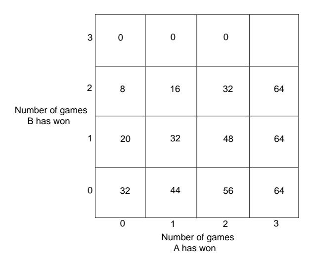

Figure 1.9: Pascal's table.

quicker and neater, which I would like to tell you here in a few words: for henceforth I would like to open my heart to you, if I may, as I am so overjoyed with our agreement. I see that truth is the same in Toulouse as in Paris.

Here, more or less, is what I do to show the fair value of each game, when two opponents play, for example, in three games and each person has staked 32 pistoles.

Let us say that the first man had won twice and the other once; now they play another game, in which the conditions are that, if the first wins, he takes all the stakes; that is 64 pistoles; if the other wins it, then they have each won two games, and therefore, if they wish to stop playing, they must each take back their own stake, that is, 32 pistoles each.

Then consider, Sir, if the first man wins, he gets 64 pistoles; if he loses he gets 32. Thus if they do not wish to risk this last game but wish to separate without playing it, the first man must say: 'I am certain to get 32 pistoles, even if I lost I still get them; but as for the other 32, perhaps I will get them, perhaps you will get them, the chances are equal. Let us then divide these 32 pistoles in half and give one half to me as well as my 32 which are mine for sure.' He will then have 48 pistoles and the other  $16...$ 

Pascal's argument produces the table illustrated in Figure 1.9 for the amount due player A at any quitting point.

Each entry in the table is the average of the numbers just above and to the right of the number. This fact, together with the known values when the tournament is completed, determines all the values in this table. If player A wins the first game, then he needs two games to win and B needs three games to win; and so, if the tounament is called off, A should receive 44 pistoles.

The letter in which Fermat presented his solution has been lost; but fortunately, Pascal describes Fermat's method in a letter dated Monday, 24th August, 1654. From Pascal's letter:21

This is your procedure when there are two players: If two players, playing several games, find themselves in that position when the first man needs two games and second needs three, then to find the fair division of stakes, you say that one must know in how many games the play will be absolutely decided.

It is easy to calculate that this will be in *four* games, from which you can conclude that it is necessary to see in how many ways four games can be arranged between two players, and one must see how many combinations would make the first man win and how many the second and to share out the stakes in this proportion. I would have found it difficult to understand this if I had not known it myself already; in fact you had explained it with this idea in mind.

Fermat realized that the number of ways that the game might be finished may not be equally likely. For example, if A needs two more games and B needs three to win, two possible ways that the tournament might go for A to win are WLW and LWLW. These two sequences do not have the same chance of occurring. To avoid this difficulty, Fermat extended the play, adding fictitious plays, so that all the ways that the games might go have the same length, namely four. He was shrewd enough to realize that this extension would not change the winner and that he now could simply count the number of sequences favorable to each player since he had made them all equally likely. If we list all possible ways that the extended game of four plays might go, we obtain the following 16 possible outcomes of the play:

| WWWW. | WI W W | LWWW  | LLWW       |
|-------|--------|-------|------------|
| WWWL  | WIWL   | LWWL  | T.I.WL     |
| WWLW. | WLLW.  | LWLW  | LLLW       |
| WWLL  | WLLL   | T.WLL | - 1.1.1.1. |

Player A wins in the cases where there are at least two wins (the 11 underlined cases), and B wins in the cases where there are at least three losses (the other 5 cases). Since A wins in 11 of the 16 possible cases Fermat argued that the probability that A wins is  $11/16$ . If the stakes are 64 pistoles, A should receive 44 pistoles in agreement with Pascal's result. Pascal and Fermat developed more systematic methods for counting the number of favorable outcomes for problems like this, and this will be one of our central problems. Such counting methods fall under the subject of *combinatorics*, which is the topic of Chapter 3.

 $\overline{^{21}}$ ibid., p. 239ff.

We see that these two mathematicians arrived at two very different ways to solve the problem of points. Pascal's method was to develop an algorithm and use it to calculate the fair division. This method is easy to implement on a computer and easy to generalize. Fermat's method, on the other hand, was to change the problem into an equivalent problem for which he could use counting or combinatorial methods. We will see in Chapter 3 that, in fact, Fermat used what has become known as Pascal's triangle! In our study of probability today we shall find that both the algorithmic approach and the combinatorial approach share equal billing, just as they did 300 years ago when probability got its start.

## **Exercises**

- 1 Let  $\Omega = \{a, b, c\}$  be a sample space. Let  $m(a) = 1/2, m(b) = 1/3$ , and  $m(c) = 1/6$ . Find the probabilities for all eight subsets of  $\Omega$ .
- **2** Give a possible sample space  $\Omega$  for each of the following experiments:
  - (a) An election decides between two candidates A and B.
  - (b) A two-sided coin is tossed.
  - (c) A student is asked for the month of the year and the day of the week on which her birthday falls.
  - (d) A student is chosen at random from a class of ten students.
  - (e) You receive a grade in this course.
- 3 For which of the cases in Exercise 2 would it be reasonable to assign the uniform distribution function?
- 4 Describe in words the events specified by the following subsets of

 $\Omega = \{HHH, HHT, HTH, HTT, THH, THT, TTH, TTT\}$ 

(see Example  $1.6$ ).

- (a)  $E = \{HHH, HHT, HTH, HTT\}.$
- (b)  $E = \{HHH, TTT\}.$
- (c)  $E = \{HHT, HTH, THH\}.$
- (d)  $E = \{ HHT, HTH, HTT, THH, THT, TTH, TTT \}.$
- 5 What are the probabilities of the events described in Exercise 4?
- 6 A die is loaded in such a way that the probability of each face turning up is proportional to the number of dots on that face. (For example, a six is three times as probable as a two.) What is the probability of getting an even number in one throw?
- 7 Let A and B be events such that  $P(A \cap B) = 1/4$ ,  $P(\tilde{A}) = 1/3$ , and  $P(B) =$ 1/2. What is  $P(A \cup B)$ ?

- 8 A student must choose one of the subjects, art, geology, or psychology, as an elective. She is equally likely to choose art or psychology and twice as likely to choose geology. What are the respective probabilities that she chooses art, geology, and psychology?
- 9 A student must choose exactly two out of three electives: art, French, and mathematics. He chooses art with probability  $5/8$ , French with probability  $5/8$ , and art and French together with probability 1/4. What is the probability that he chooses mathematics? What is the probability that he chooses either art or French?
- 10 For a bill to come before the president of the United States, it must be passed by both the House of Representatives and the Senate. Assume that, of the bills presented to these two bodies, 60 percent pass the House, 80 percent pass the Senate, and 90 percent pass at least one of the two. Calculate the probability that the next bill presented to the two groups will come before the president.
- 11 What odds should a person give in favor of the following events?
  - (a) A card chosen at random from a 52-card deck is an ace.
  - (b) Two heads will turn up when a coin is tossed twice.
  - (c) Boxcars (two sixes) will turn up when two dice are rolled.
- 12 You offer 3 : 1 odds that your friend Smith will be elected mayor of your city. What probability are you assigning to the event that Smith wins?
- 13 In a horse race, the odds that Romance will win are listed as 2 : 3 and that Downhill will win are  $1:2$ . What odds should be given for the event that either Romance or Downhill wins?
- 14 Let X be a random variable with distribution function  $m_X(x)$  defined by

 $m_X(-1) = 1/5$ ,  $m_X(0) = 1/5$ ,  $m_X(1) = 2/5$ ,  $m_X(2) = 1/5$ .

- (a) Let Y be the random variable defined by the equation  $Y = X + 3$ . Find the distribution function  $m_Y(y)$  of Y.
- (b) Let Z be the random variable defined by the equation  $Z = X^2$ . Find the distribution function  $m_Z(z)$  of Z.
- \*15 John and Mary are taking a mathematics course. The course has only three grades: A, B, and C. The probability that John gets a B is .3. The probability that Mary gets a B is .4. The probability that neither gets an A but at least one gets a B is .1. What is the probability that at least one gets a B but neither gets a C?
- 16 In a fierce battle, not less than 70 percent of the soldiers lost one eye, not less than 75 percent lost one ear, not less than 80 percent lost one hand, and not