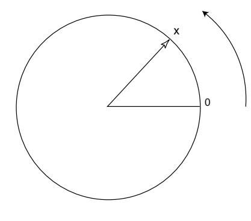
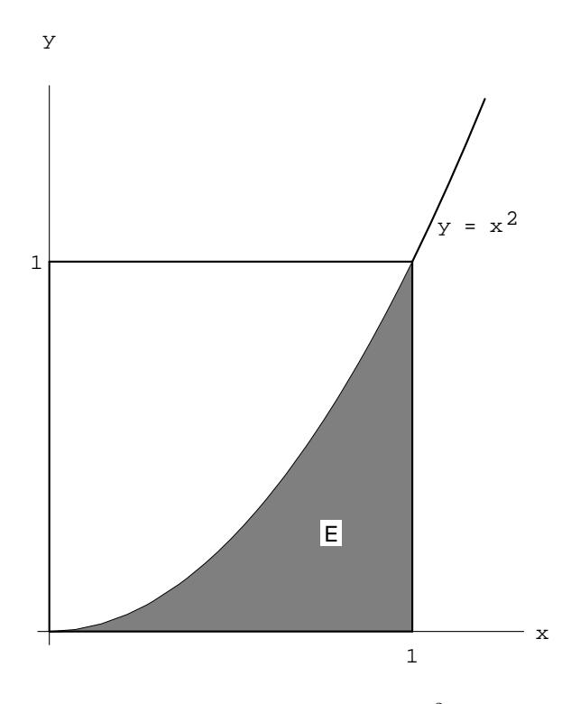
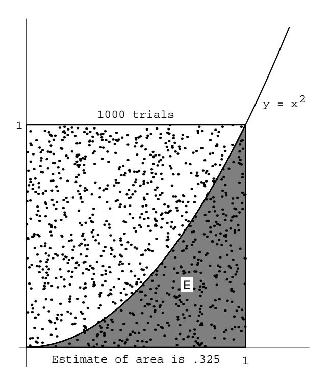

## Chapter 2

# **Continuous Probability Densities**

#### $2.1\,$ **Simulation of Continuous Probabilities**

In this section we shall show how we can use computer simulations for experiments that have a whole continuum of possible outcomes.

#### Probabilities

**Example 2.1** We begin by constructing a spinner, which consists of a circle of *unit circumference* and a pointer as shown in Figure 2.1. We pick a point on the circle and label it 0, and then label every other point on the circle with the distance, say  $x$ , from 0 to that point, measured counterclockwise. The experiment consists of spinning the pointer and recording the label of the point at the tip of the pointer. We let the random variable  $X$  denote the value of this outcome. The sample space is clearly the interval  $[0, 1)$ . We would like to construct a probability model in which each outcome is equally likely to occur.

If we proceed as we did in Chapter 1 for experiments with a finite number of possible outcomes, then we must assign the probability 0 to each outcome, since otherwise, the sum of the probabilities, over all of the possible outcomes, would not equal 1. (In fact, summing an uncountable number of real numbers is a tricky business; in particular, in order for such a sum to have any meaning, at most countably many of the summands can be different than 0.) However, if all of the assigned probabilities are 0, then the sum is 0, not 1, as it should be.

In the next section, we will show how to construct a probability model in this situation. At present, we will assume that such a model can be constructed. We will also assume that in this model, if  $E$  is an arc of the circle, and  $E$  is of length p, then the model will assign the probability p to  $E$ . This means that if the pointer is spun, the probability that it ends up pointing to a point in  $E$  equals  $p$ , which is certainly a reasonable thing to expect.

Figure 2.1: A spinner.

To simulate this experiment on a computer is an easy matter. Many computer software packages have a function which returns a random real number in the interval  $[0,1]$ . Actually, the returned value is always a rational number, and the values are determined by an algorithm, so a sequence of such values is not truly random. Nevertheless, the sequences produced by such algorithms behave much like theoretically random sequences, so we can use such sequences in the simulation of experiments. On occasion, we will need to refer to such a function. We will call this function rnd.  $\Box$ 

### Monte Carlo Procedure and Areas

It is sometimes desirable to estimate quantities whose exact values are difficult or impossible to calculate exactly. In some of these cases, a procedure involving chance, called a Monte Carlo procedure, can be used to provide such an estimate.

**Example 2.2** In this example we show how simulation can be used to estimate areas of plane figures. Suppose that we program our computer to provide a pair  $(x, y)$  or numbers, each chosen independently at random from the interval [0, 1]. Then we can interpret this pair  $(x, y)$  as the coordinates of a point chosen at random from the unit square. Events are subsets of the unit square. Our experience with Example 2.1 suggests that the point is equally likely to fall in subsets of equal area. Since the total area of the square is 1, the probability of the point falling in a specific subset  $E$  of the unit square should be equal to its area. Thus, we can estimate the area of any subset of the unit square by estimating the probability that a point chosen at random from this square falls in the subset.

We can use this method to estimate the area of the region  $E$  under the curve  $y = x^2$  in the unit square (see Figure 2.2). We choose a large number of points  $(x, y)$ at random and record what fraction of them fall in the region  $E = \{ (x, y) : y \leq x^2 \}.$ 

The program **MonteCarlo** will carry out this experiment for us. Running this program for  $10,000$  experiments gives an estimate of  $.325$  (see Figure 2.3).

From these experiments we would estimate the area to be about  $1/3$ . Of course,

Figure 2.2: Area under  $y = x^2$ .

for this simple region we can find the exact area by calculus. In fact,

Area of 
$$
E = \int_0^1 x^2 dx = \frac{1}{3}
$$
.

We have remarked in Chapter 1 that, when we simulate an experiment of this type  $n$  times to estimate a probability, we can expect the answer to be in error by at most  $1/\sqrt{n}$  at least 95 percent of the time. For 10,000 experiments we can expect an accuracy of 0.01, and our simulation did achieve this accuracy.

This same argument works for any region  $E$  of the unit square. For example, suppose E is the circle with center  $(1/2, 1/2)$  and radius  $1/2$ . Then the probability that our random point  $(x, y)$  lies inside the circle is equal to the area of the circle, that is.

$$
P(E) = \pi \left(\frac{1}{2}\right)^2 = \frac{\pi}{4}
$$

If we did not know the value of  $\pi$ , we could estimate the value by performing this experiment a large number of times!  $\Box$ 

The above example is not the only way of estimating the value of  $\pi$  by a chance experiment. Here is another way, discovered by Buffon.1

&lt;sup>1G. L. Buffon, in "Essai d'Arithmétique Morale," Oeuvres Complètes de Buffon avec Supplements, tome iv, ed. Duménil (Paris, 1836).

Figure 2.3: Computing the area by simulation.

### **Buffon's Needle**

**Example 2.3** Suppose that we take a card table and draw across the top surface a set of parallel lines a unit distance apart. We then drop a common needle of unit length at random on this surface and observe whether or not the needle lies across one of the lines. We can describe the possible outcomes of this experiment by coordinates as follows: Let  $d$  be the distance from the center of the needle to the nearest line. Next, let L be the line determined by the needle, and define  $\theta$  as the acute angle that the line  $L$  makes with the set of parallel lines. (The reader should certainly be wary of this description of the sample space. We are attempting to coordinatize a set of line segments. To see why one must be careful in the choice of coordinates, see Example 2.6.) Using this description, we have  $0 \leq d \leq 1/2$ , and  $0 \le \theta \le \pi/2$ . Moreover, we see that the needle lies across the nearest line if and only if the hypotenuse of the triangle (see Figure 2.4) is less than half the length of the needle, that is,

$$
\frac{d}{\sin \theta} < \frac{1}{2} .
$$

Now we assume that when the needle drops, the pair  $(\theta, d)$  is chosen at random from the rectangle  $0 \le \theta \le \pi/2$ ,  $0 \le d \le 1/2$ . We observe whether the needle lies across the nearest line (i.e., whether  $d \leq (1/2) \sin \theta$ ). The probability of this event E is the fraction of the area of the rectangle which lies inside  $E$  (see Figure 2.5).