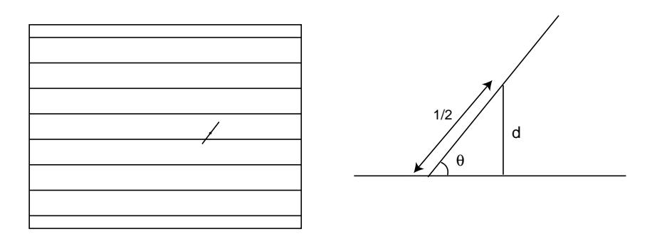
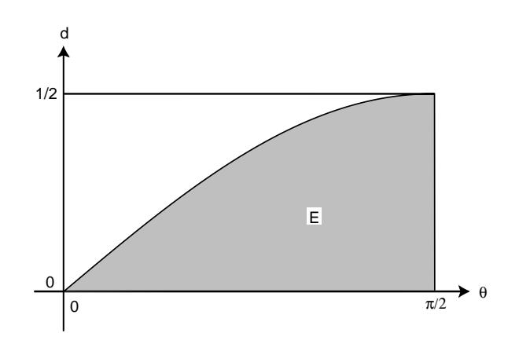
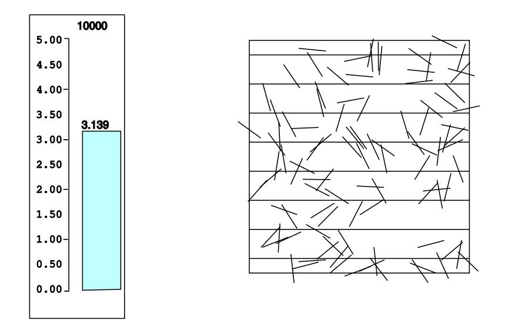
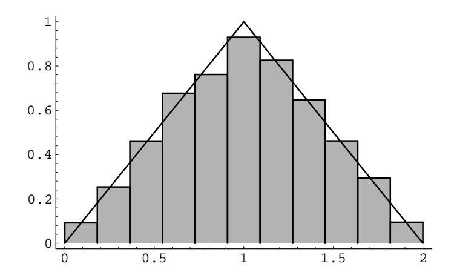
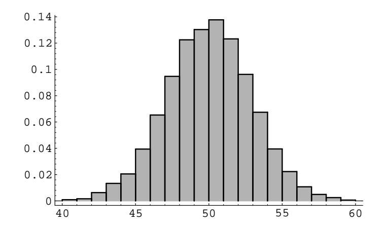
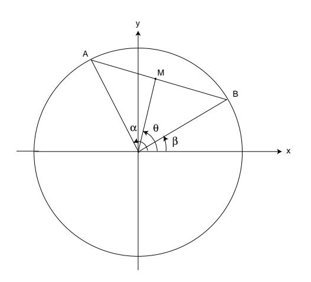

Figure 2.4: Buffon's experiment.

Figure 2.5: Set E of pairs  $(\theta, d)$  with  $d < \frac{1}{2} \sin \theta$ .

Now the area of the rectangle is  $\pi/4$ , while the area of E is

Area = 
$$
\int_0^{\pi/2} \frac{1}{2} \sin \theta \, d\theta = \frac{1}{2}.
$$

Hence, we get

$$
P(E) = \frac{1/2}{\pi/4} = \frac{2}{\pi} .
$$

The program BuffonsNeedle simulates this experiment. In Figure 2.6, we show the position of every 100th needle in a run of the program in which 10,000 needles were "dropped." Our final estimate for  $\pi$  is 3.139. While this was within 0.003 of the true value for  $\pi$  we had no right to expect such accuracy. The reason for this is that our simulation estimates  $P(E)$ . While we can expect this estimate to be in error by at most 0.001, a small error in  $P(E)$  gets magnified when we use this to compute  $\pi = 2/P(E)$ . Perlman and Wichura, in their article "Sharpening Buffon's

Figure 2.6: Simulation of Buffon's needle experiment.

Needle,"2 show that we can expect to have an error of not more than  $5/\sqrt{n}$  about 95 percent of the time. Here  $n$  is the number of needles dropped. Thus for 10,000 needles we should expect an error of no more than 0.05, and that was the case here. We see that a large number of experiments is necessary to get a decent estimate for  $\pi$ .  $\Box$ 

In each of our examples so far, events of the same size are equally likely. Here is an example where they are not. We will see many other such examples later.

**Example 2.4** Suppose that we choose two random real numbers in  $[0,1]$  and add them together. Let  $X$  be the sum. How is  $X$  distributed?

To help understand the answer to this question, we can use the program Areabargraph. This program produces a bar graph with the property that on each interval, the *area*, rather than the height, of the bar is equal to the fraction of outcomes that fell in the corresponding interval. We have carried out this experiment 1000 times; the data is shown in Figure 2.7. It appears that the function defined by

$$
f(x) = \begin{cases} x, & \text{if } 0 \le x \le 1, \\ 2 - x, & \text{if } 1 < x \le 2 \end{cases}
$$

fits the data very well. (It is shown in the figure.) In the next section, we will see that this function is the "right" function. By this we mean that if  $a$  and  $b$  are any two real numbers between 0 and 2, with  $a \leq b$ , then we can use this function to calculate the probability that  $a \leq X \leq b$ . To understand how this calculation might be performed, we again consider Figure 2.7. Because of the way the bars were constructed, the sum of the areas of the bars corresponding to the interval

&lt;sup>2M. D. Perlman and M. J. Wichura, "Sharpening Buffon's Needle," The American Statistician, vol. 29, no. 4 (1975), pp. 157-163.

Figure 2.7: Sum of two random numbers.

[a, b] approximates the probability that  $a \leq X \leq b$ . But the sum of the areas of these bars also approximates the integral

$$
\int_a^b f(x) \, dx \; .
$$

This suggests that for an experiment with a continuum of possible outcomes, if we find a function with the above property, then we will be able to use it to calculate probabilities. In the next section, we will show how to determine the function  $f(x)$ .  $\Box$ 

**Example 2.5** Suppose that we choose 100 random numbers in [0, 1], and let X represent their sum. How is  $X$  distributed? We have carried out this experiment 10000 times; the results are shown in Figure 2.8. It is not so clear what function fits the bars in this case. It turns out that the type of function which does the job is called a *normal density* function. This type of function is sometimes referred to as a "bell-shaped" curve. It is among the most important functions in the subject of probability, and will be formally defined in Section 5.2 of Chapter 4.3.  $\Box$ 

Our last example explores the fundamental question of how probabilities are assigned.

## **Bertrand's Paradox**

**Example 2.6** A chord of a circle is a line segment both of whose endpoints lie on the circle. Suppose that a chord is drawn at random in a unit circle. What is the probability that its length exceeds  $\sqrt{3}$ ?

Our answer will depend on what we mean by random, which will depend, in turn, on what we choose for coordinates. The sample space  $\Omega$  is the set of all possible chords in the circle. To find coordinates for these chords, we first introduce a

Figure 2.8: Sum of 100 random numbers.

Figure 2.9: Random chord.

rectangular coordinate system with origin at the center of the circle (see Figure 2.9). We note that a chord of a circle is perpendicular to the radial line containing the midpoint of the chord. We can describe each chord by giving:

- 1. The rectangular coordinates  $(x, y)$  of the midpoint M, or
- 2. The polar coordinates  $(r, \theta)$  of the midpoint M, or
- 3. The polar coordinates  $(1, \alpha)$  and  $(1, \beta)$  of the endpoints A and B.

In each case we shall interpret  $at$  random to mean: choose these coordinates at random.

We can easily estimate this probability by computer simulation. In programming this simulation, it is convenient to include certain simplifications, which we describe in turn: