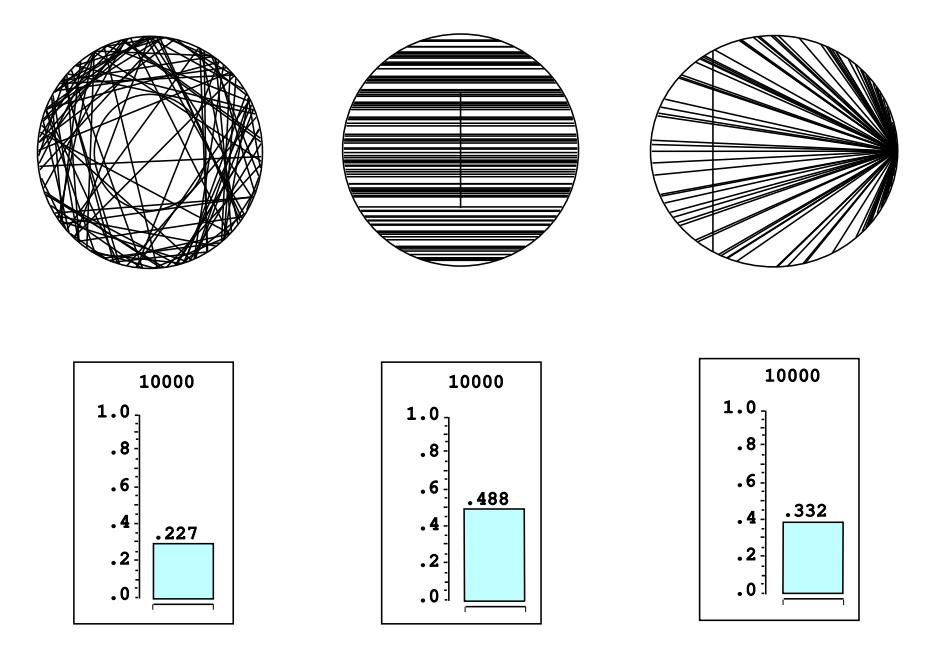

## 2.1. SIMULATION OF CONTINUOUS PROBABILITIES

1. To simulate this case, we choose values for x and y from  $[-1, 1]$  at random. Then we check whether  $x^2 + y^2 \le 1$ . If not, the point  $M = (x, y)$  lies outside the circle and cannot be the midpoint of any chord, and we ignore it. Otherwise,  $M$  lies inside the circle and is the midpoint of a unique chord, whose length  $L$  is given by the formula:

$$
L = 2\sqrt{1 - (x^2 + y^2)}.
$$

2. To simulate this case, we take account of the fact that any rotation of the circle does not change the length of the chord, so we might as well assume in advance that the chord is horizontal. Then we choose r from  $[-1, 1]$  at random, and compute the length of the resulting chord with midpoint  $(r, \pi/2)$  by the formula:

$$
L = 2\sqrt{1 - r^2}
$$

3. To simulate this case, we assume that one endpoint, say B, lies at  $(1,0)$  (i.e., that  $\beta = 0$ ). Then we choose a value for  $\alpha$  from  $[0, 2\pi]$  at random and compute the length of the resulting chord, using the Law of Cosines, by the formula:

$$
L=\sqrt{2-2\cos\alpha}.
$$

The program BertrandsParadox carries out this simulation. Running this program produces the results shown in Figure 2.10. In the first circle in this figure, a smaller circle has been drawn. Those chords which intersect this smaller circle have length at least  $\sqrt{3}$ . In the second circle in the figure, the vertical line intersects all chords of length at least  $\sqrt{3}$ . In the third circle, again the vertical line intersects all chords of length at least  $\sqrt{3}$ .

In each case we run the experiment a large number of times and record the fraction of these lengths that exceed  $\sqrt{3}$ . We have printed the results of every 100th trial up to 10,000 trials.

It is interesting to observe that these fractions are *not* the same in the three cases; they depend on our choice of coordinates. This phenomenon was first observed by Bertrand, and is now known as *Bertrand's paradox*.3 It is actually not a paradox at all; it is merely a reflection of the fact that different choices of coordinates will lead to different assignments of probabilities. Which assignment is "correct" depends on what application or interpretation of the model one has in mind.

One can imagine a real experiment involving throwing long straws at a circle drawn on a card table. A "correct" assignment of coordinates should not depend on where the circle lies on the card table, or where the card table sits in the room. Jaynes4 has shown that the only assignment which meets this requirement is  $(2)$ . In this sense, the assignment  $(2)$  is the natural, or "correct" one (see Exercise 11).

We can easily see in each case what the true probabilities are if we note that  $\sqrt{3}$  is the length of the side of an inscribed equilateral triangle. Hence, a chord has

 $3J.$  Bertrand, *Calcul des Probabilités* (Paris: Gauthier-Villars, 1889).

&lt;sup>4E. T. Jaynes, "The Well-Posed Problem," in Papers on Probability, Statistics and Statistical Physics, R. D. Rosencrantz, ed. (Dordrecht: D. Reidel, 1983), pp. 133-148.

Figure 2.10: Bertrand's paradox.

length  $L > \sqrt{3}$  if its midpoint has distance  $d < 1/2$  from the origin (see Figure 2.9). The following calculations determine the probability that  $L > \sqrt{3}$  in each of the three cases.

1.  $L > \sqrt{3}$  if  $(x, y)$  lies inside a circle of radius 1/2, which occurs with probability

$$
p = \frac{\pi (1/2)^2}{\pi (1)^2} = \frac{1}{4} .
$$

2.  $L > \sqrt{3}$  if  $|r| < 1/2$ , which occurs with probability

$$
\frac{1/2 - (-1/2)}{1 - (-1)} = \frac{1}{2}.
$$

3.  $L > \sqrt{3}$  if  $2\pi/3 < \alpha < 4\pi/3$ , which occurs with probability

$$
\frac{4\pi/3 - 2\pi/3}{2\pi - 0} = \frac{1}{3}
$$

We see that our simulations agree quite well with these theoretical values.  $\Box$ 

## **Historical Remarks**

G. L. Buffon (1707-1788) was a natural scientist in the eighteenth century who applied probability to a number of his investigations. His work is found in his monumental 44-volume *Histoire Naturelle* and its supplements.5 For example, he

 ${}^{5}G$ . L. Buffon, *Histoire Naturelle*, *Generali et Particular avec le Descriptión du Cabinet du* Roy, 44 vols. (Paris: L'Imprimerie Royale, 1749-1803).

|                   |        | Length of Number of Number of |           | Estimate  |
|-------------------|--------|-------------------------------|-----------|-----------|
| Experimenter      | needle | casts                         | crossings | for $\pi$ |
| Wolf, 1850        | .8     | 5000                          | 2532      | 3.1596    |
| Smith, 1855       | .6     | 3204                          | 1218.5    | 3.1553    |
| De Morgan, c.1860 | 1.0    | 600                           | 382.5     | 3.137     |
| Fox, 1864         | .75    | 1030                          | 489       | 3.1595    |
| Lazzerini, 1901   | .83    | 3408                          | 1808      | 3.1415929 |
| Reina, 1925       | .5419  | 2520                          | 869       | 3.1795    |

Table 2.1: Buffon needle experiments to estimate  $\pi$ .

presented a number of mortality tables and used them to compute, for each age group, the expected remaining lifetime. From his table he observed: the expected remaining lifetime of an infant of one year is 33 years, while that of a man of 21 years is also approximately 33 years. Thus, a father who is not yet 21 can hope to live longer than his one year old son, but if the father is 40, the odds are already 3 to 2 that his son will outlive him.6

Buffon wanted to show that not all probability calculations rely only on algebra, but that some rely on geometrical calculations. One such problem was his famous "needle problem" as discussed in this chapter.7 In his original formulation, Buffon describes a game in which two gamblers drop a loaf of French bread on a wide-board floor and bet on whether or not the loaf falls across a crack in the floor. Buffon asked: what length  $L$  should the bread loaf be, relative to the width  $W$  of the floorboards, so that the game is fair. He found the correct answer  $(L = (\pi/4)W)$ using essentially the methods described in this chapter. He also considered the case of a checkerboard floor, but gave the wrong answer in this case. The correct answer was given later by Laplace.

The literature contains descriptions of a number of experiments that were actually carried out to estimate  $\pi$  by this method of dropping needles. N. T. Gridgeman8 discusses the experiments shown in Table 2.1. (The halves for the number of crossing comes from a compromise when it could not be decided if a crossing had actually occurred.) He observes, as we have, that 10,000 casts could do no more than establish the first decimal place of  $\pi$  with reasonable confidence. Gridgeman points out that, although none of the experiments used even 10,000 casts, they are surprisingly good, and in some cases, too good. The fact that the number of casts is not always a round number would suggest that the authors might have resorted to clever stopping to get a good answer. Gridgeman comments that Lazzerini's estimate turned out to agree with a well-known approximation to  $\pi$ ,  $355/113 = 3.1415929$ , discovered by the fifth-century Chinese mathematician, Tsu Ch'ungchih. Gridgeman says that he did not have Lazzerini's original report, and while waiting for it (knowing

&lt;sup>6G. L. Buffon, "Essai d'Arithmétique Morale," p. 301.

 $7$ ibid., pp. 277-278.

&lt;sup>8N. T. Gridgeman, "Geometric Probability and the Number  $\pi$ " Scripta Mathematika, vol. 25, no. 3, (1960), pp. 183–195.

only the needle crossed a line 1808 times in 3408 casts) deduced that the length of the needle must have been  $5/6$ . He calculated this from Buffon's formula, assuming  $\pi = 355/113$ :

$$
L = \frac{\pi P(E)}{2} = \frac{1}{2} \left( \frac{355}{113} \right) \left( \frac{1808}{3408} \right) = \frac{5}{6} = .8333.
$$

Even with careful planning one would have to be extremely lucky to be able to stop so cleverly.

The second author likes to trace his interest in probability theory to the Chicago World's Fair of 1933 where he observed a mechanical device dropping needles and displaying the ever-changing estimates for the value of  $\pi$ . (The first author likes to trace his interest in probability theory to the second author.)

## Exercises

- \*1 In the spinner problem (see Example 2.1) divide the unit circumference into three arcs of length  $1/2$ ,  $1/3$ , and  $1/6$ . Write a program to simulate the spinner experiment 1000 times and print out what fraction of the outcomes fall in each of the three arcs. Now plot a bar graph whose bars have width  $1/2$ ,  $1/3$ , and  $1/6$ , and areas equal to the corresponding fractions as determined by your simulation. Show that the heights of the bars are all nearly the same.
- 2 Do the same as in Exercise 1, but divide the unit circumference into five arcs of length  $1/3$ ,  $1/4$ ,  $1/5$ ,  $1/6$ , and  $1/20$ .
- **3** Alter the program **MonteCarlo** to estimate the area of the circle of radius  $1/2$  with center at  $(1/2, 1/2)$  inside the unit square by choosing 1000 points at random. Compare your results with the true value of  $\pi/4$ . Use your results to estimate the value of  $\pi$ . How accurate is your estimate?
- 4 Alter the program **MonteCarlo** to estimate the area under the graph of  $y = \sin \pi x$  inside the unit square by choosing 10,000 points at random. Now calculate the true value of this area and use your results to estimate the value of  $\pi$ . How accurate is your estimate?
- 5 Alter the program MonteCarlo to estimate the area under the graph of  $y = 1/(x + 1)$  in the unit square in the same way as in Exercise 4. Calculate the true value of this area and use your simulation results to estimate the value of log 2. How accurate is your estimate?
- 6 To simulate the Buffon's needle problem we choose independently the distance d and the angle  $\theta$  at random, with  $0 \leq d \leq 1/2$  and  $0 \leq \theta \leq \pi/2$ , and check whether  $d \leq (1/2) \sin \theta$ . Doing this a large number of times, we estimate  $\pi$  as  $2/a$ , where a is the fraction of the times that  $d \leq (1/2) \sin \theta$ . Write a program to estimate  $\pi$  by this method. Run your program several times for each of 100, 1000, and 10,000 experiments. Does the accuracy of the experimental approximation for  $\pi$  improve as the number of experiments increases?