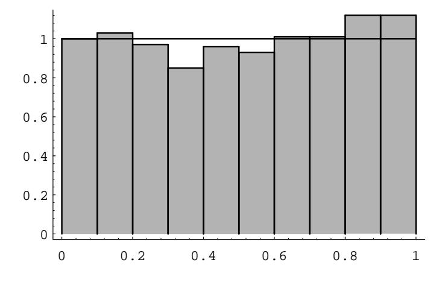

## 2.1. SIMULATION OF CONTINUOUS PROBABILITIES

7 For Buffon's needle problem, Laplace9 considered a grid with *horizontal* and *vertical* lines one unit apart. He showed that the probability that a needle of length  $L \leq 1$  crosses at least one line is

$$
p = \frac{4L - L^2}{\pi}
$$

To simulate this experiment we choose at random an angle  $\theta$  between 0 and  $\pi/2$  and independently two numbers  $d_1$  and  $d_2$  between 0 and  $L/2$ . (The two numbers represent the distance from the center of the needle to the nearest horizontal and vertical line.) The needle crosses a line if either  $d_1 \leq (L/2) \sin \theta$ or  $d_2 \leq (L/2) \cos \theta$ . We do this a large number of times and estimate  $\pi$  as

$$
\bar{\pi} = \frac{4L - L^2}{a} \ ,
$$

where  $a$  is the proportion of times that the needle crosses at least one line. Write a program to estimate  $\pi$  by this method, run your program for 100, 1000, and 10,000 experiments, and compare your results with Buffon's method described in Exercise 6. (Take  $L = 1$ .)

8 A long needle of length L much bigger than 1 is dropped on a grid with horizontal and vertical lines one unit apart. We will see (in Exercise 6.3.28) that the average number  $a$  of lines crossed is approximately

$$
a=\frac{4L}{\pi}.
$$

To estimate  $\pi$  by simulation, pick an angle  $\theta$  at random between 0 and  $\pi/2$  and compute  $L \sin \theta + L \cos \theta$ . This may be used for the number of lines crossed. Repeat this many times and estimate  $\pi$  by

$$
\bar{\pi}=\frac{4L}{a}
$$

where  $a$  is the average number of lines crossed per experiment. Write a program to simulate this experiment and run your program for the number of experiments equal to 100, 1000, and 10,000. Compare your results with the methods of Laplace or Buffon for the same number of experiments. (Use  $L = 100.$ 

The following exercises involve experiments in which not all outcomes are equally likely. We shall consider such experiments in detail in the next section, but we invite you to explore a few simple cases here.

**9** A large number of waiting time problems have an *exponential distribution* of outcomes. We shall see (in Section 5.2) that such outcomes are simulated by computing  $(-1/\lambda)$  log(rnd), where  $\lambda > 0$ . For waiting times produced in this way, the average waiting time is  $1/\lambda$ . For example, the times spent waiting for

 ${}^{9}P$ . S. Laplace, *Théorie Analytique des Probabilités* (Paris: Courcier, 1812).

a car to pass on a highway, or the times between emissions of particles from a radioactive source, are simulated by a sequence of random numbers, each of which is chosen by computing  $(-1/\lambda)\log(rnd)$ , where  $1/\lambda$  is the average time between cars or emissions. Write a program to simulate the times between cars when the average time between cars is 30 seconds. Have your program compute an area bar graph for these times by breaking the time interval from 0 to 120 into 24 subintervals. On the same pair of axes, plot the function  $f(x) = (1/30)e^{-(1/30)x}$ . Does the function fit the bar graph well?

10 In Exercise 9, the distribution came "out of a hat." In this problem, we will again consider an experiment whose outcomes are not equally likely. We will determine a function  $f(x)$  which can be used to determine the probability of certain events. Let  $T$  be the right triangle in the plane with vertices at the points  $(0,0)$ ,  $(1,0)$ , and  $(0,1)$ . The experiment consists of picking a point at random in the interior of  $T$ , and recording only the x-coordinate of the point. Thus, the sample space is the set  $[0,1]$ , but the outcomes do not seem to be equally likely. We can simulate this experiment by asking a computer to return two random real numbers in  $[0,1]$ , and recording the first of these two numbers if their sum is less than 1. Write this program and run it for 10,000 trials. Then make a bar graph of the result, breaking the interval  $[0,1]$  into 10 intervals. Compare the bar graph with the function  $f(x) = 2 - 2x$ . Now show that there is a constant c such that the height of  $T$  at the x-coordinate value x is c times  $f(x)$  for every x in [0, 1]. Finally, show that

$$
\int_0^1 f(x) dx = 1.
$$

How might one use the function  $f(x)$  to determine the probability that the outcome is between .2 and .5?

11 Here is another way to pick a chord at random on the circle of unit radius. Imagine that we have a card table whose sides are of length 100. We place coordinate axes on the table in such a way that each side of the table is parallel to one of the axes, and so that the center of the table is the origin. We now place a circle of unit radius on the table so that the center of the circle is the origin. Now pick out a point  $(x_0, y_0)$  at random in the square, and an angle  $\theta$ at random in the interval  $(-\pi/2, \pi/2)$ . Let  $m = \tan \theta$ . Then the equation of the line passing through  $(x_0, y_0)$  with slope m is

$$
y=y_0+m(x-x_0),
$$

and the distance of this line from the center of the circle (i.e., the origin) is

$$
d = \left| \frac{y_0 - mx_0}{\sqrt{m^2 + 1}} \right|
$$

We can use this distance formula to check whether the line intersects the circle (i.e., whether  $d < 1$ ). If so, we consider the resulting chord a *random* chord. This describes an experiment of dropping a long straw at random on a table on which a circle is drawn.

Write a program to simulate this experiment 10000 times and estimate the probability that the length of the chord is greater than  $\sqrt{3}$ . How does your estimate compare with the results of Example 2.6?

## 2.2 **Continuous Density Functions**

In the previous section we have seen how to simulate experiments with a whole continuum of possible outcomes and have gained some experience in thinking about such experiments. Now we turn to the general problem of assigning probabilities to the outcomes and events in such experiments. We shall restrict our attention here to those experiments whose sample space can be taken as a suitably chosen subset of the line, the plane, or some other Euclidean space. We begin with some simple examples.

## **Spinners**

**Example 2.7** The spinner experiment described in Example 2.1 has the interval  $[0,1)$  as the set of possible outcomes. We would like to construct a probability model in which each outcome is equally likely to occur. We saw that in such a model, it is necessary to assign the probability  $0$  to each outcome. This does not at all mean that the probability of *every* event must be zero. On the contrary, if we let the random variable  $X$  denote the outcome, then the probability

$$
P(0 \le X \le 1)
$$

that the head of the spinner comes to rest *somewhere* in the circle, should be equal to 1. Also, the probability that it comes to rest in the upper half of the circle should be the same as for the lower half, so that

$$
P\left(0 \le X < \frac{1}{2}\right) = P\left(\frac{1}{2} \le X < 1\right) = \frac{1}{2} \; .
$$

More generally, in our model, we would like the equation

$$
P(c \le X < d) = d - c
$$

to be true for every choice of  $c$  and  $d$ .

If we let  $E = [c, d]$ , then we can write the above formula in the form

$$
P(E) = \int_E f(x) \, dx \ ,
$$

where  $f(x)$  is the constant function with value 1. This should remind the reader of the corresponding formula in the discrete case for the probability of an event:

$$
P(E) = \sum_{\omega \in E} m(\omega)
$$

Figure 2.11: Spinner experiment.

The difference is that in the continuous case, the quantity being integrated,  $f(x)$ , is not the probability of the outcome  $x$ . (However, if one uses infinitesimals, one can consider  $f(x) dx$  as the probability of the outcome x.)

In the continuous case, we will use the following convention. If the set of outcomes is a set of real numbers, then the individual outcomes will be referred to by small Roman letters such as x. If the set of outcomes is a subset of  $R^2$ , then the individual outcomes will be denoted by  $(x, y)$ . In either case, it may be more convenient to refer to an individual outcome by using  $\omega$ , as in Chapter 1.

Figure 2.11 shows the results of 1000 spins of the spinner. The function  $f(x)$ is also shown in the figure. The reader will note that the area under  $f(x)$  and above a given interval is approximately equal to the fraction of outcomes that fell in that interval. The function  $f(x)$  is called the *density function* of the random variable X. The fact that the area under  $f(x)$  and above an interval corresponds to a probability is the defining property of density functions. A precise definition of density functions will be given shortly.  $\Box$ 

## Darts

**Example 2.8** A game of darts involves throwing a dart at a circular target of *unit radius*. Suppose we throw a dart once so that it hits the target, and we observe where it lands.

To describe the possible outcomes of this experiment, it is natural to take as our sample space the set  $\Omega$  of all the points in the target. It is convenient to describe these points by their rectangular coordinates, relative to a coordinate system with origin at the center of the target, so that each pair  $(x, y)$  of coordinates with  $x^2+y^2 \leq$ 1 describes a possible outcome of the experiment. Then  $\Omega = \{ (x, y) : x^2 + y^2 \leq 1 \}$ is a subset of the Euclidean plane, and the event  $E = \{ (x, y) : y > 0 \}$ , for example, corresponds to the statement that the dart lands in the upper half of the target, and so forth. Unless there is reason to believe otherwise (and with experts at the