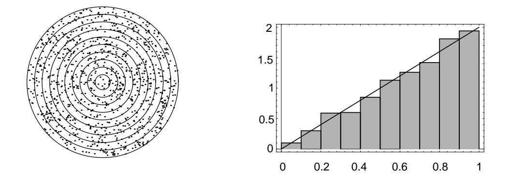

## 2.2. CONTINUOUS DENSITY FUNCTIONS

game there may well be!), it is natural to assume that the coordinates are chosen at random. (When doing this with a computer, each coordinate is chosen uniformly from the interval  $[-1,1]$ . If the resulting point does not lie inside the unit circle, the point is not counted.) Then the arguments used in the preceding example show that the probability of any elementary event, consisting of a single outcome, must be zero, and suggest that the probability of the event that the dart lands in any subset  $E$  of the target should be determined by what fraction of the target area lies in  $E$ . Thus,

$$
P(E) = \frac{\text{area of } E}{\text{area of target}} = \frac{\text{area of } E}{\pi}
$$

This can be written in the form

$$
P(E) = \int_E f(x) \, dx \ ,
$$

where  $f(x)$  is the constant function with value  $1/\pi$ . In particular, if  $E = \{(x, y) :$  $x^2 + y^2 \leq a^2$  is the event that the dart lands within distance  $a < 1$  of the center of the target, then

$$
P(E) = \frac{\pi a^2}{\pi} = a^2
$$

For example, the probability that the dart lies within a distance  $1/2$  of the center is  $1/4$ .  $\Box$ 

**Example 2.9** In the dart game considered above, suppose that, instead of observing where the dart lands, we observe how far it lands from the center of the target.

In this case, we take as our sample space the set  $\Omega$  of all circles with centers at the center of the target. It is convenient to describe these circles by their radii, so that each circle is identified by its radius r,  $0 \le r \le 1$ . In this way, we may regard  $\Omega$  as the subset [0, 1] of the real line.

What probabilities should we assign to the events  $E$  of  $\Omega$ ? If

$$
E = \{ r : 0 \le r \le a \},
$$

then  $E$  occurs if the dart lands within a distance  $a$  of the center, that is, within the circle of radius  $a$ , and we saw in the previous example that under our assumptions the probability of this event is given by

$$
P([0, a]) = a^2
$$

More generally, if

$$
E = \{ r : a \le r \le b \},\,
$$

then by our basic assumptions,

$$
P(E) = P([a, b]) = P([0, b]) - P([0, a])
$$
  
=  $b^2 - a^2$   
=  $(b - a)(b + a)$   
=  $2(b - a)\frac{(b + a)}{2}$ .

Figure 2.12: Distribution of dart distances in 400 throws.

Thus,  $P(E) = 2$ (length of E)(midpoint of E). Here we see that the probability assigned to the interval  $E$  depends not only on its length but also on its midpoint (i.e., not only on how long it is, but also on where it is). Roughly speaking, in this experiment, events of the form  $E = [a, b]$  are more likely if they are near the rim of the target and less likely if they are near the center. (A common experience for beginners! The conclusion might well be different if the beginner is replaced by an expert.)

Again we can simulate this by computer. We divide the target area into ten concentric regions of equal thickness.

The computer program **Darts** throws n darts and records what fraction of the total falls in each of these concentric regions. The program Areabargraph then plots a bar graph with the *area* of the *i*th bar equal to the fraction of the total falling in the *i*th region. Running the program for 1000 darts resulted in the bar graph of Figure 2.12.

Note that here the heights of the bars are not all equal, but grow approximately linearly with r. In fact, the linear function  $y = 2r$  appears to fit our bar graph quite well. This suggests that the probability that the dart falls within a distance a of the center should be given by the *area* under the graph of the function  $y = 2r$  between 0 and a. This area is  $a^2$ , which agrees with the probability we have assigned above to this event.  $\Box$ 

## **Sample Space Coordinates**

These examples suggest that for continuous experiments of this sort we should assign probabilities for the outcomes to fall in a given interval by means of the area under a suitable function.

More generally, we suppose that suitable coordinates can be introduced into the sample space  $\Omega$ , so that we can regard  $\Omega$  as a subset of  $\mathbb{R}^n$ . We call such a sample space a *continuous sample space*. We let  $X$  be a random variable which represents the outcome of the experiment. Such a random variable is called a *continuous random variable.* We then define a density function for  $X$  as follows.

## Density Functions of Continuous Random Variables

**Definition 2.1** Let  $X$  be a continuous real-valued random variable. A *density* function for X is a real-valued function  $f$  which satisfies

$$
P(a \le X \le b) = \int_{a}^{b} f(x) \, dx
$$

for all  $a, b \in \mathbf{R}$ .

We note that it is *not* the case that all continuous real-valued random variables possess density functions. However, in this book, we will only consider continuous random variables for which density functions exist.

In terms of the density  $f(x)$ , if E is a subset of **R**, then

$$
P(X \in E) = \int_E f(x) \, dx \, .
$$

The notation here assumes that E is a subset of **R** for which  $\int_E f(x) dx$  makes sense.

**Example 2.10** (Example 2.7 continued) In the spinner experiment, we choose for our set of outcomes the interval  $0 \leq x < 1$ , and for our density function

$$
f(x) = \begin{cases} 1, & \text{if } 0 \le x < 1, \\ 0, & \text{otherwise.} \end{cases}
$$

If  $E$  is the event that the head of the spinner falls in the upper half of the circle, then  $E = \{x : 0 \le x \le 1/2\}$ , and so

$$
P(E) = \int_0^{1/2} 1 \, dx = \frac{1}{2} \; .
$$

More generally, if E is the event that the head falls in the interval [a, b], then

$$
P(E) = \int_{a}^{b} 1 \, dx = b - a \; .
$$

**Example 2.11** (Example 2.8 continued) In the first dart game experiment, we choose for our sample space a disc of unit radius in the plane and for our density function the function

$$
f(x,y) = \begin{cases} 1/\pi, & \text{if } x^2 + y^2 \le 1, \\ 0, & \text{otherwise.} \end{cases}
$$

The probability that the dart lands inside the subset  $E$  is then given by

$$
P(E) = \int \int_E \frac{1}{\pi} dx dy
$$
  
=  $\frac{1}{\pi} \cdot (\text{area of } E).$ 

 $\Box$ 

 $\Box$ 

In these two examples, the density function is constant and does not depend on the particular outcome. It is often the case that experiments in which the coordinates are chosen at random can be described by constant density functions, and, as in Section 1.2, we call such density functions *uniform* or *equiprobable*. Not all experiments are of this type, however.

**Example 2.12** (Example 2.9 continued) In the second dart game experiment, we choose for our sample space the unit interval on the real line and for our density the function

$$
f(r) = \begin{cases} 2r, & \text{if } 0 < r < 1, \\ 0, & \text{otherwise.} \end{cases}
$$

Then the probability that the dart lands at distance  $r, a \leq r \leq b$ , from the center of the target is given by

$$
P([a, b]) = \int_a^b 2r dr
$$
  
=  $b^2 - a^2$ .

Here again, since the density is small when r is near 0 and large when r is near 1, we see that in this experiment the dart is more likely to land near the rim of the target than near the center. In terms of the bar graph of Example 2.9, the heights of the bars approximate the density function, while the areas of the bars approximate the probabilities of the subintervals (see Figure 2.12).  $\Box$ 

We see in this example that, unlike the case of discrete sample spaces, the value  $f(x)$  of the density function for the outcome x is not the probability of x occurring (we have seen that this probability is always 0) and in general  $f(x)$  is not a probability at all. In this example, if we take  $\lambda = 2$  then  $f(3/4) = 3/2$ , which being bigger than 1, cannot be a probability.

Nevertheless, the density function  $f$  does contain all the probability information about the experiment, since the probabilities of all events can be derived from it. In particular, the probability that the outcome of the experiment falls in an interval  $[a, b]$  is given by

$$
P([a, b]) = \int_{a}^{b} f(x) dx
$$

that is, by the *area* under the graph of the density function in the interval [a, b]. Thus, there is a close connection here between probabilities and areas. We have been guided by this close connection in making up our bar graphs; each bar is chosen so that its *area*, and not its height, represents the relative frequency of occurrence, and hence estimates the probability of the outcome falling in the associated interval.

In the language of the calculus, we can say that the probability of occurrence of an event of the form  $[x, x + dx]$ , where dx is small, is approximately given by

$$
P([x, x + dx]) \approx f(x)dx ,
$$

that is, by the area of the rectangle under the graph of f. Note that as  $dx \to 0$ , this probability  $\rightarrow 0$ , so that the probability  $P({x})$  of a single point is again 0, as in Example 2.7.

60