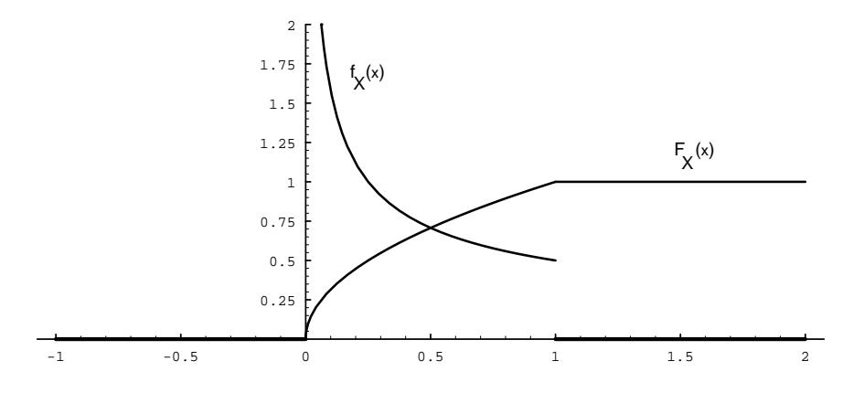
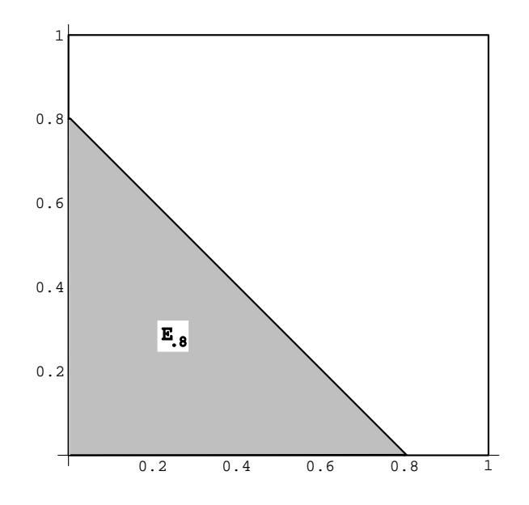
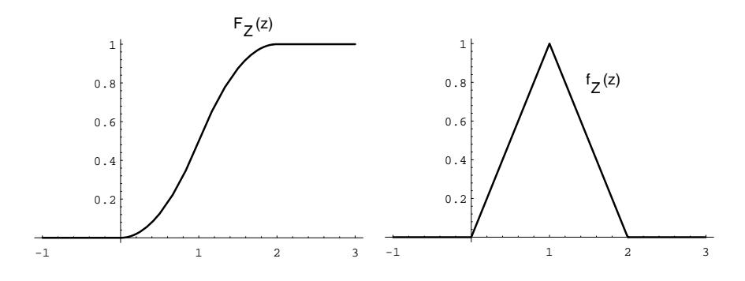
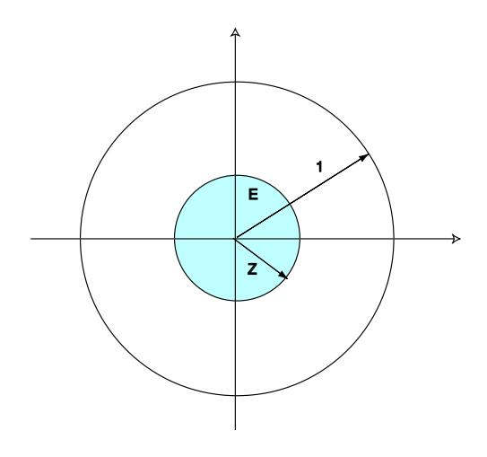

## 2.2. CONTINUOUS DENSITY FUNCTIONS

A glance at the graph of a density function tells us immediately which events of an experiment are more likely. Roughly speaking, we can say that where the density is large the events are more likely, and where it is small the events are less likely. In Example 2.4 the density function is largest at 1. Thus, given the two intervals  $[0, a]$  and  $[1, 1 + a]$ , where a is a small positive real number, we see that X is more likely to take on a value in the second interval than in the first.

## Cumulative Distribution Functions of Continuous Random **Variables**

We have seen that density functions are useful when considering continuous random variables. There is another kind of function, closely related to these density functions, which is also of great importance. These functions are called *cumulative distribution* functions.

**Definition 2.2** Let  $X$  be a continuous real-valued random variable. Then the cumulative distribution function of  $X$  is defined by the equation

$$
F_X(x) = P(X \le x) .
$$

If  $X$  is a continuous real-valued random variable which possesses a density function, then it also has a cumulative distribution function, and the following theorem shows that the two functions are related in a very nice way.

**Theorem 2.1** Let X be a continuous real-valued random variable with density function  $f(x)$ . Then the function defined by

$$
F(x) = \int_{-\infty}^{x} f(t) dt
$$

is the cumulative distribution function of  $X$ . Furthermore, we have

$$
\frac{d}{dx}F(x) = f(x) .
$$

Proof. By definition,

$$
F(x) = P(X \le x) .
$$

Let  $E = (-\infty, x]$ . Then

$$
P(X \le x) = P(X \in E) ,
$$

which equals

$$
\int_{-\infty}^{x} f(t) dt
$$

Applying the Fundamental Theorem of Calculus to the first equation in the statement of the theorem yields the second statement.  $\Box$ 

 $\Box$ 

Figure 2.13: Distribution and density for  $X = U^2$ .

In many experiments, the density function of the relevant random variable is easy to write down. However, it is quite often the case that the cumulative distribution function is easier to obtain than the density function. (Of course, once we have the cumulative distribution function, the density function can easily be obtained by differentiation, as the above theorem shows.) We now give some examples which exhibit this phenomenon.

**Example 2.13** A real number is chosen at random from  $[0,1]$  with uniform probability, and then this number is squared. Let  $X$  represent the result. What is the cumulative distribution function of  $X$ ? What is the density of  $X$ ?

We begin by letting U represent the chosen real number. Then  $X = U^2$ . If  $0 \leq x \leq 1$ , then we have

$$
F_X(x) = P(X \le x)
$$
  
= 
$$
P(U^2 \le x)
$$
  
= 
$$
P(U \le \sqrt{x})
$$
  
= 
$$
\sqrt{x}
$$
.

It is clear that  $X$  always takes on a value between 0 and 1, so the cumulative distribution function of  $X$  is given by

$$
F_X(x) = \begin{cases} 0, & \text{if } x \le 0, \\ \sqrt{x}, & \text{if } 0 \le x \le 1, \\ 1, & \text{if } x \ge 1. \end{cases}
$$

From this we easily calculate that the density function of  $X$  is

$$
f_X(x) = \begin{cases} 0, & \text{if } x \le 0, \\ 1/(2\sqrt{x}), & \text{if } 0 \le x \le 1, \\ 0, & \text{if } x > 1. \end{cases}
$$

Note that  $F_X(x)$  is continuous, but  $f_X(x)$  is not. (See Figure 2.13.)

 $\Box$ 

Figure 2.14: Calculation of distribution function for Example 2.14.

When referring to a continuous random variable  $X$  (say with a uniform density function), it is customary to say that "X is uniformly *distributed* on the interval [a, b]." It is also customary to refer to the cumulative distribution function of X as the distribution function of  $X$ . Thus, the word "distribution" is being used in several different ways in the subject of probability. (Recall that it also has a meaning when discussing discrete random variables.) When referring to the cumulative distribution function of a continuous random variable  $X$ , we will always use the word "cumulative" as a modifier, unless the use of another modifier, such as "normal" or "exponential," makes it clear. Since the phrase "uniformly densitied on the interval  $[a, b]$ " is not acceptable English, we will have to say "uniformly distributed" instead.

**Example 2.14** In Example 2.4, we considered a random variable, defined to be the sum of two random real numbers chosen uniformly from  $[0, 1]$ . Let the random variables X and Y denote the two chosen real numbers. Define  $Z = X + Y$ . We will now derive expressions for the cumulative distribution function and the density function of  $Z$ .

Here we take for our sample space  $\Omega$  the unit square in  $\mathbb{R}^2$  with uniform density. A point  $\omega \in \Omega$  then consists of a pair  $(x, y)$  of numbers chosen at random. Then  $0 \leq Z \leq 2$ . Let  $E_z$  denote the event that  $Z \leq z$ . In Figure 2.14, we show the set  $E_{.8}$ . The event  $E_z$ , for any z between 0 and 1, looks very similar to the shaded set in the figure. For  $1 < z \leq 2$ , the set  $E_z$  looks like the unit square with a triangle removed from the upper right-hand corner. We can now calculate the probability distribution  $F_Z$  of  $Z$ ; it is given by

$$
F_Z(z) = P(Z \le z)
$$
  
= Area of Ez

Figure 2.15: Distribution and density functions for Example 2.14.

Figure 2.16: Calculation of  $F_z$  for Example 2.15.

$$
= \begin{cases} 0, & \text{if } z < 0, \\ (1/2)z^2, & \text{if } 0 \le z \le 1, \\ 1 - (1/2)(2 - z)^2, & \text{if } 1 \le z \le 2, \\ 1, & \text{if } 2 < z. \end{cases}
$$

The density function is obtained by differentiating this function:

$$
f_Z(z) = \begin{cases} 0, & \text{if } z < 0, \\ z, & \text{if } 0 \le z \le 1, \\ 2 - z, & \text{if } 1 \le z \le 2, \\ 0, & \text{if } 2 < z. \end{cases}
$$

The reader is referred to Figure 2.15 for the graphs of these functions.

 $\Box$ 

**Example 2.15** In the dart game described in Example 2.8, what is the distribution of the distance of the dart from the center of the target? What is its density?

Here, as before, our sample space  $\Omega$  is the unit disk in  $\mathbb{R}^2$ , with coordinates  $(X, Y)$ . Let  $Z = \sqrt{X^2 + Y^2}$  represent the distance from the center of the target. Let