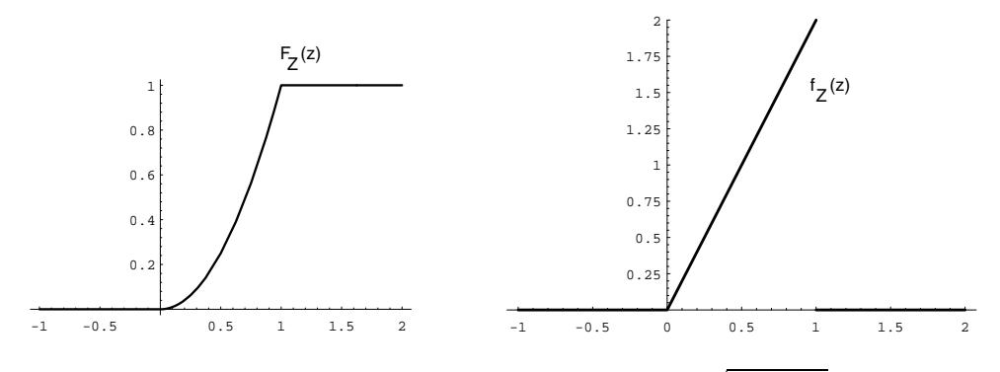
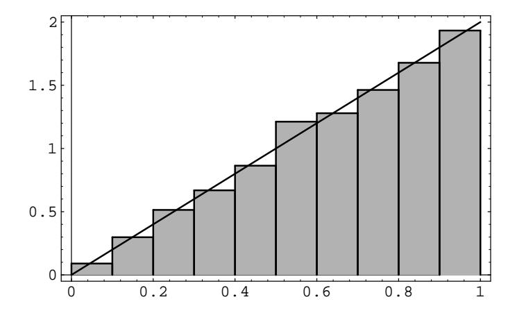
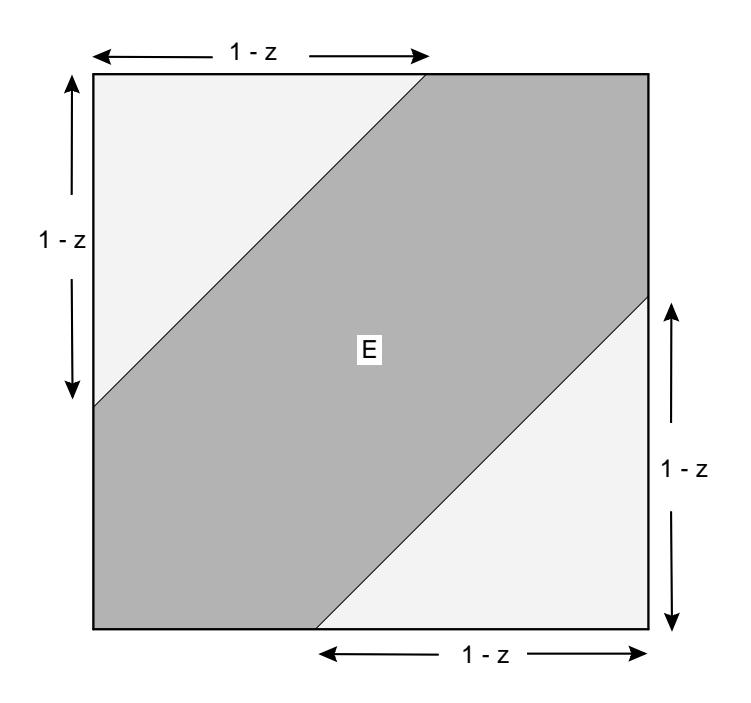
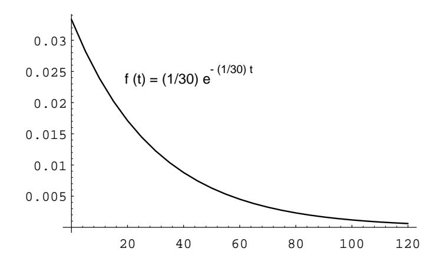
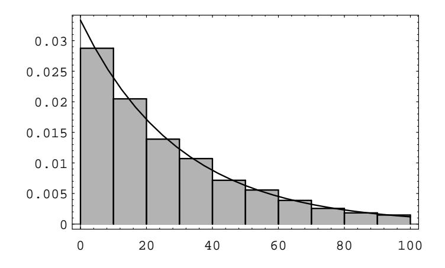

Figure 2.17: Distribution and density for  $Z = \sqrt{X^2 + Y^2}$ .

E be the event  $\{Z \leq z\}$ . Then the distribution function  $F_Z$  of Z (see Figure 2.16) is given by

$$
F_Z(z) = P(Z \le z)
$$
  
= Area of E  
Area of target

Thus, we easily compute that

$$
F_Z(z) = \begin{cases} 0, & \text{if } z \le 0, \\ z^2, & \text{if } 0 \le z \le 1, \\ 1, & \text{if } z > 1. \end{cases}
$$

The density  $f_Z(z)$  is given again by the derivative of  $F_Z(z)$ :

$$
f_Z(z) = \begin{cases} 0, & \text{if } z \le 0, \\ 2z, & \text{if } 0 \le z \le 1, \\ 0, & \text{if } z > 1. \end{cases}
$$

The reader is referred to Figure 2.17 for the graphs of these functions.

We can verify this result by simulation, as follows: We choose values for  $X$  and Y at random from [0, 1] with uniform distribution, calculate  $Z = \sqrt{X^2 + Y^2}$ , check whether  $0 \le Z \le 1$ , and present the results in a bar graph (see Figure 2.18).  $\Box$ 

**Example 2.16** Suppose Mr. and Mrs. Lockhorn agree to meet at the Hanover Inn between 5:00 and 6:00 P.M. on Tuesday. Suppose each arrives at a time between 5:00 and 6:00 chosen at random with uniform probability. What is the distribution function for the length of time that the first to arrive has to wait for the other? What is the density function?

Here again we can take the unit square to represent the sample space, and  $(X, Y)$ as the arrival times (after 5:00 P.M.) for the Lockhorns. Let  $Z = |X - Y|$ . Then we have  $F_X(x) = x$  and  $F_Y(y) = y$ . Moreover (see Figure 2.19),

$$
F_Z(z) = P(Z \le z)
$$
  
=  $P(|X - Y| \le z)$   
= Area of E.

Figure 2.18: Simulation results for Example 2.15.

Thus, we have

$$
F_Z(z) = \begin{cases} 0, & \text{if } z \le 0, \\ 1 - (1 - z)^2, & \text{if } 0 \le z \le 1, \\ 1, & \text{if } z > 1. \end{cases}
$$

The density  $f_Z(z)$  is again obtained by differentiation:

$$
f_Z(z) = \begin{cases} 0, & \text{if } z \le 0, \\ 2(1-z), & \text{if } 0 \le z \le 1, \\ 0, & \text{if } z > 1. \end{cases}
$$

 $\Box$ 

**Example 2.17** There are many occasions where we observe a sequence of occurrences which occur at "random" times. For example, we might be observing emissions of a radioactive isotope, or cars passing a milepost on a highway, or light bulbs burning out. In such cases, we might define a random variable  $X$  to denote the time between successive occurrences. Clearly,  $X$  is a continuous random variable whose range consists of the non-negative real numbers. It is often the case that we can model  $X$  by using the *exponential density*. This density is given by the formula

$$
f(t) = \begin{cases} \lambda e^{-\lambda t}, & \text{if } t \ge 0, \\ 0, & \text{if } t < 0. \end{cases}
$$

The number  $\lambda$  is a non-negative real number, and represents the reciprocal of the average value of  $X$ . (This will be shown in Chapter 6.) Thus, if the average time between occurrences is 30 minutes, then  $\lambda = 1/30$ . A graph of this density function with  $\lambda = 1/30$  is shown in Figure 2.20. One can see from the figure that even though the average value is 30, occasionally much larger values are taken on by  $X$ .

Suppose that we have bought a computer that contains a Warp 9 hard drive. The salesperson says that the average time between breakdowns of this type of hard drive is 30 months. It is often assumed that the length of time between breakdowns

Figure 2.19: Calculation of  ${\cal F}_Z.$ 

Figure 2.20: Exponential density with  $\lambda=1/30.$ 

Figure 2.21: Residual lifespan of a hard drive.

is distributed according to the exponential density. We will assume that this model applies here, with  $\lambda = 1/30$ .

Now suppose that we have been operating our computer for 15 months. We assume that the original hard drive is still running. We ask how long we should expect the hard drive to continue to run. One could reasonably expect that the hard drive will run, on the average, another 15 months. (One might also guess that it will run more than 15 months, since the fact that it has already run for 15 months implies that we don't have a lemon.) The time which we have to wait is a new random variable, which we will call Y. Obviously,  $Y = X - 15$ . We can write a computer program to produce a sequence of simulated Y-values. To do this, we first produce a sequence of  $X$ 's, and discard those values which are less than or equal to 15 (these values correspond to the cases where the hard drive has quit running before 15 months). To simulate a value of  $X$ , we compute the value of the expression

$$
\left(-\frac{1}{\lambda}\right) \log(rnd) ,
$$

where  $rnd$  represents a random real number between 0 and 1. (That this expression has the exponential density will be shown in Chapter 4.3.) Figure 2.21 shows an area bar graph of 10,000 simulated Y-values.

The average value of  $Y$  in this simulation is 29.74, which is closer to the original average life span of 30 months than to the value of 15 months which was guessed above. Also, the distribution of Y is seen to be close to the distribution of X. It is in fact the case that  $X$  and  $Y$  have the same distribution. This property is called the *memoryless property*, because the amount of time that we have to wait for an occurrence does not depend on how long we have already waited. The only continuous density function with this property is the exponential density.  $\Box$