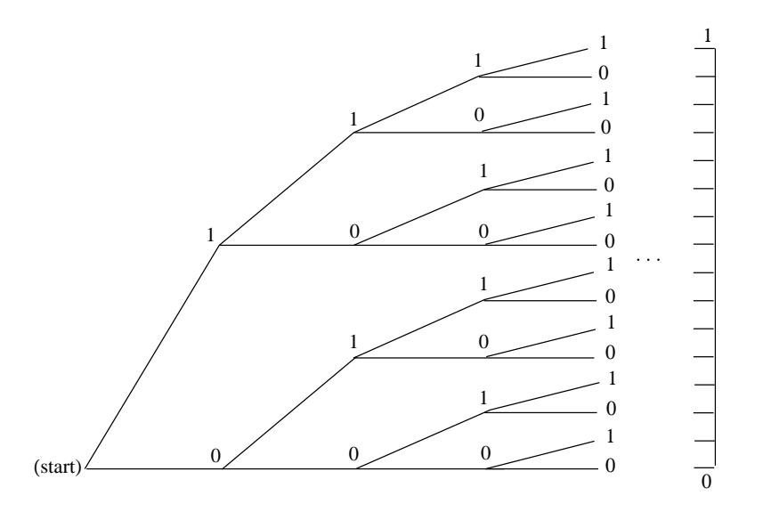

## **Assignment of Probabilities**

A fundamental question in practice is: How shall we choose the probability density function in describing any given experiment? The answer depends to a great extent on the amount and kind of information available to us about the experiment. In some cases, we can see that the outcomes are equally likely. In some cases, we can see that the experiment resembles another already described by a known density. In some cases, we can run the experiment a large number of times and make a reasonable guess at the density on the basis of the observed distribution of outcomes, as we did in Chapter 1. In general, the problem of choosing the right density function for a given experiment is a central problem for the experimenter and is not always easy to solve (see Example 2.6). We shall not examine this question in detail here but instead shall assume that the right density is already known for each of the experiments under study.

The introduction of suitable coordinates to describe a continuous sample space, and a suitable density to describe its probabilities, is not always so obvious, as our final example shows.

## Infinite Tree

**Example 2.18** Consider an experiment in which a fair coin is tossed repeatedly, without stopping. We have seen in Example 1.6 that, for a coin tossed  $n$  times, the natural sample space is a binary tree with  $n$  stages. On this evidence we expect that for a coin tossed repeatedly, the natural sample space is a binary tree with an infinite number of stages, as indicated in Figure 2.22.

It is surprising to learn that, although the *n*-stage tree is obviously a finite sample space, the unlimited tree can be described as a continuous sample space. To see how this comes about, let us agree that a typical outcome of the unlimited coin tossing experiment can be described by a sequence of the form  $\omega = \{H H T H T H ... \}.$ If we write 1 for H and 0 for T, then  $\omega = \{1 1 0 1 0 0 1 ...\}$ . In this way, each outcome is described by a sequence of 0's and 1's.

Now suppose we think of this sequence of 0's and 1's as the binary expansion of some real number  $x = .1101001 \cdots$  lying between 0 and 1. (A *binary expansion* is like a decimal expansion but based on 2 instead of 10.) Then each outcome is described by a value of x, and in this way x becomes a coordinate for the sample space, taking on all real values between 0 and 1. (We note that it is possible for two different sequences to correspond to the same real number; for example, the sequences  $\{T H H H H \ldots\}$  and  $\{H T T T T \ldots\}$  both correspond to the real number  $1/2$ . We will not concern ourselves with this apparent problem here.)

What probabilities should be assigned to the events of this sample space? Consider, for example, the event  $E$  consisting of all outcomes for which the first toss comes up heads and the second tails. Every such outcome has the form  $.10***...$ where  $*$  can be either 0 or 1. Now if  $x$  is our real-valued coordinate, then the value of x for every such outcome must lie between  $1/2 = .10000 \cdots$  and  $3/4 = .11000 \cdots$ , and moreover, every value of x between  $1/2$  and  $3/4$  has a binary expansion of the

Figure 2.22: Tree for infinite number of tosses of a coin.

form .10\*\*\*\*.... This means that  $\omega \in E$  if and only if  $1/2 \leq x < 3/4$ , and in this way we see that we can describe E by the interval  $(1/2,3/4)$ . More generally, every event consisting of outcomes for which the results of the first  $n$  tosses are prescribed is described by a binary interval of the form  $\left[\frac{k}{2^n}, \frac{k+1}{2^n}\right]$ .

We have already seen in Section 1.2 that in the experiment involving  $n$  tosses, the probability of any one outcome must be exactly  $1/2^n$ . It follows that in the unlimited toss experiment, the probability of any event consisting of outcomes for which the results of the first *n* tosses are prescribed must also be  $1/2^n$ . But  $1/2^n$  is exactly the length of the interval of x-values describing  $E!$ . Thus we see that, just as with the spinner experiment, the probability of an event  $E$  is determined by what fraction of the unit interval lies in  $E$ .

Consider again the statement: The probability is  $1/2$  that a fair coin will turn up heads when tossed. We have suggested that one interpretation of this statement is that if we toss the coin indefinitely the proportion of heads will approach  $1/2$ . That is, in our correspondence with binary sequences we expect to get a binary sequence with the proportion of 1's tending to  $1/2$ . The event E of binary sequences for which this is true is a proper subset of the set of all possible binary sequences. It does not contain, for example, the sequence  $011011011...$  (i.e.,  $(011)$  repeated again and again). The event  $E$  is actually a very complicated subset of the binary sequences. but its probability can be determined as a limit of probabilities for events with a finite number of outcomes whose probabilities are given by finite tree measures. When the probability of  $E$  is computed in this way, its value is found to be 1. This remarkable result is known as the *Strong Law of Large Numbers* (or Law of *Averages*) and is one justification for our frequency concept of probability. We shall prove a weak form of this theorem in Chapter 8.  $\Box$ 

## **Exercises**

- 1 Suppose you choose at random a real number X from the interval  $[2, 10]$ .
  - (a) Find the density function  $f(x)$  and the probability of an event E for this experiment, where E is a subinterval [a, b] of [2, 10].
  - (b) From (a), find the probability that  $X > 5$ , that  $5 < X < 7$ , and that  $X^2 - 12X + 35 > 0.$
- 2 Suppose you choose a real number  $X$  from the interval  $[2, 10]$  with a density function of the form

$$
f(x) = Cx
$$

where  $C$  is a constant.

- (a) Find  $C$ .
- (b) Find  $P(E)$ , where  $E = [a, b]$  is a subinterval of [2, 10].
- (c) Find  $P(X > 5)$ ,  $P(X < 7)$ , and  $P(X^2 12X + 35 > 0)$ .
- 3 Same as Exercise 2, but suppose

$$
f(x) = \frac{C}{x} .
$$

- 4 Suppose you throw a dart at a circular target of radius 10 inches. Assuming that you hit the target and that the coordinates of the outcomes are chosen at random, find the probability that the dart falls
  - $(a)$  within 2 inches of the center.
  - $(b)$  within 2 inches of the rim.
  - (c) within the first quadrant of the target.
  - $(d)$  within the first quadrant and within 2 inches of the rim.
- 5 Suppose you are watching a radioactive source that emits particles at a rate described by the exponential density

$$
f(t) = \lambda e^{-\lambda t} ,
$$

where  $\lambda = 1$ , so that the probability  $P(0,T)$  that a particle will appear in the next T seconds is  $P([0,T]) = \int_0^T \lambda e^{-\lambda t} dt$ . Find the probability that a particle (not necessarily the first) will appear

- (a) within the next second.
- (b) within the next 3 seconds.
- $(c)$  between 3 and 4 seconds from now.
- (d) after 4 seconds from now.

**6** Assume that a new light bulb will burn out after t hours, where t is chosen from  $[0,\infty)$  with an exponential density

$$
f(t) = \lambda e^{-\lambda t}
$$

In this context,  $\lambda$  is often called the *failure rate* of the bulb.

- (a) Assume that  $\lambda = 0.01$ , and find the probability that the bulb will not burn out before  $T$  hours. This probability is often called the *reliability* of the bulb.
- (b) For what T is the reliability of the bulb =  $1/2$ ?
- 7 Choose a number *B at random* from the interval  $[0,1]$  with uniform density. Find the probability that
  - (a)  $1/3 < B < 2/3$ .
  - (b)  $|B 1/2| \le 1/4$ .
  - (c)  $B < 1/4$  or  $1 B < 1/4$ .
  - (d)  $3B^2 < B$ .
- 8 Choose independently two numbers B and C at random from the interval [0, 1] with uniform density. Note that the point  $(B, C)$  is then chosen at random in the unit square. Find the probability that
  - (a)  $B + C < 1/2$ .
  - (b)  $BC < 1/2$ .
  - (c)  $|B C| < 1/2$ .
  - (d)  $\max\{B, C\} < 1/2$ .
  - (e)  $\min\{B, C\} < 1/2$ .
  - (f)  $B < 1/2$  and  $1 C < 1/2$ .
  - $(g)$  conditions  $(c)$  and  $(f)$  both hold.
  - (h)  $B^2 + C^2 \le 1/2$ .
  - (i)  $(B-1/2)^2 + (C-1/2)^2 < 1/4$ .
- **9** Suppose that we have a sequence of occurrences. We assume that the time X between occurrences is exponentially distributed with  $\lambda = 1/10$ , so on the average, there is one occurrence every 10 minutes (see Example 2.17). You come upon this system at time 100, and wait until the next occurrence. Make a conjecture concerning how long, on the average, you will have to wait. Write a program to see if your conjecture is right.
- 10 As in Exercise 9, assume that we have a sequence of occurrences, but now assume that the time  $X$  between occurrences is uniformly distributed between 5 and 15. As before, you come upon this system at time 100, and wait until the next occurrence. Make a conjecture concerning how long, on the average, you will have to wait. Write a program to see if your conjecture is right.