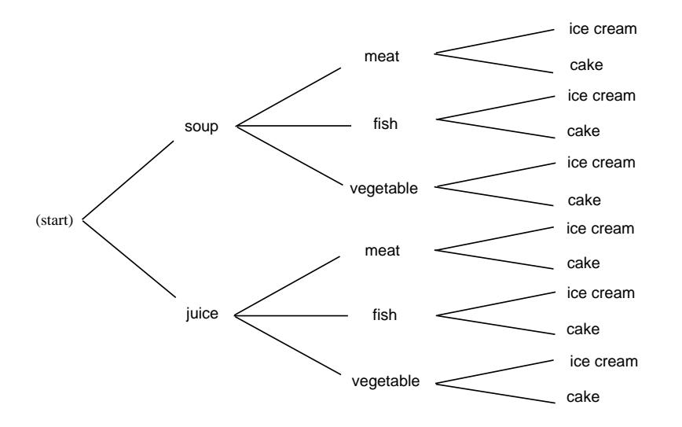

## 2.2. CONTINUOUS DENSITY FUNCTIONS

- 11 For examples such as those in Exercises 9 and 10, it might seem that at least you should not have to wait on average more than 10 minutes if the average time between occurrences is 10 minutes. Alas, even this is not true. To see why, consider the following assumption about the times between occurrences. Assume that the time between occurrences is 3 minutes with probability .9 and 73 minutes with probability .1. Show by simulation that the average time between occurrences is 10 minutes, but that if you come upon this system at time 100, your average waiting time is more than 10 minutes.
- 12 Take a stick of unit length and break it into three pieces, choosing the break points at random. (The break points are assumed to be chosen simultaneously.) What is the probability that the three pieces can be used to form a triangle? *Hint*: The sum of the lengths of any two pieces must exceed the length of the third, so each piece must have length  $\langle 1/2, 1 \rangle$  Now use Exercise  $8(g)$ .
- 13 Take a stick of unit length and break it into two pieces, choosing the break point at random. Now break the longer of the two pieces at a random point. What is the probability that the three pieces can be used to form a triangle?
- 14 Choose independently two numbers B and C at random from the interval  $[-1,1]$  with uniform distribution, and consider the quadratic equation

 $x^2 + Bx + C = 0$ .

Find the probability that the roots of this equation

- $(a)$  are both real.
- (b) are both positive.

*Hints*: (a) requires  $0 \leq B^2 - 4C$ , (b) requires  $0 \leq B^2 - 4C$ ,  $B \leq 0$ ,  $0 \leq C$ .

- 15 At the Tunbridge World's Fair, a coin toss game works as follows. Quarters are tossed onto a checkerboard. The management keeps all the quarters, but for each quarter landing entirely within one square of the checkerboard the management pays a dollar. Assume that the edge of each square is twice the diameter of a quarter, and that the outcomes are described by coordinates chosen *at random*. Is this a fair game?
- 16 Three points are chosen at random on a circle of unit circumference. What is the probability that the triangle defined by these points as vertices has three acute angles? *Hint*: One of the angles is obtuse if and only if all three points lie in the same semicircle. Take the circumference as the interval  $[0,1]$ . Take one point at 0 and the others at  $B$  and  $C$ .
- 17 Write a program to choose a random number X in the interval  $[2, 10]$  1000 times and record what fraction of the outcomes satisfy  $X > 5$ , what fraction satisfy  $5 < X < 7$ , and what fraction satisfy  $x^2 - 12x + 35 > 0$ . How do these results compare with Exercise 1?

- 18 Write a program to choose a point  $(X, Y)$  at random in a square of side 20 inches, doing this 10,000 times, and recording what fraction of the outcomes fall within 19 inches of the center; of these, what fraction fall between 8 and 10 inches of the center; and, of these, what fraction fall within the first quadrant of the square. How do these results compare with those of Exercise 4?
- 19 Write a program to simulate the problem describe in Exercise 7 (see Exercise 17). How do the simulation results compare with the results of Exercise 7?
- 20 Write a program to simulate the problem described in Exercise 12.
- 21 Write a program to simulate the problem described in Exercise 16.
- 22 Write a program to carry out the following experiment. A coin is tossed 100 times and the number of heads that turn up is recorded. This experiment is then repeated 1000 times. Have your program plot a bar graph for the proportion of the 1000 experiments in which the number of heads is  $n$ , for each  $n$  in the interval [35, 65]. Does the bar graph look as though it can be fit with a normal curve?
- 23 Write a program that picks a random number between 0 and 1 and computes the negative of its logarithm. Repeat this process a large number of times and plot a bar graph to give the number of times that the outcome falls in each interval of length 0.1 in  $[0, 10]$ . On this bar graph plot a graph of the density  $f(x) = e^{-x}$ . How well does this density fit your graph?

## Chapter 3

# Combinatorics

#### $3.1$ Permutations

Many problems in probability theory require that we count the number of ways that a particular event can occur. For this, we study the topics of *permutations* and combinations. We consider permutations in this section and combinations in the next section.

Before discussing permutations, it is useful to introduce a general counting technique that will enable us to solve a variety of counting problems, including the problem of counting the number of possible permutations of  $n$  objects.

## **Counting Problems**

Consider an experiment that takes place in several stages and is such that the number of outcomes  $m$  at the  $n$ th stage is independent of the outcomes of the previous stages. The number  $m$  may be different for different stages. We want to count the number of ways that the entire experiment can be carried out.

**Example 3.1** You are eating at Émile's restaurant and the waiter informs you that you have (a) two choices for appetizers: soup or juice; (b) three for the main course: a meat, fish, or vegetable dish; and (c) two for dessert: ice cream or cake. How many possible choices do you have for your complete meal? We illustrate the possible meals by a tree diagram shown in Figure 3.1. Your menu is decided in three stages—at each stage the number of possible choices does not depend on what is chosen in the previous stages: two choices at the first stage, three at the second, and two at the third. From the tree diagram we see that the total number of choices is the product of the number of choices at each stage. In this examples we have  $2 \cdot 3 \cdot 2 = 12$  possible menus. Our menu example is an example of the following general counting technique.  $\Box$ 

Figure 3.1: Tree for your menu.

### A Counting Technique

A task is to be carried out in a sequence of r stages. There are  $n_1$  ways to carry out the first stage; for each of these  $n_1$  ways, there are  $n_2$  ways to carry out the second stage; for each of these  $n_2$  ways, there are  $n_3$  ways to carry out the third stage, and so forth. Then the total number of ways in which the entire task can be accomplished is given by the product  $N = n_1 \cdot n_2 \cdot \ldots \cdot n_r$ .

## **Tree Diagrams**

It will often be useful to use a tree diagram when studying probabilities of events relating to experiments that take place in stages and for which we are given the probabilities for the outcomes at each stage. For example, assume that the owner of Emile's restaurant has observed that 80 percent of his customers choose the soup for an appetizer and 20 percent choose juice. Of those who choose soup, 50 percent choose meat, 30 percent choose fish, and 20 percent choose the vegetable dish. Of those who choose juice for an appetizer, 30 percent choose meat, 40 percent choose fish, and 30 percent choose the vegetable dish. We can use this to estimate the probabilities at the first two stages as indicated on the tree diagram of Figure 3.2.

We choose for our sample space the set  $\Omega$  of all possible paths  $\omega = \omega_1, \omega_2$ .  $\ldots$ ,  $\omega_6$  through the tree. How should we assign our probability distribution? For example, what probability should we assign to the customer choosing soup and then the meat? If  $8/10$  of the customers choose soup and then  $1/2$  of these choose meat, a proportion  $8/10 \cdot 1/2 = 4/10$  of the customers choose soup and then meat. This suggests choosing our probability distribution for each path through the tree to be the *product* of the probabilities at each of the stages along the path. This results in the probability distribution for the sample points  $\omega$  indicated in Figure 3.2. (Note that  $m(\omega_1) + \cdots + m(\omega_6) = 1$ .) From this we see, for example, that the probability