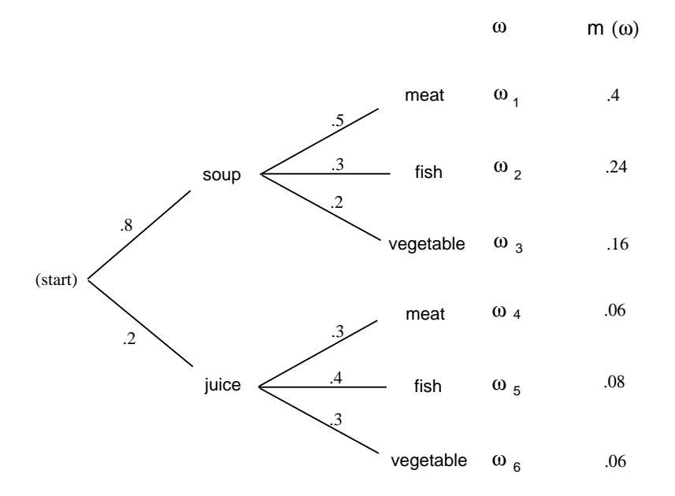

Figure 3.2: Two-stage probability assignment.

that a customer chooses meat is  $m(\omega_1) + m(\omega_4) = .46$ .

We shall say more about these tree measures when we discuss the concept of conditional probability in Chapter 4. We return now to more counting problems.

**Example 3.2** We can show that there are at least two people in Columbus, Ohio, who have the same three initials. Assuming that each person has three initials, there are 26 possibilities for a person's first initial, 26 for the second, and 26 for the third. Therefore, there are  $26^3 = 17,576$  possible sets of initials. This number is smaller than the number of people living in Columbus, Ohio; hence, there must be at least two people with the same three initials.  $\Box$ 

We consider next the celebrated birthday problem—often used to show that naive intuition cannot always be trusted in probability.

## **Birthday Problem**

**Example 3.3** How many people do we need to have in a room to make it a favorable bet (probability of success greater than  $1/2$ ) that two people in the room will have the same birthday?

Since there are 365 possible birthdays, it is tempting to guess that we would need about  $1/2$  this number, or 183. You would surely win this bet. In fact, the number required for a favorable bet is only 23. To show this, we find the probability  $p_r$  that, in a room with r people, there is no duplication of birthdays; we will have a favorable bet if this probability is less than one half.

Number of people Probability that all birthdays are different

| 20 | .5885616 |
|----|----------|
| 21 | .5563117 |
| 22 | .5243047 |
| 23 | .4927028 |
| 24 | .4616557 |
| 25 | .4313003 |

Table 3.1: Birthday problem.

Assume that there are 365 possible birthdays for each person (we ignore leap years). Order the people from 1 to r. For a sample point  $\omega$ , we choose a possible sequence of length  $r$  of birthdays each chosen as one of the 365 possible dates. There are 365 possibilities for the first element of the sequence, and for each of these choices there are 365 for the second, and so forth, making  $365^r$  possible sequences of birthdays. We must find the number of these sequences that have no duplication of birthdays. For such a sequence, we can choose any of the 365 days for the first element, then any of the remaining 364 for the second, 363 for the third, and so forth, until we make r choices. For the rth choice, there will be  $365 - r + 1$ possibilities. Hence, the total number of sequences with no duplications is

 $365 \cdot 364 \cdot 363 \cdot \ldots \cdot (365 - r + 1)$ .

Thus, assuming that each sequence is equally likely,

$$
p_r = \frac{365 \cdot 364 \cdot \ldots \cdot (365 - r + 1)}{365^r}
$$

We denote the product

 $(n)(n-1)\cdots(n-r+1)$ 

by  $(n)_r$  (read "*n* down r," or "*n* lower r"). Thus,

$$
p_r = \frac{(365)_r}{(365)^r}
$$

The program Birthday carries out this computation and prints the probabilities for  $r = 20$  to 25. Running this program, we get the results shown in Table 3.1. As we asserted above, the probability for no duplication changes from greater than one half to less than one half as we move from 22 to 23 people. To see how unlikely it is that we would lose our bet for larger numbers of people, we have run the program again, printing out values from  $r = 10$  to  $r = 100$  in steps of 10. We see that in a room of 40 people the odds already heavily favor a duplication, and in a room of 100 the odds are overwhelmingly in favor of a duplication. We have assumed that birthdays are equally likely to fall on any particular day. Statistical evidence suggests that this is not true. However, it is intuitively clear (but not easy to prove) that this makes it even more likely to have a duplication with a group of 23 people. (See Exercise 19 to find out what happens on planets with more or fewer than 365) days per year.)  $\Box$  Number of people Probability that all birthdays are different

| 10  | .8830518 |
|-----|----------|
| 20  | .5885616 |
| 30  | .2936838 |
| 40  | .1087682 |
| 50  | .0296264 |
| 60  | .0058773 |
| 70  | .0008404 |
| 80  | .0000857 |
| 90  | .0000062 |
| 100 | .0000003 |
|     |          |

Table 3.2: Birthday problem.

We now turn to the topic of permutations.

## Permutations

**Definition 3.1** Let A be any finite set. A *permutation of A* is a one-to-one mapping of A onto itself.  $\Box$ 

To specify a particular permutation we list the elements of  $A$  and, under them, show where each element is sent by the one-to-one mapping. For example, if  $A =$  $\{a, b, c\}$  a possible permutation  $\sigma$  would be

$$
\sigma = \begin{pmatrix} a & b & c \\ b & c & a \end{pmatrix}.
$$

By the permutation  $\sigma$ , a is sent to b, b is sent to c, and c is sent to a. The condition that the mapping be one-to-one means that no two elements of  $A$  are sent, by the mapping, into the same element of  $A$ .

We can put the elements of our set in some order and rename them  $1, 2, ..., n$ . Then, a typical permutation of the set  $A = \{a_1, a_2, a_3, a_4\}$  can be written in the form  $(1 \quad 0 \quad 2 \quad 1)$ 

$$
\sigma = \begin{pmatrix} 1 & 2 & 3 & 4 \\ 2 & 1 & 4 & 3 \end{pmatrix},
$$

indicating that  $a_1$  went to  $a_2$ ,  $a_2$  to  $a_1$ ,  $a_3$  to  $a_4$ , and  $a_4$  to  $a_3$ .

If we always choose the top row to be  $1\ 2\ 3\ 4$  then, to prescribe the permutation, we need only give the bottom row, with the understanding that this tells us where 1 goes, 2 goes, and so forth, under the mapping. When this is done, the permutation is often called a *rearrangement* of the *n* objects 1, 2, 3, ..., *n*. For example, all possible permutations, or rearrangements, of the numbers  $A = \{1, 2, 3\}$  are:

## 123, 132, 213, 231, 312, 321.

It is an easy matter to count the number of possible permutations of  $n$  objects. By our general counting principle, there are  $n$  ways to assign the first element, for

| $\it n$ | n!             |
|---------|----------------|
|         |                |
| 0       | 1              |
| 1       | 1              |
| 2       | $\overline{2}$ |
| 3       | 6              |
| 4       | 24             |
| 5       | 120            |
| 6       | 720            |
| 7       | 5040           |
| 8       | 40320          |
| 9       | 362880         |
| 10      | 3628800        |

Table 3.3: Values of the factorial function.

each of these we have  $n-1$  ways to assign the second object,  $n-2$  for the third, and so forth. This proves the following theorem.

**Theorem 3.1** The total number of permutations of a set  $A$  of  $n$  elements is given by  $n \cdot (n - 1) \cdot (n - 2) \cdot ... \cdot 1$ .  $\Box$ 

It is sometimes helpful to consider orderings of subsets of a given set. This prompts the following definition.

**Definition 3.2** Let  $A$  be an *n*-element set, and let  $k$  be an integer between 0 and n. Then a k-permutation of A is an ordered listing of a subset of A of size k.  $\Box$ 

Using the same techniques as in the last theorem, the following result is easily proved.

**Theorem 3.2** The total number of k-permutations of a set A of n elements is given by  $n \cdot (n-1) \cdot (n-2) \cdot \ldots \cdot (n-k+1)$ .  $\Box$ 

## Factorials

The number given in Theorem 3.1 is called *n* factorial, and is denoted by *n*!. The expression 0! is defined to be 1 to make certain formulas come out simpler. The first few values of this function are shown in Table 3.3. The reader will note that this function grows very rapidly.

The expression  $n!$  will enter into many of our calculations, and we shall need to have some estimate of its magnitude when  $n$  is large. It is clearly not practical to make exact calculations in this case. We shall instead use a result called *Stirling's formula.* Before stating this formula we need a definition.