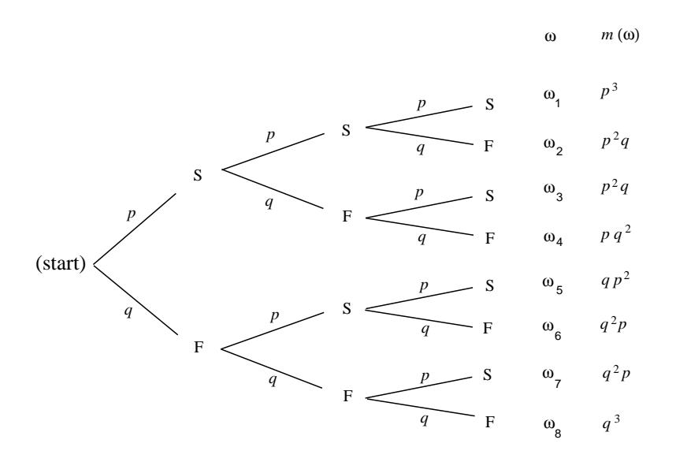

**Example 3.5** Let  $U = \{a, b, c\}$ . The subsets of U are

$$
\phi
$$
,  $\{a\}$ ,  $\{b\}$ ,  $\{c\}$ ,  $\{a,b\}$ ,  $\{a,c\}$ ,  $\{b,c\}$ ,  $\{a,b,c\}$ .

 $\Box$ 

## **Binomial Coefficients**

The number of distinct subsets with  $j$  elements that can be chosen from a set with *n* elements is denoted by  $\binom{n}{i}$ , and is pronounced "*n* choose *j*." The number  $\binom{n}{i}$  is called a *binomial coefficient*. This terminology comes from an application to algebra which will be discussed later in this section.

In the above example, there is one subset with no elements, three subsets with exactly 1 element, three subsets with exactly 2 elements, and one subset with exactly 3 elements. Thus,  $\binom{3}{0} = 1$ ,  $\binom{3}{1} = 3$ ,  $\binom{3}{2} = 3$ , and  $\binom{3}{3} = 1$ . Note that there are  $2^3 = 8$  subsets in all. (We have already seen that a set with n elements has  $2^n$ subsets; see Exercise 3.1.8.) It follows that

$$
\binom{3}{0} + \binom{3}{1} + \binom{3}{2} + \binom{3}{3} = 2^3 = 8,
$$
$$
\binom{n}{0} = \binom{n}{n} = 1.
$$

Assume that  $n > 0$ . Then, since there is only one way to choose a set with no elements and only one way to choose a set with  $n$  elements, the remaining values of  $\binom{n}{i}$  are determined by the following *recurrence relation*:

**Theorem 3.4** For integers n and j, with  $0 \lt j \lt n$ , the binomial coefficients satisfy:

$$
\binom{n}{j} = \binom{n-1}{j} + \binom{n-1}{j-1}.
$$
\n(3.1)

**Proof.** We wish to choose a subset of j elements. Choose an element u of  $U$ . Assume first that we do not want  $u$  in the subset. Then we must choose the  $j$ elements from a set of  $n-1$  elements; this can be done in  $\binom{n-1}{j}$  ways. On the other hand, assume that we do want  $u$  in the subset. Then we must choose the other  $j-1$  elements from the remaining  $n-1$  elements of U; this can be done in  $\binom{n-1}{j-1}$ ways. Since  $u$  is either in our subset or not, the number of ways that we can choose a subset of j elements is the sum of the number of subsets of j elements which have u as a member and the number which do not—this is what Equation 3.1 states.  $\Box$ 

The binomial coefficient  $\binom{n}{i}$  is defined to be 0, if  $j < 0$  or if  $j > n$ . With this definition, the restrictions on  $j$  in Theorem 3.4 are unnecessary.

|                | $j = 0$ | -1             | $\overline{2}$ | 3              | 4   | 5   | 6   | 7   | 8  | 9  | 10 |
|----------------|---------|----------------|----------------|----------------|-----|-----|-----|-----|----|----|----|
| $n = 0$        |         |                |                |                |     |     |     |     |    |    |    |
| 1              | 1       | 1              |                |                |     |     |     |     |    |    |    |
| 2              | 1       | $\overline{c}$ | 1              |                |     |     |     |     |    |    |    |
| 3              | 1       | 3              | 3              | 1              |     |     |     |     |    |    |    |
| $\overline{4}$ | 1       | $\overline{4}$ | 6              | $\overline{4}$ | 1   |     |     |     |    |    |    |
| 5              | 1       | 5              | 10             | 10             | 5   | 1   |     |     |    |    |    |
| 6              | 1       | 6              | 15             | 20             | 15  | 6   | 1   |     |    |    |    |
| 7              | 1       | 7              | 21             | 35             | 35  | 21  | 7   | 1   |    |    |    |
| 8              | 1       | 8              | 28             | 56             | 70  | 56  | 28  | 8   | 1  |    |    |
| 9              | 1       | 9              | 36             | 84             | 126 | 126 | 84  | 36  | 9  | 1  |    |
| 10             | 1       | 10             | 45             | 120            | 210 | 252 | 210 | 120 | 45 | 10 |    |

Figure 3.3: Pascal's triangle.

## Pascal's Triangle

The relation 3.1, together with the knowledge that

$$
\binom{n}{0} = \binom{n}{n} = 1,
$$

determines completely the numbers  $\binom{n}{j}$ . We can use these relations to determine the famous *triangle of Pascal*, which exhibits all these numbers in matrix form (see Figure  $3.3$ ).

The *n*th row of this triangle has the entries  $\binom{n}{0}, \binom{n}{1}, \ldots, \binom{n}{n}$ . We know that the first and last of these numbers are 1. The remaining numbers are determined by the recurrence relation Equation 3.1; that is, the entry  $\binom{n}{j}$  for  $0 < j < n$  in the  $n$ th row of Pascal's triangle is the  $sum$  of the entry immediately above and the one immediately to its left in the  $(n-1)$ st row. For example,  $\binom{5}{2} = 6 + 4 = 10$ .

This algorithm for constructing Pascal's triangle can be used to write a computer program to compute the binomial coefficients. You are asked to do this in Exercise 4.

While Pascal's triangle provides a way to construct recursively the binomial coefficients, it is also possible to give a formula for  $\binom{n}{i}$ .

**Theorem 3.5** The binomial coefficients are given by the formula

$$
\binom{n}{j} = \frac{(n)_j}{j!} \ . \tag{3.2}
$$

**Proof.** Each subset of size j of a set of size n can be ordered in j! ways. Each of these orderings is a j-permutation of the set of size  $n$ . The number of j-permutations is  $(n)_j$ , so the number of subsets of size j is

$$
\frac{(n)_j}{j!}
$$

This completes the proof.

 $\Box$ 

The above formula can be rewritten in the form

$$
\binom{n}{j} = \frac{n!}{j!(n-j)!}
$$

This immediately shows that

$$
\binom{n}{j} = \binom{n}{n-j} .
$$

When using Equation 3.2 in the calculation of  $\binom{n}{i}$ , if one alternates the multiplications and divisions, then all of the intermediate values in the calculation are integers. Furthermore, none of these intermediate values exceed the final value. (See Exercise  $40.$ )

Another point that should be made concerning Equation 3.2 is that if it is used to *define* the binomial coefficients, then it is no longer necessary to require n to be a positive integer. The variable  $j$  must still be a non-negative integer under this definition. This idea is useful when extending the Binomial Theorem to general exponents. (The Binomial Theorem for non-negative integer exponents is given below as Theorem  $3.7$ .)

## Poker Hands

**Example 3.6** Poker players sometimes wonder why a four of a kind beats a full *house.* A poker hand is a random subset of 5 elements from a deck of 52 cards. A hand has four of a kind if it has four cards with the same value—for example, four sixes or four kings. It is a full house if it has three of one value and two of a second—for example, three twos and two queens. Let us see which hand is more likely. How many hands have four of a kind? There are 13 ways that we can specify the value for the four cards. For each of these, there are 48 possibilities for the fifth card. Thus, the number of four-of-a-kind hands is  $13 \cdot 48 = 624$ . Since the total number of possible hands is  $\binom{52}{5} = 2598960$ , the probability of a hand with four of a kind is  $624/2598960 = .00024$ .

Now consider the case of a full house; how many such hands are there? There are 13 choices for the value which occurs three times; for each of these there are  $\binom{4}{3}$  = 4 choices for the particular three cards of this value that are in the hand. Having picked these three cards, there are 12 possibilities for the value which occurs twice; for each of these there are  $\binom{4}{2} = 6$  possibilities for the particular pair of this value. Thus, the number of full houses is  $13 \cdot 4 \cdot 12 \cdot 6 = 3744$ , and the probability of obtaining a hand with a full house is  $3744/2598960 = .0014$ . Thus, while both types of hands are unlikely, you are six times more likely to obtain a full house than four of a kind.  $\Box$ 

Figure 3.4: Tree diagram of three Bernoulli trials.

## **Bernoulli Trials**

Our principal use of the binomial coefficients will occur in the study of one of the important chance processes called *Bernoulli trials*.

**Definition 3.5** A *Bernoulli trials process* is a sequence of *n* chance experiments such that

- 1. Each experiment has two possible outcomes, which we may call success and failure.
- 2. The probability  $p$  of success on each experiment is the same for each experiment, and this probability is not affected by any knowledge of previous outcomes. The probability q of failure is given by  $q = 1 - p$ .

 $\Box$ 

**Example 3.7** The following are Bernoulli trials processes:

- 1. A coin is tossed ten times. The two possible outcomes are heads and tails. The probability of heads on any one toss is  $1/2$ .
- 2. An opinion poll is carried out by asking 1000 people, randomly chosen from the population, if they favor the Equal Rights Amendment—the two outcomes being yes and no. The probability  $p$  of a yes answer (i.e., a success) indicates the proportion of people in the entire population that favor this amendment.
- 3. A gambler makes a sequence of 1-dollar bets, betting each time on black at roulette at Las Vegas. Here a success is winning  $1$  dollar and a failure is losing