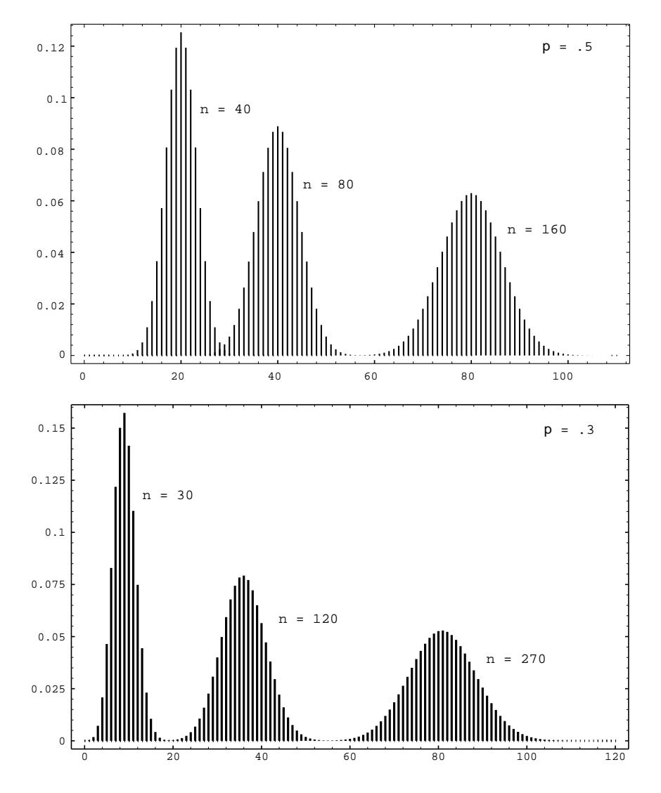

1 dollar. Since in American roulette the gambler wins if the ball stops on one of 18 out of 38 positions and loses otherwise, the probability of winning is  $p = 18/38 = .474.$ 

To analyze a Bernoulli trials process, we choose as our sample space a binary tree and assign a probability distribution to the paths in this tree. Suppose, for example, that we have three Bernoulli trials. The possible outcomes are indicated in the tree diagram shown in Figure 3.4. We define  $X$  to be the random variable which represents the outcome of the process, i.e., an ordered triple of S's and F's. The probabilities assigned to the branches of the tree represent the probability for each individual trial. Let the outcome of the *i*th trial be denoted by the random variable  $X_i$ , with distribution function  $m_i$ . Since we have assumed that outcomes on any one trial do not affect those on another, we assign the same probabilities at each level of the tree. An outcome  $\omega$  for the entire experiment will be a path through the tree. For example,  $\omega_3$  represents the outcomes SFS. Our frequency interpretation of probability would lead us to expect a fraction  $p$  of successes on the first experiment; of these, a fraction  $q$  of failures on the second; and, of these, a fraction  $p$  of successes on the third experiment. This suggests assigning probability pqp to the outcome  $\omega_3$ . More generally, we assign a distribution function  $m(\omega)$  for paths  $\omega$  by defining  $m(\omega)$  to be the product of the branch probabilities along the path  $\omega$ . Thus, the probability that the three events S on the first trial, F on the second trial, and S on the third trial occur is the product of the probabilities for the individual events. We shall see in the next chapter that this means that the events involved are *independent* in the sense that the knowledge of one event does not affect our prediction for the occurrences of the other events.

## **Binomial Probabilities**

We shall be particularly interested in the probability that in  $n$  Bernoulli trials there are exactly j successes. We denote this probability by  $b(n, p, j)$ . Let us calculate the particular value  $b(3, p, 2)$  from our tree measure. We see that there are three paths which have exactly two successes and one failure, namely  $\omega_2$ ,  $\omega_3$ , and  $\omega_5$ . Each of these paths has the same probability  $p^2q$ . Thus  $b(3, p, 2) = 3p^2q$ . Considering all possible numbers of successes we have

$$
b(3, p, 0) = q3,\n b(3, p, 1) = 3pq2,\n b(3, p, 2) = 3p2q,\n b(3, p, 3) = p3.
$$

We can, in the same manner, carry out a tree measure for  $n$  experiments and determine  $b(n, p, j)$  for the general case of n Bernoulli trials.

 $\Box$ 

 $\Box$ 

**Theorem 3.6** Given *n* Bernoulli trials with probability  $p$  of success on each experiment, the probability of exactly  $j$  successes is

$$
b(n, p, j) = \binom{n}{j} p^j q^{n-j}
$$

where  $q = 1 - p$ .

**Proof.** We construct a tree measure as described above. We want to find the sum of the probabilities for all paths which have exactly j successes and  $n - j$  failures. Each such path is assigned a probability  $p^j q^{n-j}$ . How many such paths are there? To specify a path, we have to pick, from the  $n$  possible trials, a subset of  $j$  to be successes, with the remaining  $n-j$  outcomes being failures. We can do this in  $\binom{n}{i}$ ways. Thus the sum of the probabilities is

$$
b(n,p,j) = {n \choose j} p^j q^{n-j} .
$$

**Example 3.8** A fair coin is tossed six times. What is the probability that exactly three heads turn up? The answer is

$$
b(6, .5, 3) = {6 \choose 3} \left(\frac{1}{2}\right)^3 \left(\frac{1}{2}\right)^3 = 20 \cdot \frac{1}{64} = .3125.
$$

**Example 3.9** A die is rolled four times. What is the probability that we obtain exactly one 6? We treat this as Bernoulli trials with  $success =$  "rolling a 6" and *failure* = "rolling some number other than a 6." Then  $p = 1/6$ , and the probability of exactly one success in four trials is

$$
b(4, 1/6, 1) = {4 \choose 1} \left(\frac{1}{6}\right)^1 \left(\frac{5}{6}\right)^3 = .386.
$$

To compute binomial probabilities using the computer, multiply the function choose(n, k) by  $p^k q^{n-k}$ . The program **BinomialProbabilities** prints out the binomial probabilities  $b(n, p, k)$  for k between kmin and kmax, and the sum of these probabilities. We have run this program for  $n = 100$ ,  $p = 1/2$ , kmin = 45, and  $kmax = 55$ ; the output is shown in Table 3.8. Note that the individual probabilities are quite small. The probability of exactly 50 heads in 100 tosses of a coin is about .08. Our intuition tells us that this is the most likely outcome, which is correct; but, all the same, it is not a very likely outcome.

| k. | b(n,p,k) |
|----|----------|
| 45 | .0485    |
| 46 | .0580    |
| 47 | .0666    |
| 48 | .0735    |
| 49 | .0780    |
| 50 | .0796    |
| 51 | .0780    |
| 52 | .0735    |
| 53 | .0666    |
| 54 | .0580    |
| 55 | .0485    |

Table 3.8: Binomial probabilities for  $n = 100$ ,  $p = 1/2$ .

## **Binomial Distributions**

**Definition 3.6** Let n be a positive integer, and let p be a real number between 0 and 1. Let  $B$  be the random variable which counts the number of successes in a Bernoulli trials process with parameters n and p. Then the distribution  $b(n, p, k)$ of B is called the *binomial distribution*.

We can get a better idea about the binomial distribution by graphing this distribution for different values of n and p (see Figure 3.5). The plots in this figure were generated using the program BinomialPlot.

We have run this program for  $p = .5$  and  $p = .3$ . Note that even for  $p = .3$  the graphs are quite symmetric. We shall have an explanation for this in Chapter 9. We also note that the highest probability occurs around the value  $np$ , but that these highest probabilities get smaller as n increases. We shall see in Chapter 6 that  $np$ is the *mean* or *expected* value of the binomial distribution  $b(n, p, k)$ .

The following example gives a nice way to see the binomial distribution, when  $p = 1/2.$ 

**Example 3.10** A Galton board is a board in which a large number of BB-shots are dropped from a chute at the top of the board and deflected off a number of pins on their way down to the bottom of the board. The final position of each slot is the result of a number of random deflections either to the left or the right. We have written a program GaltonBoard to simulate this experiment.

We have run the program for the case of 20 rows of pins and  $10,000$  shots being dropped. We show the result of this simulation in Figure 3.6.

Note that if we write 0 every time the shot is deflected to the left, and 1 every time it is deflected to the right, then the path of the shot can be described by a sequence of 0's and 1's of length  $n$ , just as for the *n*-fold coin toss.

The distribution shown in Figure 3.6 is an example of an empirical distribution, in the sense that it comes about by means of a sequence of experiments. As expected,

Figure 3.5: Binomial distributions.