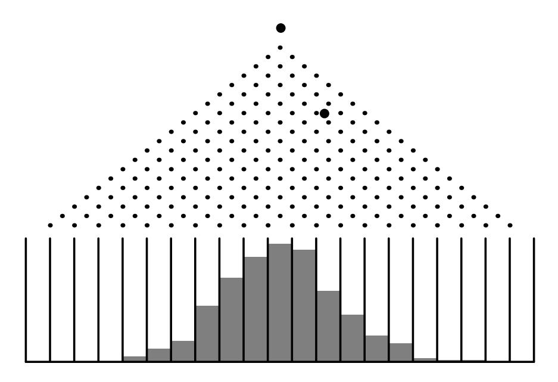
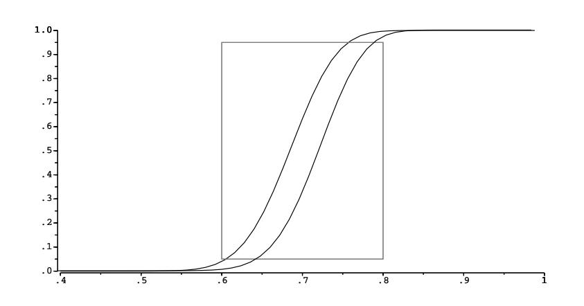

Figure 3.6: Simulation of the Galton board.

this empirical distribution resembles the corresponding binomial distribution with parameters  $n = 20$  and  $p = 1/2$ .  $\Box$ 

## **Hypothesis Testing**

**Example 3.11** Suppose that ordinary aspirin has been found effective against headaches 60 percent of the time, and that a drug company claims that its new aspirin with a special headache additive is more effective. We can test this claim as follows: we call their claim the *alternate hypothesis*, and its negation, that the additive has no appreciable effect, the *null hypothesis*. Thus the null hypothesis is that  $p = .6$ , and the alternate hypothesis is that  $p > .6$ , where p is the probability that the new aspirin is effective.

We give the aspiring to  $n$  people to take when they have a headache. We want to find a number  $m$ , called the *critical value* for our experiment, such that we reject the null hypothesis if at least  $m$  people are cured, and otherwise we accept it. How should we determine this critical value?

First note that we can make two kinds of errors. The first, often called a type 1 error in statistics, is to reject the null hypothesis when in fact it is true. The second, called a *type 2 error*, is to accept the null hypothesis when it is false. To determine the probability of both these types of errors we introduce a function  $\alpha(p)$ , defined to be the probability that we reject the null hypothesis, where this probability is calculated under the assumption that the null hypothesis is true. In the present case, we have

$$
\alpha(p) = \sum_{m \leq k \leq n} b(n, p, k) \ .
$$

Note that  $\alpha(.6)$  is the probability of a type 1 error, since this is the probability of a high number of successes for an ineffective additive. So for a given  $n$  we want to choose m so as to make  $\alpha$ (.6) quite small, to reduce the likelihood of a type 1 error. But as m increases above the most probable value  $np = .6n, \alpha(.6)$ , being the upper tail of a binomial distribution, approaches 0. Thus *increasing*  $m$  makes a type 1 error less likely.

Now suppose that the additive really is effective, so that  $p$  is appreciably greater than .6; say  $p = .8$ . (This alternative value of p is chosen arbitrarily; the following calculations depend on this choice.) Then choosing m well below  $np = .8n$  will increase  $\alpha(.8)$ , since now  $\alpha(.8)$  is all but the lower tail of a binomial distribution. Indeed, if we put  $\beta(0.8) = 1 - \alpha(0.8)$ , then  $\beta(0.8)$  gives us the probability of a type 2 error, and so *decreasing*  $m$  makes a type 2 error less likely.

The manufacturer would like to guard against a type 2 error, since if such an error is made, then the test does not show that the new drug is better, when in fact it is. If the alternative value of  $p$  is chosen closer to the value of  $p$  given in the null hypothesis (in this case  $p = .6$ ), then for a given test population, the value of  $\beta$  will increase. So, if the manufacturer's statistician chooses an alternative value for  $p$  which is close to the value in the null hypothesis, then it will be an expensive proposition (i.e., the test population will have to be large) to reject the null hypothesis with a small value of  $\beta$ .

What we hope to do then, for a given test population  $n$ , is to choose a value of  $m$ , if possible, which makes both these probabilities small. If we make a type 1 error we end up buying a lot of essentially ordinary aspirin at an inflated price; a type 2 error means we miss a bargain on a superior medication. Let us say that we want our critical number  $m$  to make each of these undesirable cases less than 5 percent probable.

We write a program **PowerCurve** to plot, for  $n = 100$  and selected values of m, the function  $\alpha(p)$ , for p ranging from .4 to 1. The result is shown in Figure 3.7. We include in our graph a box (in dotted lines) from .6 to .8, with bottom and top at heights 0.5 and 0.95. Then a value for  $m$  satisfies our requirements if and only if the graph of  $\alpha$  enters the box from the bottom, and leaves from the top (why?—which is the type 1 and which is the type 2 criterion?). As m increases, the graph of  $\alpha$ moves to the right. A few experiments have shown us that  $m = 69$  is the smallest value for m that thwarts a type 1 error, while  $m = 73$  is the largest which thwarts a type 2. So we may choose our critical value between 69 and 73. If we're more intent on avoiding a type 1 error we favor 73, and similarly we favor 69 if we regard a type 2 error as worse. Of course, the drug company may not be happy with having as much as a 5 percent chance of an error. They might insist on having a 1 percent chance of an error. For this we would have to increase the number  $n$  of trials (see Exercise 28).  $\Box$ 

## **Binomial Expansion**

We next remind the reader of an application of the binomial coefficients to algebra. This is the *binomial expansion*, from which we get the term binomial coefficient.

Figure 3.7: The power curve.

**Theorem 3.7 (Binomial Theorem)** The quantity  $(a + b)^n$  can be expressed in the form

$$
(a+b)^n = \sum_{j=0}^n \binom{n}{j} a^j b^{n-j}.
$$

**Proof.** To see that this expansion is correct, write

$$
(a + b)^n = (a + b)(a + b) \cdots (a + b).
$$

When we multiply this out we will have a sum of terms each of which results from a choice of an a or b for each of n factors. When we choose j a's and  $(n - j)$  b's, we obtain a term of the form  $a^j b^{n-j}$ . To determine such a term, we have to specify j of the  $n$  terms in the product from which we choose the  $a$ . This can be done in  $\binom{n}{i}$  ways. Thus, collecting these terms in the sum contributes a term  $\binom{n}{i}a^j b^{n-j}$ .  $\Box$ 

For example, we have

$$
(a + b)^0 = 1
$$
  
\n
$$
(a + b)^1 = a + b
$$
  
\n
$$
(a + b)^2 = a^2 + 2ab + b^2
$$
  
\n
$$
(a + b)^3 = a^3 + 3a^2b + 3ab^2 + b^3
$$
.

We see here that the coefficients of successive powers do indeed yield Pascal's triangle.

**Corollary 3.1** The sum of the elements in the *n*th row of Pascal's triangle is  $2^n$ . If the elements in the nth row of Pascal's triangle are added with alternating signs, the sum is 0.

 $\Box$ 

**Proof.** The first statement in the corollary follows from the fact that

 $\mathcal{L}^{\mathcal{L}}$ 

$$
2^{n} = (1+1)^{n} = {n \choose 0} + {n \choose 1} + {n \choose 2} + \cdots + {n \choose n},
$$

 $\mathcal{L}^{\mathcal{L}}$ 

and the second from the fact that

$$
0 = (1-1)^n = {n \choose 0} - {n \choose 1} + {n \choose 2} - \dots + (-1)^n {n \choose n}.
$$

The first statement of the corollary tells us that the number of subsets of a set of *n* elements is  $2^n$ . We shall use the second statement in our next application of the binomial theorem.

We have seen that, when  $A$  and  $B$  are any two events (cf. Section 1.2),

$$
P(A \cup B) = P(A) + P(B) - P(A \cap B).
$$

We now extend this theorem to a more general version, which will enable us to find the probability that at least one of a number of events occurs.

## **Inclusion-Exclusion Principle**

**Theorem 3.8** Let P be a probability distribution on a sample space  $\Omega$ , and let  $\{A_1, A_2, \ldots, A_n\}$  be a finite set of events. Then

$$
P(A_1 \cup A_2 \cup \dots \cup A_n) = \sum_{i=1}^n P(A_i) - \sum_{1 \le i < j \le n} P(A_i \cap A_j) + \sum_{1 \le i < j < k \le n} P(A_i \cap A_j \cap A_k) - \dots \quad (3.3)
$$

That is, to find the probability that at least one of n events  $A_i$  occurs, first add the probability of each event, then subtract the probabilities of all possible two-way intersections, add the probability of all three-way intersections, and so forth.

**Proof.** If the outcome  $\omega$  occurs in at least one of the events  $A_i$ , its probability is added exactly once by the left side of Equation 3.3. We must show that it is added exactly once by the right side of Equation 3.3. Assume that  $\omega$  is in exactly k of the sets. Then its probability is added k times in the first term, subtracted  $\binom{k}{2}$  times in the second, added  $\binom{k}{3}$  times in the third term, and so forth. Thus, the total number of times that it is added is

$$
\binom{k}{1} - \binom{k}{2} + \binom{k}{3} - \cdots (-1)^{k-1} \binom{k}{k}.
$$

But

$$
0 = (1-1)^{k} = \sum_{j=0}^{k} {k \choose j} (-1)^{j} = {k \choose 0} - \sum_{j=1}^{k} {k \choose j} (-1)^{j-1}.
$$