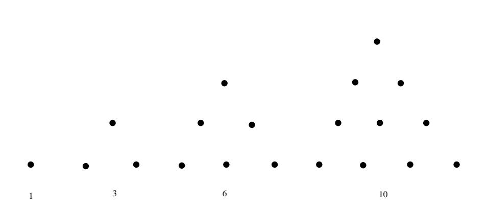
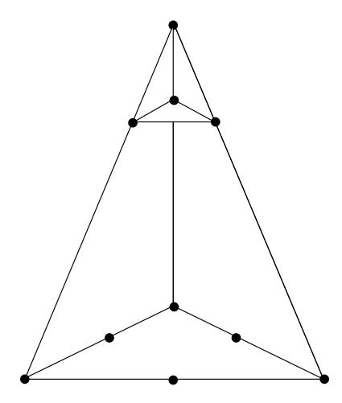
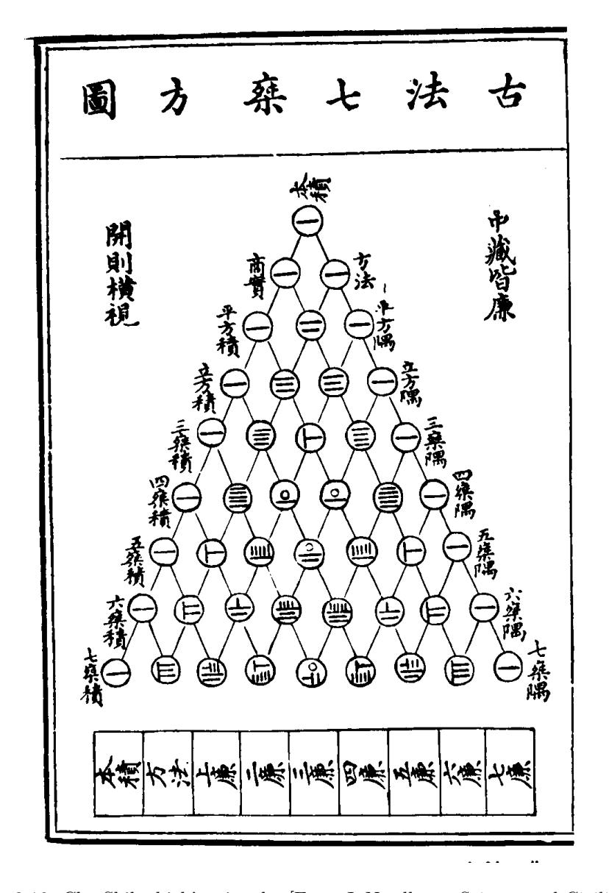

Figure 3.8: Pythagorean triangular patterns.  $\,$ 

Figure 3.9: Geometric representation of the tetrahedral number 10.  $\,$ 

11 12 22 13 23 33 14 24 34 44 15 25 35 45 55 16 26 36 46 56 66

Table 3.12: Outcomes for the roll of two dice.

number of medicinal preparations using 1, 2, 3, 4, 5, or 6 possible ingredients.17 His rule is equivalent to our formula

$$
\binom{n}{r} = \frac{(n)_r}{r!} \ .
$$

The binomial numbers as coefficients of  $(a + b)^n$  appeared in the works of mathematicians in China around 1100. There are references about this time to "the tabulation system for unlocking binomial coefficients." The triangle to provide the coefficients up to the eighth power is given by Chu Shih-chieh in a book written around 1303 (see Figure 3.10).18 The original manuscript of Chu's book has been lost, but copies have survived. Edwards notes that there is an error in this copy of Chu's triangle. Can you find it? (*Hint*: Two numbers which should be equal are not.) Other copies do not show this error.

The first appearance of Pascal's triangle in the West seems to have come from calculations of Tartaglia in calculating the number of possible ways that  $n$  dice might turn up.19 For one die the answer is clearly 6. For two dice the possibilities may be displayed as shown in Table 3.12.

Displaying them this way suggests the sixth triangular number  $1+2+3+4$  +  $5+6=21$  for the throw of 2 dice. Tartaglia "on the first day of Lent, 1523, in Verona, having thought about the problem all night,"20 realized that the extension of the figurate table gave the answers for  $n$  dice. The problem had suggested itself to Tartaglia from watching people casting their own horoscopes by means of a *Book* of Fortune, selecting verses by a process which included noting the numbers on the faces of three dice. The 56 ways that three dice can fall were set out on each page. The way the numbers were written in the book did not suggest the connection with figurate numbers, but a method of enumeration similar to the one we used for 2 dice does. Tartaglia's table was not published until 1556.

A table for the binomial coefficients was published in 1554 by the German mathematician Stifel.21 Pascal's triangle appears also in Cardano's Opus novum of 1570.22

 $17$ ibid., p. 27.

&lt;sup>18J. Needham, *Science and Civilization in China*, vol. 3 (New York: Cambridge University Press, 1959), p. 135.

&lt;sup>19N. Tartaglia, General Trattato di Numeri et Misure (Vinegia, 1556).

 $^{20}$ Quoted in Edwards, op. cit., p. 37.

 $^{21}$ M. Stifel, Arithmetica Integra (Norimburgae, 1544).

 $22$ G. Cardano, Opus Novum de Proportionibus Numerorum (Basilea, 1570).

Figure 3.10: Chu Shih-chieh's triangle. [From J. Needham, Science and Civilization in China, vol. 3 (New York: Cambridge University Press, 1959), p. 135. Reprinted with permission.]

Cardano was interested in the problem of finding the number of ways to choose  $r$ objects out of  $n$ . Thus by the time of Pascal's work, his triangle had appeared as a result of looking at the figurate numbers, the combinatorial numbers, and the binomial numbers, and the fact that all three were the same was presumably pretty well understood.

Pascal's interest in the binomial numbers came from his letters with Fermat concerning a problem known as the problem of points. This problem, and the correspondence between Pascal and Fermat, were discussed in Chapter 1. The reader will recall that this problem can be described as follows: Two players A and B are playing a sequence of games and the first player to win  $n$  games wins the match. It is desired to find the probability that A wins the match at a time when A has won  $a$  games and B has won  $b$  games. (See Exercises 4.1.40-4.1.42.)

Pascal solved the problem by backward induction, much the way we would do today in writing a computer program for its solution. He referred to the combinatorial method of Fermat which proceeds as follows: If A needs  $c$  games and B needs d games to win, we require that the players continue to play until they have played  $c+d-1$  games. The winner in this extended series will be the same as the winner in the original series. The probability that A wins in the extended series and hence in the original series is

$$
\sum_{r=c}^{c+d-1} \frac{1}{2^{c+d-1}} {c+d-1 \choose r}.
$$

Even at the time of the letters Pascal seemed to understand this formula.

Suppose that the first player to win  $n$  games wins the match, and suppose that each player has put up a stake of  $x$ . Pascal studied the value of winning a particular game. By this he meant the increase in the expected winnings of the winner of the particular game under consideration. He showed that the value of the first game is

$$
\frac{1\cdot 3\cdot 5\cdot \ldots \cdot (2n-1)}{2\cdot 4\cdot 6\cdot \ldots \cdot (2n)}x.
$$

His proof of this seems to use Fermat's formula and the fact that the above ratio of products of odd to products of even numbers is equal to the probability of exactly *n* heads in  $2n$  tosses of a coin. (See Exercise 39.)

Pascal presented Fermat with the table shown in Table 3.13. He states:

You will see as always, that the value of the first game is equal to that of the second which is easily shown by combinations. You will see, in the same way, that the numbers in the first line are always increasing; so also are those in the second; and those in the third. But those in the fourth line are decreasing, and those in the fifth, etc. This seems odd.23

The student can pursue this question further using the computer and Pascal's backward iteration method for computing the expected payoff at any point in the series.

 $^{23}$  F. N. David, op. cit., p. 235.