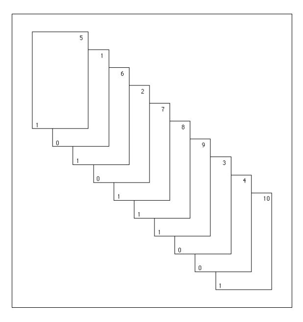
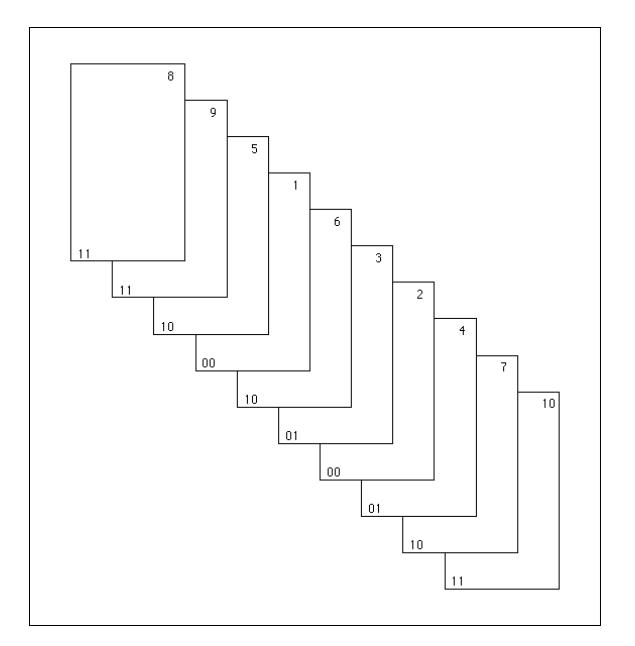

there are 4 rising sequences; they are  $(1)$ ,  $(2,3,4)$ ,  $(5,6)$ , and  $(7)$ . It is easy to see that an ordering is the result of a riffle shuffle applied to the identity ordering if and only if it has no more than two rising sequences. (If the ordering has two rising sequences, then these rising sequences correspond to the two stacks induced by the cut, and if the ordering has one rising sequence, then it is the identity ordering.) Thus, the sample space of orderings obtained by applying a riffle shuffle to the identity ordering is naturally described as the set of all orderings with at most two rising sequences.

It is now easy to assign a probability distribution to this sample space. Each ordering with two rising sequences is assigned the value

$$
\frac{b(n, 1/2, k)}{\binom{n}{k}} = \frac{1}{2^n}
$$

and the identity ordering is assigned the value

$$
\frac{n+1}{2^n}
$$

There is another way to view a riffle shuffle. We can imagine starting with a deck cut into two stacks as before, with the same probabilities assignment as before i.e., the binomial distribution. Once we have the two stacks, we take cards, one by one, off of the bottom of the two stacks, and place them onto one stack. If there are  $k_1$  and  $k_2$  cards, respectively, in the two stacks at some point in this process, then we make the assumption that the probabilities that the next card to be taken comes from a given stack is proportional to the current stack size. This implies that the probability that we take the next card from the first stack equals

$$
\frac{k_1}{k_1+k_2} \; ;
$$

and the corresponding probability for the second stack is

$$
\frac{k_2}{k_1+k_2}
$$

We shall now show that this process assigns the uniform probability to each of the possible interleavings of the two stacks.

Suppose, for example, that an interleaving came about as the result of choosing cards from the two stacks in some order. The probability that this result occurred is the product of the probabilities at each point in the process, since the choice of card at each point is assumed to be independent of the previous choices. Each factor of this product is of the form

$$
\frac{k_i}{k_1+k_2}:
$$

where  $i = 1$  or 2, and the denominator of each factor equals the number of cards left to be chosen. Thus, the denominator of the probability is just  $n!$ . At the moment when a card is chosen from a stack that has  $i$  cards in it, the numerator of the corresponding factor in the probability is  $i$ , and the number of cards in this stack decreases by 1. Thus, the numerator is seen to be  $k!(n-k)!$ , since all cards in both stacks are eventually chosen. Therefore, this process assigns the probability

$$
\frac{1}{\binom{n}{k}}
$$

to each possible interleaving.

We now turn to the question of what happens when we riffle shuffle  $s$  times. It should be clear that if we start with the identity ordering, we obtain an ordering with at most  $2s$  rising sequences, since a riffle shuffle creates at most two rising sequences from every rising sequence in the starting ordering. In fact, it is not hard to see that each such ordering is the result of s riffle shuffles. The question becomes, then, in how many ways can an ordering with  $r$  rising sequences come about by applying  $s$  riffle shuffles to the identity ordering? In order to answer this question, we turn to the idea of an  $a$ -shuffle.

## $a$ -Shuffles

There are several ways to visualize an  $a$ -shuffle. One way is to imagine a creature with  $a$  hands who is given a deck of cards to riffle shuffle. The creature naturally cuts the deck into a stacks, and then riffles them together. (Imagine that!) Thus, the ordinary riffle shuffle is a 2-shuffle. As in the case of the ordinary 2-shuffle, we allow some of the stacks to have 0 cards. Another way to visualize an  $a$ -shuffle is to think about its inverse, called an  $a$ -unshuffle. This idea is described in the proof of the next theorem.

We will now show that an a-shuffle followed by a b-shuffle is equivalent to an abshuffle. This means, in particular, that s riffle shuffles in succession are equivalent to one  $2s$ -shuffle. This equivalence is made precise by the following theorem.

**Theorem 3.9** Let a and b be two positive integers. Let  $S_{a,b}$  be the set of all ordered pairs in which the first entry is an  $a$ -shuffle and the second entry is a  $b$ -shuffle. Let  $S_{ab}$  be the set of all ab-shuffles. Then there is a 1-1 correspondence between  $S_{a,b}$ and  $S_{ab}$  with the following property. Suppose that  $(T_1, T_2)$  corresponds to  $T_3$ . If  $T_1$  is applied to the identity ordering, and  $T_2$  is applied to the resulting ordering, then the final ordering is the same as the ordering that is obtained by applying  $T_3$ to the identity ordering.

**Proof.** The easiest way to describe the required correspondence is through the idea of an unshuffle. An  $a$ -unshuffle begins with a deck of  $n$  cards. One by one, cards are taken from the top of the deck and placed, with equal probability, on the bottom of any one of a stacks, where the stacks are labelled from 0 to  $a-1$ . After all of the cards have been distributed, we combine the stacks to form one stack by placing stack i on top of stack  $i+1$ , for  $0 \le i \le a-1$ . It is easy to see that if one starts with a deck, there is exactly one way to cut the deck to obtain the  $a$  stacks generated by the a-unshuffle, and with these a stacks, there is exactly one way to interleave them to obtain the deck in the order that it was in before the unshuffle was performed. Thus, this a-unshuffle corresponds to a unique a-shuffle, and this a-shuffle is the inverse of the original *a*-unshuffle.

If we apply an ab-unshuffle  $U_3$  to a deck, we obtain a set of ab stacks, which are then combined, in order, to form one stack. We label these stacks with ordered pairs of integers, where the first coordinate is between 0 and  $a-1$ , and the second coordinate is between 0 and  $b-1$ . Then we label each card with the label of its stack. The number of possible labels is  $ab$ , as required. Using this labelling, we can describe how to find a b-unshuffle and an  $a$ -unshuffle, such that if these two unshuffles are applied in this order to the deck, we obtain the same set of ab stacks as were obtained by the *ab*-unshuffle.

To obtain the b-unshuffle  $U_2$ , we sort the deck into b stacks, with the *i*th stack containing all of the cards with second coordinate i, for  $0 \le i \le b-1$ . Then these stacks are combined to form one stack. The  $a$ -unshuffle  $U_1$  proceeds in the same manner, except that the first coordinates of the labels are used. The resulting  $a$ stacks are then combined to form one stack.

The above description shows that the cards ending up on top are all those labelled  $(0,0)$ . These are followed by those labelled  $(0,1)$ ,  $(0,2)$ , ...,  $(0,b-$ 1),  $(1,0)$ ,  $(1,1)$ ,...,  $(a-1,b-1)$ . Furthermore, the relative order of any pair of cards with the same labels is never altered. But this is exactly the same as an *ab*-unshuffle, if, at the beginning of such an unshuffle, we label each of the cards with one of the labels  $(0,0)$ ,  $(0,1)$ , ...,  $(0,b-1)$ ,  $(1,0)$ ,  $(1,1)$ , ...,  $(a-1,b-1)$ . This completes the proof.  $\Box$ 

In Figure 3.11, we show the labels for a 2-unshuffle of a deck with 10 cards. There are 4 cards with the label 0 and 6 cards with the label 1, so if the 2-unshuffle is performed, the first stack will have 4 cards and the second stack will have 6 cards. When this unshuffle is performed, the deck ends up in the identity ordering.

In Figure 3.12, we show the labels for a 4-unshuffle of the same deck (because there are four labels being used). This figure can also be regarded as an example of a pair of 2-unshuffles, as described in the proof above. The first 2-unshuffle will use the second coordinate of the labels to determine the stacks. In this case, the two stacks contain the cards whose values are

$$
\{5, 1, 6, 2, 7\} \text{ and } \{8, 9, 3, 4, 10\}
$$

After this 2-unshuffle has been performed, the deck is in the order shown in Figure 3.11, as the reader should check. If we wish to perform a 4-unshuffle on the deck, using the labels shown, we sort the cards lexicographically, obtaining the four stacks

$$
\{1,2\}, \{3,4\}, \{5,6,7\}, \text{ and } \{8,9,10\}.
$$

When these stacks are combined, we once again obtain the identity ordering of the deck. The point of the above theorem is that both sorting procedures always lead to the same initial ordering.

Figure 3.11: Before a 2-unshuffle.

Figure 3.12: Before a 4-unshuffle.