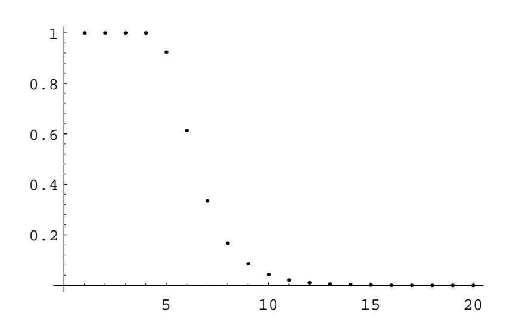

| Number of Riffle Shuffles | Variation Distance |
|---------------------------|--------------------|
| 1                         | 1                  |
| 2                         | 1                  |
| 3                         |                    |
| 4                         | 0.9999995334       |
| 5                         | 0.9237329294       |
| 6                         | 0.6135495966       |
|                           | 0.3340609995       |
| 8                         | 0.1671586419       |
| 9                         | 0.0854201934       |
| 10                        | 0.0429455489       |
| 11                        | 0.0215023760       |
| 12                        | 0.0107548935       |
| 13                        | 0.0053779101       |
| 14                        | 0.0026890130       |

Table 3.14: Distance to the random process.    $\,$ 

Figure 3.13: Distance to the random process.  $\,$ 

very far from random. After 5 shuffles, the distance from the random process is essentially halved each time a shuffle occurs.

Given the distribution functions  $f_X(\pi)$  and  $u(\pi)$  as above, there is another way to view the variation distance  $|| f_X - u ||$ . Given any event T (which is a subset of  $S_n$ ), we can calculate its probability under the process X and under the uniform process. For example, we can imagine that  $T$  represents the set of all permutations in which the first player in a 7-player poker game is dealt a straight flush (five consecutive cards in the same suit). It is interesting to consider how much the probability of this event after a certain number of shuffles differs from the probability of this event if all permutations are equally likely. This difference can be thought of as describing how close the process  $X$  is to the random process with respect to the event  $T$ .

Now consider the event  $T$  such that the absolute value of the difference between these two probabilities is as large as possible. It can be shown that this absolute value is the variation distance between the process  $X$  and the uniform process. (The reader is asked to prove this fact in Exercise 4.)

We have just seen that, for a deck of 52 cards, the variation distance between the 7-riffle shuffle process and the random process is about .334. It is of interest to find an event  $T$  such that the difference between the probabilities that the two processes produce  $T$  is close to .334. An event with this property can be described in terms of the game called New-Age Solitaire.

## New-Age Solitaire

This game was invented by Peter Doyle. It is played with a standard 52-card deck. We deal the cards face up, one at a time, onto a discard pile. If an ace is encountered, say the ace of Hearts, we use it to start a Heart pile. Each suit pile must be built up in order, from ace to king, using only subsequently dealt cards. Once we have dealt all of the cards, we pick up the discard pile and continue. We define the Yin suits to be Hearts and Clubs, and the Yang suits to be Diamonds and Spades. The game ends when either both Yin suit piles have been completed, or both Yang suit piles have been completed. It is clear that if the ordering of the deck is produced by the random process, then the probability that the Yin suit piles are completed first is exactly  $1/2$ .

Now suppose that we buy a new deck of cards, break the seal on the package, and riffle shuffle the deck 7 times. If one tries this, one finds that the Yin suits win about  $75\%$  of the time. This is  $25\%$  more than we would get if the deck were in truly random order. This deviation is reasonably close to the theoretical maximum of 33.4% obtained above.

Why do the Yin suits win so often? In a brand new deck of cards, the suits are in the following order, from top to bottom: ace through king of Hearts, ace through king of Clubs, king through ace of Diamonds, and king through ace of Spades. Note that if the cards were not shuffled at all, then the Yin suit piles would be completed on the first pass, before any Yang suit cards are even seen. If we were to continue playing the game until the Yang suit piles are completed, it would take 13 passes

through the deck to do this. Thus, one can see that in a new deck, the Yin suits are in the most advantageous order and the Yang suits are in the least advantageous order. Under 7 riffle shuffles, the relative advantage of the Yin suits over the Yang suits is preserved to a certain extent.

## **Exercises**

1 Given any ordering  $\sigma$  of  $\{1, 2, ..., n\}$ , we can define  $\sigma^{-1}$ , the inverse ordering of  $\sigma$ , to be the ordering in which the *i*th element is the position occupied by i in  $\sigma$ . For example, if  $\sigma = (1, 3, 5, 2, 4, 7, 6)$ , then  $\sigma^{-1} = (1, 4, 2, 5, 3, 7, 6)$ . (If one thinks of these orderings as permutations, then  $\sigma^{-1}$  is the inverse of  $\sigma$ .)

A fall occurs between two positions in an ordering if the left position is occupied by a larger number than the right position. It will be convenient to say that every ordering has a fall after the last position. In the above example,  $\sigma^{-1}$  has four falls. They occur after the second, fourth, sixth, and seventh positions. Prove that the number of rising sequences in an ordering  $\sigma$  equals the number of falls in  $\sigma^{-1}$ .

2 Show that if we start with the identity ordering of  $\{1, 2, ..., n\}$ , then the probability that an  $a$ -shuffle leads to an ordering with exactly  $r$  rising sequences equals

$$
\frac{\binom{n+a-r}{n}}{a^n}A(n,r) ,
$$

for  $1 \leq r \leq a$ .

- **3** Let D be a deck of n cards. We have seen that there are  $a^n$  a-shuffles of D. A coding of the set of a-unshuffles was given in the proof of Theorem 3.9. We will now give a coding of the  $a$ -shuffles which corresponds to the coding of the  $a$ -unshuffles. Let  $S$  be the set of all  $n$ -tuples of integers, each between 0 and  $a-1$ . Let  $M = (m_1, m_2, \ldots, m_n)$  be any element of S. Let  $n_i$  be the number of i's in M, for  $0 \le i \le a-1$ . Suppose that we start with the deck in increasing order (i.e., the cards are numbered from 1 to  $n$ ). We label the first  $n_0$  cards with a 0, the next  $n_1$  cards with a 1, etc. Then the a-shuffle corresponding to  $M$  is the shuffle which results in the ordering in which the cards labelled i are placed in the positions in  $M$  containing the label i. The cards with the same label are placed in these positions in increasing order of their numbers. For example, if  $n = 6$  and  $a = 3$ , let  $M = (1,0,2,2,0,2)$ . Then  $n_0 = 2$ ,  $n_1 = 1$ , and  $n_2 = 3$ . So we label cards 1 and 2 with a 0, card 3 with a 1, and cards 4, 5, and 6 with a 2. Then cards 1 and 2 are placed in positions 2 and 5, card 3 is placed in position 1, and cards 4, 5, and 6 are placed in positions 3, 4, and 6, resulting in the ordering  $(3, 1, 4, 5, 2, 6)$ .
  - (a) Using this coding, show that the probability that in an  $a$ -shuffle, the first card (i.e., card number 1) moves to the *i*th position, is given by the following expression:

$$
\frac{(a-1)^{i-1}a^{n-i}+(a-2)^{i-1}(a-1)^{n-i}+\cdots+1^{i-1}2^{n-i}}{a^n}.
$$

- (b) Give an accurate estimate for the probability that in three riffle shuffles of a 52-card deck, the first card ends up in one of the first 26 positions. Using a computer, accurately estimate the probability of the same event after seven riffle shuffles.
- 4 Let X denote a particular process that produces elements of  $S_n$ , and let U denote the uniform process. Let the distribution functions of these processes be denoted by  $f_X$  and u, respectively. Show that the variation distance  $|| f_X - u ||$  is equal to

$$
\max_{T \subset S_n} \sum_{\pi \in T} \Big( f_X(\pi) - u(\pi) \Big) .
$$

*Hint*: Write the permutations in  $S_n$  in decreasing order of the difference  $f_X(\pi) - u(\pi)$ .

5 Consider the process described in the text in which an  $n$ -card deck is repeatedly labelled and 2-unshuffled, in the manner described in the proof of Theorem 3.9. (See Figures 3.10 and 3.13.) The process continues until the labels are all different. Show that the process never terminates until at least  $\lceil \log_2(n) \rceil$  unshuffles have been done.