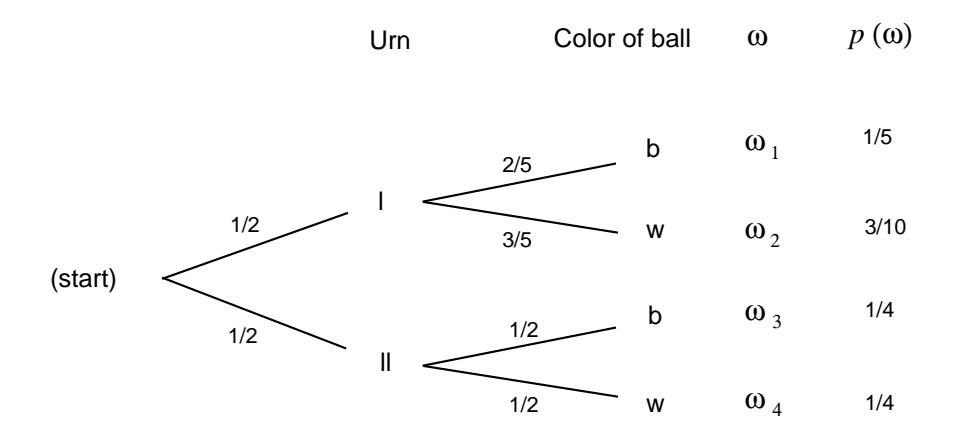
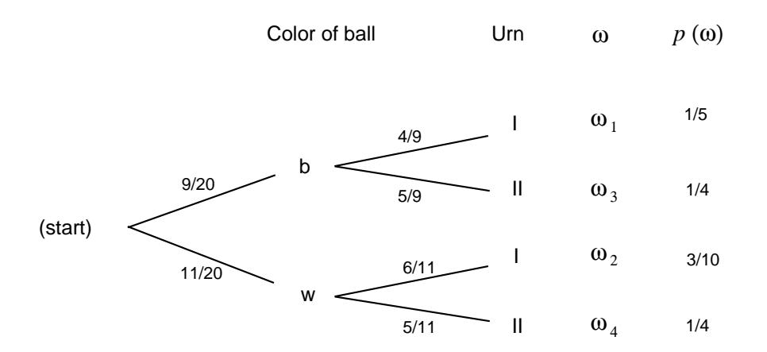

## Chapter 4

# **Conditional Probability**

#### $4.1$ Discrete Conditional Probability

## **Conditional Probability**

In this section we ask and answer the following question. Suppose we assign a distribution function to a sample space and then learn that an event  $E$  has occurred. How should we change the probabilities of the remaining events? We shall call the new probability for an event F the *conditional probability of* F given E and denote it by  $P(F|E)$ .

**Example 4.1** An experiment consists of rolling a die once. Let X be the outcome. Let F be the event  $\{X = 6\}$ , and let E be the event  $\{X > 4\}$ . We assign the distribution function  $m(\omega) = 1/6$  for  $\omega = 1, 2, ..., 6$ . Thus,  $P(F) = 1/6$ . Now suppose that the die is rolled and we are told that the event  $E$  has occurred. This leaves only two possible outcomes: 5 and 6. In the absence of any other information, we would still regard these outcomes to be equally likely, so the probability of  $F$ becomes  $1/2$ , making  $P(F|E) = 1/2$ .  $\Box$ 

**Example 4.2** In the Life Table (see Appendix C), one finds that in a population of 100,000 females,  $89.835\%$  can expect to live to age 60, while 57.062\% can expect to live to age 80. Given that a woman is 60, what is the probability that she lives to age  $80$ ?

This is an example of a conditional probability. In this case, the original sample space can be thought of as a set of 100,000 females. The events  $E$  and  $F$  are the subsets of the sample space consisting of all women who live at least 60 years, and at least 80 years, respectively. We consider  $E$  to be the new sample space, and note that F is a subset of E. Thus, the size of E is 89,835, and the size of F is 57,062. So, the probability in question equals  $57,062/89,835 = .6352$ . Thus, a woman who is 60 has a  $63.52\%$  chance of living to age 80.  $\Box$  **Example 4.3** Consider our voting example from Section 1.2: three candidates A, B, and C are running for office. We decided that A and B have an equal chance of winning and C is only  $1/2$  as likely to win as A. Let A be the event "A wins," B that "B wins," and C that "C wins." Hence, we assigned probabilities  $P(A) = 2/5$ ,  $P(B) = 2/5$ , and  $P(C) = 1/5$ .

Suppose that before the election is held, A drops out of the race. As in Example 4.1, it would be natural to assign new probabilities to the events  $B$  and  $C$  which are proportional to the original probabilities. Thus, we would have  $P(B|A) = 2/3$ , and  $P(C|A) = 1/3$ . It is important to note that any time we assign probabilities to real-life events, the resulting distribution is only useful if we take into account all relevant information. In this example, we may have knowledge that most voters who favor  $A$  will vote for  $C$  if  $A$  is no longer in the race. This will clearly make the probability that C wins greater than the value of  $1/3$  that was assigned above.  $\Box$ 

In these examples we assigned a distribution function and then were given new information that determined a new sample space, consisting of the outcomes that are still possible, and caused us to assign a new distribution function to this space.

We want to make formal the procedure carried out in these examples. Let  $\Omega = {\omega_1, \omega_2, \ldots, \omega_r}$  be the original sample space with distribution function  $m(\omega_i)$ assigned. Suppose we learn that the event  $E$  has occurred. We want to assign a new distribution function  $m(\omega_i|E)$  to  $\Omega$  to reflect this fact. Clearly, if a sample point  $\omega_i$ is not in E, we want  $m(\omega_i|E) = 0$ . Moreover, in the absence of information to the contrary, it is reasonable to assume that the probabilities for  $\omega_k$  in E should have the same relative magnitudes that they had before we learned that  $E$  had occurred. For this we require that

$$
m(\omega_k|E)=cm(\omega_k)
$$

for all  $\omega_k$  in E, with c some positive constant. But we must also have

$$
\sum_E m(\omega_k|E) = c \sum_E m(\omega_k) = 1.
$$

Thus,

$$
c = \frac{1}{\sum_E m(\omega_k)} = \frac{1}{P(E)}
$$

(Note that this requires us to assume that  $P(E) > 0$ .) Thus, we will define

$$
m(\omega_k|E) = \frac{m(\omega_k)}{P(E)}
$$

for  $\omega_k$  in E. We will call this new distribution the *conditional distribution* given E. For a general event  $F$ , this gives

$$
P(F|E) = \sum_{F \cap E} m(\omega_k|E) = \sum_{F \cap E} \frac{m(\omega_k)}{P(E)} = \frac{P(F \cap E)}{P(E)}
$$

We call  $P(F|E)$  the conditional probability of F occurring given that E occurs, and compute it using the formula

$$
P(F|E) = \frac{P(F \cap E)}{P(E)}.
$$

Figure 4.1: Tree diagram.

**Example 4.4** (Example 4.1 continued) Let us return to the example of rolling a die. Recall that F is the event  $X = 6$ , and E is the event  $X > 4$ . Note that  $E \cap F$ is the event  $F$ . So, the above formula gives

$$
P(F|E) = \frac{P(F \cap E)}{P(E)}
$$
$$
= \frac{1/6}{1/3}
$$
$$
= \frac{1}{2},
$$

in agreement with the calculations performed earlier.

Example 4.5 We have two urns, I and II. Urn I contains 2 black balls and 3 white balls. Urn II contains 1 black ball and 1 white ball. An urn is drawn at random and a ball is chosen at random from it. We can represent the sample space of this experiment as the paths through a tree as shown in Figure 4.1. The probabilities assigned to the paths are also shown.

Let  $B$  be the event "a black ball is drawn," and  $I$  the event "urn I is chosen." Then the branch weight  $2/5$ , which is shown on one branch in the figure, can now be interpreted as the conditional probability  $P(B|I)$ .

Suppose we wish to calculate  $P(I|B)$ . Using the formula, we obtain

$$
P(I|B) = \frac{P(I \cap B)}{P(B)}
$$
  
= 
$$
\frac{P(I \cap B)}{P(B \cap I) + P(B \cap II)}
$$
  
= 
$$
\frac{1/5}{1/5 + 1/4} = \frac{4}{9}.
$$

 $\Box$ 

Figure 4.2: Reverse tree diagram.

### **Bayes Probabilities**

Our original tree measure gave us the probabilities for drawing a ball of a given color, given the urn chosen. We have just calculated the *inverse probability* that a particular urn was chosen, given the color of the ball. Such an inverse probability is called a *Bayes probability* and may be obtained by a formula that we shall develop later. Bayes probabilities can also be obtained by simply constructing the tree measure for the two-stage experiment carried out in reverse order. We show this tree in Figure 4.2.

The paths through the reverse tree are in one-to-one correspondence with those in the forward tree, since they correspond to individual outcomes of the experiment, and so they are assigned the same probabilities. From the forward tree, we find that the probability of a black ball is

$$
\frac{1}{2} \cdot \frac{2}{5} + \frac{1}{2} \cdot \frac{1}{2} = \frac{9}{20} .
$$

The probabilities for the branches at the second level are found by simple division. For example, if x is the probability to be assigned to the top branch at the second level, we must have

$$
\frac{9}{20}\cdot x=\frac{1}{5}
$$

or  $x = 4/9$ . Thus,  $P(I|B) = 4/9$ , in agreement with our previous calculations. The reverse tree then displays all of the inverse, or Bayes, probabilities.

**Example 4.6** We consider now a problem called the *Monty Hall* problem. This has long been a favorite problem but was revived by a letter from Craig Whitaker to Marilyn vos Savant for consideration in her column in *Parade Magazine*.1 Craig wrote:

&lt;sup>1Marilyn vos Savant, Ask Marilyn, Parade Magazine, 9 September; 2 December; 17 February 1990, reprinted in Marilyn vos Savant, Ask Marilyn, St. Martins, New York, 1992.