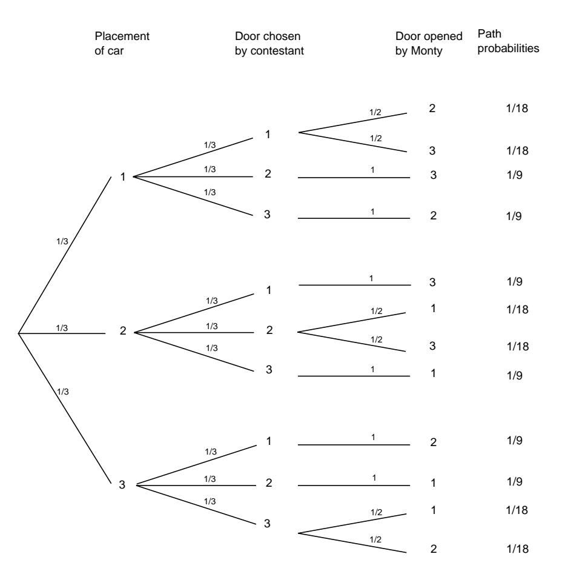
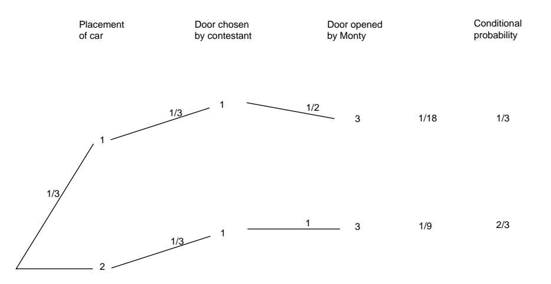

Suppose you're on Monty Hall's Let's Make a Deal! You are given the choice of three doors, behind one door is a car, the others, goats. You pick a door, say 1, Monty opens another door, say 3, which has a goat. Monty says to you "Do you want to pick door 2?" Is it to your advantage to switch your choice of doors?

Marilyn gave a solution concluding that you should switch, and if you do, your probability of winning is  $2/3$ . Several irate readers, some of whom identified themselves as having a PhD in mathematics, said that this is absurd since after Monty has ruled out one door there are only two possible doors and they should still each have the same probability  $1/2$  so there is no advantage to switching. Marilyn stuck to her solution and encouraged her readers to simulate the game and draw their own conclusions from this. We also encourage the reader to do this (see Exercise 11).

Other readers complained that Marilyn had not described the problem completely. In particular, the way in which certain decisions were made during a play of the game were not specified. This aspect of the problem will be discussed in Section 4.3. We will assume that the car was put behind a door by rolling a three-sided die which made all three choices equally likely. Monty knows where the car is, and always opens a door with a goat behind it. Finally, we assume that if Monty has a choice of doors (i.e., the contestant has picked the door with the car behind it), he chooses each door with probability  $1/2$ . Marilyn clearly expected her readers to assume that the game was played in this manner.

As is the case with most apparent paradoxes, this one can be resolved through careful analysis. We begin by describing a simpler, related question. We say that a contestant is using the "stay" strategy if he picks a door, and, if offered a chance to switch to another door, declines to do so (i.e., he stays with his original choice). Similarly, we say that the contestant is using the "switch" strategy if he picks a door, and, if offered a chance to switch to another door, takes the offer. Now suppose that a contestant decides in advance to play the "stay" strategy. His only action in this case is to pick a door (and decline an invitation to switch, if one is offered). What is the probability that he wins a car? The same question can be asked about the "switch" strategy.

Using the "stay" strategy, a contestant will win the car with probability  $1/3$ , since  $1/3$  of the time the door he picks will have the car behind it. On the other hand, if a contestant plays the "switch" strategy, then he will win whenever the door he originally picked does not have the car behind it, which happens 2/3 of the time.

This very simple analysis, though correct, does not quite solve the problem that Craig posed. Craig asked for the conditional probability that you win if you switch, given that you have chosen door 1 and that Monty has chosen door 3. To solve this problem, we set up the problem before getting this information and then compute the conditional probability given this information. This is a process that takes place in several stages; the car is put behind a door, the contestant picks a door, and finally Monty opens a door. Thus it is natural to analyze this using a tree measure. Here we make an additional assumption that if Monty has a choice

Figure 4.3: The Monty Hall problem.

of doors (i.e., the contestant has picked the door with the car behind it) then he picks each door with probability  $1/2$ . The assumptions we have made determine the branch probabilities and these in turn determine the tree measure. The resulting tree and tree measure are shown in Figure 4.3. It is tempting to reduce the tree's size by making certain assumptions such as: "Without loss of generality, we will assume that the contestant always picks door 1." We have chosen not to make any such assumptions, in the interest of clarity.

Now the given information, namely that the contestant chose door 1 and Monty chose door 3, means only two paths through the tree are possible (see Figure 4.4). For one of these paths, the car is behind door 1 and for the other it is behind door 2. The path with the car behind door 2 is twice as likely as the one with the car behind door 1. Thus the conditional probability is  $2/3$  that the car is behind door 2 and  $1/3$  that it is behind door 1, so if you switch you have a  $2/3$  chance of winning the car, as Marilyn claimed.

At this point, the reader may think that the two problems above are the same, since they have the same answers. Recall that we assumed in the original problem

Figure 4.4: Conditional probabilities for the Monty Hall problem.

if the contestant chooses the door with the car, so that Monty has a choice of two doors, he chooses each of them with probability  $1/2$ . Now suppose instead that in the case that he has a choice, he chooses the door with the larger number with probability  $3/4$ . In the "switch" vs. "stay" problem, the probability of winning with the "switch" strategy is still  $2/3$ . However, in the original problem, if the contestant switches, he wins with probability  $4/7$ . The reader can check this by noting that the same two paths as before are the only two possible paths in the tree. The path leading to a win, if the contestant switches, has probability  $1/3$ , while the path which leads to a loss, if the contestant switches, has probability  $1/4$ .  $\Box$ 

## Independent Events

It often happens that the knowledge that a certain event E has occurred has no effect on the probability that some other event F has occurred, that is, that  $P(F|E)$  =  $P(F)$ . One would expect that in this case, the equation  $P(E|F) = P(E)$  would also be true. In fact (see Exercise 1), each equation implies the other. If these equations are true, we might say the  $F$  is independent of  $E$ . For example, you would not expect the knowledge of the outcome of the first toss of a coin to change the probability that you would assign to the possible outcomes of the second toss, that is, you would not expect that the second toss depends on the first. This idea is formalized in the following definition of independent events.

**Definition 4.1** Let  $E$  and  $F$  be two events. We say that they are *independent* if either 1) both events have positive probability and

$$
P(E|F) = P(E) \text{ and } P(F|E) = P(F) ,
$$

or 2) at least one of the events has probability 0.

As noted above, if both  $P(E)$  and  $P(F)$  are positive, then each of the above equations imply the other, so that to see whether two events are independent, only one of these equations must be checked (see Exercise 1).

The following theorem provides another way to check for independence.

**Theorem 4.1** Two events  $E$  and  $F$  are independent if and only if

$$
P(E \cap F) = P(E)P(F) .
$$

**Proof.** If either event has probability 0, then the two events are independent and the above equation is true, so the theorem is true in this case. Thus, we may assume that both events have positive probability in what follows. Assume that  $E$  and  $F$ are independent. Then  $P(E|F) = P(E)$ , and so

$$
P(E \cap F) = P(E|F)P(F)
$$
  
= 
$$
P(E)P(F).
$$

Assume next that  $P(E \cap F) = P(E)P(F)$ . Then

$$
P(E|F) = \frac{P(E \cap F)}{P(F)} = P(E) .
$$

Also,

$$
P(F|E) = \frac{P(F \cap E)}{P(E)} = P(F)
$$

Therefore,  $E$  and  $F$  are independent.

**Example 4.7** Suppose that we have a coin which comes up heads with probability  $p$ , and tails with probability  $q$ . Now suppose that this coin is tossed twice. Using a frequency interpretation of probability, it is reasonable to assign to the outcome  $(H, H)$  the probability  $p^2$ , to the outcome  $(H, T)$  the probability pq, and so on. Let  $E$  be the event that heads turns up on the first toss and  $F$  the event that tails turns up on the second toss. We will now check that with the above probability assignments, these two events are independent, as expected. We have  $P(E)$  =  $p^{2} + pq = p$ ,  $P(F) = pq + q^{2} = q$ . Finally  $P(E \cap F) = pq$ , so  $P(E \cap F) =$  $P(E)P(F)$ .  $\Box$ 

**Example 4.8** It is often, but not always, intuitively clear when two events are independent. In Example 4.7, let A be the event "the first toss is a head" and B the event "the two outcomes are the same." Then

$$
P(B|A) = \frac{P(B \cap A)}{P(A)} = \frac{P\{\text{HH}\}}{P\{\text{HH}, \text{HT}\}} = \frac{1/4}{1/2} = \frac{1}{2} = P(B).
$$

Therefore,  $A$  and  $B$  are independent, but the result was not so obvious.

140