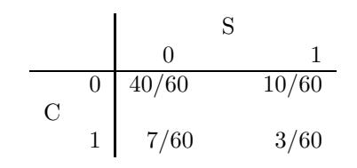

**Example 4.9** Finally, let us give an example of two events that are not independent. In Example 4.7, let  $I$  be the event "heads on the first toss" and  $J$  the event "two heads turn up." Then  $P(I) = 1/2$  and  $P(J) = 1/4$ . The event  $I \cap J$  is the event "heads on both tosses" and has probability  $1/4$ . Thus, I and J are not independent since  $P(I)P(J) = 1/8 \neq P(I \cap J)$ . □

We can extend the concept of independence to any finite set of events  $A_1$ ,  $A_2$ ,  $\ldots, A_n.$ 

**Definition 4.2** A set of events  $\{A_1, A_2, ..., A_n\}$  is said to be *mutually independent* if for any subset  $\{A_i, A_j, \ldots, A_m\}$  of these events we have

$$
P(A_i \cap A_j \cap \dots \cap A_m) = P(A_i)P(A_j)\cdots P(A_m),
$$

or equivalently, if for any sequence  $\bar{A}_1$ ,  $\bar{A}_2$ , ...,  $\bar{A}_n$  with  $\bar{A}_j = A_j$  or  $\tilde{A}_j$ ,

$$
P(\bar{A}_1 \cap \bar{A}_2 \cap \dots \cap \bar{A}_n) = P(\bar{A}_1)P(\bar{A}_2) \cdots P(\bar{A}_n)
$$

(For a proof of the equivalence in the case  $n = 3$ , see Exercise 33.)

 $\Box$ 

Using this terminology, it is a fact that any sequence  $(S, S, F, F, S, \ldots, S)$  of possible outcomes of a Bernoulli trials process forms a sequence of mutually independent  ${\rm events}.$ 

It is natural to ask: If all pairs of a set of events are independent, is the whole set mutually independent? The answer is not necessarily, and an example is given in Exercise 7.

It is important to note that the statement

$$
P(A_1 \cap A_2 \cap \dots \cap A_n) = P(A_1)P(A_2)\cdots P(A_n)
$$

does not imply that the events  $A_1, A_2, \ldots, A_n$  are mutually independent (see Exercise 8).

## Joint Distribution Functions and Independence of Random **Variables**

It is frequently the case that when an experiment is performed, several different quantities concerning the outcomes are investigated.

**Example 4.10** Suppose we toss a coin three times. The basic random variable X corresponding to this experiment has eight possible outcomes, which are the ordered triples consisting of H's and T's. We can also define the random variable  $X_i$ , for  $i = 1, 2, 3$ , to be the outcome of the *i*th toss. If the coin is fair, then we should assign the probability  $1/8$  to each of the eight possible outcomes. Thus, the distribution functions of  $X_1$ ,  $X_2$ , and  $X_3$  are identical; in each case they are defined by  $m(H) = m(T) = 1/2$ .  $\Box$ 

If we have several random variables  $X_1, X_2, \ldots, X_n$  which correspond to a given experiment, then we can consider the joint random variable  $X = (X_1, X_2, \ldots, X_n)$ defined by taking an outcome  $\omega$  of the experiment, and writing, as an *n*-tuple, the corresponding *n* outcomes for the random variables  $X_1, X_2, \ldots, X_n$ . Thus, if the random variable  $X_i$  has, as its set of possible outcomes the set  $R_i$ , then the set of possible outcomes of the joint random variable  $X$  is the Cartesian product of the  $R_i$ 's, i.e., the set of all *n*-tuples of possible outcomes of the  $X_i$ 's.

**Example 4.11** (Example 4.10 continued) In the coin-tossing example above, let  $X_i$  denote the outcome of the *i*th toss. Then the joint random variable  $\bar{X}$  =  $(X_1, X_2, X_3)$  has eight possible outcomes.

Suppose that we now define  $Y_i$ , for  $i = 1, 2, 3$ , as the number of heads which occur in the first *i* tosses. Then  $Y_i$  has  $\{0, 1, \ldots, i\}$  as possible outcomes, so at first glance, the set of possible outcomes of the joint random variable  $\overline{Y} = (Y_1, Y_2, Y_3)$ should be the set

$$
\{(a_1, a_2, a_3) \; : \; 0 \le a_1 \le 1, 0 \le a_2 \le 2, 0 \le a_3 \le 3\}.
$$

However, the outcome  $(1,0,1)$  cannot occur, since we must have  $a_1 \le a_2 \le a_3$ . The solution to this problem is to define the probability of the outcome  $(1,0,1)$  to be 0. In addition, we must have  $a_{i+1} - a_i \leq 1$  for  $i = 1, 2$ .

We now illustrate the assignment of probabilities to the various outcomes for the joint random variables  $\bar{X}$  and  $\bar{Y}$ . In the first case, each of the eight outcomes should be assigned the probability  $1/8$ , since we are assuming that we have a fair coin. In the second case, since  $Y_i$  has  $i+1$  possible outcomes, the set of possible outcomes has size 24. Only eight of these 24 outcomes can actually occur, namely the ones satisfying  $a_1 \leq a_2 \leq a_3$ . Each of these outcomes corresponds to exactly one of the outcomes of the random variable  $X$ , so it is natural to assign probability  $1/8$  to each of these. We assign probability 0 to the other 16 outcomes. In each case, the probability function is called a joint distribution function.  $\Box$ 

We collect the above ideas in a definition.

**Definition 4.3** Let  $X_1, X_2, \ldots, X_n$  be random variables associated with an experiment. Suppose that the sample space (i.e., the set of possible outcomes) of  $X_i$  is the set  $R_i$ . Then the joint random variable  $\bar{X} = (X_1, X_2, \ldots, X_n)$  is defined to be the random variable whose outcomes consist of ordered  $n$ -tuples of outcomes, with the *i*th coordinate lying in the set  $R_i$ . The sample space  $\Omega$  of X is the Cartesian product of the  $R_i$ 's:

$$
\Omega = R_1 \times R_2 \times \cdots \times R_n \ .
$$

The joint distribution function of  $\bar{X}$  is the function which gives the probability of each of the outcomes of  $\bar{X}$ .  $\Box$ 

**Example 4.12** (Example 4.10 continued) We now consider the assignment of probabilities in the above example. In the case of the random variable  $\overline{X}$ , the probability of any outcome  $(a_1, a_2, a_3)$  is just the product of the probabilities  $P(X_i = a_i)$ ,

|            | Not smoke | Smoke | $\text{Total}$ |
|------------|-----------|-------|----------------|
| Not cancer |           |       |                |
| Cancer     |           |       |                |
| Totals     |           |       |                |

Table 4.1: Smoking and cancer.

Table 4.2: Joint distribution

for  $i = 1, 2, 3$ . However, in the case of  $\overline{Y}$ , the probability assigned to the outcome  $(1, 1, 0)$  is not the product of the probabilities  $P(Y_1 = 1), P(Y_2 = 1),$  and  $P(Y_3 = 0)$ . The difference between these two situations is that the value of  $X_i$  does not affect the value of  $X_j$ , if  $i \neq j$ , while the values of  $Y_i$  and  $Y_j$  affect one another. For example, if  $Y_1 = 1$ , then  $Y_2$  cannot equal 0. This prompts the next definition.  $\Box$ 

**Definition 4.4** The random variables  $X_1, X_2, \ldots, X_n$  are mutually independent if

$$
P(X_1 = r_1, X_2 = r_2, ..., X_n = r_n)
$$
  
=  $P(X_1 = r_1)P(X_2 = r_2) \cdots P(X_n = r_n)$ 

for any choice of  $r_1, r_2, \ldots, r_n$ . Thus, if  $X_1, X_2, \ldots, X_n$  are mutually independent, then the joint distribution function of the random variable

$$
X = (X_1, X_2, \dots, X_n)
$$

is just the product of the individual distribution functions. When two random variables are mutually independent, we shall say more briefly that they are *indepen*- $\Box$ dent.

**Example 4.13** In a group of 60 people, the numbers who do or do not smoke and do or do not have cancer are reported as shown in Table 4.1. Let  $\Omega$  be the sample space consisting of these 60 people. A person is chosen at random from the group. Let  $C(\omega) = 1$  if this person has cancer and 0 if not, and  $S(\omega) = 1$  if this person smokes and 0 if not. Then the joint distribution of  $\{C, S\}$  is given in Table 4.2. For example  $P(C = 0, S = 0) = 40/60$ ,  $P(C = 0, S = 1) = 10/60$ , and so forth. The distributions of the individual random variables are called *marginal distributions*. The marginal distributions of  $C$  and  $S$  are:

$$
p_C = \begin{pmatrix} 0 & 1 \\ 50/60 & 10/60 \end{pmatrix},
$$

$$
ps = \begin{pmatrix} 0 & 1 \\ 47/60 & 13/60 \end{pmatrix}.
$$

The random variables  $S$  and  $C$  are not independent, since

$$
P(C = 1, S = 1) = \frac{3}{60} = .05,
$$
  
$$
P(C = 1)P(S = 1) = \frac{10}{60} \cdot \frac{13}{60} = .036
$$

Note that we would also see this from the fact that

$$
P(C = 1|S = 1) = \frac{3}{13} = .23,
$$
  
$$
P(C = 1) = \frac{1}{6} = .167.
$$

## **Independent Trials Processes**

The study of random variables proceeds by considering special classes of random variables. One such class that we shall study is the class of *independent trials*.

**Definition 4.5** A sequence of random variables  $X_1, X_2, \ldots, X_n$  that are mutually independent and that have the same distribution is called a sequence of independent trials or an *independent trials process*.

Independent trials processes arise naturally in the following way. We have a single experiment with sample space  $R = \{r_1, r_2, \ldots, r_s\}$  and a distribution function

$$
m_X = \begin{pmatrix} r_1 & r_2 & \cdots & r_s \\ p_1 & p_2 & \cdots & p_s \end{pmatrix} .
$$

We repeat this experiment  $n$  times. To describe this total experiment, we choose as sample space the space

$$
\Omega = R \times R \times \cdots \times R,
$$

consisting of all possible sequences  $\omega = (\omega_1, \omega_2, \dots, \omega_n)$  where the value of each  $\omega_j$ is chosen from  $R$ . We assign a distribution function to be the *product distribution* 

$$
m(\omega)=m(\omega_1)\cdot\ldots\cdot m(\omega_n)\ ,
$$

with  $m(\omega_j) = p_k$  when  $\omega_j = r_k$ . Then we let  $X_j$  denote the jth coordinate of the outcome  $(r_1, r_2, \ldots, r_n)$ . The random variables  $X_1, \ldots, X_n$  form an independent trials process.  $\Box$ 

**Example 4.14** An experiment consists of rolling a die three times. Let  $X_i$  represent the outcome of the *i*th roll, for  $i = 1, 2, 3$ . The common distribution function is

$$
m_i = \begin{pmatrix} 1 & 2 & 3 & 4 & 5 & 6 \\ 1/6 & 1/6 & 1/6 & 1/6 & 1/6 & 1/6 \end{pmatrix}.
$$