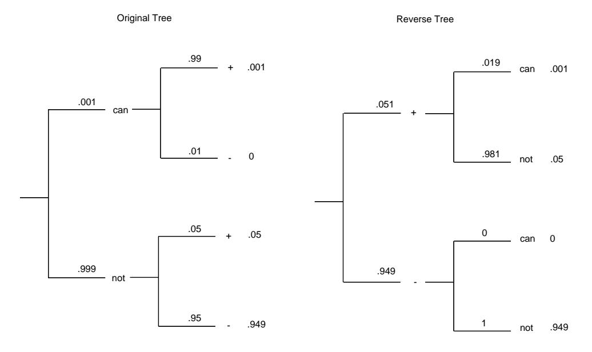

## 4.1. DISCRETE CONDITIONAL PROBABILITY

The sample space is  $R^3 = R \times R \times R$  with  $R = \{1, 2, 3, 4, 5, 6\}$ . If  $\omega = (1, 3, 6)$ , then  $X_1(\omega) = 1$ ,  $X_2(\omega) = 3$ , and  $X_3(\omega) = 6$  indicating that the first roll was a 1, the second was a 3, and the third was a 6. The probability assigned to any sample point is

$$
m(\omega) = \frac{1}{6} \cdot \frac{1}{6} \cdot \frac{1}{6} = \frac{1}{216} \ .
$$

**Example 4.15** Consider next a Bernoulli trials process with probability p for success on each experiment. Let  $X_j(\omega) = 1$  if the jth outcome is success and  $X_j(\omega) = 0$ if it is a failure. Then  $X_1, X_2, \ldots, X_n$  is an independent trials process. Each  $X_j$ has the same distribution function

$$
m_j = \begin{pmatrix} 0 & 1 \\ q & p \end{pmatrix},
$$

where  $q = 1 - p$ .

If  $S_n = X_1 + X_2 + \cdots + X_n$ , then

$$
P(S_n = j) = {n \choose j} p^j q^{n-j} ,
$$

and  $S_n$  has, as distribution, the binomial distribution  $b(n, p, j)$ .

 $\Box$ 

## Bayes' Formula

In our examples, we have considered conditional probabilities of the following form: Given the outcome of the second stage of a two-stage experiment, find the probability for an outcome at the first stage. We have remarked that these probabilities are called *Bayes probabilities*.

We return now to the calculation of more general Bayes probabilities. Suppose we have a set of events  $H_1, H_2, \ldots, H_m$  that are pairwise disjoint and such that the sample space  $\Omega$  satisfies the equation

$$
\Omega = H_1 \cup H_2 \cup \cdots \cup H_m
$$

We call these events *hypotheses*. We also have an event  $E$  that gives us some information about which hypothesis is correct. We call this event evidence.

Before we receive the evidence, then, we have a set of *prior probabilities*  $P(H_1)$ ,  $P(H_2), \ldots, P(H_m)$  for the hypotheses. If we know the correct hypothesis, we know the probability for the evidence. That is, we know  $P(E|H_i)$  for all i. We want to find the probabilities for the hypotheses given the evidence. That is, we want to find the conditional probabilities  $P(H_i|E)$ . These probabilities are called the *posterior*  $probabilities.$ 

To find these probabilities, we write them in the form

$$
P(H_i|E) = \frac{P(H_i \cap E)}{P(E)} \tag{4.1}
$$

|             | Number having | The results |      |      |         |
|-------------|---------------|-------------|------|------|---------|
| Disease     | this disease  |             |      |      |         |
| $a_1$       | 3215          | 2110        | 301  | 704  | $100\,$ |
| $d_2$       | 2125          | 396         | 132  | 1187 | 410     |
| $d_3$       | 4660          | 510         | 3568 | 73   | 509     |
| $\rm Total$ | 10000         |             |      |      |         |

Table 4.3: Diseases data.

We can calculate the numerator from our given information by

$$
P(H_i \cap E) = P(H_i)P(E|H_i) \tag{4.2}
$$

Since one and only one of the events  $H_1, H_2, \ldots, H_m$  can occur, we can write the probability of  $E$  as

$$
P(E) = P(H_1 \cap E) + P(H_2 \cap E) + \cdots + P(H_m \cap E).
$$

Using Equation 4.2, the above expression can be seen to equal

$$
P(H_1)P(E|H_1) + P(H_2)P(E|H_2) + \cdots + P(H_m)P(E|H_m) \tag{4.3}
$$

Using  $(4.1)$ ,  $(4.2)$ , and  $(4.3)$  yields *Bayes' formula*:

$$
P(H_i|E) = \frac{P(H_i)P(E|H_i)}{\sum_{k=1}^{m} P(H_k)P(E|H_k)}
$$

Although this is a very famous formula, we will rarely use it. If the number of hypotheses is small, a simple tree measure calculation is easily carried out, as we have done in our examples. If the number of hypotheses is large, then we should use a computer.

Bayes probabilities are particularly appropriate for medical diagnosis. A doctor is anxious to know which of several diseases a patient might have. She collects evidence in the form of the outcomes of certain tests. From statistical studies the doctor can find the prior probabilities of the various diseases before the tests, and the probabilities for specific test outcomes, given a particular disease. What the doctor wants to know is the posterior probability for the particular disease, given the outcomes of the tests.

**Example 4.16** A doctor is trying to decide if a patient has one of three diseases  $d_1, d_2,$  or  $d_3$ . Two tests are to be carried out, each of which results in a positive  $(+)$  or a negative  $(-)$  outcome. There are four possible test patterns  $++, +-,$  $-+$ , and  $-$ . National records have indicated that, for 10,000 people having one of these three diseases, the distribution of diseases and test results are as in Table 4.3.

From this data, we can estimate the prior probabilities for each of the diseases and, given a particular disease, the probability of a particular test outcome. For example, the prior probability of disease  $d_1$  may be estimated to be  $3215/10,000 =$ .3215. The probability of the test result  $+-$ , given disease  $d_1$ , may be estimated to be  $301/3215 = .094$ .

|                          |                          | $d_1$ | $d_2$ | $d_3$ |
|--------------------------|--------------------------|-------|-------|-------|
| $^{+}$                   | $^{+}$                   | .700  | .131  | .169  |
| $^{+}$                   |                          | .075  | .033  | .892  |
| $\overline{\phantom{0}}$ | $^{+}$                   | .358  | .604  | .038  |
| -                        | $\overline{\phantom{0}}$ | .098  | .403  | .499  |

Table 4.4: Posterior probabilities.

We can now use Bayes' formula to compute various posterior probabilities. The computer program **Bayes** computes these posterior probabilities. The results for this example are shown in Table 4.4.

We note from the outcomes that, when the test result is  $++$ , the disease  $d_1$  has a significantly higher probability than the other two. When the outcome is  $+-$ , this is true for disease  $d_3$ . When the outcome is  $-+$ , this is true for disease  $d_2$ . Note that these statements might have been guessed by looking at the data. If the outcome is  $--$ , the most probable cause is  $d_3$ , but the probability that a patient has  $d_2$  is only slightly smaller. If one looks at the data in this case, one can see that it might be hard to guess which of the two diseases  $d_2$  and  $d_3$  is more likely.  $\Box$ 

Our final example shows that one has to be careful when the prior probabilities are small.

**Example 4.17** A doctor gives a patient a test for a particular cancer. Before the results of the test, the only evidence the doctor has to go on is that 1 woman in 1000 has this cancer. Experience has shown that, in 99 percent of the cases in which cancer is present, the test is positive; and in 95 percent of the cases in which it is not present, it is negative. If the test turns out to be positive, what probability should the doctor assign to the event that cancer is present? An alternative form of this question is to ask for the relative frequencies of false positives and cancers.

We are given that prior(cancer) = .001 and prior(not cancer) = .999. We know also that  $P(+|cancer) = .99$ ,  $P(-|cancer) = .01$ ,  $P(+|not cancer) = .05$ , and  $P(-|$ not cancer) = .95. Using this data gives the result shown in Figure 4.5.

We see now that the probability of cancer given a positive test has only increased from .001 to .019. While this is nearly a twenty-fold increase, the probability that the patient has the cancer is still small. Stated in another way, among the positive results, 98.1 percent are false positives, and 1.9 percent are cancers. When a group of second-year medical students was asked this question, over half of the students incorrectly guessed the probability to be greater than .5.  $\Box$ 

## **Historical Remarks**

Conditional probability was used long before it was formally defined. Pascal and Fermat considered the *problem of points*: given that team A has won  $m$  games and team B has won n games, what is the probability that A will win the series? (See Exercises  $40-42$ .) This is clearly a conditional probability problem.

In his book, Huygens gave a number of problems, one of which was:

Figure 4.5: Forward and reverse tree diagrams.

Three gamblers, A, B and C, take 12 balls of which 4 are white and 8 black. They play with the rules that the drawer is blindfolded, A is to draw first, then B and then C, the winner to be the one who first draws a white ball. What is the ratio of their chances?2

From his answer it is clear that Huygens meant that each ball is replaced after drawing. However, John Hudde, the mayor of Amsterdam, assumed that he meant to sample without replacement and corresponded with Huygens about the difference in their answers. Hacking remarks that "Neither party can understand what the other is doing."3

By the time of de Moivre's book, The Doctrine of Chances, these distinctions were well understood. De Moivre defined independence and dependence as follows:

Two Events are independent, when they have no connexion one with the other, and that the happening of one neither forwards nor obstructs the happening of the other.

Two Events are dependent, when they are so connected together as that the Probability of either's happening is altered by the happening of the  $other.4$ 

De Moivre used sampling with and without replacement to illustrate that the probability that two independent events both happen is the product of their probabilities, and for dependent events that:

&lt;sup>2Quoted in F. N. David, *Games, Gods and Gambling* (London: Griffin, 1962), p. 119.

&lt;sup>3I. Hacking, *The Emergence of Probability* (Cambridge: Cambridge University Press, 1975), p. 99.

&lt;sup>4A. de Moivre, *The Doctrine of Chances*, 3rd ed. (New York: Chelsea, 1967), p. 6.