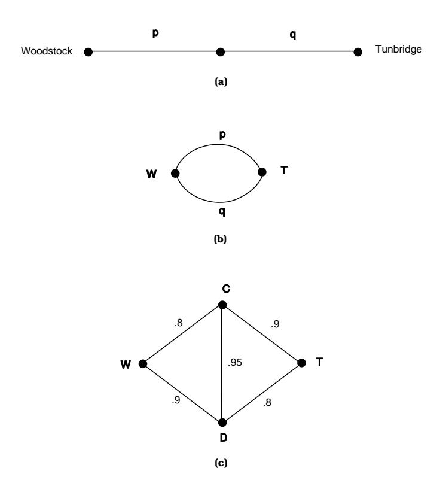

## 4.1. DISCRETE CONDITIONAL PROBABILITY

- 23 You are given two urns and fifty balls. Half of the balls are white and half are black. You are asked to distribute the balls in the urns with no restriction placed on the number of either type in an urn. How should you distribute the balls in the urns to maximize the probability of obtaining a white ball if an urn is chosen at random and a ball drawn out at random? Justify your answer.
- 24 A fair coin is thrown  $n$  times. Show that the conditional probability of a head on any specified trial, given a total of k heads over the n trials, is  $k/n$  ( $k > 0$ ).
- **25** (Johnsonbough8) A coin with probability p for heads is tossed n times. Let E be the event "a head is obtained on the first toss' and  $F_k$  the event 'exactly k heads are obtained." For which pairs  $(n, k)$  are E and  $F_k$  independent?
- **26** Suppose that A and B are events such that  $P(A|B) = P(B|A)$  and  $P(A \cup B) =$ 1 and  $P(A \cap B) > 0$ . Prove that  $P(A) > 1/2$ .
- $27$  (Chung9) In London, half of the days have some rain. The weather forecaster is correct  $2/3$  of the time, i.e., the probability that it rains, given that she has predicted rain, and the probability that it does not rain, given that she has predicted that it won't rain, are both equal to  $2/3$ . When rain is forecast, Mr. Pickwick takes his umbrella. When rain is not forecast, he takes it with probability  $1/3$ . Find
  - (a) the probability that Pickwick has no umbrella, given that it rains.
  - (b) the probability that he brings his umbrella, given that it doesn't rain.
- 28 Probability theory was used in a famous court case: People v. Collins.10 In this case a purse was snatched from an elderly person in a Los Angeles suburb. A couple seen running from the scene were described as a black man with a beard and a mustache and a blond girl with hair in a ponytail. Witnesses said they drove off in a partly yellow car. Malcolm and Janet Collins were arrested. He was black and though clean shaven when arrested had evidence of recently having had a beard and a mustache. She was blond and usually wore her hair in a ponytail. They drove a partly yellow Lincoln. The prosecution called a professor of mathematics as a witness who suggested that a conservative set of probabilities for the characteristics noted by the witnesses would be as shown in Table 4.5.

The prosecution then argued that the probability that all of these characteristics are met by a randomly chosen couple is the product of the probabilities or  $1/12,000,000$ , which is very small. He claimed this was proof beyond a reasonable doubt that the defendants were guilty. The jury agreed and handed down a verdict of guilty of second-degree robbery.

&lt;sup>8R. Johnsonbough, "Problem #103," Two Year College Math Journal, vol. 8 (1977), p. 292.

&lt;sup>9K. L. Chung, *Elementary Probability Theory With Stochastic Processes, 3rd ed.* (New York: Springer-Verlag, 1979), p. 152.

 $^{10}$ M. W. Gray, "Statistics and the Law," *Mathematics Magazine*, vol. 56 (1983), pp. 67-81.

| man with mustache           | 1/4    |
|-----------------------------|--------|
| girl with blond hair        | 1/3    |
| girl with ponytail          | 1/10   |
| black man with beard        | 1/10   |
| interracial couple in a car | 1/1000 |
| partly yellow car           | 1/10   |

Table 4.5: Collins case probabilities.

If you were the lawyer for the Collins couple how would you have countered the above argument? (The appeal of this case is discussed in Exercise 5.1.34.)

- 29 A student is applying to Harvard and Dartmouth. He estimates that he has a probability of .5 of being accepted at Dartmouth and .3 of being accepted at Harvard. He further estimates the probability that he will be accepted by both is .2. What is the probability that he is accepted by Dartmouth if he is accepted by Harvard? Is the event "accepted at Harvard" independent of the event "accepted at Dartmouth"?
- 30 Luxco, a wholesale lightbulb manufacturer, has two factories. Factory A sells bulbs in lots that consists of 1000 regular and 2000 *soft glow* bulbs each. Random sampling has shown that on the average there tend to be about 2 bad regular bulbs and 11 bad softglow bulbs per lot. At factory B the lot size is reversed—there are 2000 regular and 1000 softglow per lot—and there tend to be 5 bad regular and 6 bad softglow bulbs per lot.

The manager of factory A asserts, "We're obviously the better producer; our bad bulb rates are .2 percent and .55 percent compared to B's .25 percent and .6 percent. We're better at both regular and soft glow bulbs by half of a tenth of a percent each."

"Au contraire," counters the manager of B, "each of our 3000 bulb lots contains only 11 bad bulbs, while A's 3000 bulb lots contain 13. So our .37 percent bad bulb rate beats their .43 percent."

Who is right?

- 31 Using the Life Table for 1981 given in Appendix C, find the probability that a male of age 60 in 1981 lives to age 80. Find the same probability for a female.
- 32 (a) There has been a blizzard and Helen is trying to drive from Woodstock to Tunbridge, which are connected like the top graph in Figure 4.6. Here  $p$  and  $q$  are the probabilities that the two roads are passable. What is the probability that Helen can get from Woodstock to Tunbridge?
  - (b) Now suppose that Woodstock and Tunbridge are connected like the middle graph in Figure 4.6. What now is the probability that she can get from  $W$  to  $T$ ? Note that if we think of the roads as being components of a system, then in (a) and (b) we have computed the *reliability* of a system whose components are (a) in series and (b) in parallel.

Figure 4.6: From Woodstock to Tunbridge.

- (c) Now suppose  $W$  and  $T$  are connected like the bottom graph in Figure 4.6. Find the probability of Helen's getting from  $W$  to  $T$ . Hint: If the road from  $C$  to  $D$  is impassable, it might as well not be there at all; if it is passable, then figure out how to use part (b) twice.
- **33** Let  $A_1$ ,  $A_2$ , and  $A_3$  be events, and let  $B_i$  represent either  $A_i$  or its complement  $A_i$ . Then there are eight possible choices for the triple  $(B_1, B_2, B_3)$ . Prove that the events  $A_1$ ,  $A_2$ ,  $A_3$  are independent if and only if

$$
P(B_1 \cap B_2 \cap B_3) = P(B_1)P(B_2)P(B_3) ,
$$

for all eight of the possible choices for the triple  $(B_1, B_2, B_3)$ .

- **34** Four women, A, B, C, and D, check their hats, and the hats are returned in a random manner. Let  $\Omega$  be the set of all possible permutations of A, B, C, D. Let  $X_j = 1$  if the jth woman gets her own hat back and 0 otherwise. What is the distribution of  $X_j$ ? Are the  $X_i$ 's mutually independent?
- 35 A box has numbers from 1 to 10. A number is drawn at random. Let  $X_1$  be the number drawn. This number is replaced, and the ten numbers mixed. A second number  $X_2$  is drawn. Find the distributions of  $X_1$  and  $X_2$ . Are  $X_1$ and  $X_2$  independent? Answer the same questions if the first number is not replaced before the second is drawn.

|                | -1   | $\mathbf{\Omega}$ |      |                   |
|----------------|------|-------------------|------|-------------------|
|                |      | 1/36              | 1/6  | 1/12              |
| 0              | 1/18 | 0                 | 1/18 | $\mathbf{\Omega}$ |
|                |      | 1/36              | 1/6  | 1/12              |
| $\overline{2}$ | 1/12 | 0                 | 1/12 | 1/6               |

Table 4.6: Joint distribution.

- **36** A die is thrown twice. Let  $X_1$  and  $X_2$  denote the outcomes. Define  $X =$  $\min(X_1, X_2)$ . Find the distribution of X.
- **\*37** Given that  $P(X = a) = r$ ,  $P(\max(X, Y) = a) = s$ , and  $P(\min(X, Y) = a) =$ t, show that you can determine  $u = P(Y = a)$  in terms of r, s, and t.
- 38 A fair coin is tossed three times. Let X be the number of heads that turn up on the first two tosses and  $Y$  the number of heads that turn up on the third toss. Give the distribution of
  - (a) the random variables  $X$  and  $Y$ .
  - (b) the random variable  $Z = X + Y$ .
  - (c) the random variable  $W = X Y$ .
- **39** Assume that the random variables  $X$  and  $Y$  have the joint distribution given in Table 4.6.
  - (a) What is  $P(X \ge 1$  and  $Y \le 0$ ?
  - (b) What is the conditional probability that  $Y \leq 0$  given that  $X = 2$ ?
  - (c) Are  $X$  and Y independent?
  - (d) What is the distribution of  $Z = XY$ ?
- 40 In the *problem of points*, discussed in the historical remarks in Section 3.2, two players, A and B, play a series of points in a game with player A winning each point with probability  $p$  and player B winning each point with probability  $q = 1 - p$ . The first player to win N points wins the game. Assume that  $N=3$ . Let X be a random variable that has the value 1 if player A wins the series and  $0$  otherwise. Let  $Y$  be a random variable with value the number of points played in a game. Find the distribution of X and Y when  $p = 1/2$ . Are  $X$  and  $Y$  independent in this case? Answer the same questions for the case  $p = 2/3$ .
- 41 The letters between Pascal and Fermat, which are often credited with having started probability theory, dealt mostly with the *problem of points* described in Exercise 40. Pascal and Fermat considered the problem of finding a fair division of stakes if the game must be called off when the first player has won r games and the second player has won s games, with  $r < N$  and  $s < N$ . Let  $P(r, s)$  be the probability that player A wins the game if he has already won  $r$  points and player B has won  $s$  points. Then