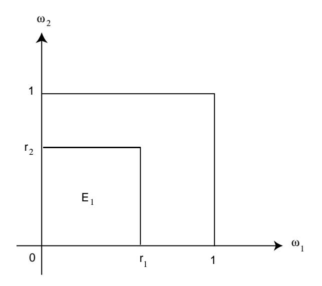
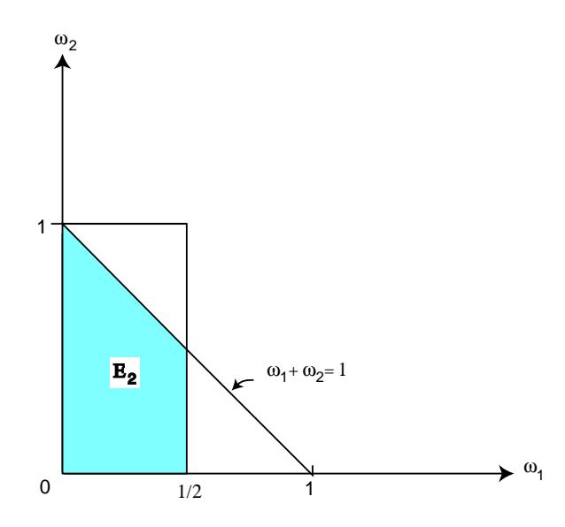
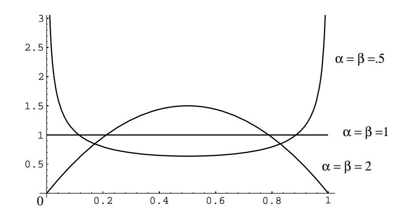

## Joint Density and Cumulative Distribution Functions

In a manner analogous with discrete random variables, we can define joint density functions and cumulative distribution functions for multi-dimensional continuous random variables.

**Definition 4.6** Let  $X_1, X_2, \ldots, X_n$  be continuous random variables associated with an experiment, and let  $\bar{X} = (X_1, X_2, \ldots, X_n)$ . Then the joint cumulative distribution function of  $\overline{X}$  is defined by

$$
F(x_1, x_2,..., x_n) = P(X_1 \le x_1, X_2 \le x_2,..., X_n \le x_n).
$$

The joint density function of  $\bar{X}$  satisfies the following equation:

$$
F(x_1, x_2,..., x_n) = \int_{-\infty}^{x_1} \int_{-\infty}^{x_2} \cdots \int_{-\infty}^{x_n} f(t_1, t_2,... t_n) dt_n dt_{n-1} ... dt_1.
$$

It is straightforward to show that, in the above notation,

$$
f(x_1, x_2, \dots, x_n) = \frac{\partial^n F(x_1, x_2, \dots, x_n)}{\partial x_1 \partial x_2 \cdots \partial x_n} \ . \tag{4.4}
$$

## **Independent Random Variables**

As with discrete random variables, we can define mutual independence of continuous random variables.

**Definition 4.7** Let  $X_1, X_2, ..., X_n$  be continuous random variables with cumulative distribution functions  $F_1(x)$ ,  $F_2(x)$ ,...,  $F_n(x)$ . Then these random variables are mutually independent if

$$
F(x_1, x_2, \ldots, x_n) = F_1(x_1) F_2(x_2) \cdots F_n(x_n)
$$

for any choice of  $x_1, x_2, \ldots, x_n$ . Thus, if  $X_1, X_2, \ldots, X_n$  are mutually independent, then the joint cumulative distribution function of the random variable  $\bar{X} = (X_1, X_2, \ldots, X_n)$  is just the product of the individual cumulative distribution functions. When two random variables are mutually independent, we shall say more briefly that they are *independent*.  $\Box$ 

Using Equation 4.4, the following theorem can easily be shown to hold for mutually independent continuous random variables.

**Theorem 4.2** Let  $X_1, X_2, \ldots, X_n$  be continuous random variables with density functions  $f_1(x)$ ,  $f_2(x)$ ,...,  $f_n(x)$ . Then these random variables are *mutually independent* if and only if

$$
f(x_1, x_2, \ldots, x_n) = f_1(x_1) f_2(x_2) \cdots f_n(x_n)
$$

for any choice of  $x_1, x_2, \ldots, x_n$ .

 $\Box$ 

Figure 4.7:  $X_1$  and  $X_2$  are independent.

Let's look at some examples.

**Example 4.22** In this example, we define three random variables,  $X_1$ ,  $X_2$ , and  $X_3$ . We will show that  $X_1$  and  $X_2$  are independent, and that  $X_1$  and  $X_3$  are not independent. Choose a point  $\omega = (\omega_1, \omega_2)$  at random from the unit square. Set  $X_1 = \omega_1^2$ ,  $X_2 = \omega_2^2$ , and  $X_3 = \omega_1 + \omega_2$ . Find the joint distributions  $F_{12}(r_1, r_2)$  and  $F_{23}(r_2, r_3).$ 

We have already seen (see Example 2.13) that

$$
F_1(r_1) = P(-\infty < X_1 \le r_1)
$$
  
=  $\sqrt{r_1}$ , if  $0 \le r_1 \le 1$ 

and similarly,

$$
F_2(r_2) = \sqrt{r_2}
$$

if  $0 \le r_2 \le 1$ . Now we have (see Figure 4.7)

$$
F_{12}(r_1, r_2) = P(X_1 \le r_1 \text{ and } X_2 \le r_2)
$$
  
=  $P(\omega_1 \le \sqrt{r_1} \text{ and } \omega_2 \le \sqrt{r_2})$   
= Area  $(E_1)$   
=  $\sqrt{r_1}\sqrt{r_2}$   
=  $F_1(r_1)F_2(r_2)$ .

In this case  $F_{12}(r_1, r_2) = F_1(r_1)F_2(r_2)$  so that  $X_1$  and  $X_2$  are independent. On the other hand, if  $r_1 = 1/4$  and  $r_3 = 1$ , then (see Figure 4.8)

$$
F_{13}(1/4,1) = P(X_1 \le 1/4, X_3 \le 1)
$$

Figure 4.8:  $X_1$  and  $X_3$  are not independent.

= 
$$
P(\omega_1 \le 1/2, \ \omega_1 + \omega_2 \le 1)
$$
  
\n= Area  $(E_2)$   
\n=  $\frac{1}{2} - \frac{1}{8} = \frac{3}{8}$ .

Now recalling that

$$
F_3(r_3) = \begin{cases} 0, & \text{if } r_3 < 0, \\ (1/2)r_3^2, & \text{if } 0 \le r_3 \le 1, \\ 1 - (1/2)(2 - r_3)^2, & \text{if } 1 \le r_3 \le 2, \\ 1, & \text{if } 2 < r_3, \end{cases}
$$

(see Example 2.14), we have  $F_1(1/4)F_3(1) = (1/2)(1/2) = 1/4$ . Hence,  $X_1$  and  $X_3$ are not independent random variables. A similar calculation shows that  $X_2$  and  $X_3$ are not independent either.  $\Box$ 

Although we shall not prove it here, the following theorem is a useful one. The statement also holds for mutually independent discrete random variables. A proof may be found in Rényi.17

**Theorem 4.3** Let  $X_1, X_2, \ldots, X_n$  be mutually independent continuous random variables and let  $\phi_1(x), \phi_2(x), \ldots, \phi_n(x)$  be continuous functions. Then  $\phi_1(X_1)$ ,  $\phi_2(X_2), \ldots, \phi_n(X_n)$  are mutually independent.  $\Box$ 

## **Independent Trials**

Using the notion of independence, we can now formulate for continuous sample spaces the notion of independent trials (see Definition 4.5).

&lt;sup>17A. Rényi, Probability Theory (Budapest: Akadémiai Kiadó, 1970), p. 183.

Figure 4.9: Beta density for  $\alpha = \beta = .5, 1, 2$ .

**Definition 4.8** A sequence  $X_1, X_2, \ldots, X_n$  of random variables  $X_i$  that are mutually independent and have the same density is called an *independent trials* process.  $\Box$ 

As in the case of discrete random variables, these independent trials processes arise naturally in situations where an experiment described by a single random variable is repeated  $n$  times.

## **Beta Density**

We consider next an example which involves a sample space with both discrete and continuous coordinates. For this example we shall need a new density function called the *beta density*. This density has two parameters  $\alpha$ ,  $\beta$  and is defined by

$$
B(\alpha, \beta, x) = \begin{cases} (1/B(\alpha, \beta))x^{\alpha-1}(1-x)^{\beta-1}, & \text{if } 0 \le x \le 1, \\ 0, & \text{otherwise.} \end{cases}
$$

Here  $\alpha$  and  $\beta$  are any positive numbers, and the beta function  $B(\alpha, \beta)$  is given by the area under the graph of  $x^{\alpha-1}(1-x)^{\beta-1}$  between 0 and 1:

$$
B(\alpha, \beta) = \int_0^1 x^{\alpha - 1} (1 - x)^{\beta - 1} dx
$$

Note that when  $\alpha = \beta = 1$  the beta density if the uniform density. When  $\alpha$  and  $\beta$  are greater than 1 the density is bell-shaped, but when they are less than 1 it is U-shaped as suggested by the examples in Figure 4.9.

We shall need the values of the beta function only for integer values of  $\alpha$  and  $\beta$ , and in this case

$$
B(\alpha, \beta) = \frac{(\alpha - 1)! (\beta - 1)!}{(\alpha + \beta - 1)!}.
$$

**Example 4.23** In medical problems it is often assumed that a drug is effective with a probability  $x$  each time it is used and the various trials are independent, so that