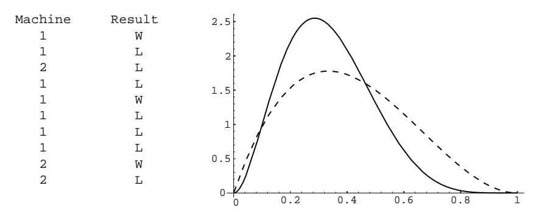
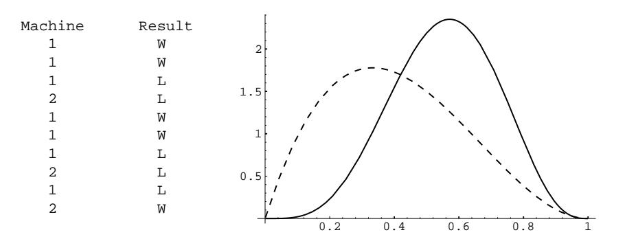

one is, in effect, tossing a biased coin with probability  $x$  for heads. Before further experimentation, you do not know the value  $x$  but past experience might give some information about its possible values. It is natural to represent this information by sketching a density function to determine a distribution for  $x$ . Thus, we are considering  $x$  to be a continuous random variable, which takes on values between 0 and 1. If you have no knowledge at all, you would sketch the uniform density. If past experience suggests that x is very likely to be near  $2/3$  you would sketch a density with maximum at  $2/3$  and a spread reflecting your uncertainly in the estimate of  $2/3$ . You would then want to find a density function that reasonably fits your sketch. The beta densities provide a class of densities that can be fit to most sketches you might make. For example, for  $\alpha > 1$  and  $\beta > 1$  it is bell-shaped with the parameters  $\alpha$  and  $\beta$  determining its peak and its spread.

Assume that the experimenter has chosen a beta density to describe the state of his knowledge about  $x$  before the experiment. Then he gives the drug to  $n$  subjects and records the number  $i$  of successes. The number  $i$  is a discrete random variable, so we may conveniently describe the set of possible outcomes of this experiment by referring to the ordered pair  $(x, i)$ .

We let  $m(i|x)$  denote the probability that we observe i successes given the value of x. By our assumptions,  $m(i|x)$  is the binomial distribution with probability x for success:

$$
m(i|x) = b(n, x, i) = {n \choose i} x^{i} (1-x)^{j}
$$
,

where  $i = n - i$ .

If x is chosen at random from [0,1] with a beta density  $B(\alpha, \beta, x)$ , then the density function for the outcome of the pair  $(x, i)$  is

$$
f(x,i) = m(i|x)B(\alpha, \beta, x)
$$
  
= 
$$
{n \choose i} x^{i} (1-x)^{j} \frac{1}{B(\alpha, \beta)} x^{\alpha-1} (1-x)^{\beta-1}
$$
  
= 
$$
{n \choose i} \frac{1}{B(\alpha, \beta)} x^{\alpha+i-1} (1-x)^{\beta+j-1}.
$$

Now let  $m(i)$  be the probability that we observe i successes not knowing the value of  $x$ . Then

$$
m(i) = \int_0^1 m(i|x)B(\alpha, \beta, x) dx
$$
  
= 
$$
{\binom{n}{i}} \frac{1}{B(\alpha, \beta)} \int_0^1 x^{\alpha + i - 1} (1 - x)^{\beta + j - 1} dx
$$
  
= 
$$
{\binom{n}{i}} \frac{B(\alpha + i, \beta + j)}{B(\alpha, \beta)}.
$$

Hence, the probability density  $f(x|i)$  for x, given that i successes were observed, is

$$
f(x|i) = \frac{f(x,i)}{m(i)}
$$

## CHAPTER 4. CONDITIONAL PROBABILITY

$$
= \frac{x^{\alpha+i-1}(1-x)^{\beta+j-1}}{B(\alpha+i,\beta+j)} , \qquad (4.5)
$$

that is,  $f(x|i)$  is another beta density. This says that if we observe i successes and j failures in n subjects, then the new density for the probability that the drug is effective is again a beta density but with parameters  $\alpha + i$ ,  $\beta + j$ .

Now we assume that before the experiment we choose a beta density with parameters  $\alpha$  and  $\beta$ , and that in the experiment we obtain i successes in n trials. We have just seen that in this case, the new density for  $x$  is a beta density with parameters  $\alpha + i$  and  $\beta + j$ .

Now we wish to calculate the probability that the drug is effective on the next subject. For any particular real number  $t$  between 0 and 1, the probability that  $x$ has the value  $t$  is given by the expression in Equation 4.5. Given that  $x$  has the value  $t$ , the probability that the drug is effective on the next subject is just  $t$ . Thus, to obtain the probability that the drug is effective on the next subject, we integrate the product of the expression in Equation 4.5 and t over all possible values of t. We obtain:

$$
\frac{1}{B(\alpha+i,\beta+j)} \int_0^1 t \cdot t^{\alpha+i-1} (1-t)^{\beta+j-1} dt
$$
  
\n
$$
= \frac{B(\alpha+i+1,\beta+j)}{B(\alpha+i,\beta+j)}
$$
  
\n
$$
= \frac{(\alpha+i)!(\beta+j-1)!}{(\alpha+\beta+i+j)!} \cdot \frac{(\alpha+\beta+i+j-1)!}{(\alpha+i-1)!(\beta+j-1)!}
$$
  
\n
$$
= \frac{\alpha+i}{\alpha+\beta+n}.
$$

If  $n$  is large, then our estimate for the probability of success after the experiment is approximately the proportion of successes observed in the experiment, which is certainly a reasonable conclusion.  $\Box$ 

The next example is another in which the true probabilities are unknown and must be estimated based upon experimental data.

**Example 4.24** (Two-armed bandit problem) You are in a casino and confronted by two slot machines. Each machine pays off either 1 dollar or nothing. The probability that the first machine pays off a dollar is  $x$  and that the second machine pays off a dollar is  $y$ . We assume that  $x$  and  $y$  are random numbers chosen independently from the interval  $[0,1]$  and unknown to you. You are permitted to make a series of ten plays, each time choosing one machine or the other. How should you choose to maximize the number of times that you win?

One strategy that sounds reasonable is to calculate, at every stage, the probability that each machine will pay off and choose the machine with the higher probability. Let  $\text{win}(i)$ , for  $i = 1$  or 2, be the number of times that you have won on the *i*th machine. Similarly, let  $\log(i)$  be the number of times you have lost on the *i*th machine. Then, from Example 4.23, the probability  $p(i)$  that you win if you

Figure 4.10: Play the best machine.

choose the *i*th machine is

$$
p(i) = \frac{\text{win}(i) + 1}{\text{win}(i) + \text{lose}(i) + 2}
$$

Thus, if  $p(1) > p(2)$  you would play machine 1 and otherwise you would play machine 2. We have written a program **TwoArm** to simulate this experiment. In the program, the user specifies the initial values for x and y (but these are unknown to the experimenter). The program calculates at each stage the two conditional densities for  $x$  and  $y$ , given the outcomes of the previous trials, and then computes  $p(i)$ , for  $i = 1, 2$ . It then chooses the machine with the highest value for the probability of winning for the next play. The program prints the machine chosen on each play and the outcome of this play. It also plots the new densities for  $x$ (solid line) and  $y$  (dotted line), showing only the current densities. We have run the program for ten plays for the case  $x = .6$  and  $y = .7$ . The result is shown in Figure 4.10.

The run of the program shows the weakness of this strategy. Our initial probability for winning on the better of the two machines is .7. We start with the poorer machine and our outcomes are such that we always have a probability greater than .6 of winning and so we just keep playing this machine even though the other machine is better. If we had lost on the first play we would have switched machines. Our final density for  $y$  is the same as our initial density, namely, the uniform density. Our final density for  $x$  is different and reflects a much more accurate knowledge about  $x$ . The computer did pretty well with this strategy, winning seven out of the ten trials, but ten trials are not enough to judge whether this is a good strategy in the long run.

Another popular strategy is the *play-the-winner strategy*. As the name suggests, for this strategy we choose the same machine when we win and switch machines when we lose. The program **TwoArm** will simulate this strategy as well. In Figure 4.11, we show the results of running this program with the play-the-winner strategy and the same true probabilities of 0.6 and 0.7 for the two machines. After ten plays our densities for the unknown probabilities of winning suggest to us that the second machine is indeed the better of the two. We again won seven out of the ten trials.

Figure 4.11: Play the winner.

Neither of the strategies that we simulated is the best one in terms of maximizing our average winnings. This best strategy is very complicated but is reasonably approximated by the play-the-winner strategy. Variations on this example have played an important role in the problem of clinical tests of drugs where experimenters face a similar situation.  $\Box$ 

## **Exercises**

- 1 Pick a point x at random (with uniform density) in the interval  $[0,1]$ . Find the probability that  $x > 1/2$ , given that
  - (a)  $x > 1/4$ .
  - (b)  $x < 3/4$ .
  - (c)  $|x-1/2| < 1/4$ .
  - (d)  $x^2 x + 2/9 < 0$ .
- 2 A radioactive material emits  $\alpha$ -particles at a rate described by the density function

$$
f(t) = .1e^{-.1t}
$$
.

Find the probability that a particle is emitted in the first 10 seconds, given that

- (a) no particle is emitted in the first second.
- (b) no particle is emitted in the first 5 seconds.
- (c) a particle is emitted in the first 3 seconds.
- $(d)$  a particle is emitted in the first 20 seconds.
- 3 The Acme Super light bulb is known to have a useful life described by the density function

$$
f(t) = .01e^{-.01t}
$$
,

where time  $t$  is measured in hours.