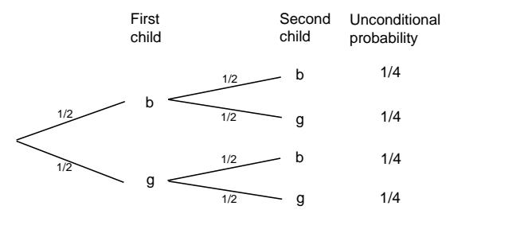

- (a) Find the *failure rate* of this bulb (see Exercise  $2.2.6$ ).
- (b) Find the *reliability* of this bulb after 20 hours.
- (c) Given that it lasts 20 hours, find the probability that the bulb lasts another 20 hours.
- (d) Find the probability that the bulb burns out in the forty-first hour, given that it lasts 40 hours.
- 4 Suppose you toss a dart at a circular target of radius 10 inches. Given that the dart lands in the upper half of the target, find the probability that
  - (a) it lands in the right half of the target.
  - (b) its distance from the center is less than 5 inches.
  - (c) its distance from the center is greater than 5 inches.
  - (d) it lands within 5 inches of the point  $(0,5)$ .
- **5** Suppose you choose two numbers  $x$  and  $y$ , independently at random from the interval  $[0,1]$ . Given that their sum lies in the interval  $[0,1]$ , find the probability that
  - (a)  $|x-y| < 1$ .
  - (b)  $xy < 1/2$ .
  - (c)  $\max\{x, y\} < 1/2$ .
  - (d)  $x^2 + y^2 < 1/4$ .
  - (e)  $x > y$ .
- 6 Find the conditional density functions for the following experiments.
  - (a) A number x is chosen at random in the interval [0, 1], given that  $x > 1/4$ .
  - (b) A number t is chosen at random in the interval  $[0, \infty)$  with exponential density  $e^{-t}$ , given that  $1 < t < 10$ .
  - (c) A dart is thrown at a circular target of radius 10 inches, given that it falls in the upper half of the target.
  - (d) Two numbers  $x$  and  $y$  are chosen at random in the interval [0, 1], given that  $x > y$ .
- 7 Let x and y be chosen at random from the interval [0, 1]. Show that the events  $x > 1/3$  and  $y > 2/3$  are independent events.
- 8 Let x and y be chosen at random from the interval  $[0,1]$ . Which pairs of the following events are independent?
  - (a)  $x > 1/3$ .
  - (b)  $y > 2/3$ .
  - (c)  $x > y$ .

(d)  $x + y < 1$ .

**9** Suppose that  $X$  and  $Y$  are continuous random variables with density functions  $f_X(x)$  and  $f_Y(y)$ , respectively. Let  $f(x, y)$  denote the joint density function of  $(X, Y)$ . Show that

$$
\int_{-\infty}^{\infty} f(x, y) dy = f_X(x)
$$

and

$$
\int_{-\infty}^{\infty} f(x, y) dx = f_Y(y) .
$$

- \*10 In Exercise 2.2.12 you proved the following: If you take a stick of unit length and break it into three pieces, choosing the breaks at random (i.e., choosing two real numbers independently and uniformly from  $[0, 1]$ , then the probability that the three pieces form a triangle is  $1/4$ . Consider now a similar experiment: First break the stick at random, then break the longer piece at random. Show that the two experiments are actually quite different, as follows:
  - (a) Write a program which simulates both cases for a run of 1000 trials, prints out the proportion of successes for each run, and repeats this process ten times. (Call a trial a success if the three pieces do form a triangle.) Have your program pick  $(x, y)$  at random in the unit square, and in each case use  $x$  and  $y$  to find the two breaks. For each experiment, have it plot  $(x, y)$  if  $(x, y)$  gives a success.
  - (b) Show that in the second experiment the theoretical probability of success is actually  $2 \log 2 - 1$ .
- 11 A coin has an unknown bias  $p$  that is assumed to be uniformly distributed between 0 and 1. The coin is tossed  $n$  times and heads turns up  $j$  times and tails turns up  $k$  times. We have seen that the probability that heads turns up next time is

$$
\frac{j+1}{n+2} .
$$

Show that this is the same as the probability that the next ball is black for the Polya urn model of Exercise 4.1.20. Use this result to explain why, in the Polya urn model, the proportion of black balls does not tend to 0 or 1 as one might expect but rather to a uniform distribution on the interval  $[0, 1]$ .

12 Previous experience with a drug suggests that the probability  $p$  that the drug is effective is a random quantity having a beta density with parameters  $\alpha = 2$ and  $\beta = 3$ . The drug is used on ten subjects and found to be successful in four out of the ten patients. What density should we now assign to the probability  $p$ ? What is the probability that the drug will be successful the next time it is used?

174

## 4.3. PARADOXES

- 13 Write a program to allow you to compare the strategies play-the-winner and play-the-best-machine for the two-armed bandit problem of Example 4.24. Have your program determine the initial payoff probabilities for each machine by choosing a pair of random numbers between 0 and 1. Have your program carry out 20 plays and keep track of the number of wins for each of the two strategies. Finally, have your program make 1000 repetitions of the 20 plays and compute the average winning per 20 plays. Which strategy seems to be the best? Repeat these simulations with 20 replaced by 100. Does your answer to the above question change?
- 14 Consider the two-armed bandit problem of Example 4.24. Bruce Barnes proposed the following strategy, which is a variation on the play-the-best-machine strategy. The machine with the greatest probability of winning is played unless the following two conditions hold: (a) the difference in the probabilities for winning is less than 0.08, and (b) the ratio of the number of times played on the more often played machine to the number of times played on the less often played machine is greater than 1.4. If the above two conditions hold, then the machine with the smaller probability of winning is played. Write a program to simulate this strategy. Have your program choose the initial payoff probabilities at random from the unit interval  $[0, 1]$ , make 20 plays, and keep track of the number of wins. Repeat this experiment 1000 times and obtain the average number of wins per 20 plays. Implement a second strategy—for example, play-the-best-machine or one of your own choice, and see how this second strategy compares with Bruce's on average wins.

## 4.3 Paradoxes

Much of this section is based on an article by Snell and Vanderbei.18

One must be very careful in dealing with problems involving conditional probability. The reader will recall that in the Monty Hall problem (Example 4.6), if the contestant chooses the door with the car behind it, then Monty has a choice of doors to open. We made an assumption that in this case, he will choose each door with probability  $1/2$ . We then noted that if this assumption is changed, the answer to the original question changes. In this section, we will study other examples of the same phenomenon.

**Example 4.25** Consider a family with two children. Given that one of the children is a boy, what is the probability that both children are boys?

One way to approach this problem is to say that the other child is equally likely to be a boy or a girl, so the probability that both children are boys is  $1/2$ . The "textbook" solution would be to draw the tree diagram and then form the conditional tree by deleting paths to leave only those paths that are consistent with the given

&lt;sup>18J. L. Snell and R. Vanderbei, "Three Bewitching Paradoxes," in Topics in Contemporary Probability and Its Applications, CRC Press, Boca Raton, 1995.

|     | First child |     | Second child | Unconditional probability | Conditional probability |
|-----|----------------|-----|-----------------|------------------------------|----------------------------|
|     |                | 1/2 | b               | 1/4                          | 1/3                        |
| 1/2 | b              | 1/2 | g               | 1/4                          | 1/3                        |
| 1/2 | g              | 1/2 | - b             | 1/4                          | 1/3                        |

Figure 4.12: Tree for Example 4.25.

information. The result is shown in Figure 4.12. We see that the probability of two boys given a boy in the family is not  $1/2$  but rather  $1/3$ .  $\Box$ 

This problem and others like it are discussed in Bar-Hillel and Falk.19 These authors stress that the answer to conditional probabilities of this kind can change depending upon how the information given was actually obtained. For example, they show that  $1/2$  is the correct answer for the following scenario.

**Example 4.26** Mr. Smith is the father of two. We meet him walking along the street with a young boy whom he proudly introduces as his son. What is the probability that Mr. Smith's other child is also a boy?

As usual we have to make some additional assumptions. For example, we will assume that if Mr. Smith has a boy and a girl, he is equally likely to choose either one to accompany him on his walk. In Figure 4.13 we show the tree analysis of this problem and we see that  $1/2$  is, indeed, the correct answer.  $\Box$ 

**Example 4.27** It is not so easy to think of reasonable scenarios that would lead to the classical  $1/3$  answer. An attempt was made by Stephen Geller in proposing this problem to Marilyn vos Savant.20 Geller's problem is as follows: A shopkeeper says she has two new baby beagles to show you, but she doesn't know whether they're both male, both female, or one of each sex. You tell her that you want only a male, and she telephones the fellow who's giving them a bath. "Is at least one a male?"

 $19M$ . Bar-Hillel and R. Falk, "Some teasers concerning conditional probabilities," Cognition, vol. 11 (1982), pgs. 109-122.

&lt;sup>20M. vos Savant, "Ask Marilyn," Parade Magazine, 9 September; 2 December; 17 February 1990, reprinted in Marilyn vos Savant, Ask Marilyn, St. Martins, New York, 1992.