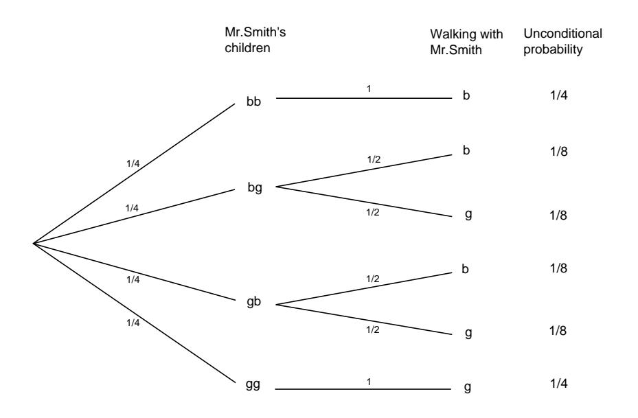
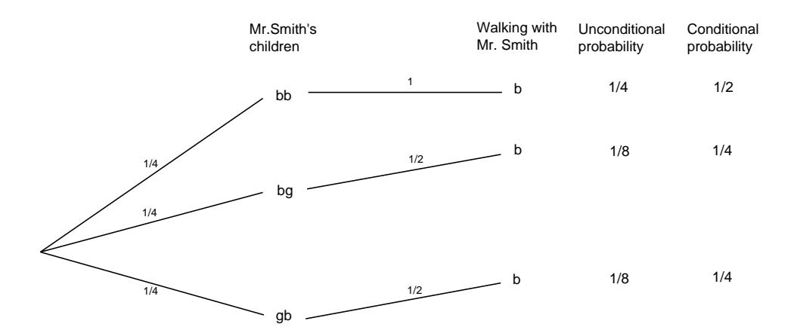
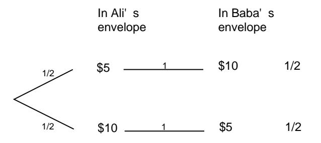

Figure 4.13: Tree for Example 4.26.

she asks. "Yes," she informs you with a smile. What is the probability that the *other* one is male?

The reader is asked to decide whether the model which gives an answer of  $1/3$ is a reasonable one to use in this case.  $\Box$ 

In the preceding examples, the apparent paradoxes could easily be resolved by clearly stating the model that is being used and the assumptions that are being made. We now turn to some examples in which the paradoxes are not so easily resolved.

**Example 4.28** Two envelopes each contain a certain amount of money. One envelope is given to Ali and the other to Baba and they are told that one envelope contains twice as much money as the other. However, neither knows who has the larger prize. Before anyone has opened their envelope, Ali is asked if she would like to trade her envelope with Baba. She reasons as follows: Assume that the amount in my envelope is x. If I switch, I will end up with  $x/2$  with probability  $1/2$ , and  $2x$  with probability  $1/2$ . If I were given the opportunity to play this game many times, and if I were to switch each time, I would, on average, get

$$
\frac{1}{2}\frac{x}{2} + \frac{1}{2}2x = \frac{5}{4}x
$$

This is greater than my average winnings if I didn't switch.

Of course, Baba is presented with the same opportunity and reasons in the same way to conclude that he too would like to switch. So they switch and each thinks that his/her net worth just went up by  $25\%$ .

Since neither has yet opened any envelope, this process can be repeated and so again they switch. Now they are back with their original envelopes and yet they think that their fortune has increased  $25\%$  twice. By this reasoning, they could convince themselves that by repeatedly switching the envelopes, they could become arbitrarily wealthy. Clearly, something is wrong with the above reasoning, but where is the mistake?

One of the tricks of making paradoxes is to make them slightly more difficult than is necessary to further befuddle us. As John Finn has suggested, in this paradox we could just have well started with a simpler problem. Suppose Ali and Baba know that I am going to give then either an envelope with \$5 or one with \$10 and I am going to toss a coin to decide which to give to Ali, and then give the other to Baba. Then Ali can argue that Baba has  $2x$  with probability  $1/2$  and  $x/2$  with probability  $1/2$ . This leads Ali to the same conclusion as before. But now it is clear that this is nonsense, since if Ali has the envelope containing \$5, Baba cannot possibly have half of this, namely \$2.50, since that was not even one of the choices. Similarly, if Ali has \$10, Baba cannot have twice as much, namely \$20. In fact, in this simpler problem the possibly outcomes are given by the tree diagram in Figure 4.14. From the diagram, it is clear that neither is made better off by switching.  $\Box$ 

In the above example, Ali's reasoning is incorrect because he infers that if the amount in his envelope is  $x$ , then the probability that his envelope contains the

Figure 4.14: John Finn's version of Example 4.28.

smaller amount is  $1/2$ , and the probability that her envelope contains the larger amount is also  $1/2$ . In fact, these conditional probabilities depend upon the distribution of the amounts that are placed in the envelopes.

For definiteness, let  $X$  denote the positive integer-valued random variable which represents the smaller of the two amounts in the envelopes. Suppose, in addition, that we are given the distribution of  $X$ , i.e., for each positive integer  $x$ , we are given the value of

$$
p_x = P(X = x) .
$$

(In Finn's example,  $p_5 = 1$ , and  $p_n = 0$  for all other values of n.) Then it is easy to calculate the conditional probability that an envelope contains the smaller amount, given that it contains x dollars. The two possible sample points are  $(x, x/2)$  and  $(x, 2x)$ . If x is odd, then the first sample point has probability 0, since  $x/2$  is not an integer, so the desired conditional probability is  $1$  that  $x$  is the smaller amount. If x is even, then the two sample points have probabilities  $p_{x/2}$  and  $p_x$ , respectively, so the conditional probability that  $x$  is the smaller amount is

$$
\frac{p_x}{p_{x/2} + p_x}
$$

which is not necessarily equal to  $1/2$ .

Steven Brams and D. Marc Kilgour21 study the problem, for different distributions, of whether or not one should switch envelopes, if one's objective is to maximize the long-term average winnings. Let  $x$  be the amount in your envelope. They show that for any distribution of  $X$ , there is at least one value of  $x$  such that you should switch. They give an example of a distribution for which there is exactly one value of  $x$  such that you should switch (see Exercise 5). Perhaps the most interesting case is a distribution in which you should always switch. We now give this example.

**Example 4.29** Suppose that we have two envelopes in front of us, and that one envelope contains twice the amount of money as the other (both amounts are positive integers). We are given one of the envelopes, and asked if we would like to switch.

&lt;sup>21S. J. Brams and D. M. Kilgour, "The Box Problem: To Switch or Not to Switch," Mathematics *Magazine*, vol. 68, no. 1 (1995), p. 29.

As above, we let  $X$  denote the smaller of the two amounts in the envelopes, and let

$$
p_x = P(X = x) .
$$

We are now in a position where we can calculate the long-term average winnings, if we switch. (This long-term average is an example of a probabilistic concept known as expectation, and will be discussed in Chapter 6.) Given that one of the two sample points has occurred, the probability that it is the point  $(x, x/2)$  is

$$
\frac{p_{x/2}}{p_{x/2}+p_x}
$$

and the probability that it is the point  $(x, 2x)$  is

$$
\frac{p_x}{p_{x/2} + p_x}
$$

Thus, if we switch, our long-term average winnings are

$$
\frac{p_{x/2}}{p_{x/2} + p_x} \frac{x}{2} + \frac{p_x}{p_{x/2} + p_x} 2x
$$

If this is greater than  $x$ , then it pays in the long run for us to switch. Some routine algebra shows that the above expression is greater than  $x$  if and only if

$$
\frac{p_{x/2}}{p_{x/2} + p_x} < \frac{2}{3} \tag{4.6}
$$

It is interesting to consider whether there is a distribution on the positive integers such that the inequality 4.6 is true for all even values of x. Brams and Kilgour22 give the following example.

We define  $p_x$  as follows:

$$
p_x = \begin{cases} \frac{1}{3} \left(\frac{2}{3}\right)^{k-1}, & \text{if } x = 2^k, \\ 0, & \text{otherwise.} \end{cases}
$$

It is easy to calculate (see Exercise 4) that for all relevant values of  $x$ , we have

$$
\frac{p_{x/2}}{p_{x/2} + p_x} = \frac{3}{5}
$$

which means that the inequality 4.6 is always true.

So far, we have been able to resolve paradoxes by clearly stating the assumptions being made and by precisely stating the models being used. We end this section by describing a paradox which we cannot resolve.

**Example 4.30** Suppose that we have two envelopes in front of us, and we are told that the envelopes contain  $X$  and  $Y$  dollars, respectively, where  $X$  and  $Y$  are different positive integers. We randomly choose one of the envelopes, and we open

180

 $22$ ibid.