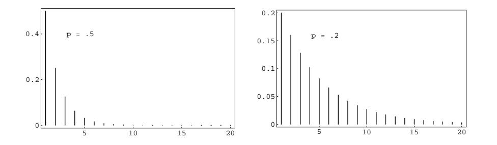
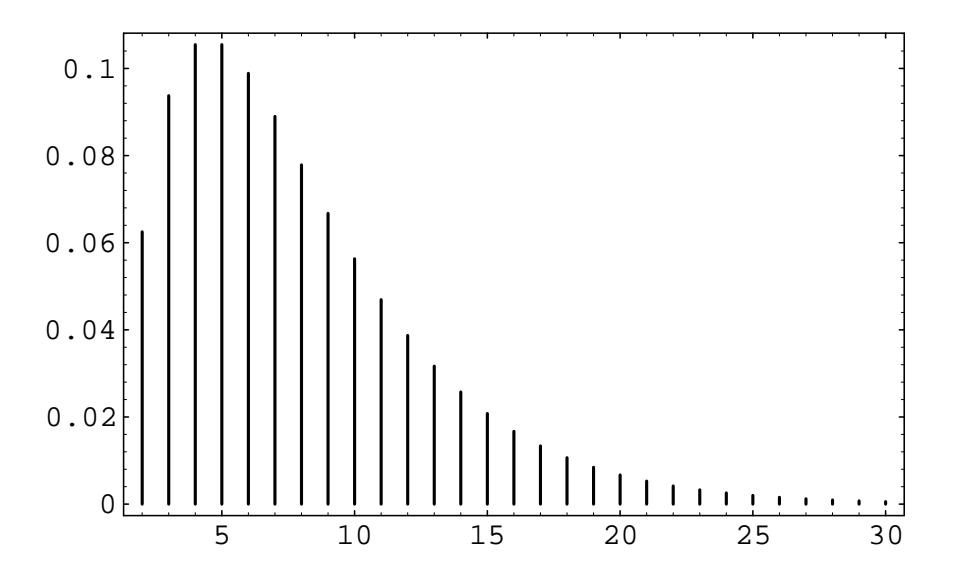

Figure 5.1: Geometric distributions.

The left-hand expression is just a geometric series with first term  $p$  and common ratio  $q$ , so its sum is

$$
\frac{p}{1-q}
$$

which equals 1.

In Figure 5.1 we have plotted this distribution using the program Geometric-**Plot** for the cases  $p = 0.5$  and  $p = 0.2$ . We see that as p decreases we are more likely to get large values for  $T$ , as would be expected. In both cases, the most probable value for  $T$  is 1. This will always be true since

$$
\frac{P(T = j + 1)}{P(T = j)} = q < 1.
$$

In general, if  $0 < p < 1$ , and  $q = 1 - p$ , then we say that the random variable T has a *geometric distribution* if

$$
P(T = j) = q^{j-1}p,
$$

for  $j = 1, 2, 3, \ldots$ .

To simulate the geometric distribution with parameter  $p$ , we can simply compute a sequence of random numbers in  $[0, 1)$ , stopping when an entry does not exceed p. However, for small values of p, this is time-consuming (taking, on the average,  $1/p$ steps). We now describe a method whose running time does not depend upon the size of  $p$ . Define  $Y$  to be the smallest integer satisfying the inequality

$$
1 - q^Y \geq rnd \tag{5.1}
$$

Then we have

$$
P(Y = j) = P\left(1 - q^{j} \geq rnd > 1 - q^{j-1}\right)
$$
  
=  $q^{j-1} - q^{j}$   
=  $q^{j-1}(1 - q)$   
=  $q^{j-1}p$ .

Thus, Y is geometrically distributed with parameter  $p$ . To generate Y, all we have to do is solve Equation 5.1 for  $Y$ . We obtain

$$
Y = \left\lceil \frac{\log(1 - rnd)}{\log q} \right\rceil,
$$

where the notation  $[x]$  means the least integer which is greater than or equal to x. Since  $log(1-rnd)$  and  $log(rnd)$  are identically distributed, Y can also be generated using the equation

$$
Y = \left| \frac{\log\,rnd}{\log\, q} \right| \, .
$$

**Example 5.1** The geometric distribution plays an important role in the theory of queues, or waiting lines. For example, suppose a line of customers waits for service at a counter. It is often assumed that, in each small time unit, either 0 or 1 new customers arrive at the counter. The probability that a customer arrives is  $p$  and that no customer arrives is  $q = 1 - p$ . Then the time T until the next arrival has a geometric distribution. It is natural to ask for the probability that no customer arrives in the next k time units, that is, for  $P(T > k)$ . This is given by

$$
P(T > k) = \sum_{j=k+1}^{\infty} q^{j-1}p = q^{k}(p + qp + q^{2}p + \cdots)
$$
  
=  $q^{k}$ .

This probability can also be found by noting that we are asking for no successes (i.e., arrivals) in a sequence of  $k$  consecutive time units, where the probability of a success in any one time unit is p. Thus, the probability is just  $q^k$ , since arrivals in any two time units are independent events.

It is often assumed that the length of time required to service a customer also has a geometric distribution but with a different value for  $p$ . This implies a rather special property of the service time. To see this, let us compute the conditional probability

$$
P(T > r + s | T > r) = \frac{P(T > r + s)}{P(T > r)} = \frac{q^{r+s}}{q^r} = q^s
$$

Thus, the probability that the customer's service takes  $s$  more time units is independent of the length of time  $r$  that the customer has already been served. Because of this interpretation, this property is called the "memoryless" property, and is also obeyed by the exponential distribution. (Fortunately, not too many service stations have this property.)  $\Box$ 

## **Negative Binomial Distribution**

Suppose we are given a coin which has probability  $p$  of coming up heads when it is tossed. We fix a positive integer  $k$ , and toss the coin until the  $k$ th head appears. We

## 5.1. IMPORTANT DISTRIBUTIONS

let X represent the number of tosses. When  $k = 1$ , X is geometrically distributed. For a general  $k$ , we say that X has a negative binomial distribution. We now calculate the probability distribution of X. If  $X = x$ , then it must be true that there were exactly  $k-1$  heads thrown in the first  $x-1$  tosses, and a head must have been thrown on the xth toss. There are

$$
\binom{x-1}{k-1}
$$

sequences of length  $x$  with these properties, and each of them is assigned the same probability, namely

$$
p^{k-1}q^{x-k} .
$$

Therefore, if we define

$$
u(x,k,p) = P(X = x)
$$

then

$$
u(x,k,p) = \binom{x-1}{k-1} p^k q^{x-k}
$$

One can simulate this on a computer by simulating the tossing of a coin. The following algorithm is, in general, much faster. We note that  $X$  can be understood as the sum of  $k$  outcomes of a geometrically distributed experiment with parameter p. Thus, we can use the following sum as a means of generating  $X$ :

$$
\sum_{j=1}^k \left\lceil \frac{\log\,rnd_j}{\log\, q} \right\rceil.
$$

**Example 5.2** A fair coin is tossed until the second time a head turns up. The distribution for the number of tosses is  $u(x, 2, p)$ . Thus the probability that x tosses are needed to obtain two heads is found by letting  $k = 2$  in the above formula. We obtain

$$
u(x, 2, 1/2) = {x - 1 \choose 1} \frac{1}{2^x} ,
$$

for  $x = 2, 3, ...$ 

In Figure 5.2 we give a graph of the distribution for  $k = 2$  and  $p = .25$ . Note that the distribution is quite asymmetric, with a long tail reflecting the fact that large values of  $x$  are possible.  $\Box$ 

## **Poisson Distribution**

The Poisson distribution arises in many situations. It is safe to say that it is one of the three most important discrete probability distributions (the other two being the uniform and the binomial distributions). The Poisson distribution can be viewed as arising from the binomial distribution or from the exponential density. We shall now explain its connection with the former; its connection with the latter will be explained in the next section.

Figure 5.2: Negative binomial distribution with  $k = 2$  and  $p = .25$ .

Suppose that we have a situation in which a certain kind of occurrence happens at random over a period of time. For example, the occurrences that we are interested in might be incoming telephone calls to a police station in a large city. We want to model this situation so that we can consider the probabilities of events such as more than 10 phone calls occurring in a 5-minute time interval. Presumably, in our example, there would be more incoming calls between 6:00 and 7:00 P.M. than between 4:00 and 5:00 A.M., and this fact would certainly affect the above probability. Thus, to have a hope of computing such probabilities, we must assume that the average rate, i.e., the average number of occurrences per minute, is a constant. This rate we will denote by  $\lambda$ . (Thus, in a given 5-minute time interval, we would expect about  $5\lambda$  occurrences.) This means that if we were to apply our model to the two time periods given above, we would simply use different rates for the two time periods, thereby obtaining two different probabilities for the given event.

Our next assumption is that the number of occurrences in two non-overlapping time intervals are independent. In our example, this means that the events that there are j calls between 5:00 and 5:15 P.M. and k calls between 6:00 and 6:15 P.M. on the same day are independent.

We can use the binomial distribution to model this situation. We imagine that a given time interval is broken up into  $n$  subintervals of equal length. If the subintervals are sufficiently short, we can assume that two or more occurrences happen in one subinterval with a probability which is negligible in comparison with the probability of at most one occurrence. Thus, in each subinterval, we are assuming that there is either 0 or 1 occurrence. This means that the sequence of subintervals can be thought of as a sequence of Bernoulli trials, with a success corresponding to an occurrence in the subinterval.