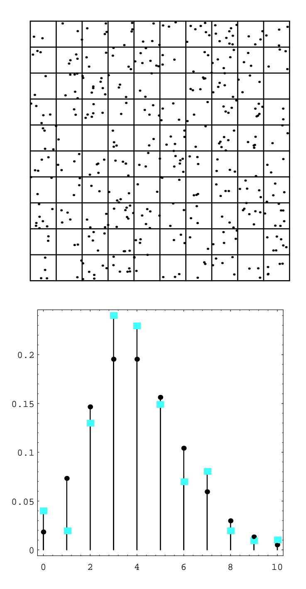

## 5.1. IMPORTANT DISTRIBUTIONS

To decide upon the proper value of  $p$ , the probability of an occurrence in a given subinterval, we reason as follows. On the average, there are  $\lambda t$  occurrences in a time interval of length  $t$ . If this time interval is divided into  $n$  subintervals, then we would expect, using the Bernoulli trials interpretation, that there should be  $np$ occurrences. Thus, we want

$$
\lambda t = np
$$

SO

$$
p = \frac{\lambda t}{n} \; .
$$

We now wish to consider the random variable  $X$ , which counts the number of occurrences in a given time interval. We want to calculate the distribution of  $X$ . For ease of calculation, we will assume that the time interval is of length 1; for time intervals of arbitrary length  $t$ , see Exercise 11. We know that

$$
P(X = 0) = b(n, p, 0) = (1 - p)^{n} = \left(1 - \frac{\lambda}{n}\right)^{n}.
$$

For large n, this is approximately  $e^{-\lambda}$ . It is easy to calculate that for any fixed k, we have  $\frac{1}{2}$ 

$$
\frac{b(n,p,k)}{b(n,p,k-1)} = \frac{\lambda - (k-1)p}{kq}
$$

which, for large n (and therefore small p) is approximately  $\lambda/k$ . Thus, we have

$$
P(X=1) \approx \lambda e^{-\lambda} ,
$$

and in general,

$$
P(X = k) \approx \frac{\lambda^k}{k!} e^{-\lambda} . \tag{5.2}
$$

The above distribution is the Poisson distribution. We note that it must be checked that the distribution given in Equation 5.2 really is a distribution, i.e., that its values are non-negative and sum to 1. (See Exercise 12.)

The Poisson distribution is used as an approximation to the binomial distribution when the parameters n and p are large and small, respectively (see Examples  $5.3$ ) and 5.4). However, the Poisson distribution also arises in situations where it may not be easy to interpret or measure the parameters n and  $p$  (see Example 5.5).

**Example 5.3** A typesetter makes, on the average, one mistake per 1000 words. Assume that he is setting a book with 100 words to a page. Let  $S_{100}$  be the number of mistakes that he makes on a single page. Then the exact probability distribution for  $S_{100}$  would be obtained by considering  $S_{100}$  as a result of 100 Bernoulli trials with  $p = 1/1000$ . The expected value of  $S_{100}$  is  $\lambda = 100(1/1000) = .1$ . The exact probability that  $S_{100} = j$  is  $b(100, 1/1000, j)$ , and the Poisson approximation is

$$
\frac{e^{-.1}(.1)^j}{j!}.
$$

In Table 5.1 we give, for various values of  $n$  and  $p$ , the exact values computed by the binomial distribution and the Poisson approximation.  $\Box$ 

|                  | Poisson      | Binomial | Poisson       | Binomial  | Poisson        | Binomial   |
|------------------|--------------|----------|---------------|-----------|----------------|------------|
|                  |              | $n=100$  |               | $n = 100$ |                | $n = 1000$ |
| $\boldsymbol{j}$ | $\lambda=.1$ | $p=.001$ | $\lambda = 1$ | $p=.01$   | $\lambda = 10$ | $p=.01$    |
| $\overline{0}$   | .9048        | .9048    | .3679         | .3660     | .0000          | .0000      |
| $\mathbf{1}$     | .0905        | .0905    | .3679         | .3697     | .0005          | .0004      |
| $\overline{2}$   | .0045        | .0045    | .1839         | .1849     | .0023          | .0022      |
| 3                | .0002        | $.0002$  | .0613         | .0610     | .0076          | .0074      |
| $\overline{4}$   | .0000        | .0000    | .0153         | .0149     | .0189          | .0186      |
| $\overline{5}$   |              |          | .0031         | .0029     | .0378          | .0374      |
| 6                |              |          | .0005         | .0005     | .0631          | .0627      |
| $\overline{7}$   |              |          | .0001         | .0001     | .0901          | .0900      |
| 8                |              |          | .0000         | .0000     | .1126          | .1128      |
| 9                |              |          |               |           | .1251          | .1256      |
| 10               |              |          |               |           | .1251          | .1257      |
| 11               |              |          |               |           | .1137          | .1143      |
| 12               |              |          |               |           | .0948          | .0952      |
| 13               |              |          |               |           | .0729          | .0731      |
| 14               |              |          |               |           | .0521          | .0520      |
| 15               |              |          |               |           | .0347          | .0345      |
| 16               |              |          |               |           | .0217          | .0215      |
| 17               |              |          |               |           | .0128          | .0126      |
| 18               |              |          |               |           | .0071          | .0069      |
| 19               |              |          |               |           | .0037          | .0036      |
| 20               |              |          |               |           | .0019          | .0018      |
| 21               |              |          |               |           | .0009          | .0009      |
| 22               |              |          |               |           | .0004          | .0004      |
| $23\,$           |              |          |               |           | .0002          | .0002      |
| 24               |              |          |               |           | .0001          | .0001      |
| 25               |              |          |               |           | .0000          | .0000      |

Table 5.1: Poisson approximation to the binomial distribution.

## 5.1. IMPORTANT DISTRIBUTIONS

**Example 5.4** In his book,1 Feller discusses the statistics of flying bomb hits in the south of London during the Second World War.

Assume that you live in a district of size 10 blocks by 10 blocks so that the total district is divided into 100 small squares. How likely is it that the square in which you live will receive no hits if the total area is hit by 400 bombs?

We assume that a particular bomb will hit your square with probability  $1/100$ . Since there are 400 bombs, we can regard the number of hits that your square receives as the number of *successes* in a Bernoulli trials process with  $n = 400$  and  $p = 1/100$ . Thus we can use the Poisson distribution with  $\lambda = 400 \cdot 1/100 = 4$  to approximate the probability that your square will receive  $j$  hits. This probability is  $p(j) = e^{-4}4^{j}/j!$ . The expected number of squares that receive exactly j hits is then  $100 \cdot p(j)$ . It is easy to write a program **LondonBombs** to simulate this situation and compare the expected number of squares with  $j$  hits with the observed number. In Exercise 26 you are asked to compare the actual observed data with that predicted by the Poisson distribution.

In Figure 5.3, we have shown the simulated hits, together with a spike graph showing both the observed and predicted frequencies. The observed frequencies are shown as squares, and the predicted frequencies are shown as dots.  $\Box$ 

If the reader would rather not consider flying bombs, he is invited to instead consider an analogous situation involving cookies and raisins. We assume that we have made enough cookie dough for 500 cookies. We put 600 raisins in the dough, and mix it thoroughly. One way to look at this situation is that we have 500 cookies, and after placing the cookies in a grid on the table, we throw 600 raisins at the cookies. (See Exercise 22.)

**Example 5.5** Suppose that in a certain fixed amount A of blood, the average human has 40 white blood cells. Let  $X$  be the random variable which gives the number of white blood cells in a random sample of size  $A$  from a random individual. We can think of  $X$  as binomially distributed with each white blood cell in the body representing a trial. If a given white blood cell turns up in the sample, then the trial corresponding to that blood cell was a success. Then  $p$  should be taken as the ratio of A to the total amount of blood in the individual, and  $n$  will be the number of white blood cells in the individual. Of course, in practice, neither of these parameters is very easy to measure accurately, but presumably the number 40 is easy to measure. But for the average human, we then have  $40 = np$ , so we can think of X as being Poisson distributed, with parameter  $\lambda = 40$ . In this case, it is easier to model the situation using the Poisson distribution than the binomial distribution.  $\Box$ 

To simulate a Poisson random variable on a computer, a good way is to take advantage of the relationship between the Poisson distribution and the exponential density. This relationship and the resulting simulation algorithm will be described in the next section.

&lt;sup>1ibid., p. 161.

Figure 5.3: Flying bomb hits.  $\,$