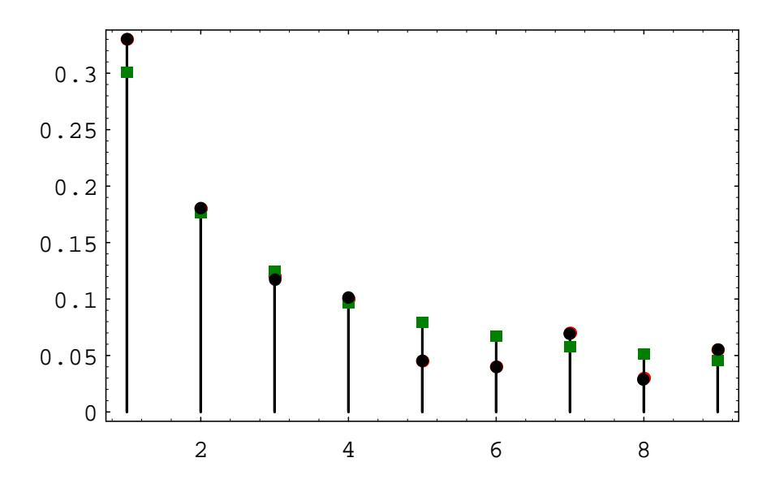

## 5.1. IMPORTANT DISTRIBUTIONS

## **Hypergeometric Distribution**

Suppose that we have a set of N balls, of which k are red and  $N-k$  are blue. We choose  $n$  of these balls, without replacement, and define  $X$  to be the number of red balls in our sample. The distribution of  $X$  is called the hypergeometric distribution. We note that this distribution depends upon three parameters, namely  $N, k$ , and n. There does not seem to be a standard notation for this distribution; we will use the notation  $h(N, k, n, x)$  to denote  $P(X = x)$ . This probability can be found by noting that there are

$$
\binom{N}{n}
$$

different samples of size  $n$ , and the number of such samples with exactly x red balls is obtained by multiplying the number of ways of choosing  $x$  red balls from the set of k red balls and the number of ways of choosing  $n - x$  blue balls from the set of  $N - k$  blue balls. Hence, we have

$$
h(N, k, n, x) = \frac{{k \choose x} {N-k \choose n-x}}{{N \choose n}}.
$$

This distribution can be generalized to the case where there are more than two types of objects. (See Exercise 40.)

If we let N and k tend to  $\infty$ , in such a way that the ratio  $k/N$  remains fixed, then the hypergeometric distribution tends to the binomial distribution with parameters n and  $p = k/N$ . This is reasonable because if N and k are much larger than n, then whether we choose our sample with or without replacement should not affect the probabilities very much, and the experiment consisting of choosing with replacement yields a binomially distributed random variable (see Exercise 44).

An example of how this distribution might be used is given in Exercises 36 and 37. We now give another example involving the hypergeometric distribution. It illustrates a statistical test called Fisher's Exact Test.

**Example 5.6** It is often of interest to consider two traits, such as eye color and hair color, and to ask whether there is an association between the two traits. Two traits are associated if knowing the value of one of the traits for a given person allows us to predict the value of the other trait for that person. The stronger the association, the more accurate the predictions become. If there is no association between the traits, then we say that the traits are independent. In this example, we will use the traits of gender and political party, and we will assume that there are only two possible genders, female and male, and only two possible political parties, Democratic and Republican.

Suppose that we have collected data concerning these traits. To test whether there is an association between the traits, we first assume that there is no association between the two traits. This gives rise to an "expected" data set, in which knowledge of the value of one trait is of no help in predicting the value of the other trait. Our collected data set usually differs from this expected data set. If it differs by quite a bit, then we would tend to reject the assumption of independence of the traits. To

|        | Democrat | Republican |  |
|--------|----------|------------|--|
| Female |          |            |  |
| Male   |          |            |  |
|        |          |            |  |

|        | Democrat                    | Republican |       |
|--------|-----------------------------|------------|-------|
| Female | $_{\scriptscriptstyle S11}$ | $S_1$      |       |
| Male   | 821                         | 822        | م 1.1 |
|        | ۰, ۲                        | もつつ        |       |

Table 5.2: Observed data.

Table 5.3: General data table.

nail down what is meant by "quite a bit," we decide which possible data sets differ from the expected data set by at least as much as ours does, and then we compute the probability that any of these data sets would occur under the assumption of independence of traits. If this probability is small, then it is unlikely that the difference between our collected data set and the expected data set is due entirely to chance.

Suppose that we have collected the data shown in Table 5.2. The row and column sums are called marginal totals, or marginals. In what follows, we will denote the row sums by  $t_{11}$  and  $t_{12}$ , and the column sums by  $t_{21}$  and  $t_{22}$ . The *ij*th entry in the table will be denoted by  $s_{ij}$ . Finally, the size of the data set will be denoted by  $n$ . Thus, a general data table will look as shown in Table 5.3. We now explain the model which will be used to construct the "expected" data set. In the model, we assume that the two traits are independent. We then put  $t_{21}$  yellow balls and  $t_{22}$  green balls, corresponding to the Democratic and Republican marginals, into an urn. We draw  $t_{11}$  balls, without replacement, from the urn, and call these balls females. The  $t_{12}$  balls remaining in the urn are called males. In the specific case under consideration, the probability of getting the actual data under this model is given by the expression

$$
\frac{\binom{32}{24}\binom{18}{4}}{\binom{50}{28}}
$$

i.e., a value of the hypergeometric distribution.

We are now ready to construct the expected data set. If we choose 28 balls out of 50, we should expect to see, on the average, the same percentage of yellow balls in our sample as in the urn. Thus, we should expect to see, on the average,  $28(32/50) = 17.92 \approx 18$  yellow balls in our sample. (See Exercise 36.) The other expected values are computed in exactly the same way. Thus, the expected data set is shown in Table 5.4. We note that the value of  $s_{11}$  determines the other three values in the table, since the marginals are all fixed. Thus, in considering the possible data sets that could appear in this model, it is enough to consider the various possible values of  $s_{11}$ . In the specific case at hand, what is the probability

|        | Democrat | Republican |  |
|--------|----------|------------|--|
| Female |          |            |  |
| Male   |          |            |  |
|        |          |            |  |

Table 5.4: Expected data.

of drawing exactly a yellow balls, i.e., what is the probability that  $s_{11} = a$ ? It is

$$
\frac{\binom{32}{a}\binom{18}{28-a}}{\binom{50}{28}}\tag{5.3}
$$

We are now ready to decide whether our actual data differs from the expected data set by an amount which is greater than could be reasonably attributed to chance alone. We note that the expected number of female Democrats is 18, but the actual number in our data is 24. The other data sets which differ from the expected data set by more than ours correspond to those where the number of female Democrats equals 25, 26, 27, or 28. Thus, to obtain the required probability, we sum the expression in (5.3) from  $a = 24$  to  $a = 28$ . We obtain a value of 0.00395. Thus, we should reject the hypothesis that the two traits are independent.  $\Box$ 

Finally, we turn to the question of how to simulate a hypergeometric random variable X. Let us assume that the parameters for X are  $N$ , k, and n. We imagine that we have a set of N balls, labelled from 1 to N. We decree that the first k of these balls are red, and the rest are blue. Suppose that we have chosen  $m$  balls, and that j of them are red. Then there are  $k - j$  red balls left, and  $N - m$  balls left. Thus, our next choice will be red with probability

$$
\frac{k-j}{N-m} \; .
$$

So at this stage, we choose a random number in  $[0, 1]$ , and report that a red ball has been chosen if and only if the random number does not exceed the above expression. Then we update the values of  $m$  and  $j$ , and continue until  $n$  balls have been chosen.

## **Benford Distribution**

Our next example of a distribution comes from the study of leading digits in data sets. It turns out that many data sets that occur "in real life" have the property that the first digits of the data are not uniformly distributed over the set  $\{1, 2, \ldots, 9\}$ . Rather, it appears that the digit 1 is most likely to occur, and that the distribution is monotonically decreasing on the set of possible digits. The Benford distribution appears, in many cases, to fit such data. Many explanations have been given for the occurrence of this distribution. Possibly the most convincing explanation is that this distribution is the only one that is invariant under a change of scale. If one thinks of certain data sets as somehow "naturally occurring," then the distribution should be unaffected by which units are chosen in which to represent the data, i.e., the distribution should be invariant under change of scale.

Figure 5.4: Leading digits in President Clinton's tax returns.

Theodore Hill2 gives a general description of the Benford distribution, when one considers the first d digits of integers in a data set. We will restrict our attention to the first digit. In this case, the Benford distribution has distribution function

$$
f(k) = \log_{10}(k+1) - \log_{10}(k) ,
$$

for  $1 \leq k \leq 9$ .

Mark Nigrini3 has advocated the use of the Benford distribution as a means of testing suspicious financial records such as bookkeeping entries, checks, and tax returns. His idea is that if someone were to "make up" numbers in these cases, the person would probably produce numbers that are fairly uniformly distributed, while if one were to use the actual numbers, the leading digits would roughly follow the Benford distribution. As an example, Nigrini analyzed President Clinton's tax returns for a 13-year period. In Figure 5.4, the Benford distribution values are shown as squares, and the President's tax return data are shown as circles. One sees that in this example, the Benford distribution fits the data very well.

This distribution was discovered by the astronomer Simon Newcomb who stated the following in his paper on the subject: "That the ten digits do not occur with equal frequency must be evident to anyone making use of logarithm tables, and noticing how much faster the first pages wear out than the last ones. The first significant figure is oftener 1 than any other digit, and the frequency diminishes up to  $9.^{9.1}$ 

&lt;sup>2T. P. Hill, "The Significant Digit Phenomenon," American Mathematical Monthly, vol. 102, no. 4 (April 1995), pgs. 322-327.

 ${}^{3}$ M. Nigrini, "Detecting Biases and Irregularities in Tabulated Data," working paper

&lt;sup>4S. Newcomb, "Note on the frequency of use of the different digits in natural numbers," American Journal of Mathematics, vol. 4 (1881), pgs. 39-40.