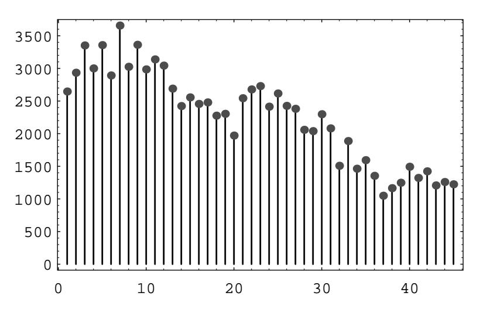

## 5.1. IMPORTANT DISTRIBUTIONS

| Number of deaths   Number of corps with $x$ deaths in a given year |
|--------------------------------------------------------------------|
| 144                                                                |
|                                                                    |
| 32                                                                 |
|                                                                    |
|                                                                    |

|  | Table 5.5: Mule kicks. |  |  |  |
|--|------------------------|--|--|--|
|--|------------------------|--|--|--|

- 26 Feller5 discusses the statistics of flying bomb hits in an area in the south of London during the Second World War. The area in question was divided into  $24 \times 24 = 576$  small areas. The total number of hits was 537. There were 229 squares with 0 hits, 211 with 1 hit, 93 with 2 hits, 35 with 3 hits, 7 with 4 hits, and 1 with 5 or more. Assuming the hits were purely random, use the Poisson approximation to find the probability that a particular square would have exactly  $k$  hits. Compute the expected number of squares that would have  $0, 1, 2, 3, 4,$  and  $5$  or more hits and compare this with the observed results.
- 27 Assume that the probability that there is a significant accident in a nuclear power plant during one year's time is .001. If a country has 100 nuclear plants, estimate the probability that there is at least one such accident during a given year.
- 28 An airline finds that 4 percent of the passengers that make reservations on a particular flight will not show up. Consequently, their policy is to sell 100 reserved seats on a plane that has only 98 seats. Find the probability that every person who shows up for the flight will find a seat available.
- 29 The king's coinmaster boxes his coins 500 to a box and puts 1 counterfeit coin in each box. The king is suspicious, but, instead of testing all the coins in 1 box, he tests 1 coin chosen at random out of each of 500 boxes. What is the probability that he finds at least one fake? What is it if the king tests 2 coins from each of 250 boxes?
- **30** (From Kemeny6) Show that, if you make 100 bets on the number 17 at roulette at Monte Carlo (see Example 6.13), you will have a probability greater than  $1/2$  of coming out ahead. What is your expected winning?
- **31** In one of the first studies of the Poisson distribution, von Bortkiewicz7 considered the frequency of deaths from kicks in the Prussian army corps. From the study of 14 corps over a 20-year period, he obtained the data shown in Table 5.5. Fit a Poisson distribution to this data and see if you think that the Poisson distribution is appropriate.

 $5$ ibid., p. 161.

 $^6\mathrm{Private}$  communication.

&lt;sup>7L. von Bortkiewicz, Das Gesetz der Kleinen Zahlen (Leipzig: Teubner, 1898), p. 24.

- 32 It is often assumed that the auto traffic that arrives at the intersection during a unit time period has a Poisson distribution with expected value  $m$ . Assume that the number of cars  $X$  that arrive at an intersection from the north in unit time has a Poisson distribution with parameter  $\lambda = m$  and the number Y that arrive from the west in unit time has a Poisson distribution with parameter  $\lambda = \overline{m}$ . If X and Y are independent, show that the total number  $X + Y$ that arrive at the intersection in unit time has a Poisson distribution with parameter  $\lambda = m + \overline{m}$ .
- 33 Cars coming along Magnolia Street come to a fork in the road and have to choose either Willow Street or Main Street to continue. Assume that the number of cars that arrive at the fork in unit time has a Poisson distribution with parameter  $\lambda = 4$ . A car arriving at the fork chooses Main Street with probability  $3/4$  and Willow Street with probability  $1/4$ . Let X be the random variable which counts the number of cars that, in a given unit of time, pass by Joe's Barber Shop on Main Street. What is the distribution of  $X$ ?
- **34** In the appeal of the *People v. Collins* case (see Exercise 4.1.28), the counsel for the defense argued as follows: Suppose, for example, there are 5,000,000 couples in the Los Angeles area and the probability that a randomly chosen couple fits the witnesses' description is  $1/12,000,000$ . Then the probability that there are two such couples given that there is at least one is not at all small. Find this probability. (The California Supreme Court overturned the initial guilty verdict.)
- 35 A manufactured lot of brass turnbuckles has S items of which D are defective. A sample of s items is drawn without replacement. Let X be a random variable that gives the number of defective items in the sample. Let  $p(d) = P(X = d)$ .
  - (a) Show that

$$
p(d) = \frac{\binom{D}{d}\binom{S-D}{s-d}}{\binom{S}{s}}
$$

Thus, X is hypergeometric.

(b) Prove the following identity, known as *Euler's formula*:

$$
\sum_{d=0}^{\min(D,s)} \binom{D}{d} \binom{S-D}{s-d} = \binom{S}{s}.
$$

- **36** A bin of 1000 turnbuckles has an unknown number D of defectives. A sample of 100 turnbuckles has 2 defectives. The maximum likelihood estimate for  $D$ is the number of defectives which gives the highest probability for obtaining the number of defectives observed in the sample. Guess this number  $D$  and then write a computer program to verify your guess.
- 37 There are an unknown number of moose on Isle Royale (a National Park in Lake Superior). To estimate the number of moose, 50 moose are captured and

## 5.1. IMPORTANT DISTRIBUTIONS

tagged. Six months later 200 moose are captured and it is found that 8 of these were tagged. Estimate the number of moose on Isle Royale from these data, and then verify your guess by computer program (see Exercise 36).

- **38** A manufactured lot of buggy whips has 20 items, of which 5 are defective. A random sample of 5 items is chosen to be inspected. Find the probability that the sample contains exactly one defective item
  - (a) if the sampling is done with replacement.
  - (b) if the sampling is done without replacement.
- **39** Suppose that N and k tend to  $\infty$  in such a way that  $k/N$  remains fixed. Show that

$$
h(N, k, n, x) \to b(n, k/N, x) .
$$

- 40 A bridge deck has 52 cards with 13 cards in each of four suits: spades, hearts, diamonds, and clubs. A hand of 13 cards is dealt from a shuffled deck. Find the probability that the hand has
  - (a) a distribution of suits  $4, 4, 3, 2$  (for example, four spades, four hearts, three diamonds, two clubs).
  - (b) a distribution of suits  $5, 3, 3, 2$ .
- 41 Write a computer algorithm that simulates a hypergeometric random variable with parameters  $N, k$ , and n.
- 42 You are presented with four different dice. The first one has two sides marked 0 and four sides marked 4. The second one has a 3 on every side. The third one has a 2 on four sides and a 6 on two sides, and the fourth one has a 1 on three sides and a 5 on three sides. You allow your friend to pick any of the four dice he wishes. Then you pick one of the remaining three and you each roll your die. The person with the largest number showing wins a dollar. Show that you can choose your die so that you have probability  $2/3$  of winning no matter which die your friend picks. (See Tenney and Foster.8)
- 43 The students in a certain class were classified by hair color and eye color. The conventions used were: Brown and black hair were considered dark, and red and blonde hair were considered light; black and brown eyes were considered dark, and blue and green eyes were considered light. They collected the data shown in Table 5.6. Are these traits independent? (See Example 5.6.)
- 44 Suppose that in the hypergeometric distribution, we let N and k tend to  $\infty$  in such a way that the ratio  $k/N$  approaches a real number p between 0 and 1. Show that the hypergeometric distribution tends to the binomial distribution with parameters  $n$  and  $p$ .

&lt;sup>8R. L. Tenney and C. C. Foster, Non-transitive Dominance, Math. Mag. 49 (1976) no. 3, pgs. 115-120.

|            | Dark Eyes | Light Eyes |  |
|------------|-----------|------------|--|
| Dark Hair  |           |            |  |
| Light Hair |           |            |  |
|            |           |            |  |

Table 5.6: Observed data.

Figure 5.5: Distribution of choices in the Powerball lottery.

- (a) Compute the leading digits of the first 100 powers of 2, and see how well 45 these data fit the Benford distribution.
  - (b) Multiply each number in the data set of part (a) by 3, and compare the distribution of the leading digits with the Benford distribution.
- 46 In the Powerball lottery, contestants pick 5 different integers between 1 and 45, and in addition, pick a bonus integer from the same range (the bonus integer can equal one of the first five integers chosen). Some contestants choose the numbers themselves, and others let the computer choose the numbers. The data shown in Table 5.7 are the contestant-chosen numbers in a certain state on May 3, 1996. A spike graph of the data is shown in Figure 5.5.

The goal of this problem is to check the hypothesis that the chosen numbers are uniformly distributed. To do this, compute the value  $v$  of the random variable  $\chi^2$  given in Example 5.6. In the present case, this random variable has 44 degrees of freedom. One can find, in a  $\chi^2$  table, the value  $v_0 = 59.43$ , which represents a number with the property that a  $\chi^2$ -distributed random variable takes on values that exceed  $v_0$  only 5% of the time. Does your computed value of v exceed  $v_0$ ? If so, you should reject the hypothesis that the contestants' choices are uniformly distributed.