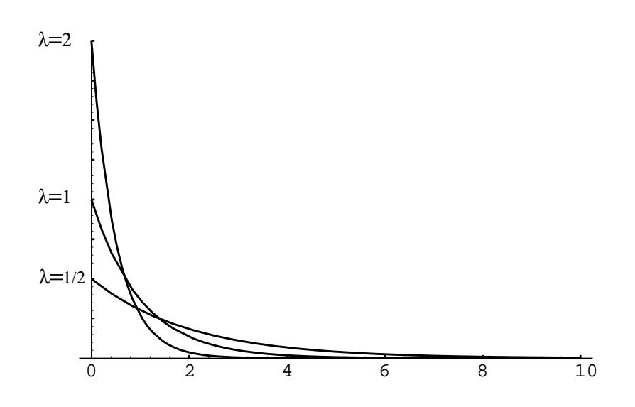

| Integer | Times  | Integer        | Times  | Integer | Times  |
|---------|--------|----------------|--------|---------|--------|
|         | Chosen |                | Chosen |         | Chosen |
| 1       | 2646   | $\overline{2}$ | 2934   | 3       | 3352   |
| 4       | 3000   | 5              | 3357   | 6       | 2892   |
| 7       | 3657   | 8              | 3025   | 9       | 3362   |
| 10      | 2985   | 11             | 3138   | 12      | 3043   |
| 13      | 2690   | 14             | 2423   | 15      | 2556   |
| 16      | 2456   | 17             | 2479   | 18      | 2276   |
| 19      | 2304   | 20             | 1971   | 21      | 2543   |
| 22      | 2678   | 23             | 2729   | 24      | 2414   |
| 25      | 2616   | 26             | 2426   | 27      | 2381   |
| 28      | 2059   | 29             | 2039   | 30      | 2298   |
| 31      | 2081   | 32             | 1508   | 33      | 1887   |
| 34      | 1463   | 35             | 1594   | 36      | 1354   |
| 37      | 1049   | 38             | 1165   | 39      | 1248   |
| 40      | 1493   | 41             | 1322   | 42      | 1423   |
| 43      | 1207   | 44             | 1259   | 45      | 1224   |

Table 5.7: Numbers chosen by contestants in the Powerball lottery.

## $5.2$ **Important Densities**

In this section, we will introduce some important probability density functions and give some examples of their use. We will also consider the question of how one simulates a given density using a computer.

## **Continuous Uniform Density**

The simplest density function corresponds to the random variable  $U$  whose value represents the outcome of the experiment consisting of choosing a real number at random from the interval  $[a, b]$ .

$$
f(\omega) = \begin{cases} 1/(b-a), & \text{if } a \le \omega \le b, \\ 0, & \text{otherwise.} \end{cases}
$$

It is easy to simulate this density on a computer. We simply calculate the expression

$$
(b-a)rnd + a
$$
.

## **Exponential and Gamma Densities**

The exponential density function is defined by

$$
f(x) = \begin{cases} \lambda e^{-\lambda x}, & \text{if } 0 \le x < \infty, \\ 0, & \text{otherwise.} \end{cases}
$$

Here  $\lambda$  is any positive constant, depending on the experiment. The reader has seen this density in Example 2.17. In Figure 5.6 we show graphs of several exponential densities for different choices of  $\lambda$ . The exponential density is often used to

Figure 5.6: Exponential densities.

describe experiments involving a question of the form: How long until something happens? For example, the exponential density is often used to study the time between emissions of particles from a radioactive source.

The cumulative distribution function of the exponential density is easy to compute. Let T be an exponentially distributed random variable with parameter  $\lambda$ . If  $x \geq 0$ , then we have

$$
F(x) = P(T \le x)
$$
  
= 
$$
\int_0^x \lambda e^{-\lambda t} dt
$$
  
= 
$$
1 - e^{-\lambda x}.
$$

Both the exponential density and the geometric distribution share a property known as the "memoryless" property. This property was introduced in Example 5.1; it says that

$$
P(T > r + s | T > r) = P(T > s) .
$$

This can be demonstrated to hold for the exponential density by computing both sides of this equation. The right-hand side is just

$$
1 - F(s) = e^{-\lambda s}
$$

while the left-hand side is

$$
\frac{P(T>r+s)}{P(T>r)} = \frac{1-F(r+s)}{1-F(r)}
$$

$$
= \frac{e^{-\lambda(r+s)}}{e^{-\lambda r}}
$$
$$
= e^{-\lambda s}.
$$

There is a very important relationship between the exponential density and the Poisson distribution. We begin by defining  $X_1, X_2, \ldots$  to be a sequence of independent exponentially distributed random variables with parameter  $\lambda$ . We might think of  $X_i$  as denoting the amount of time between the *i*th and  $(i + 1)$ st emissions of a particle by a radioactive source. (As we shall see in Chapter 6, we can think of the parameter  $\lambda$  as representing the reciprocal of the average length of time between emissions. This parameter is a quantity that might be measured in an actual experiment of this type.)

We now consider a time interval of length  $t$ , and we let  $Y$  denote the random variable which counts the number of emissions that occur in the time interval. We would like to calculate the distribution function of  $Y$  (clearly,  $Y$  is a discrete random variable). If we let  $S_n$  denote the sum  $X_1 + X_2 + \cdots + X_n$ , then it is easy to see that

$$
P(Y = n) = P(S_n \le t \text{ and } S_{n+1} > t) .
$$

Since the event  $S_{n+1} \leq t$  is a subset of the event  $S_n \leq t$ , the above probability is seen to be equal to

$$
P(S_n \le t) - P(S_{n+1} \le t) \tag{5.4}
$$

We will show in Chapter 7 that the density of  $S_n$  is given by the following formula:

$$
g_n(x) = \begin{cases} \lambda \frac{(\lambda x)^{n-1}}{(n-1)!} e^{-\lambda x}, & \text{if } x > 0, \\ 0, & \text{otherwise.} \end{cases}
$$

This density is an example of a gamma density with parameters  $\lambda$  and n. The general gamma density allows  $n$  to be any positive real number. We shall not discuss this general density.

It is easy to show by induction on  $n$  that the cumulative distribution function of  $S_n$  is given by:

$$
G_n(x) = \begin{cases} 1 - e^{-\lambda x} \left( 1 + \frac{\lambda x}{1!} + \dots + \frac{(\lambda x)^{n-1}}{(n-1)!} \right), & \text{if } x > 0, \\ 0, & \text{otherwise.} \end{cases}
$$

Using this expression, the quantity in  $(5.4)$  is easy to compute; we obtain

$$
e^{-\lambda t} \frac{(\lambda t)^n}{n!} \; .
$$

which the reader will recognize as the probability that a Poisson-distributed random variable, with parameter  $\lambda t$ , takes on the value n.

The above relationship will allow us to simulate a Poisson distribution, once we have found a way to simulate an exponential density. The following random variable does the job:

$$
Y = -\frac{1}{\lambda} \log(rnd) \tag{5.5}
$$

Using Corollary 5.2 (below), one can derive the above expression (see Exercise 3). We content ourselves for now with a short calculation that should convince the reader that the random variable  $Y$  has the required property. We have

$$
P(Y \le y) = P\left(-\frac{1}{\lambda}\log(rnd) \le y\right)
$$
  
=  $P(\log(rnd) \ge -\lambda y)$   
=  $P(rnd \ge e^{-\lambda y})$   
=  $1 - e^{-\lambda y}$ .

This last expression is seen to be the cumulative distribution function of an exponentially distributed random variable with parameter  $\lambda$ .

To simulate a Poisson random variable W with parameter  $\lambda$ , we simply generate a sequence of values of an exponentially distributed random variable with the same parameter, and keep track of the subtotals  $S_k$  of these values. We stop generating the sequence when the subtotal first exceeds  $\lambda$ . Assume that we find that

$$
S_n \leq \lambda < S_{n+1}
$$

Then the value  $n$  is returned as a simulated value for  $W$ .

**Example 5.7** (Queues) Suppose that customers arrive at random times at a service station with one server, and suppose that each customer is served immediately if no one is ahead of him, but must wait his turn in line otherwise. How long should each customer expect to wait? (We define the waiting time of a customer to be the length of time between the time that he arrives and the time that he begins to be served.)

Let us assume that the interarrival times between successive customers are given by random variables  $X_1, X_2, \ldots, X_n$  that are mutually independent and identically distributed with an exponential cumulative distribution function given by

$$
F_X(t) = 1 - e^{-\lambda t}
$$

Let us assume, too, that the service times for successive customers are given by random variables  $Y_1, Y_2, \ldots, Y_n$  that again are mutually independent and identically distributed with another exponential cumulative distribution function given by

$$
F_Y(t) = 1 - e^{-\mu t}
$$

The parameters  $\lambda$  and  $\mu$  represent, respectively, the reciprocals of the average time between arrivals of customers and the average service time of the customers. Thus, for example, the larger the value of  $\lambda$ , the smaller the average time between arrivals of customers. We can guess that the length of time a customer will spend in the queue depends on the relative sizes of the average interarrival time and the average service time.

It is easy to verify this conjecture by simulation. The program Queue simulates this queueing process. Let  $N(t)$  be the number of customers in the queue at time t.