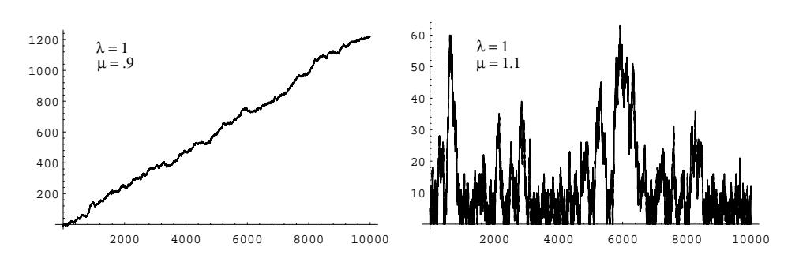
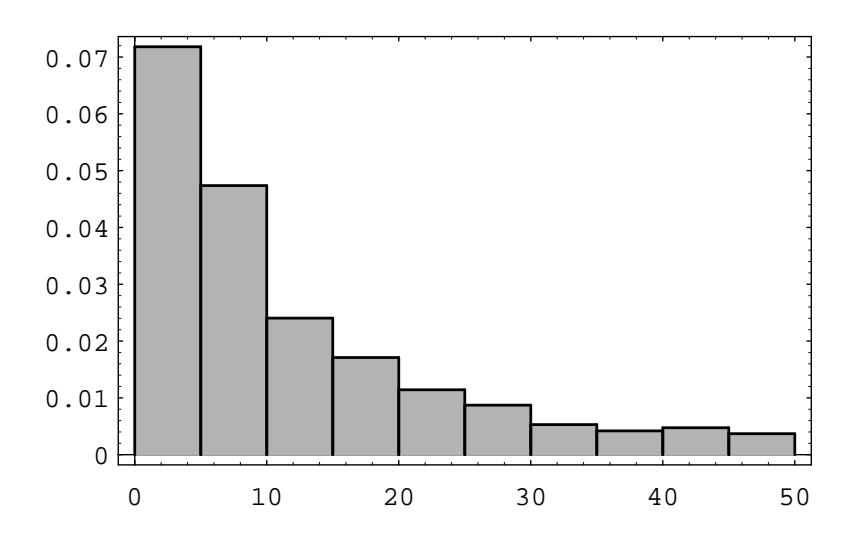
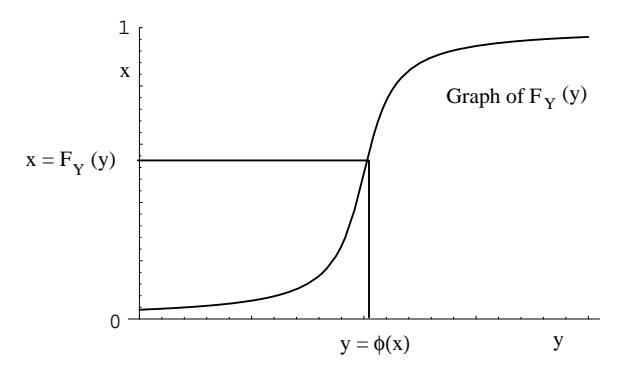

Figure 5.7: Queue sizes.

Figure 5.8: Waiting times.

Then we plot  $N(t)$  as a function of t for different choices of the parameters  $\lambda$  and  $\mu$  (see Figure 5.7).

We note that when  $\lambda < \mu$ , then  $1/\lambda > 1/\mu$ , so the average interarrival time is greater than the average service time, i.e., customers are served more quickly, on average, than new ones arrive. Thus, in this case, it is reasonable to expect that  $N(t)$  remains small. However, if  $\lambda > \mu$  then customers arrive more quickly than they are served, and, as expected,  $N(t)$  appears to grow without limit.

We can now ask: How long will a customer have to wait in the queue for service? To examine this question, we let  $W_i$  be the length of time that the *i*th customer has to remain in the system (waiting in line and being served). Then we can present these data in a bar graph, using the program Queue, to give some idea of how the  $W_i$  are distributed (see Figure 5.8). (Here  $\lambda = 1$  and  $\mu = 1.1$ .)

We see that these waiting times appear to be distributed exponentially. This is always the case when  $\lambda < \mu$ . The proof of this fact is too complicated to give here, but we can verify it by simulation for different choices of  $\lambda$  and  $\mu$ , as above.  $\Box$ 

## **Functions of a Random Variable**

Before continuing our list of important densities, we pause to consider random variables which are functions of other random variables. We will prove a general theorem that will allow us to derive expressions such as Equation 5.5.

**Theorem 5.1** Let X be a continuous random variable, and suppose that  $\phi(x)$  is a strictly increasing function on the range of X. Define  $Y = \phi(X)$ . Suppose that X and Y have cumulative distribution functions  $F_X$  and  $F_Y$  respectively. Then these functions are related by

$$
F_Y(y) = F_X(\phi^{-1}(y))
$$

If  $\phi(x)$  is strictly decreasing on the range of X, then

$$
F_Y(y) = 1 - F_X(\phi^{-1}(y))
$$

**Proof.** Since  $\phi$  is a strictly increasing function on the range of X, the events  $(X \leq \phi^{-1}(y))$  and  $(\phi(X) \leq y)$  are equal. Thus, we have

$$
F_Y(y) = P(Y \le y)
$$
  
=  $P(\phi(X) \le y)$   
=  $P(X \le \phi^{-1}(y))$   
=  $F_X(\phi^{-1}(y))$ .

If  $\phi(x)$  is strictly decreasing on the range of X, then we have

$$
F_Y(y) = P(Y \le y)
$$
  
=  $P(\phi(X) \le y)$   
=  $P(X \ge \phi^{-1}(y))$   
=  $1 - P(X < \phi^{-1}(y))$   
=  $1 - F_X(\phi^{-1}(y))$ .

This completes the proof.

**Corollary 5.1** Let X be a continuous random variable, and suppose that  $\phi(x)$  is a strictly increasing function on the range of X. Define  $Y = \phi(X)$ . Suppose that the density functions of X and Y are  $f_X$  and  $f_Y$ , respectively. Then these functions are related by

$$
f_Y(y) = f_X(\phi^{-1}(y)) \frac{d}{dy} \phi^{-1}(y)
$$
.

If  $\phi(x)$  is strictly decreasing on the range of X, then

$$
f_Y(y) = -f_X(\phi^{-1}(y)) \frac{d}{dy} \phi^{-1}(y) .
$$

210

 $\Box$ 

## 5.2. IMPORTANT DENSITIES

**Proof.** This result follows from Theorem 5.1 by using the Chain Rule.  $\Box$ 

If the function  $\phi$  is neither strictly increasing nor strictly decreasing, then the situation is somewhat more complicated but can be treated by the same methods. For example, suppose that  $Y = X^2$ , Then  $\phi(x) = x^2$ , and

$$
F_Y(y) = P(Y \le y)
$$
  
=  $P(-\sqrt{y} \le X \le +\sqrt{y})$   
=  $P(X \le +\sqrt{y}) - P(X \le -\sqrt{y})$   
=  $F_X(\sqrt{y}) - F_X(-\sqrt{y}).$ 

Moreover,

$$
f_Y(y) = \frac{d}{dy} F_Y(y)
$$
  
= 
$$
\frac{d}{dy} (F_X(\sqrt{y}) - F_X(-\sqrt{y}))
$$
  
= 
$$
(f_X(\sqrt{y}) + f_X(-\sqrt{y})) \frac{1}{2\sqrt{y}}
$$

We see that in order to express  $F_Y$  in terms of  $F_X$  when  $Y = \phi(X)$ , we have to express  $P(Y \leq y)$  in terms of  $P(X \leq x)$ , and this process will depend in general upon the structure of  $\phi$ .

## Simulation

Theorem 5.1 tells us, among other things, how to simulate on the computer a random variable  $Y$  with a prescribed cumulative distribution function  $F$ . We assume that  $F(y)$  is strictly increasing for those values of y where  $0 \lt F(y) \lt 1$ . For this purpose, let U be a random variable which is uniformly distributed on  $[0,1]$ . Then U has cumulative distribution function  $F_U(u) = u$ . Now, if F is the prescribed cumulative distribution function for  $Y$ , then to write  $Y$  in terms of  $U$  we first solve the equation

$$
F(y) = u
$$

for y in terms of u. We obtain  $y = F^{-1}(u)$ . Note that since F is an increasing function this equation always has a unique solution (see Figure 5.9). Then we set  $Z = F^{-1}(U)$  and obtain, by Theorem 5.1,

$$
F_Z(y) = F_U(F(y)) = F(y) ,
$$

since  $F_U(u) = u$ . Therefore, Z and Y have the same cumulative distribution function. Summarizing, we have the following.

 $\Box$ 

Figure 5.9: Converting a uniform distribution  $F_U$  into a prescribed distribution  $F_Y$ .

**Corollary 5.2** If  $F(y)$  is a given cumulative distribution function that is strictly increasing when  $0 < F(y) < 1$  and if U is a random variable with uniform distribution on  $[0,1]$ , then

$$
Y = F^{-1}(U)
$$

has the cumulative distribution  $F(y)$ .

Thus, to simulate a random variable with a given cumulative distribution  $F$  we need only set  $Y = F^{-1}(\text{rnd}).$ 

## **Normal Density**

We now come to the most important density function, the normal density function. We have seen in Chapter 3 that the binomial distribution functions are bell-shaped, even for moderate size values of  $n$ . We recall that a binomially-distributed random variable with parameters n and p can be considered to be the sum of n mutually independent 0-1 random variables. A very important theorem in probability theory, called the Central Limit Theorem, states that under very general conditions, if we sum a large number of mutually independent random variables, then the distribution of the sum can be closely approximated by a certain specific continuous density, called the normal density. This theorem will be discussed in Chapter 9.

The normal density function with parameters  $\mu$  and  $\sigma$  is defined as follows:

$$
f_X(x) = \frac{1}{\sqrt{2\pi}\sigma} e^{-(x-\mu)^2/2\sigma^2}
$$

The parameter  $\mu$  represents the "center" of the density (and in Chapter 6, we will show that it is the average, or expected, value of the density). The parameter  $\sigma$ is a measure of the "spread" of the density, and thus it is assumed to be positive. (In Chapter 6, we will show that  $\sigma$  is the standard deviation of the density.) We note that it is not at all obvious that the above function is a density, i.e., that its