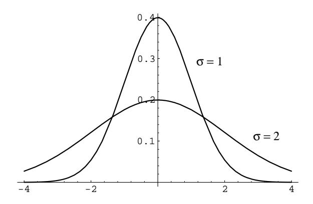
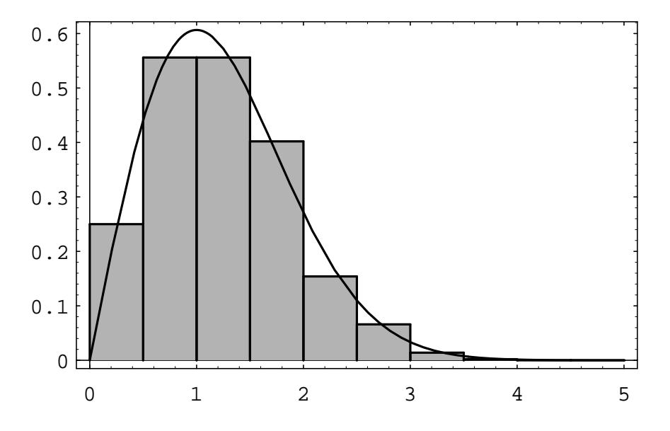

Figure 5.10: Normal density for two sets of parameter values.

integral over the real line equals 1. The cumulative distribution function is given by the formula

$$
F_X(x) = \int_{-\infty}^x \frac{1}{\sqrt{2\pi}\sigma} e^{-(u-\mu)^2/2\sigma^2} du.
$$

In Figure 5.10 we have included for comparison a plot of the normal density for the cases  $\mu = 0$  and  $\sigma = 1$ , and  $\mu = 0$  and  $\sigma = 2$ .

One cannot write  $F_X$  in terms of simple functions. This leads to several problems. First of all, values of  $F_X$  must be computed using numerical integration. Extensive tables exist containing values of this function (see Appendix A). Secondly, we cannot write  $F_X^{-1}$  in closed form, so we cannot use Corollary 5.2 to help us simulate a normal random variable. For this reason, special methods have been developed for simulating a normal distribution. One such method relies on the fact that if U and V are independent random variables with uniform densities on  $[0, 1]$ , then the random variables

$$
X = \sqrt{-2\log U \cos 2\pi V}
$$

and

$$
Y = \sqrt{-2\log U} \sin 2\pi V
$$

are independent, and have normal density functions with parameters  $\mu = 0$  and  $\sigma = 1$ . (This is not obvious, nor shall we prove it here. See Box and Muller.9)

Let Z be a normal random variable with parameters  $\mu = 0$  and  $\sigma = 1$ . A normal random variable with these parameters is said to be a *standard* normal random variable. It is an important and useful fact that if we write

$$
X = \sigma Z + \mu
$$

then X is a normal random variable with parameters  $\mu$  and  $\sigma$ . To show this, we will use Theorem 5.1. We have  $\phi(z) = \sigma z + \mu$ ,  $\phi^{-1}(x) = (x - \mu)/\sigma$ , and

$$
F_X(x) = F_Z\left(\frac{x-\mu}{\sigma}\right),
$$

 ${}^{9}$ G. E. P. Box and M. E. Muller, A Note on the Generation of Random Normal Deviates, Ann. of Math. Stat. 29 (1958), pgs. 610-611.

$$
f_X(x) = f_Z\left(\frac{x-\mu}{\sigma}\right) \cdot \frac{1}{\sigma}
$$
  
= 
$$
\frac{1}{\sqrt{2\pi}\sigma} e^{-(x-\mu)^2/2\sigma^2}.
$$

The reader will note that this last expression is the density function with parameters  $\mu$  and  $\sigma$ , as claimed.

We have seen above that it is possible to simulate a standard normal random variable Z. If we wish to simulate a normal random variable X with parameters  $\mu$ and  $\sigma$ , then we need only transform the simulated values for Z using the equation  $X = \sigma Z + \mu$ .

Suppose that we wish to calculate the value of a cumulative distribution function for the normal random variable X, with parameters  $\mu$  and  $\sigma$ . We can reduce this calculation to one concerning the standard normal random variable  $Z$  as follows:

$$
F_X(x) = P(X \le x)
$$
  
=  $P\left(Z \le \frac{x-\mu}{\sigma}\right)$   
=  $F_Z\left(\frac{x-\mu}{\sigma}\right)$ .

This last expression can be found in a table of values of the cumulative distribution function for a standard normal random variable. Thus, we see that it is unnecessary to make tables of normal distribution functions with arbitrary  $\mu$  and  $\sigma$ .

The process of changing a normal random variable to a standard normal random variable is known as standardization. If  $X$  has a normal distribution with parameters  $\mu$  and  $\sigma$  and if

$$
Z = \frac{X - \mu}{\sigma}
$$

then  $Z$  is said to be the standardized version of  $X$ .

The following example shows how we use the standardized version of a normal random variable  $X$  to compute specific probabilities relating to  $X$ .

**Example 5.8** Suppose that X is a normally distributed random variable with parameters  $\mu = 10$  and  $\sigma = 3$ . Find the probability that X is between 4 and 16.

To solve this problem, we note that  $Z = (X - 10)/3$  is the standardized version of  $X$ . So, we have

$$
P(4 \le X \le 16) = P(X \le 16) - P(X \le 4)
$$
  
=  $F_X(16) - F_X(4)$   
=  $F_Z\left(\frac{16 - 10}{3}\right) - F_Z\left(\frac{4 - 10}{3}\right)$   
=  $F_Z(2) - F_Z(-2)$ .

Figure 5.11: Distribution of dart distances in 1000 drops.

This last expression can be evaluated by using tabulated values of the standard normal distribution function (see 11.5); when we use this table, we find that  $F_Z(2)$ .9772 and  $F_Z(-2) = .0228$ . Thus, the answer is .9544.

In Chapter 6, we will see that the parameter  $\mu$  is the mean, or average value, of the random variable X. The parameter  $\sigma$  is a measure of the spread of the random variable, and is called the standard deviation. Thus, the question asked in this example is of a typical type, namely, what is the probability that a random variable has a value within two standard deviations of its average value.  $\Box$ 

## Maxwell and Rayleigh Densities

**Example 5.9** Suppose that we drop a dart on a large table top, which we consider as the xy-plane, and suppose that the  $x$  and  $y$  coordinates of the dart point are independent and have a normal distribution with parameters  $\mu = 0$  and  $\sigma = 1$ . How is the distance of the point from the origin distributed?

This problem arises in physics when it is assumed that a moving particle in  $Rn$  has components of the velocity that are mutually independent and normally distributed and it is desired to find the density of the speed of the particle. The density in the case  $n = 3$  is called the Maxwell density.

The density in the case  $n = 2$  (i.e. the dart board experiment described above) is called the Rayleigh density. We can simulate this case by picking independently a pair of coordinates  $(x, y)$ , each from a normal distribution with  $\mu = 0$  and  $\sigma = 1$  on  $(-\infty,\infty)$ , calculating the distance  $r = \sqrt{x^2 + y^2}$  of the point  $(x, y)$  from the origin, repeating this process a large number of times, and then presenting the results in a bar graph. The results are shown in Figure 5.11.

|         | Female | Male |     |
|---------|--------|------|-----|
|         | 37     | 56   | 93  |
| В       | 63     | 60   | 123 |
|         |        | 43   | 90  |
| Below C | h.     |      | 13  |
|         | 152    | 167  | 319 |

Table 5.8: Calculus class data.

|         | Female | Male |     |
|---------|--------|------|-----|
|         | 44.3   | 48.7 | 93  |
| в       | 58.6   | 64.4 | 123 |
| e       | 42.9   | 47.1 | 90  |
| Below C | 6.2    | 6.8  | 13  |
|         | 152    | 167  | 319 |

Table 5.9: Expected data.

We have also plotted the theoretical density

$$
f(r) = re^{-r^2/2}
$$

This will be derived in Chapter 7; see Example 7.7.

## **Chi-Squared Density**

We return to the problem of independence of traits discussed in Example 5.6. It is frequently the case that we have two traits, each of which have several different values. As was seen in the example, quite a lot of calculation was needed even in the case of two values for each trait. We now give another method for testing independence of traits, which involves much less calculation.

**Example 5.10** Suppose that we have the data shown in Table 5.8 concerning grades and gender of students in a Calculus class. We can use the same sort of model in this situation as was used in Example 5.6. We imagine that we have an urn with 319 balls of two colors, say blue and red, corresponding to females and males, respectively. We now draw 93 balls, without replacement, from the urn. These balls correspond to the grade of A. We continue by drawing 123 balls, which correspond to the grade of B. When we finish, we have four sets of balls, with each ball belonging to exactly one set. (We could have stipulated that the balls were of four colors, corresponding to the four possible grades. In this case, we would draw a subset of size 152, which would correspond to the females. The balls remaining in the urn would correspond to the males. The choice does not affect the final determination of whether we should reject the hypothesis of independence of traits.)

The expected data set can be determined in exactly the same way as in Example 5.6. If we do this, we obtain the expected values shown in Table 5.9. Even if

 $\Box$