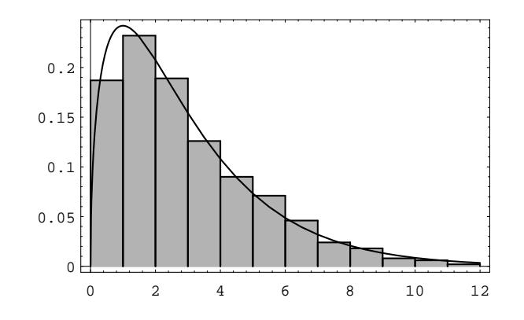

## 5.2. IMPORTANT DENSITIES

the traits are independent, we would still expect to see some differences between the numbers in corresponding boxes in the two tables. However, if the differences are large, then we might suspect that the two traits are not independent. In Example 5.6, we used the probability distribution of the various possible data sets to compute the probability of finding a data set that differs from the expected data set by at least as much as the actual data set does. We could do the same in this case, but the amount of computation is enormous.

Instead, we will describe a single number which does a good job of measuring how far a given data set is from the expected one. To quantify how far apart the two sets of numbers are, we could sum the squares of the differences of the corresponding numbers. (We could also sum the absolute values of the differences, but we would not want to sum the differences.) Suppose that we have data in which we expect to see 10 objects of a certain type, but instead we see 18, while in another case we expect to see 50 objects of a certain type, but instead we see 58. Even though the two differences are about the same, the first difference is more surprising than the second, since the expected number of outcomes in the second case is quite a bit larger than the expected number in the first case. One way to correct for this is to divide the individual squares of the differences by the expected number for that box. Thus, if we label the values in the eight boxes in the first table by  $O_i$  (for observed values) and the values in the eight boxes in the second table by  $E_i$  (for expected values), then the following expression might be a reasonable one to use to measure how far the observed data is from what is expected:

$$
\sum_{i=1}^{8} \frac{(O_i - E_i)^2}{E_i}
$$

This expression is a random variable, which is usually denoted by the symbol  $\chi^2$ , pronounced "ki-squared." It is called this because, under the assumption of independence of the two traits, the density of this random variable can be computed and is approximately equal to a density called the chi-squared density. We choose not to give the explicit expression for this density, since it involves the gamma function, which we have not discussed. The chi-squared density is, in fact, a special case of the general gamma density.

In applying the chi-squared density, tables of values of this density are used, as in the case of the normal density. The chi-squared density has one parameter  $n$ , which is called the number of degrees of freedom. The number  $n$  is usually easy to determine from the problem at hand. For example, if we are checking two traits for independence, and the two traits have  $a$  and  $b$  values, respectively, then the number of degrees of freedom of the random variable  $\chi^2$  is  $(a-1)(b-1)$ . So, in the example at hand, the number of degrees of freedom is 3.

We recall that in this example, we are trying to test for independence of the two traits of gender and grades. If we assume these traits are independent, then the ball-and-urn model given above gives us a way to simulate the experiment. Using a computer, we have performed 1000 experiments, and for each one, we have calculated a value of the random variable  $\chi^2$ . The results are shown in Figure 5.12, together with the chi-squared density function with three degrees of freedom.

Figure 5.12: Chi-squared density with three degrees of freedom.

As we stated above, if the value of the random variable  $\chi^2$  is large, then we would tend not to believe that the two traits are independent. But how large is large? The actual value of this random variable for the data above is 4.13. In Figure 5.12, we have shown the chi-squared density with 3 degrees of freedom. It can be seen that the value 4.13 is larger than most of the values taken on by this random variable.

Typically, a statistician will compute the value v of the random variable  $\chi^2$ , just as we have done. Then, by looking in a table of values of the chi-squared density, a value  $v_0$  is determined which is only exceeded 5% of the time. If  $v \ge v_0$ , the statistician rejects the hypothesis that the two traits are independent. In the present case,  $v_0 = 7.815$ , so we would not reject the hypothesis that the two traits are independent.  $\Box$ 

## **Cauchy Density**

The following example is from Feller.10

**Example 5.11** Suppose that a mirror is mounted on a vertical axis, and is free to revolve about that axis. The axis of the mirror is 1 foot from a straight wall of infinite length. A pulse of light is shown onto the mirror, and the reflected ray hits the wall. Let  $\phi$  be the angle between the reflected ray and the line that is perpendicular to the wall and that runs through the axis of the mirror. We assume that  $\phi$  is uniformly distributed between  $-\pi/2$  and  $\pi/2$ . Let X represent the distance between the point on the wall that is hit by the reflected ray and the point on the wall that is closest to the axis of the mirror. We now determine the density of  $X$ .

Let B be a fixed positive quantity. Then  $X \geq B$  if and only if  $tan(\phi) \geq B$ , which happens if and only if  $\phi \geq \arctan(B)$ . This happens with probability

$$
\frac{\pi/2 - \arctan(B)}{\pi}
$$

 $10$ W. Feller, An Introduction to Probability Theory and Its Applications,, vol. 2, (New York: Wiley, 1966)

## 5.2. IMPORTANT DENSITIES

Thus, for positive  $B$ , the cumulative distribution function of  $X$  is

$$
F(B) = 1 - \frac{\pi/2 - \arctan(B)}{\pi}
$$

Therefore, the density function for positive  $B$  is

$$
f(B) = \frac{1}{\pi(1 + B^2)} \; .
$$

Since the physical situation is symmetric with respect to  $\phi = 0$ , it is easy to see that the above expression for the density is correct for negative values of  $B$  as well.

The Law of Large Numbers, which we will discuss in Chapter 8, states that in many cases, if we take the average of independent values of a random variable. then the average approaches a specific number as the number of values increases. It turns out that if one does this with a Cauchy-distributed random variable, the average does not approach any specific number.  $\Box$ 

## **Exercises**

- 1 Choose a number  $U$  from the unit interval  $[0,1]$  with uniform distribution. Find the cumulative distribution and density for the random variables
  - (a)  $Y = U + 2$ .
  - (b)  $Y = U^3$ .
- 2 Choose a number  $U$  from the interval  $[0,1]$  with uniform distribution. Find the cumulative distribution and density for the random variables
  - (a)  $Y = 1/(U + 1)$ .
  - (b)  $Y = \log(U + 1)$ .
- 3 Use Corollary 5.2 to derive the expression for the random variable given in Equation 5.5. *Hint*: The random variables  $1-rnd$  and rnd are identically distributed.
- 4 Suppose we know a random variable  $Y$  as a function of the uniform random variable  $U: Y = \phi(U)$ , and suppose we have calculated the cumulative distribution function  $F_Y(y)$  and thence the density  $f_Y(y)$ . How can we check whether our answer is correct? An easy simulation provides the answer: Make a bar graph of  $Y = \phi(rnd)$  and compare the result with the graph of  $f_Y(y)$ . These graphs should look similar. Check your answers to Exercises 1 and 2 by this method.
- **5** Choose a number U from the interval [0, 1] with uniform distribution. Find the cumulative distribution and density for the random variables
  - (a)  $Y = |U 1/2|$ .
  - (b)  $Y = (U 1/2)^2$ .

- 6 Check your results for Exercise 5 by simulation as described in Exercise 4.
- 7 Explain how you can generate a random variable whose cumulative distribution function is

$$
F(x) = \begin{cases} 0, & \text{if } x < 0, \\ x^2, & \text{if } 0 \le x \le 1, \\ 1, & \text{if } x > 1. \end{cases}
$$

- 8 Write a program to generate a sample of 1000 random outcomes each of which is chosen from the distribution given in Exercise 7. Plot a bar graph of your results and compare this empirical density with the density for the cumulative distribution given in Exercise 7.
- **9** Let U, V be random numbers chosen independently from the interval  $[0,1]$ with uniform distribution. Find the cumulative distribution and density of each of the variables
  - (a)  $Y = U + V$ .
  - (b)  $Y = |U V|$ .
- 10 Let U, V be random numbers chosen independently from the interval  $[0,1]$ . Find the cumulative distribution and density for the random variables
  - (a)  $Y = \max(U, V)$ .
  - (b)  $Y = min(U, V)$ .
- 11 Write a program to simulate the random variables of Exercises 9 and 10 and plot a bar graph of the results. Compare the resulting empirical density with the density found in Exercises 9 and 10.
- 12 A number U is chosen at random in the interval  $[0,1]$ . Find the probability that
  - (a)  $R = U^2 < 1/4$ .
  - (b)  $S = U(1-U) < 1/4$ .
  - (c)  $T = U/(1-U) < 1/4$ .
- 13 Find the cumulative distribution function  $F$  and the density function  $f$  for each of the random variables  $R$ ,  $S$ , and  $T$  in Exercise 12.
- 14 A point  $P$  in the unit square has coordinates  $X$  and  $Y$  chosen at random in the interval  $[0,1]$ . Let D be the distance from P to the nearest edge of the square, and  $E$  the distance to the nearest corner. What is the probability that
  - (a)  $D < 1/4$ ?
  - (b)  $E < 1/4$ ?
- 15 In Exercise 14 find the cumulative distribution  $F$  and density  $f$  for the random variable  $D$ .