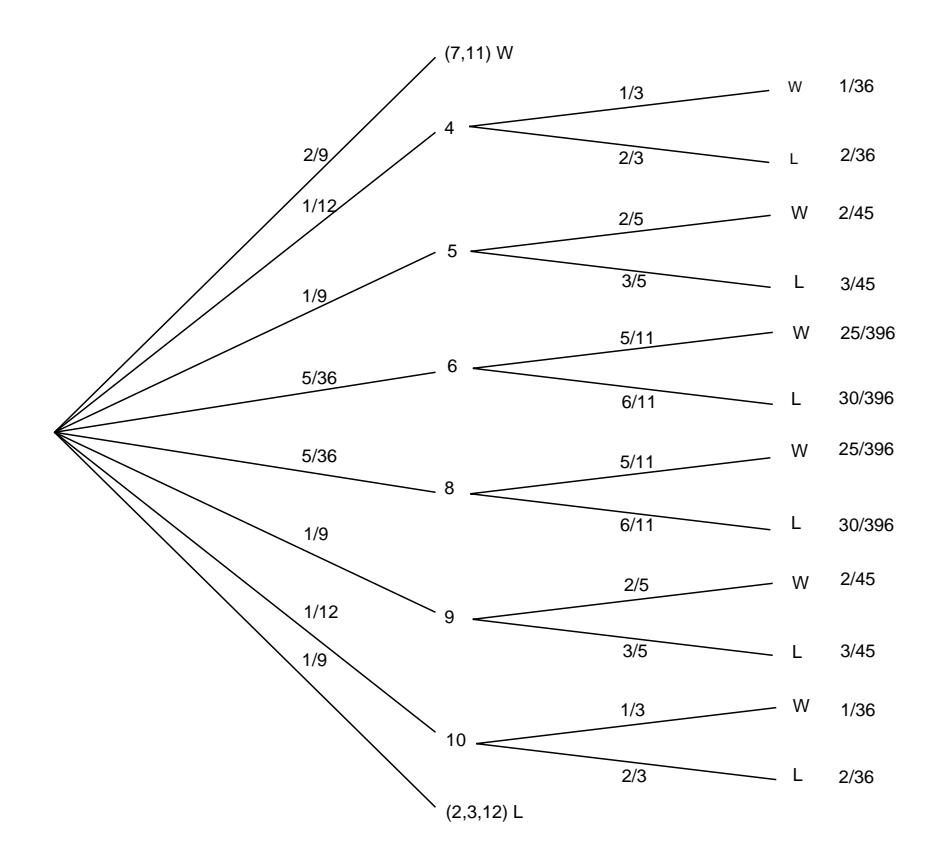

# **Bernoulli Trials**

**Theorem 6.3** Let  $S_n$  be the number of successes in *n* Bernoulli trials with probability  $p$  for success on each trial. Then the expected number of successes is  $np$ . That is,

$$
E(S_n)=np.
$$

**Proof.** Let  $X_j$  be a random variable which has the value 1 if the jth outcome is a success and 0 if it is a failure. Then, for each  $X_j$ ,

$$
E(X_i) = 0 \cdot (1 - p) + 1 \cdot p = p.
$$

Since

$$
S_n=X_1+X_2+\cdots+X_n,
$$

and the expected value of the sum is the sum of the expected values, we have

$$
E(S_n) = E(X_1) + E(X_2) + \cdots + E(X_n) = np.
$$

# **Poisson Distribution**

Recall that the Poisson distribution with parameter  $\lambda$  was obtained as a limit of binomial distributions with parameters n and p, where it was assumed that  $np = \lambda$ , and  $n \to \infty$ . Since for each n, the corresponding binomial distribution has expected value  $\lambda$ , it is reasonable to guess that the expected value of a Poisson distribution with parameter  $\lambda$  also has expectation equal to  $\lambda$ . This is in fact the case, and the reader is invited to show this (see Exercise 21).

#### Independence

If X and Y are two random variables, it is not true in general that  $E(X \cdot Y) =$  $E(X)E(Y)$ . However, this is true if X and Y are *independent*.

**Theorem 6.4** If  $X$  and  $Y$  are independent random variables, then

$$
E(X \cdot Y) = E(X)E(Y) .
$$

**Proof.** Suppose that

 $\Omega_X = \{x_1, x_2, \ldots\}$ 

and

$$
\Omega_Y = \{y_1, y_2, \ldots\}
$$

are the sample spaces of  $X$  and  $Y$ , respectively. Using Theorem 6.1, we have

$$
E(X \cdot Y) = \sum_{j} \sum_{k} x_j y_k P(X = x_j, Y = y_k).
$$

But if  $X$  and  $Y$  are independent,

$$
P(X = x_j, Y = y_k) = P(X = x_j)P(Y = y_k) .
$$

Thus,

$$
E(X \cdot Y) = \sum_{j} \sum_{k} x_{j} y_{k} P(X = x_{j}) P(Y = y_{k})
$$
  
= 
$$
\left( \sum_{j} x_{j} P(X = x_{j}) \right) \left( \sum_{k} y_{k} P(Y = y_{k}) \right)
$$
  
= 
$$
E(X)E(Y).
$$

**Example 6.9** A coin is tossed twice.  $X_i = 1$  if the *i*th toss is heads and 0 otherwise. We know that  $X_1$  and  $X_2$  are independent. They each have expected value  $1/2$ . Thus  $E(X_1 \cdot X_2) = E(X_1)E(X_2) = (1/2)(1/2) = 1/4.$  $\Box$ 

We next give a simple example to show that the expected values need not multiply if the random variables are not independent.

**Example 6.10** Consider a single toss of a coin. We define the random variable  $X$ to be 1 if heads turns up and 0 if tails turns up, and we set  $Y = 1 - X$ . Then  $E(X) = E(Y) = 1/2$ . But  $X \cdot Y = 0$  for either outcome. Hence,  $E(X \cdot Y) = 0 \neq$  $E(X)E(Y)$ .  $\Box$ 

We return to our records example of Section 3.1 for another application of the result that the expected value of the sum of random variables is the sum of the expected values of the individual random variables.

### Records

**Example 6.11** We start keeping snowfall records this year and want to find the expected number of records that will occur in the next  $n$  years. The first year is necessarily a record. The second year will be a record if the snowfall in the second year is greater than that in the first year. By symmetry, this probability is  $1/2$ . More generally, let  $X_j$  be 1 if the jth year is a record and 0 otherwise. To find  $E(X_i)$ , we need only find the probability that the jth year is a record. But the record snowfall for the first  $j$  years is equally likely to fall in any one of these years,

#### 6.1. EXPECTED VALUE

so  $E(X_i) = 1/j$ . Therefore, if  $S_n$  is the total number of records observed in the first  $n$  years,

$$
E(S_n) = 1 + \frac{1}{2} + \frac{1}{3} + \dots + \frac{1}{n}
$$

This is the famous *divergent harmonic series*. It is easy to show that

$$
E(S_n) \sim \log n
$$

as  $n \to \infty$ . A more accurate approximation to  $E(S_n)$  is given by the expression

$$
\log n + \gamma + \frac{1}{2n} \; ,
$$

where  $\gamma$  denotes Euler's constant, and is approximately equal to .5772.

Therefore, in ten years the expected number of records is approximately 2.9298; the exact value is the sum of the first ten terms of the harmonic series which is 2.9290.  $\Box$ 

### Craps

**Example 6.12** In the game of craps, the player makes a bet and rolls a pair of dice. If the sum of the numbers is  $7$  or 11 the player wins, if it is  $2, 3$ , or  $12$  the player loses. If any other number results, say r, then r becomes the player's point and he continues to roll until either  $r$  or 7 occurs. If  $r$  comes up first he wins, and if 7 comes up first he loses. The program Craps simulates playing this game a number of times.

We have run the program for 1000 plays in which the player bets 1 dollar each time. The player's average winnings were  $-.006$ . The game of craps would seem to be only slightly unfavorable. Let us calculate the expected winnings on a single play and see if this is the case. We construct a two-stage tree measure as shown in Figure 6.1.

The first stage represents the possible sums for his first roll. The second stage represents the possible outcomes for the game if it has not ended on the first roll. In this stage we are representing the possible outcomes of a sequence of rolls required to determine the final outcome. The branch probabilities for the first stage are computed in the usual way assuming all 36 possibilities for outcomes for the pair of dice are equally likely. For the second stage we assume that the game will eventually end, and we compute the conditional probabilities for obtaining either the point or a 7. For example, assume that the player's point is 6. Then the game will end when one of the eleven pairs,  $(1,5)$ ,  $(2,4)$ ,  $(3,3)$ ,  $(4,2)$ ,  $(5,1)$ ,  $(1,6)$ ,  $(2,5)$ ,  $(3,4)$ ,  $(4,3)$ ,  $(5,2)$ ,  $(6,1)$ , occurs. We assume that each of these possible pairs has the same probability. Then the player wins in the first five cases and loses in the last six. Thus the probability of winning is  $5/11$  and the probability of losing is  $6/11$ . From the path probabilities, we can find the probability that the player wins 1 dollar; it is 244/495. The probability of losing is then 251/495. Thus if X is his winning for

Figure 6.1: Tree measure for craps.