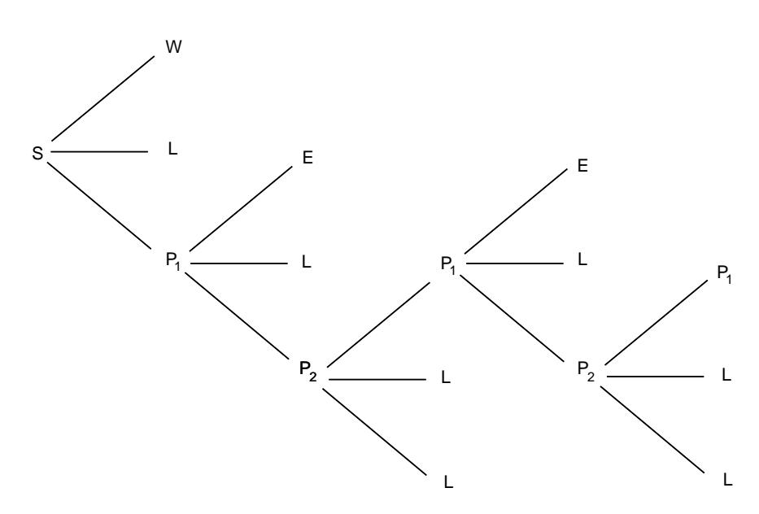
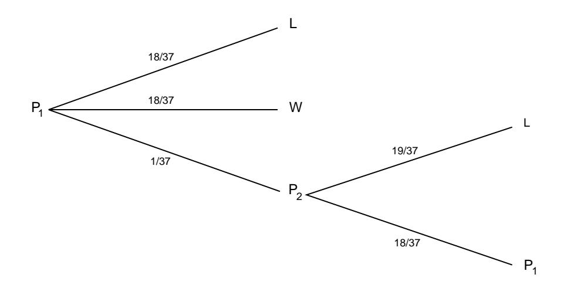

a dollar bet.

$$
E(X) = 1\left(\frac{244}{495}\right) + (-1)\left(\frac{251}{495}\right)
$$
$$
= -\frac{7}{495} \approx -0.0141.
$$

The game is unfavorable, but only slightly. The player's expected gain in  $n$  plays is  $-n(.0141)$ . If *n* is not large, this is a small expected loss for the player. The casino makes a large number of plays and so can afford a small average gain per play and still expect a large profit.  $\Box$ 

## Roulette

**Example 6.13** In Las Vegas, a roulette wheel has 38 slots numbered 0, 00, 1, 2, ..., 36. The 0 and 00 slots are green, and half of the remaining 36 slots are red and half are black. A croupler spins the wheel and throws an ivory ball. If you bet 1 dollar on red, you win 1 dollar if the ball stops in a red slot, and otherwise you lose a dollar. We wish to calculate the expected value of your winnings, if you bet 1 dollar on red.

Let X be the random variable which denotes your winnings in a 1 dollar bet on red in Las Vegas roulette. Then the distribution of  $X$  is given by

$$
m_X = \begin{pmatrix} -1 & 1 \\ 20/38 & 18/38 \end{pmatrix},
$$

and one can easily calculate (see Exercise 5) that

$$
E(X) \approx -.0526.
$$

We now consider the roulette game in Monte Carlo, and follow the treatment of Sagan.1 In the roulette game in Monte Carlo there is only one 0. If you bet 1 franc on red and a 0 turns up, then, depending upon the casino, one or more of the following options may be offered:

(a) You get  $1/2$  of your bet back, and the casino gets the other half of your bet.

(b) Your bet is put "in prison," which we will denote by  $P_1$ . If red comes up on the next turn, you get your bet back (but you don't win any money). If black or 0 comes up, you lose your bet.

(c) Your bet is put in prison  $P_1$ , as before. If red comes up on the next turn, you get your bet back, and if black comes up on the next turn, then you lose your bet. If a 0 comes up on the next turn, then your bet is put into double prison, which we will denote by  $P_2$ . If your bet is in double prison, and if red comes up on the next turn, then your bet is moved back to prison  $P_1$  and the game proceeds as before. If your bet is in double prison, and if black or 0 come up on the next turn, then you lose your bet. We refer the reader to Figure 6.2, where a tree for this option is shown. In this figure,  $S$  is the starting position,  $W$  means that you win your bet, L means that you lose your bet, and E means that you break even.

&lt;sup>1H. Sagan, *Markov Chains in Monte Carlo*, Math. Mag., vol. 54, no. 1 (1981), pp. 3-10.

Figure 6.2: Tree for 2-prison Monte Carlo roulette.

It is interesting to compare the expected winnings of a 1 franc bet on red, under each of these three options. We leave the first two calculations as an exercise (see Exercise  $37$ ). Suppose that you choose to play alternative (c). The calculation for this case illustrates the way that the early French probabilists worked problems like this.

Suppose you bet on red, you choose alternative  $(c)$ , and a 0 comes up. Your possible future outcomes are shown in the tree diagram in Figure 6.3. Assume that your money is in the first prison and let  $x$  be the probability that you lose your franc. From the tree diagram we see that

$$
x = \frac{18}{37} + \frac{1}{37}P
$$
(you lose your franc | your franc is in  $P_2$ ).

Also,

$$
P
$$
(you lose your franc | your franc is in  $P_2$ ) =  $\frac{19}{37} + \frac{18}{37}x$ .

So, we have

$$
x = \frac{18}{37} + \frac{1}{37} \left( \frac{19}{37} + \frac{18}{37} x \right)
$$

Solving for x, we obtain  $x = 685/1351$ . Thus, starting at S, the probability that you lose your bet equals

$$
\frac{18}{37} + \frac{1}{37}x = \frac{25003}{49987}
$$

To find the probability that you win when you bet on red, note that you can only win if red comes up on the first turn, and this happens with probability 18/37. Thus your expected winnings are

$$
1\cdot\frac{18}{37}-1\cdot\frac{25003}{49987}=-\frac{687}{49987}\approx -.0137\;.
$$

Figure 6.3: Your money is put in prison.

It is interesting to note that the more romantic option  $(c)$  is less favorable than option (a) (see Exercise 37).

If you bet 1 dollar on the number 17, then the distribution function for your winnings  $X$  is

$$
P_X = \begin{pmatrix} -1 & 35 \\ 36/37 & 1/37 \end{pmatrix} ,
$$

and the expected winnings are

$$
-1\cdot\frac{36}{37}+35\cdot\frac{1}{37}=-\frac{1}{37}\approx -.027\;.
$$

Thus, at Monte Carlo different bets have different expected values. In Las Vegas almost all bets have the same expected value of  $-2/38 = -.0526$  (see Exercises 4 and  $5$ ).  $\Box$ 

## **Conditional Expectation**

**Definition 6.2** If  $F$  is any event and  $X$  is a random variable with sample space  $\Omega = \{x_1, x_2, \ldots\}$ , then the *conditional expectation given* F is defined by

$$
E(X|F) = \sum_j x_j P(X = x_j|F) .
$$

Conditional expectation is used most often in the form provided by the following theorem.  $\Box$ 

**Theorem 6.5** Let X be a random variable with sample space  $\Omega$ . If  $F_1, F_2, \ldots, F_r$ are events such that  $F_i \cap F_j = \emptyset$  for  $i \neq j$  and  $\Omega = \bigcup_j F_j$ , then

$$
E(X) = \sum_j E(X|F_j)P(F_j) .
$$

Proof. We have

$$
\sum_{j} E(X|F_j)P(F_j) = \sum_{j} \sum_{k} x_k P(X = x_k|F_j)P(F_j)
$$
  
= 
$$
\sum_{j} \sum_{k} x_k P(X = x_k \text{ and } F_j \text{ occurs})
$$
  
= 
$$
\sum_{k} \sum_{j} x_k P(X = x_k \text{ and } F_j \text{ occurs})
$$
  
= 
$$
\sum_{k} x_k P(X = x_k)
$$
  
= 
$$
E(X).
$$

**Example 6.14** (Example 6.12 continued) Let  $T$  be the number of rolls in a single play of craps. We can think of a single play as a two-stage process. The first stage consists of a single roll of a pair of dice. The play is over if this roll is a  $2, 3, 7$ , 11, or 12. Otherwise, the player's point is established, and the second stage begins. This second stage consists of a sequence of rolls which ends when either the player's point or a 7 is rolled. We record the outcomes of this two-stage experiment using the random variables  $X$  and  $S$ , where  $X$  denotes the first roll, and  $S$  denotes the number of rolls in the second stage of the experiment (of course,  $S$  is sometimes equal to 0). Note that  $T = S + 1$ . Then by Theorem 6.5

$$
E(T) = \sum_{j=2}^{12} E(T|X=j)P(X=j) .
$$

If  $j = 7, 11$  or 2, 3, 12, then  $E(T|X = j) = 1$ . If  $j = 4, 5, 6, 8, 9$ , or 10, we can use Example 6.4 to calculate the expected value of  $S$ . In each of these cases, we continue rolling until we get either a j or a 7. Thus,  $S$  is geometrically distributed with parameter p, which depends upon j. If  $j = 4$ , for example, the value of p is  $3/36 + 6/36 = 1/4$ . Thus, in this case, the expected number of additional rolls is  $1/p = 4$ , so  $E(T|X = 4) = 1 + 4 = 5$ . Carrying out the corresponding calculations for the other possible values of  $j$  and using Theorem 6.5 gives

$$
E(T) = 1\left(\frac{12}{36}\right) + \left(1 + \frac{36}{36}\right)\left(\frac{3}{36}\right) + \left(1 + \frac{36}{46}\right)\left(\frac{4}{36}\right) + \left(1 + \frac{36}{56}\right)\left(\frac{5}{36}\right) + \left(1 + \frac{36}{56}\right)\left(\frac{5}{36}\right) + \left(1 + \frac{36}{46}\right)\left(\frac{4}{36}\right) + \left(1 + \frac{36}{36}\right)\left(\frac{3}{36}\right) = \frac{557}{165} \approx 3.375\dots
$$

 $\Box$