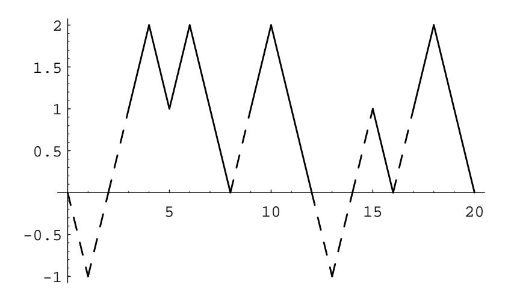
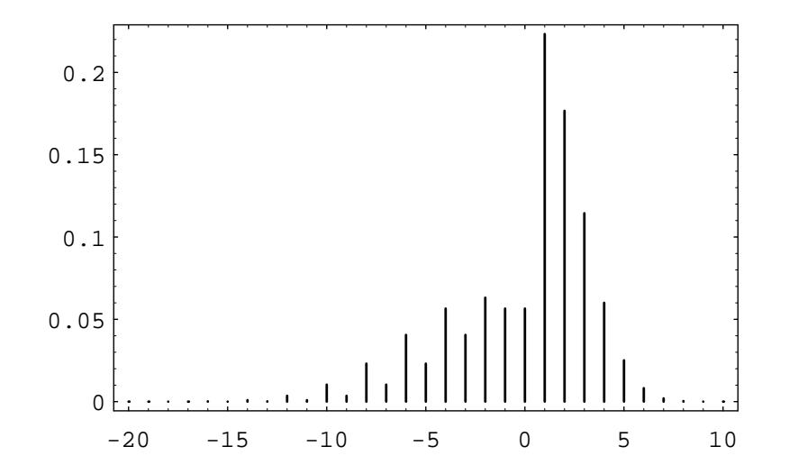

## 6.1. EXPECTED VALUE

## Martingales

We can extend the notion of fairness to a player playing a sequence of games by using the concept of conditional expectation.

**Example 6.15** Let  $S_1, S_2, \ldots, S_n$  be Peter's accumulated fortune in playing heads or tails (see Example 1.4). Then

$$
E(S_n|S_{n-1}=a,\ldots,S_1=r)=\frac{1}{2}(a+1)+\frac{1}{2}(a-1)=a.
$$

We note that Peter's expected fortune after the next play is equal to his present fortune. When this occurs, we say the game is *fair*. A fair game is also called a martingale. If the coin is biased and comes up heads with probability  $p$  and tails with probability  $q = 1 - p$ , then

$$
E(S_n|S_{n-1}=a,\ldots,S_1=r)=p(a+1)+q(a-1)=a+p-q.
$$

Thus, if  $p < q$ , this game is unfavorable, and if  $p > q$ , it is favorable.

 $\Box$ 

If you are in a casino, you will see players adopting elaborate *systems* of play to try to make unfavorable games favorable. Two such systems, the martingale doubling system and the more conservative Labouchere system, were described in Exercises 1.1.9 and 1.1.10. Unfortunately, such systems cannot change even a fair game into a favorable game.

Even so, it is a favorite pastime of many people to develop systems of play for gambling games and for other games such as the stock market. We close this section with a simple illustration of such a system.

## **Stock Prices**

**Example 6.16** Let us assume that a stock increases or decreases in value each day by 1 dollar, each with probability  $1/2$ . Then we can identify this simplified model with our familiar game of heads or tails. We assume that a buyer, Mr. Ace, adopts the following strategy. He buys the stock on the first day at its price  $V$ . He then waits until the price of the stock increases by one to  $V + 1$  and sells. He then continues to watch the stock until its price falls back to  $V$ . He buys again and waits until it goes up to  $V + 1$  and sells. Thus he holds the stock in intervals during which it increases by 1 dollar. In each such interval, he makes a profit of 1 dollar. However, we assume that he can do this only for a finite number of trading days. Thus he can lose if, in the last interval that he holds the stock, it does not get back up to  $V + 1$ ; and this is the only way he can lose. In Figure 6.4 we illustrate a typical history if Mr. Ace must stop in twenty days. Mr. Ace holds the stock under his system during the days indicated by broken lines. We note that for the history shown in Figure 6.4, his system nets him a gain of 4 dollars.

We have written a program StockSystem to simulate the fortune of Mr. Ace if he uses his sytem over an  $n$ -day period. If one runs this program a large number

Figure 6.4: Mr. Ace's system.

of times, for  $n = 20$ , say, one finds that his expected winnings are very close to 0, but the probability that he is ahead after 20 days is significantly greater than  $1/2$ . For small values of  $n$ , the exact distribution of winnings can be calculated. The distribution for the case  $n = 20$  is shown in Figure 6.5. Using this distribution, it is easy to calculate that the expected value of his winnings is exactly 0. This is another instance of the fact that a fair game (a martingale) remains fair under quite general systems of play.

Although the expected value of his winnings is 0, the probability that Mr. Ace is ahead after 20 days is about .610. Thus, he would be able to tell his friends that his system gives him a better chance of being ahead than that of someone who simply buys the stock and holds it, if our simple random model is correct. There have been a number of studies to determine how random the stock market is.  $\Box$ 

## **Historical Remarks**

With the Law of Large Numbers to bolster the frequency interpretation of probability, we find it natural to justify the definition of expected value in terms of the average outcome over a large number of repetitions of the experiment. The concept of expected value was used before it was formally defined; and when it was used, it was considered not as an average value but rather as the appropriate value for a gamble. For example recall, from the Historical Remarks section of Chapter 1, Section 1.2, Pascal's way of finding the value of a three-game series that had to be called off before it is finished.

Pascal first observed that if each player has only one game to win, then the stake of 64 pistoles should be divided evenly. Then he considered the case where one player has won two games and the other one.

Then consider, Sir, if the first man wins, he gets 64 pistoles, if he loses he gets 32. Thus if they do not wish to risk this last game, but wish

Figure 6.5: Winnings distribution for  $n = 20$ .

to separate without playing it, the first man must say: "I am certain to get 32 pistoles, even if I lose I still get them; but as for the other 32 pistoles, perhaps I will get them, perhaps you will get them, the chances are equal. Let us then divide these 32 pistoles in half and give one half to me as well as my 32 which are mine for sure." He will then have 48 pistoles and the other  $162$ 

Note that Pascal reduced the problem to a symmetric bet in which each player gets the same amount and takes it as obvious that in this case the stakes should be divided equally.

The first systematic study of expected value appears in Huygens' book. Like Pascal, Huygens find the value of a gamble by assuming that the answer is obvious for certain symmetric situations and uses this to deduce the expected for the general situation. He does this in steps. His first proposition is

Prop. I. If I expect  $a$  or  $b$ , either of which, with equal probability, may fall to me, then my Expectation is worth  $(a+b)/2$ , that is, the half Sum of  $a$  and  $b$ 3

Huygens proved this as follows: Assume that two player A and B play a game in which each player puts up a stake of  $(a + b)/2$  with an equal chance of winning the total stake. Then the value of the game to each player is  $(a + b)/2$ . For example, if the game had to be called off clearly each player should just get back his original stake. Now, by symmetry, this value is not changed if we add the condition that the winner of the game has to pay the loser an amount  $b$  as a consolation prize. Then for player A the value is still  $(a + b)/2$ . But what are his possible outcomes

&lt;sup>2Quoted in F. N. David, *Games, Gods and Gambling* (London: Griffin, 1962), p. 231.

&lt;sup>3C. Huygens, *Calculating in Games of Chance*, translation attributed to John Arbuthnot (London, 1692), p. 34.

for the modified game? If he wins he gets the total stake  $a + b$  and must pay B an amount  $b$  so ends up with  $a$ . If he loses he gets an amount  $b$  from player B. Thus player A wins a or b with equal chances and the value to him is  $(a + b)/2$ .

Huygens illustrated this proof in terms of an example. If you are offered a game in which you have an equal chance of winning 2 or 8, the expected value is 5, since this game is equivalent to the game in which each player stakes 5 and agrees to pay the loser  $3$  — a game in which the value is obviously 5.

Huygens' second proposition is

Prop. II. If I expect  $a, b,$  or  $c$ , either of which, with equal facility, may happen, then the Value of my Expectation is  $(a + b + c)/3$ , or the third of the Sum of a, b, and  $c^4$ 

His argument here is similar. Three players, A, B, and C, each stake

$$
(a+b+c)/3
$$

in a game they have an equal chance of winning. The value of this game to player A is clearly the amount he has staked. Further, this value is not changed if A enters into an agreement with B that if one of them wins he pays the other a consolation prize of  $b$  and with C that if one of them wins he pays the other a consolation prize of c. By symmetry these agreements do not change the value of the game. In this modified game, if A wins he wins the total stake  $a + b + c$  minus the consolation prizes  $b + c$  giving him a final winning of a. If B wins, A wins b and if C wins, A wins c. Thus A finds himself in a game with value  $(a + b + c)/3$  and with outcomes  $a, b,$  and c occurring with equal chance. This proves Proposition II.

More generally, this reasoning shows that if there are  $n$  outcomes

$$
a_1, a_2, \ldots, a_n,
$$

all occurring with the same probability, the expected value is

$$
\frac{a_1 + a_2 + \dots + a_n}{n}
$$

In his third proposition Huygens considered the case where you win  $a$  or  $b$  but with unequal probabilities. He assumed there are  $p$  chances of winning  $a$ , and  $q$ chances of winning  $b$ , all having the same probability. He then showed that the expected value is

$$
E = \frac{p}{p+q} \cdot a + \frac{q}{p+q} \cdot b
$$

This follows by considering an equivalent gamble with  $p + q$  outcomes all occurring with the same probability and with a payoff of  $a$  in  $p$  of the outcomes and  $b$  in  $q$  of the outcomes. This allowed Huygens to compute the expected value for experiments with unequal probabilities, at least when these probabilities are rational numbers.

Thus, instead of defining the expected value as a weighted average, Huygens assumed that the expected value of certain symmetric gambles are known and deduced the other values from these. Although this requires a good deal of clever

 $4$ ibid., p. 35.