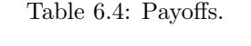

manipulation, Huygens ended up with values that agree with those given by our modern definition of expected value. One advantage of this method is that it gives a justification for the expected value in cases where it is not reasonable to assume that you can repeat the experiment a large number of times, as for example, in betting that at least two presidents died on the same day of the year. (In fact, three did; all were signers of the Declaration of Independence, and all three died on July 4.)

In his book, Huygens calculated the expected value of games using techniques similar to those which we used in computing the expected value for roulette at Monte Carlo. For example, his proposition XIV is:

Prop. XIV. If I were playing with another by turns, with two Dice, on this Condition, that if I throw 7 I gain, and if he throws 6 he gains allowing him the first Throw: To find the proportion of my Hazard to  $his.5$ 

A modern description of this game is as follows. Huygens and his opponent take turns rolling a die. The game is over if Huygens rolls a 7 or his opponent rolls a 6. His opponent rolls first. What is the probability that Huygens wins the game?

To solve this problem Huygens let  $x$  be his chance of winning when his opponent threw first and  $y$  his chance of winning when he threw first. Then on the first roll his opponent wins on 5 out of the 36 possibilities. Thus,

$$
x = \frac{31}{36} \cdot y \ .
$$

But when Huygens rolls he wins on 6 out of the 36 possible outcomes, and in the other 30, he is led back to where his chances are  $x$ . Thus

$$
y = \frac{6}{36} + \frac{30}{36} \cdot x \; .
$$

From these two equations Huygens found that  $x = 31/61$ .

Another early use of expected value appeared in Pascal's argument to show that a rational person should believe in the existence of God.6 Pascal said that we have to make a wager whether to believe or not to believe. Let  $p$  denote the probability that God does not exist. His discussion suggests that we are playing a game with two strategies, believe and not believe, with payoffs as shown in Table 6.4.

Here  $-u$  represents the cost to you of passing up some worldly pleasures as a consequence of believing that God exists. If you do not believe, and God is a vengeful God, you will lose x. If God exists and you do believe you will gain v. Now to determine which strategy is best you should compare the two expected values

 $p(-u) + (1-p)v$  and  $p0 + (1-p)(-x)$ ,

 $5$ ibid., p. 47.

 ${}^6$ Quoted in I. Hacking, The Emergence of Probability (Cambridge: Cambridge Univ. Press, 1975).

|             | God does not exist God exists |       |
|-------------|-------------------------------|-------|
|             |                               | $1-p$ |
| believe     | $-\overline{u}$               |       |
| not believe |                               |       |

| ge             | Survivors |
|----------------|-----------|
| $\overline{0}$ | 100       |
| 6              | 64        |
| 16             | 40        |
| 26             | 25        |
| 36             | 16        |
| 46             | 10        |
| 56             | 6         |
| 66             | 3         |
| 76             | 1         |

Table 6.5: Graunt's mortality data.

and choose the larger of the two. In general, the choice will depend upon the value of p. But Pascal assumed that the value of v is infinite and so the strategy of believing is best no matter what probability you assign for the existence of God. This example is considered by some to be the beginning of decision theory. Decision analyses of this kind appear today in many fields, and, in particular, are an important part of medical diagnostics and corporate business decisions.

Another early use of expected value was to decide the price of annuities. The study of statistics has its origins in the use of the bills of mortality kept in the parishes in London from 1603. These records kept a weekly tally of christenings and burials. From these John Graunt made estimates for the population of London and also provided the first mortality data,7 shown in Table 6.5.

As Hacking observes, Graunt apparently constructed this table by assuming that after the age of 6 there is a constant probability of about  $5/8$  of surviving for another decade.8 For example, of the 64 people who survive to age 6,  $5/8$  of 64 or 40 survive to 16, 5/8 of these 40 or 25 survive to 26, and so forth. Of course, he rounded off his figures to the nearest whole person.

Clearly, a constant mortality rate cannot be correct throughout the whole range, and later tables provided by Halley were more realistic in this respect.9

7ibid., p. 108.

&lt;sup>8ibid., p. 109.

&lt;sup>9E. Halley, "An Estimate of The Degrees of Mortality of Mankind," Phil. Trans. Royal. Soc.,

## 6.1. EXPECTED VALUE

A *terminal annuity* provides a fixed amount of money during a period of  $n$  years. To determine the price of a terminal annuity one needs only to know the appropriate interest rate. A *life annuity* provides a fixed amount during each year of the buyer's life. The appropriate price for a life annuity is the expected value of the terminal annuity evaluated for the random lifetime of the buyer. Thus, the work of Huygens in introducing expected value and the work of Graunt and Halley in determining mortality tables led to a more rational method for pricing annuities. This was one of the first serious uses of probability theory outside the gambling houses.

Although expected value plays a role now in every branch of science, it retains its importance in the casino. In 1962, Edward Thorp's book Beat the Dealer10 provided the reader with a strategy for playing the popular casino game of blackjack that would assure the player a positive expected winning. This book forever more changed the belief of the casinos that they could not be beat.

## Exercises

- 1 A card is drawn at random from a deck consisting of cards numbered 2 through 10. A player wins 1 dollar if the number on the card is odd and loses 1 dollar if the number if even. What is the expected value of his winnings?
- **2** A card is drawn at random from a deck of playing cards. If it is red, the player wins 1 dollar; if it is black, the player loses 2 dollars. Find the expected value of the game.
- **3** In a class there are 20 students: 3 are 5' 6", 5 are 5'8", 4 are 5'10", 4 are 6', and 4 are 6' 2". A student is chosen at random. What is the student's expected height?
- 4 In Las Vegas the roulette wheel has a 0 and a 00 and then the numbers 1 to 36 marked on equal slots; the wheel is spun and a ball stops randomly in one slot. When a player bets 1 dollar on a number, he receives 36 dollars if the ball stops on this number, for a net gain of 35 dollars; otherwise, he loses his dollar bet. Find the expected value for his winnings.
- 5 In a second version of roulette in Las Vegas, a player bets on red or black. Half of the numbers from 1 to 36 are red, and half are black. If a player bets a dollar on black, and if the ball stops on a black number, he gets his dollar back and another dollar. If the ball stops on a red number or on 0 or 00 he loses his dollar. Find the expected winnings for this bet.
- 6 A die is rolled twice. Let X denote the sum of the two numbers that turn up, and Y the difference of the numbers (specifically, the number on the first roll minus the number on the second). Show that  $E(XY) = E(X)E(Y)$ . Are X and  $Y$  independent?

vol. 17 (1693), pp. 596-610; 654-656.

 $10E$ . Thorp, *Beat the Dealer* (New York: Random House, 1962).

- \*7 Show that, if  $X$  and  $Y$  are random variables taking on only two values each, and if  $E(XY) = E(X)E(Y)$ , then X and Y are independent.
- 8 A royal family has children until it has a boy or until it has three children, whichever comes first. Assume that each child is a boy with probability  $1/2$ . Find the expected number of boys in this royal family and the expected number of girls.
- 9 If the first roll in a game of craps is neither a natural nor craps, the player can make an additional bet, equal to his original one, that he will make his point before a seven turns up. If his point is four or ten he is paid off at 2 : 1 odds; if it is a five or nine he is paid off at odds  $3:2$ ; and if it is a six or eight he is paid off at odds  $6:5$ . Find the player's expected winnings if he makes this additional bet when he has the opportunity.
- 10 In Example 6.16 assume that Mr. Ace decides to buy the stock and hold it until it goes up 1 dollar and then sell and not buy again. Modify the program **StockSystem** to find the distribution of his profit under this system after a twenty-day period. Find the expected profit and the probability that he comes out ahead.
- 11 On September 26, 1980, the New York Times reported that a mysterious stranger strode into a Las Vegas casino, placed a single bet of 777,000 dollars on the "don't pass" line at the crap table, and walked away with more than 1.5 million dollars. In the "don't pass" bet, the bettor is essentially betting with the house. An exception occurs if the roller rolls a 12 on the first roll. In this case, the roller loses and the "don't pass" better just gets back the money bet instead of winning. Show that the "don't pass" bettor has a more favorable bet than the roller.
- 12 Recall that in the martingale doubling system (see Exercise 1.1.10), the player doubles his bet each time he loses. Suppose that you are playing roulette in a fair casino where there are no 0's, and you bet on red each time. You then win with probability  $1/2$  each time. Assume that you enter the casino with 100 dollars, start with a 1-dollar bet and employ the martingale system. You stop as soon as you have won one bet, or in the unlikely event that black turns up six times in a row so that you are down 63 dollars and cannot make the required 64-dollar bet. Find your expected winnings under this system of play.
- 13 You have 80 dollars and play the following game. An urn contains two white balls and two black balls. You draw the balls out one at a time without replacement until all the balls are gone. On each draw, you bet half of your present fortune that you will draw a white ball. What is your expected final fortune?
- 14 In the hat check problem (see Example 3.12), it was assumed that  $N$  people check their hats and the hats are handed back at random. Let  $X_j = 1$  if the