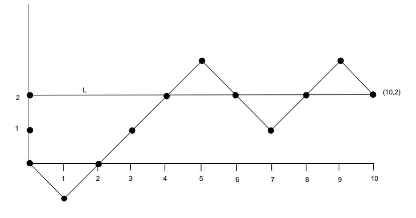

*j*th person gets his or her hat and 0 otherwise. Find  $E(X_i)$  and  $E(X_i \cdot X_k)$ for j not equal to k. Are  $X_i$  and  $X_k$  independent?

- 15 A box contains two gold balls and three silver balls. You are allowed to choose successively balls from the box at random. You win 1 dollar each time you draw a gold ball and lose 1 dollar each time you draw a silver ball. After a draw, the ball is not replaced. Show that, if you draw until you are ahead by 1 dollar or until there are no more gold balls, this is a favorable game.
- 16 Gerolamo Cardano in his book, The Gambling Scholar, written in the early 1500s, considers the following carnival game. There are six dice. Each of the dice has five blank sides. The sixth side has a number between 1 and  $6-$ a different number on each die. The six dice are rolled and the player wins a prize depending on the total of the numbers which turn up.
  - (a) Find, as Cardano did, the expected total without finding its distribution.
  - (b) Large prizes were given for large totals with a modest fee to play the game. Explain why this could be done.
- 17 Let X be the first time that a *failure* occurs in an infinite sequence of Bernoulli trials with probability p for success. Let  $p_k = P(X = k)$  for  $k = 1, 2, ...$ Show that  $p_k = p^{k-1}q$  where  $q = 1 - p$ . Show that  $\sum_k p_k = 1$ . Show that  $E(X) = 1/q$ . What is the expected number of tosses of a coin required to obtain the first tail?
- 18 Exactly one of six similar keys opens a certain door. If you try the keys, one after another, what is the expected number of keys that you will have to try before success?
- 19 A multiple choice exam is given. A problem has four possible answers, and exactly one answer is correct. The student is allowed to choose a subset of the four possible answers as his answer. If his chosen subset contains the correct answer, the student receives three points, but he loses one point for each wrong answer in his chosen subset. Show that if he just guesses a subset uniformly and randomly his expected score is zero.
- 20 You are offered the following game to play: a fair coin is tossed until heads turns up for the first time (see Example  $6.3$ ). If this occurs on the first toss you receive 2 dollars, if it occurs on the second toss you receive  $2^2 = 4$  dollars and, in general, if heads turns up for the first time on the nth toss you receive  $2^n$  dollars.
  - (a) Show that the expected value of your winnings does not exist (i.e., is given by a divergent sum) for this game. Does this mean that this game is favorable no matter how much you pay to play it?
  - (b) Assume that you only receive  $2^{10}$  dollars if any number greater than or equal to ten tosses are required to obtain the first head. Show that your expected value for this modified game is finite and find its value.

- (c) Assume that you pay 10 dollars for each play of the original game. Write a program to simulate 100 plays of the game and see how you do.
- (d) Now assume that the utility of *n* dollars is  $\sqrt{n}$ . Write an expression for the expected utility of the payment, and show that this expression has a finite value. Estimate this value. Repeat this exercise for the case that the utility function is  $log(n)$ .
- 21 Let X be a random variable which is Poisson distributed with parameter  $\lambda$ . Show that  $E(X) = \lambda$ . Hint: Recall that

$$
e^x = 1 + x + \frac{x^2}{2!} + \frac{x^3}{3!} + \cdots
$$

- 22 Recall that in Exercise 1.1.14, we considered a town with two hospitals. In the large hospital about 45 babies are born each day, and in the smaller hospital about 15 babies are born each day. We were interested in guessing which hospital would have on the average the largest number of days with the property that more than 60 percent of the children born on that day are boys. For each hospital find the expected number of days in a year that have the property that more than 60 percent of the children born on that day were boys.
- 23 An insurance company has 1,000 policies on men of age 50. The company estimates that the probability that a man of age 50 dies within a year is 0.01. Estimate the number of claims that the company can expect from beneficiaries of these men within a year.
- 24 Using the life table for 1981 in Appendix C, write a program to compute the expected lifetime for males and females of each possible age from 1 to 85. Compare the results for males and females. Comment on whether life insurance should be priced differently for males and females.
- \*25 A deck of ESP cards consists of 20 cards each of two types: say ten stars, ten circles (normally there are five types). The deck is shuffled and the cards turned up one at a time. You, the alleged percipient, are to name the symbol on each card *before* it is turned up.

Suppose that you are really just guessing at the cards. If you do not get to see each card after you have made your guess, then it is easy to calculate the expected number of correct guesses, namely ten.

If, on the other hand, you are guessing with information, that is, if you see each card after your guess, then, of course, you might expect to get a higher score. This is indeed the case, but calculating the correct expectation is no longer easy.

But it is easy to do a computer simulation of this guessing with information, so we can get a good idea of the expectation by simulation. (This is similar to the way that skilled blackjack players make blackjack into a favorable game by observing the cards that have already been played. See Exercise 29.)

- (a) First, do a simulation of guessing without information, repeating the experiment at least 1000 times. Estimate the expected number of correct answers and compare your result with the theoretical expectation.
- (b) What is the best strategy for guessing with information?
- (c) Do a simulation of guessing with information, using the strategy in  $(b)$ . Repeat the experiment at least 1000 times, and estimate the expectation in this case.
- (d) Let S be the number of stars and C the number of circles in the deck. Let  $h(S, C)$  be the expected winnings using the optimal guessing strategy in (b). Show that  $h(S, C)$  satisfies the recursion relation

$$
h(S, C) = \frac{S}{S + C}h(S - 1, C) + \frac{C}{S + C}h(S, C - 1) + \frac{\max(S, C)}{S + C},
$$

and  $h(0,0) = h(-1,0) = h(0,-1) = 0$ . Using this relation, write a program to compute  $h(S, C)$  and find  $h(10, 10)$ . Compare the computed value of  $h(10, 10)$  with the result of your simulation in (c). For more about this exercise and Exercise 26 see Diaconis and Graham.11

\*26 Consider the ESP problem as described in Exercise 25. You are again guessing with information, and you are using the optimal guessing strategy of guessing star if the remaining deck has more stars, circle if more circles, and tossing a coin if the number of stars and circles are equal. Assume that  $S \geq C$ , where  $S$  is the number of stars and  $C$  the number of circles.

We can plot the results of a typical game on a graph, where the horizontal axis represents the number of steps and the vertical axis represents the *difference* between the number of stars and the number of circles that have been turned up. A typical game is shown in Figure 6.6. In this particular game, the order in which the cards were turned up is  $(C, S, S, S, S, C, C, S, S, C)$ . Thus, in this particular game, there were six stars and four circles in the deck. This means, in particular, that every game played with this deck would have a graph which ends at the point  $(10, 2)$ . We define the line L to be the horizontal line which goes through the ending point on the graph (so its vertical coordinate is just the difference between the number of stars and circles in the deck).

- (a) Show that, when the random walk is below the line  $L$ , the player guesses right when the graph goes up (star is turned up) and, when the walk is above the line, the player guesses right when the walk goes down (circle turned up). Show from this property that the subject is sure to have at least  $S$  correct guesses.
- (b) When the walk is at a point  $(x, x)$  on the line L the number of stars and circles remaining is the same, and so the subject tosses a coin. Show that

 $^{11}{\rm P.}$  Diaconis and R. Graham, "The Analysis of Sequential Experiments with Feedback to Subjects," Annals of Statistics, vol. 9 (1981), pp. 3-23.

Figure 6.6: Random walk for ESP.

the probability that the walk reaches  $(x, x)$  is

$$
\frac{\binom{S}{x}\binom{C}{x}}{\binom{S+C}{2x}}.
$$

*Hint*: The outcomes of  $2x$  cards is a hypergeometric distribution (see Section  $5.1$ ).

(c) Using the results of (a) and (b) show that the expected number of correct guesses under intelligent guessing is

$$
S + \sum_{x=1}^{C} \frac{1}{2} \frac{\binom{S}{x} \binom{C}{x}}{\binom{S+C}{2x}}
$$

- 27 It has been said12 that a Dr. B. Muriel Bristol declined a cup of tea stating that she preferred a cup into which milk had been poured first. The famous statistician R. A. Fisher carried out a test to see if she could tell whether milk was put in before or after the tea. Assume that for the test Dr. Bristol was given eight cups of tea—four in which the milk was put in before the tea and four in which the milk was put in after the tea.
  - (a) What is the expected number of correct guesses the lady would make if she had no information after each test and was just guessing?
  - (b) Using the result of Exercise 26 find the expected number of correct guesses if she was told the result of each guess and used an optimal guessing strategy.
- 28 In a popular computer game the computer picks an integer from 1 to  $n$  at random. The player is given  $k$  chances to guess the number. After each guess the computer responds "correct," "too small," or "too big."

&lt;sup>12J. F. Box, *R. A. Fisher, The Life of a Scientist* (New York: John Wiley and Sons, 1978).