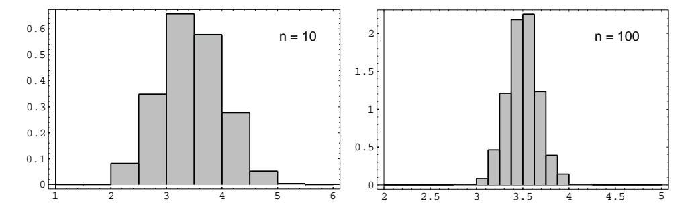

Figure 6.7: Empirical distribution of  $A_n$ .

The last equation in the above theorem implies that in an independent trials process, if the individual summands have finite variance, then the standard deviation of the average goes to 0 as  $n \to \infty$ . Since the standard deviation tells us something about the spread of the distribution around the mean, we see that for large values of n, the value of  $A_n$  is usually very close to the mean of  $A_n$ , which equals  $\mu$ , as shown above. This statement is made precise in Chapter 8, where it is called the Law of Large Numbers. For example, let X represent the roll of a fair die. In Figure 6.7, we show the distribution of a random variable  $A_n$  corresponding to X, for  $n = 10$  and  $n = 100$ .

**Example 6.18** Consider *n* rolls of a die. We have seen that, if  $X_j$  is the outcome if the jth roll, then  $E(X_j) = 7/2$  and  $V(X_j) = 35/12$ . Thus, if  $S_n$  is the sum of the outcomes, and  $A_n = S_n/n$  is the average of the outcomes, we have  $E(A_n) = 7/2$  and  $V(A_n) = (35/12)/n$ . Therefore, as *n* increases, the expected value of the average remains constant, but the variance tends to 0. If the variance is a measure of the expected deviation from the mean this would indicate that, for large  $n$ , we can expect the average to be very near the expected value. This is in fact the case, and we shall justify it in Chapter 8.  $\Box$ 

## **Bernoulli Trials**

Consider next the general Bernoulli trials process. As usual, we let  $X_j = 1$  if the *j*th outcome is a success and 0 if it is a failure. If  $p$  is the probability of a success, and  $q = 1 - p$ , then

$$
E(X_j) = 0q + 1p = p,
$$
  
\n
$$
E(X_j^2) = 0^2q + 1^2p = p,
$$

and

$$
V(X_j) = E(X_j^2) - (E(X_j))^2 = p - p^2 = pq.
$$

Thus, for Bernoulli trials, if  $S_n = X_1 + X_2 + \cdots + X_n$  is the number of successes, then  $E(S_n) = np$ ,  $V(S_n) = npq$ , and  $D(S_n) = \sqrt{npq}$ . If  $A_n = S_n/n$  is the average number of successes, then  $E(A_n) = p$ ,  $V(A_n) = pq/n$ , and  $D(A_n) = \sqrt{pq/n}$ . We see that the expected proportion of successes remains  $p$  and the variance tends to 0.

This suggests that the frequency interpretation of probability is a correct one. We shall make this more precise in Chapter 8.

**Example 6.19** Let T denote the number of trials until the first success in a Bernoulli trials process. Then  $T$  is geometrically distributed. What is the variance of  $T$ ? In Example 4.15, we saw that

$$
m_T = \begin{pmatrix} 1 & 2 & 3 & \cdots \\ p & qp & q^2p & \cdots \end{pmatrix}.
$$

In Example 6.4, we showed that

$$
E(T)=1/p.
$$

Thus,

$$
V(T) = E(T^2) - 1/p^2 ,
$$

so we need only find

$$
E(T^{2}) = 1p + 4qp + 9q^{2}p + \cdots
$$
  
=  $p(1 + 4q + 9q^{2} + \cdots).$ 

To evaluate this sum, we start again with

$$
1 + x + x^2 + \dots = \frac{1}{1 - x} \; .
$$

Differentiating, we obtain

$$
1 + 2x + 3x^2 + \cdots = \frac{1}{(1-x)^2} \; .
$$

Multiplying by  $x$ ,

$$
x + 2x^{2} + 3x^{3} + \dots = \frac{x}{(1 - x)^{2}}
$$

Differentiating again gives

$$
1 + 4x + 9x^2 + \dots = \frac{1+x}{(1-x)^3} \; .
$$

Thus.

$$
E(T^{2}) = p \frac{1+q}{(1-q)^{3}} = \frac{1+q}{p^{2}}
$$

and

$$
V(T) = E(T2) - (E(T))^{2}
$$
  
= 
$$
\frac{1+q}{p^{2}} - \frac{1}{p^{2}} = \frac{q}{p^{2}}.
$$

For example, the variance for the number of tosses of a coin until the first head turns up is  $(1/2)/(1/2)^2 = 2$ . The variance for the number of rolls of a die until the first six turns up is  $(5/6)/(1/6)^2 = 30$ . Note that, as p decreases, the variance increases rapidly. This corresponds to the increased spread of the geometric distribution as  $p$  decreases (noted in Figure 5.1).  $\Box$ 

## **Poisson Distribution**

Just as in the case of expected values, it is easy to guess the variance of the Poisson distribution with parameter  $\lambda$ . We recall that the variance of a binomial distribution with parameters n and p equals  $npq$ . We also recall that the Poisson distribution could be obtained as a limit of binomial distributions, if n goes to  $\infty$  and p goes to 0 in such a way that their product is kept fixed at the value  $\lambda$ . In this case,  $npq = \lambda q$  approaches  $\lambda$ , since q goes to 1. So, given a Poisson distribution with parameter  $\lambda$ , we should guess that its variance is  $\lambda$ . The reader is asked to show this in Exercise 29.

## **Exercises**

- 1 A number is chosen at random from the set  $S = \{-1,0,1\}$ . Let X be the number chosen. Find the expected value, variance, and standard deviation of  $X$ .
- 2 A random variable  $X$  has the distribution

$$
p_X = \left(\begin{array}{rrr} 0 & 1 & 2 & 4 \\ 1/3 & 1/3 & 1/6 & 1/6 \end{array}\right) .
$$

Find the expected value, variance, and standard deviation of  $X$ .

- 3 You place a 1-dollar bet on the number 17 at Las Vegas, and your friend places a 1-dollar bet on black (see Exercises 1.1.6 and 1.1.7). Let X be your winnings and Y be her winnings. Compare  $E(X)$ ,  $E(Y)$ , and  $V(X)$ ,  $V(Y)$ . What do these computations tell you about the nature of your winnings if you and your friend make a sequence of bets, with you betting each time on a number and your friend betting on a color?
- 4 X is a random variable with  $E(X) = 100$  and  $V(X) = 15$ . Find
  - (a)  $E(X^2)$ .
  - (b)  $E(3X + 10)$ .
  - (c)  $E(-X)$ .
  - (d)  $V(-X)$ .
  - (e)  $D(-X)$ .
- 5 In a certain manufacturing process, the (Fahrenheit) temperature never varies by more than  $2^{\circ}$  from  $62^{\circ}$ . The temperature is, in fact, a random variable F with distribution

$$
P_F = \begin{pmatrix} 60 & 61 & 62 & 63 & 64 \\ 1/10 & 2/10 & 4/10 & 2/10 & 1/10 \end{pmatrix}
$$

- (a) Find  $E(F)$  and  $V(F)$ .
- (b) Define  $T = F 62$ . Find  $E(T)$  and  $V(T)$ , and compare these answers with those in part  $(a)$ .

- (c) It is decided to report the temperature readings on a Celsius scale, that is,  $C = (5/9)(F - 32)$ . What is the expected value and variance for the readings now?
- 6 Write a computer program to calculate the mean and variance of a distribution which you specify as data. Use the program to compare the variances for the following densities, both having expected value 0:

$$
p_X = \begin{pmatrix} -2 & -1 & 0 & 1 & 2 \\ 3/11 & 2/11 & 1/11 & 2/11 & 3/11 \end{pmatrix} ;
$$
$$
p_Y = \begin{pmatrix} -2 & -1 & 0 & 1 & 2 \\ 1/11 & 2/11 & 5/11 & 2/11 & 1/11 \end{pmatrix} .
$$

- **7** A coin is tossed three times. Let  $X$  be the number of heads that turn up. Find  $V(X)$  and  $D(X)$ .
- 8 A random sample of 2400 people are asked if they favor a government proposal to develop new nuclear power plants. If 40 percent of the people in the country are in favor of this proposal, find the expected value and the standard deviation for the number  $S_{2400}$  of people in the sample who favored the proposal.
- **9** A die is loaded so that the probability of a face coming up is proportional to the number on that face. The die is rolled with outcome X. Find  $V(X)$  and  $D(X)$ .
- 10 Prove the following facts about the standard deviation.
  - (a)  $D(X + c) = D(X)$ .
  - (b)  $D(cX) = |c|D(X)$ .
- 11 A number is chosen at random from the integers 1, 2, 3,  $\dots$ , Let X be the number chosen. Show that  $E(X) = (n+1)/2$  and  $V(X) = (n-1)(n+1)/12$ . *Hint*: The following identity may be useful:

$$
1^{2} + 2^{2} + \dots + n^{2} = \frac{(n)(n+1)(2n+1)}{6}
$$

- 12 Let X be a random variable with  $\mu = E(X)$  and  $\sigma^2 = V(X)$ . Define  $X^* =$  $(X-\mu)/\sigma$ . The random variable  $X^*$  is called the *standardized random variable* associated with  $X$ . Show that this standardized random variable has expected value 0 and variance 1.
- 13 Peter and Paul play Heads or Tails (see Example 1.4). Let  $W_n$  be Peter's winnings after *n* matches. Show that  $E(W_n) = 0$  and  $V(W_n) = n$ .
- 14 Find the expected value and the variance for the number of boys and the number of girls in a royal family that has children until there is a boy or until there are three children, whichever comes first.