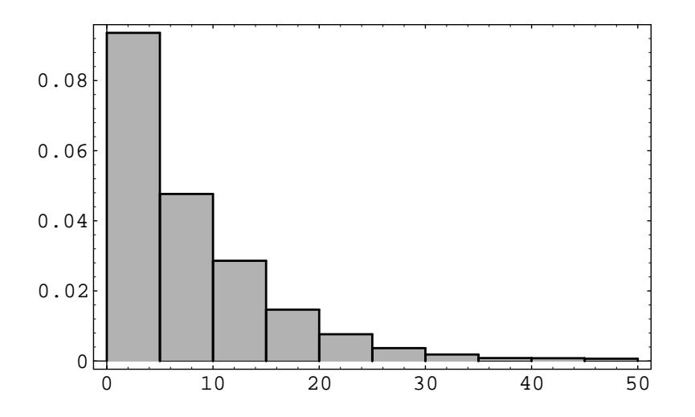
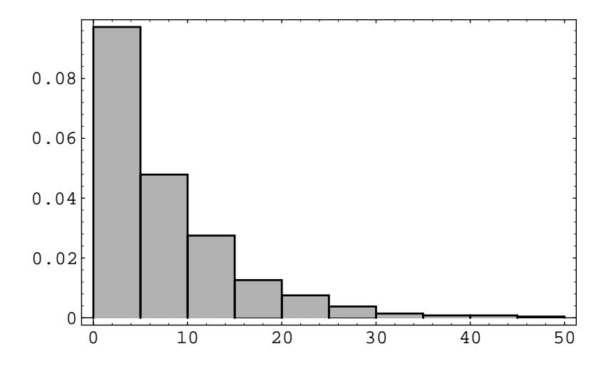

Figure 6.8: Distribution of queue lengths.

We note that the distribution appears to be a geometric distribution. In the study of queueing theory it is shown that the distribution for the queue length in equilibrium is indeed a geometric distribution with

$$
s_j = (1 - \rho)\rho^j
$$
 for  $j = 0, 1, 2, ...$ ,

if  $\rho < 1$ . The expected value of a random variable with this distribution is

$$
N=\frac{\rho}{(1-\rho)}
$$

(see Example 6.4). Thus by Little's result the expected waiting time is

$$
T = \frac{\rho}{\lambda(1-\rho)} = \frac{1}{\mu - \lambda} ,
$$

where  $\mu$  is the service rate,  $\lambda$  the arrival rate, and  $\rho$  the traffic intensity.

In our simulation, the arrival rate is 1 and the service rate is 1.1. Thus, the traffic intensity is  $1/1.1 = 10/11$ , the expected queue size is

$$
\frac{10/11}{(1-10/11)} = 10
$$

and the expected waiting time is

$$
\frac{1}{1.1 - 1} = 10 \; .
$$

In our simulation the average queue size was 8.19 and the average waiting time was 7.37. In Figure 6.9, we show the histogram for the waiting times. This histogram suggests that the density for the waiting times is exponential with parameter  $\mu - \lambda$ ,  $\Box$ and this is the case.

Figure 6.9: Distribution of queue waiting times.

## **Exercises**

- 1 Let X be a random variable with range  $[-1,1]$  and let  $f_X(x)$  be the density function of X. Find  $\mu(X)$  and  $\sigma^2(X)$  if, for  $|x| < 1$ ,
  - (a)  $f_X(x) = 1/2$ .
  - (b)  $f_X(x) = |x|$ .
  - (c)  $f_X(x) = 1 |x|$ .
  - (d)  $f_X(x) = (3/2)x^2$ .
- 2 Let X be a random variable with range  $[-1,1]$  and  $f_X$  its density function. Find  $\mu(X)$  and  $\sigma^2(X)$  if, for  $|x| > 1$ ,  $f_X(x) = 0$ , and for  $|x| < 1$ ,
  - (a)  $f_X(x) = (3/4)(1 x^2)$ .
  - (b)  $f_X(x) = (\pi/4) \cos(\pi x/2)$ .
  - (c)  $f_X(x) = (x+1)/2$ .
  - (d)  $f_X(x) = (3/8)(x+1)^2$ .
- 3 The lifetime, measure in hours, of the ACME super light bulb is a random variable T with density function  $f_T(t) = \lambda^2 t e^{-\lambda t}$ , where  $\lambda = .05$ . What is the expected lifetime of this light bulb? What is its variance?
- 4 Let X be a random variable with range  $[-1, 1]$  and density function  $f_X(x) =$  $ax + b$  if  $|x| < 1$ .
  - (a) Show that if  $\int_{-1}^{+1} f_X(x) dx = 1$ , then  $b = 1/2$ .
  - (b) Show that if  $f_X(x) \geq 0$ , then  $-1/2 \leq a \leq 1/2$ .
  - (c) Show that  $\mu = (2/3)a$ , and hence that  $-1/3 \leq \mu \leq 1/3$ .

## 6.3. CONTINUOUS RANDOM VARIABLES

(d) Show that  $\sigma^2(X) = (2/3)b - (4/9)a^2 = 1/3 - (4/9)a^2$ .

- 5 Let X be a random variable with range  $[-1,1]$  and density function  $f_X(x) =$  $ax^2 + bx + c$  if  $|x| < 1$  and 0 otherwise.
  - (a) Show that  $2a/3 + 2c = 1$  (see Exercise 4).
  - (b) Show that  $2b/3 = \mu(X)$ .
  - (c) Show that  $2a/5 + 2c/3 = \sigma^2(X)$ .
  - (d) Find a, b, and c if  $\mu(X) = 0$ ,  $\sigma^2(X) = 1/15$ , and sketch the graph of  $f_X$ .
  - (e) Find a, b, and c if  $\mu(X) = 0$ ,  $\sigma^2(X) = 1/2$ , and sketch the graph of  $f_X$ .
- 6 Let T be a random variable with range  $[0,\infty]$  and  $f_T$  its density function. Find  $\mu(T)$  and  $\sigma^2(T)$  if, for  $t < 0$ ,  $f_T(t) = 0$ , and for  $t > 0$ ,
  - (a)  $f_T(t) = 3e^{-3t}$ .
  - (b)  $f_T(t) = 9te^{-3t}$ .
  - (c)  $f_T(t) = 3/(1+t)^4$ .
- 7 Let X be a random variable with density function  $f_X$ . Show, using elementary calculus, that the function

$$
\phi(a) = E((X - a)^2)
$$

takes its minimum value when  $a = \mu(X)$ , and in that case  $\phi(a) = \sigma^2(X)$ .

- 8 Let X be a random variable with mean  $\mu$  and variance  $\sigma^2$ . Let  $Y = aX^2 +$  $bX + c$ . Find the expected value of Y.
- **9** Let X, Y, and Z be independent random variables, each with mean  $\mu$  and variance  $\sigma^2$ .
  - (a) Find the expected value and variance of  $S = X + Y + Z$ .
  - (b) Find the expected value and variance of  $A = (1/3)(X + Y + Z)$ .
  - (c) Find the expected value of  $S^2$  and  $A^2$ .
- 10 Let  $X$  and  $Y$  be independent random variables with uniform density functions on  $[0,1]$ . Find
  - (a)  $E(|X Y|)$ .
  - (b)  $E(\max(X, Y)).$
  - (c)  $E(\min(X, Y)).$
  - (d)  $E(X^2+Y^2)$ .
  - (e)  $E((X+Y)^2)$ .

- 11 The Pilsdorff Beer Company runs a fleet of trucks along the 100 mile road from Hangtown to Dry Gulch. The trucks are old, and are apt to break down at any point along the road with equal probability. Where should the company locate a garage so as to minimize the expected distance from a typical breakdown to the garage? In other words, if  $X$  is a random variable giving the location of the breakdown, measured, say, from Hangtown, and b gives the location of the garage, what choice of b minimizes  $E(|X-b|)$ ? Now suppose X is not distributed uniformly over  $[0, 100]$ , but instead has density function  $f_X(x) = 2x/10,000$ . Then what choice of b minimizes  $E(|X - b|)$ ?
- 12 Find  $E(XY)$ , where X and Y are independent random variables which are uniform on  $[0,1]$ . Then verify your answer by simulation.
- 13 Let  $X$  be a random variable that takes on nonnegative values and has distribution function  $F(x)$ . Show that

$$
E(X) = \int_0^\infty (1 - F(x)) \, dx
$$

*Hint*: Integrate by parts.

Illustrate this result by calculating  $E(X)$  by this method if X has an exponential distribution  $F(x) = 1 - e^{-\lambda x}$  for  $x \ge 0$ , and  $F(x) = 0$  otherwise.

14 Let X be a continuous random variable with density function  $f_X(x)$ . Show that if

$$
\int_{-\infty}^{+\infty} x^2 f_X(x) dx < \infty ,
$$

then

$$
\int_{-\infty}^{+\infty} |x| f_X(x) \, dx < \infty \; .
$$

*Hint*: Except on the interval  $[-1, 1]$ , the first integrand is greater than the second integrand.

- 15 Let X be a random variable distributed uniformly over  $[0, 20]$ . Define a new random variable Y by  $Y = |X|$  (the greatest integer in X). Find the expected value of Y. Do the same for  $Z = |X + .5|$ . Compute  $E(|X - Y|)$  and  $E(|X - Z|)$ . (Note that Y is the value of X rounded off to the nearest smallest integer, while  $Z$  is the value of  $X$  rounded off to the nearest integer. Which method of rounding off is better? Why?)
- 16 Assume that the lifetime of a diesel engine part is a random variable X with density  $f_X$ . When the part wears out, it is replaced by another with the same density. Let  $N(t)$  be the number of parts that are used in time t. We want to study the random variable  $N(t)/t$ . Since parts are replaced on the average every  $E(X)$  time units, we expect about  $t/E(X)$  parts to be used in time t. That is, we expect that

$$
\lim_{t \to \infty} E\left(\frac{N(t)}{t}\right) = \frac{1}{E(X)}.
$$

280