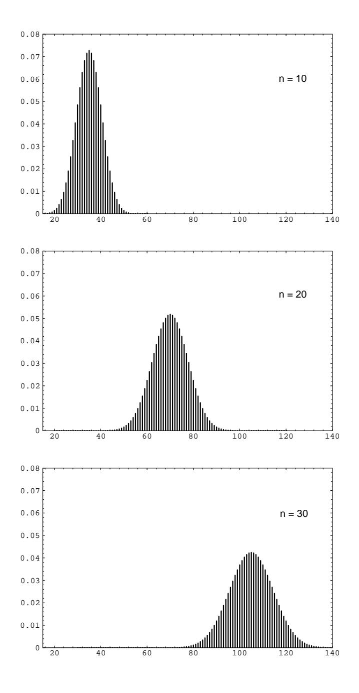

## Chapter 7

## **Sums of Independent Random Variables**

## **Sums of Discrete Random Variables** $7.1$

In this chapter we turn to the important question of determining the distribution of a sum of independent random variables in terms of the distributions of the individual constituents. In this section we consider only sums of discrete random variables, reserving the case of continuous random variables for the next section.

We consider here only random variables whose values are integers. Their distribution functions are then defined on these integers. We shall find it convenient to assume here that these distribution functions are defined for all integers, by defining them to be 0 where they are not otherwise defined.

## Convolutions

Suppose  $X$  and  $Y$  are two independent discrete random variables with distribution functions  $m_1(x)$  and  $m_2(x)$ . Let  $Z = X + Y$ . We would like to determine the distribution function  $m_3(x)$  of Z. To do this, it is enough to determine the probability that Z takes on the value z, where z is an arbitrary integer. Suppose that  $X = k$ , where k is some integer. Then  $Z = z$  if and only if  $Y = z - k$ . So the event  $Z = z$ is the union of the pairwise disjoint events

$$
(X = k)
$$
 and  $(Y = z - k)$ 

where  $k$  runs over the integers. Since these events are pairwise disjoint, we have

$$
P(Z = z) = \sum_{k=-\infty}^{\infty} P(X = k) \cdot P(Y = z - k) .
$$

Thus, we have found the distribution function of the random variable Z. This leads to the following definition.

**Definition 7.1** Let  $X$  and  $Y$  be two independent integer-valued random variables, with distribution functions  $m_1(x)$  and  $m_2(x)$  respectively. Then the *convolution* of  $m_1(x)$  and  $m_2(x)$  is the distribution function  $m_3 = m_1 * m_2$  given by

$$
m_3(j) = \sum_k m_1(k) \cdot m_2(j-k) ,
$$

for  $j = \ldots, -2, -1, 0, 1, 2, \ldots$  The function  $m_3(x)$  is the distribution function of the random variable  $Z = X + Y$ .  $\Box$ 

It is easy to see that the convolution operation is commutative, and it is straightforward to show that it is also associative.

Now let  $S_n = X_1 + X_2 + \cdots + X_n$  be the sum of *n* independent random variables of an independent trials process with common distribution function  $m$  defined on the integers. Then the distribution function of  $S_1$  is m. We can write

$$
S_n = S_{n-1} + X_n
$$

Thus, since we know the distribution function of  $X_n$  is m, we can find the distribution function of  $S_n$  by induction.

**Example 7.1** A die is rolled twice. Let  $X_1$  and  $X_2$  be the outcomes, and let  $S_2 = X_1 + X_2$  be the sum of these outcomes. Then  $X_1$  and  $X_2$  have the common distribution function:

$$
m = \begin{pmatrix} 1 & 2 & 3 & 4 & 5 & 6 \\ 1/6 & 1/6 & 1/6 & 1/6 & 1/6 & 1/6 \end{pmatrix}.
$$

The distribution function of  $S_2$  is then the convolution of this distribution with itself. Thus,

$$
P(S_2 = 2) = m(1)m(1)
$$
  
=  $\frac{1}{6} \cdot \frac{1}{6} = \frac{1}{36}$ ,  
$$
P(S_2 = 3) = m(1)m(2) + m(2)m(1)
$$
  
=  $\frac{1}{6} \cdot \frac{1}{6} + \frac{1}{6} \cdot \frac{1}{6} = \frac{2}{36}$ ,  
$$
P(S_2 = 4) = m(1)m(3) + m(2)m(2) + m(3)m(1)
$$
  
=  $\frac{1}{6} \cdot \frac{1}{6} + \frac{1}{6} \cdot \frac{1}{6} + \frac{1}{6} \cdot \frac{1}{6} = \frac{3}{36}$ .

Continuing in this way we would find  $P(S_2 = 5) = 4/36$ ,  $P(S_2 = 6) = 5/36$ ,  $P(S_2 = 7) = 6/36, P(S_2 = 8) = 5/36, P(S_2 = 9) = 4/36, P(S_2 = 10) = 3/36,$  $P(S_2 = 11) = 2/36$ , and  $P(S_2 = 12) = 1/36$ .

The distribution for  $S_3$  would then be the convolution of the distribution for  $S_2$ with the distribution for  $X_3$ . Thus

$$
P(S_3 = 3) = P(S_2 = 2)P(X_3 = 1)
$$

$$
= \frac{1}{36} \cdot \frac{1}{6} = \frac{1}{216} ,
$$
  
\n
$$
P(S_3 = 4) = P(S_2 = 3)P(X_3 = 1) + P(S_2 = 2)P(X_3 = 2)
$$
  
\n
$$
= \frac{2}{36} \cdot \frac{1}{6} + \frac{1}{36} \cdot \frac{1}{6} = \frac{3}{216} ,
$$

and so forth.

This is clearly a tedious job, and a program should be written to carry out this calculation. To do this we first write a program to form the convolution of two densities  $p$  and  $q$  and return the density  $r$ . We can then write a program to find the density for the sum  $S_n$  of n independent random variables with a common density  $p$ , at least in the case that the random variables have a finite number of possible values.

Running this program for the example of rolling a die *n* times for  $n = 10, 20, 30$ results in the distributions shown in Figure 7.1. We see that, as in the case of Bernoulli trials, the distributions become bell-shaped. We shall discuss in Chapter 9 a very general theorem called the *Central Limit Theorem* that will explain this phenomenon.  $\Box$ 

**Example 7.2** A well-known method for evaluating a bridge hand is: an ace is assigned a value of 4, a king 3, a queen 2, and a jack 1. All other cards are assigned a value of 0. The *point count* of the hand is then the sum of the values of the cards in the hand. (It is actually more complicated than this, taking into account voids in suits, and so forth, but we consider here this simplified form of the point count.) If a card is dealt at random to a player, then the point count for this card has distribution

$$
p_X = \begin{pmatrix} 0 & 1 & 2 & 3 & 4 \\ 36/52 & 4/52 & 4/52 & 4/52 & 4/52 \end{pmatrix}
$$

Let us regard the total hand of 13 cards as 13 independent trials with this common distribution. (Again this is not quite correct because we assume here that we are always choosing a card from a full deck.) Then the distribution for the point count  $C$  for the hand can be found from the program  $NFoldConvolution$  by using the distribution for a single card and choosing  $n = 13$ . A player with a point count of 13 or more is said to have an *opening bid*. The probability of having an opening bid is then

$$
P(C \geq 13)
$$

Since we have the distribution of  $C$ , it is easy to compute this probability. Doing this we find that

$$
P(C \ge 13) = .2845,
$$

so that about one in four hands should be an opening bid according to this simplified model. A more realistic discussion of this problem can be found in Epstein, The Theory of Gambling and Statistical Logic.1  $\Box$ 

&lt;sup>1R. A. Epstein, *The Theory of Gambling and Statistical Logic*, rev. ed. (New York: Academic Press, 1977).

Figure 7.1: Density of  $S_n$  for rolling a die *n* times.