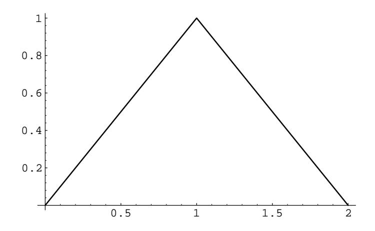
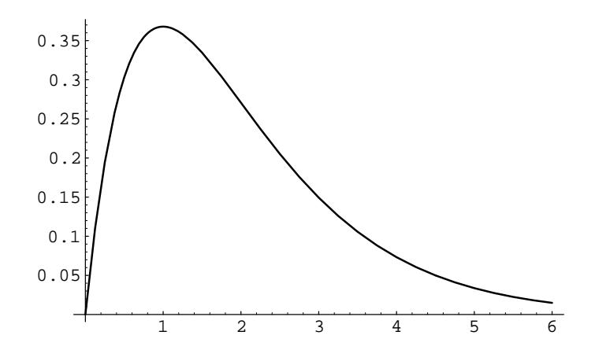

Figure 7.2: Convolution of two uniform densities.

Figure 7.3: Convolution of two exponential densities with  $\lambda = 1$ .

and so, if  $z > 0$ ,

$$
f_Z(z) = \int_{-\infty}^{+\infty} f_X(z - y) f_Y(y) dy
$$
  
= 
$$
\int_0^z \lambda e^{-\lambda(z-y)} \lambda e^{-\lambda y} dy
$$
  
= 
$$
\int_0^z \lambda^2 e^{-\lambda z} dy
$$
  
= 
$$
\lambda^2 z e^{-\lambda z},
$$

while if  $z < 0$ ,  $f_Z(z) = 0$  (see Figure 7.3). Hence,

$$
f_Z(z) = \begin{cases} \lambda^2 z e^{-\lambda z}, & \text{if } z \ge 0, \\ 0, & \text{otherwise.} \end{cases}
$$

## Sum of Two Independent Normal Random Variables

**Example 7.5** It is an interesting and important fact that the convolution of two normal densities with means  $\mu_1$  and  $\mu_2$  and variances  $\sigma_1$  and  $\sigma_2$  is again a normal density, with mean  $\mu_1 + \mu_2$  and variance  $\sigma_1^2 + \sigma_2^2$ . We will show this in the special case that both random variables are standard normal. The general case can be done in the same way, but the calculation is messier. Another way to show the general result is given in Example 10.17.

Suppose  $X$  and  $Y$  are two independent random variables, each with the standard normal density (see Example 5.8). We have

$$
f_X(x) = f_Y(y) = \frac{1}{\sqrt{2\pi}} e^{-x^2/2}
$$
,

and so

$$
f_Z(z) = f_X * f_Y(z)
$$
  
=  $\frac{1}{2\pi} \int_{-\infty}^{+\infty} e^{-(z-y)^2/2} e^{-y^2/2} dy$   
=  $\frac{1}{2\pi} e^{-z^2/4} \int_{-\infty}^{+\infty} e^{-(y-z/2)^2} dy$   
=  $\frac{1}{2\pi} e^{-z^2/4} \sqrt{\pi} \left[ \frac{1}{\sqrt{\pi}} \int_{-\infty}^{\infty} e^{-(y-z/2)^2} dy \right]$ 

The expression in the brackets equals 1, since it is the integral of the normal density function with  $\mu = 0$  and  $\sigma = \sqrt{2}$ . So, we have

$$
f_Z(z) = \frac{1}{\sqrt{4\pi}} e^{-z^2/4} .
$$

 $\Box$ 

## Sum of Two Independent Cauchy Random Variables

**Example 7.6** Choose two numbers at random from the interval  $(-\infty, +\infty)$  with the Cauchy density with parameter  $a = 1$  (see Example 5.10). Then

$$
f_X(x) = f_Y(x) = \frac{1}{\pi(1+x^2)},
$$

and  $Z = X + Y$  has density

$$
f_Z(z) = \frac{1}{\pi^2} \int_{-\infty}^{+\infty} \frac{1}{1 + (z - y)^2} \frac{1}{1 + y^2} \, dy
$$

This integral requires some effort, and we give here only the result (see Section 10.3, or  $Dwass3$ :

$$
f_Z(z) = \frac{2}{\pi(4 + z^2)} \; .
$$

Now, suppose that we ask for the density function of the *average* 

$$
A = (1/2)(X + Y)
$$

of X and Y. Then  $A = (1/2)Z$ . Exercise 5.2.19 shows that if U and V are two continuous random variables with density functions  $f_U(x)$  and  $f_V(x)$ , respectively, and if  $V = aU$ , then

$$
f_V(x) = \left(\frac{1}{a}\right) f_U\left(\frac{x}{a}\right).
$$

Thus, we have

$$
f_A(z) = 2f_Z(2z) = \frac{1}{\pi(1+z^2)}.
$$

Hence, the density function for the average of two random variables, each having a Cauchy density, is again a random variable with a Cauchy density; this remarkable property is a peculiarity of the Cauchy density. One consequence of this is if the error in a certain measurement process had a Cauchy density and you averaged a number of measurements, the average could not be expected to be any more accurate than any one of your individual measurements!  $\Box$ 

## **Rayleigh Density**

**Example 7.7** Suppose  $X$  and  $Y$  are two independent standard normal random variables. Now suppose we locate a point P in the xy-plane with coordinates  $(X, Y)$ and ask: What is the density of the square of the distance of  $P$  from the origin? (We have already simulated this problem in Example 5.9.) Here, with the preceding notation, we have

$$
f_X(x) = f_Y(x) = \frac{1}{\sqrt{2\pi}}e^{-x^2/2}
$$

Moreover, if  $X^2$  denotes the square of X, then (see Theorem 5.1 and the discussion following)

$$
f_{X^2}(r) = \begin{cases} \frac{1}{2\sqrt{r}}(f_X(\sqrt{r}) + f_X(-\sqrt{r})) & \text{if } r > 0, \\ 0 & \text{otherwise} \end{cases}
$$
  
= 
$$
\begin{cases} \frac{1}{\sqrt{2\pi r}}(e^{-r/2}) & \text{if } r > 0, \\ 0 & \text{otherwise.} \end{cases}
$$

 ${}^{3}$ M. Dwass, "On the Convolution of Cauchy Distributions," American Mathematical Monthly, vol. 92, no. 1, (1985), pp. 55–57; see also R. Nelson, letters to the Editor, ibid., p. 679.

This is a gamma density with  $\lambda = 1/2$ ,  $\beta = 1/2$  (see Example 7.4). Now let  $R^2 = X^2 + Y^2$ . Then

$$
f_{R^2}(r) = \int_{-\infty}^{+\infty} f_{X^2}(r-s) f_{Y^2}(s) ds
$$
  
=  $\frac{1}{4\pi} \int_{-\infty}^{+\infty} e^{-(r-s)/2} \frac{r-s}{2} e^{-s} \frac{s^{-1/2}}{2} ds$   
=  $\begin{cases} \frac{1}{2} e^{-r^2/2}, & \text{if } r \ge 0, \\ 0, & \text{otherwise.} \end{cases}$ 

Hence,  $R^2$  has a gamma density with  $\lambda = 1/2$ ,  $\beta = 1$ . We can interpret this result as giving the density for the square of the distance of  $P$  from the center of a target if its coordinates are normally distributed.

The density of the random variable R is obtained from that of  $R^2$  in the usual way (see Theorem  $5.1$ ), and we find

$$
f_R(r) = \begin{cases} \frac{1}{2}e^{-r^2/2} \cdot 2r = re^{-r^2/2}, & \text{if } r \ge 0, \\ 0, & \text{otherwise.} \end{cases}
$$

Physicists will recognize this as a Rayleigh density. Our result here agrees with our simulation in Example 5.9.  $\Box$ 

## **Chi-Squared Density**

More generally, the same method shows that the sum of the squares of  $n$  independent normally distributed random variables with mean 0 and standard deviation 1 has a gamma density with  $\lambda = 1/2$  and  $\beta = n/2$ . Such a density is called a *chi-squared density* with *n* degrees of freedom. This density was introduced in Chapter 4.3. In Example 5.10, we used this density to test the hypothesis that two traits were independent.

Another important use of the chi-squared density is in comparing experimental data with a theoretical discrete distribution, to see whether the data supports the theoretical model. More specifically, suppose that we have an experiment with a finite set of outcomes. If the set of outcomes is countable, we group them into finitely many sets of outcomes. We propose a theoretical distribution which we think will model the experiment well. We obtain some data by repeating the experiment a number of times. Now we wish to check how well the theoretical distribution fits the data.

Let  $X$  be the random variable which represents a theoretical outcome in the model of the experiment, and let  $m(x)$  be the distribution function of X. In a manner similar to what was done in Example 5.10, we calculate the value of the expression

$$
V = \sum_{x} \frac{(o_x - n \cdot m(x))^2}{n \cdot m(x)}
$$

where the sum runs over all possible outcomes  $x, n$  is the number of data points, and  $o_x$  denotes the number of outcomes of type x observed in the data. Then