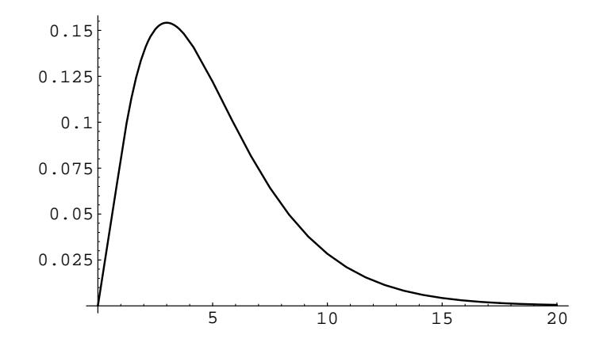
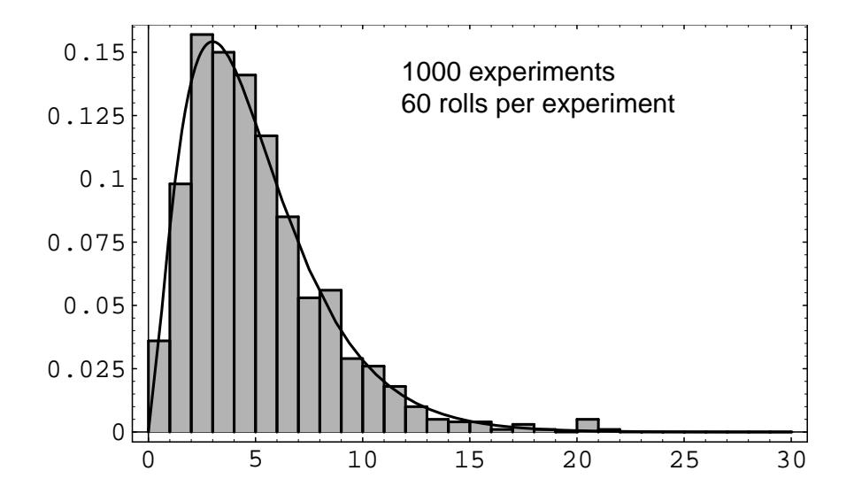
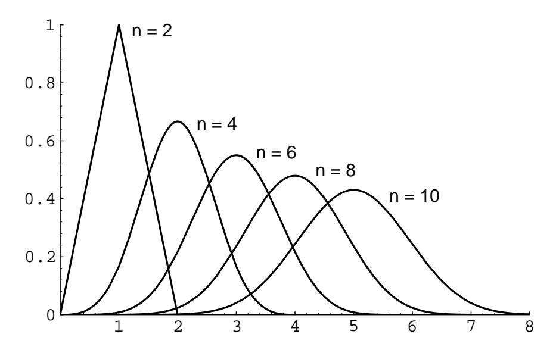
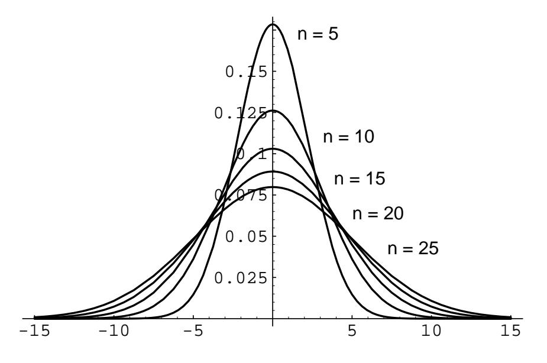

| Outcome | Observed Frequency |
|---------|--------------------|
|         | 15                 |
|         |                    |
|         |                    |
|         |                    |
|         |                    |
|         |                    |

Table 7.1: Observed data.

for moderate or large values of n, the quantity V is approximately chi-squared distributed, with  $\nu-1$  degrees of freedom, where  $\nu$  represents the number of possible outcomes. The proof of this is beyond the scope of this book, but we will illustrate the reasonableness of this statement in the next example. If the value of  $V$  is very large, when compared with the appropriate chi-squared density function, then we would tend to reject the hypothesis that the model is an appropriate one for the experiment at hand. We now give an example of this procedure.

**Example 7.8** Suppose we are given a single die. We wish to test the hypothesis that the die is fair. Thus, our theoretical distribution is the uniform distribution on the integers between 1 and 6. So, if we roll the die  $n$  times, the expected number of data points of each type is  $n/6$ . Thus, if  $o_i$  denotes the actual number of data points of type i, for  $1 \le i \le 6$ , then the expression

$$
V = \sum_{i=1}^{6} \frac{(o_i - n/6)^2}{n/6}
$$

is approximately chi-squared distributed with 5 degrees of freedom.

Now suppose that we actually roll the die 60 times and obtain the data in Table 7.1. If we calculate  $V$  for this data, we obtain the value 13.6. The graph of the chi-squared density with 5 degrees of freedom is shown in Figure 7.4. One sees that values as large as  $13.6$  are rarely taken on by V if the die is fair, so we would reject the hypothesis that the die is fair. (When using this test, a statistician will reject the hypothesis if the data gives a value of  $V$  which is larger than 95% of the values one would expect to obtain if the hypothesis is true.)

In Figure 7.5, we show the results of rolling a die 60 times, then calculating  $V$ , and then repeating this experiment 1000 times. The program that performs these calculations is called **DieTest**. We have superimposed the chi-squared density with 5 degrees of freedom; one can see that the data values fit the curve fairly well, which supports the statement that the chi-squared density is the correct one to use.  $\Box$ 

So far we have looked at several important special cases for which the convolution integral can be evaluated explicitly. In general, the convolution of two continuous densities cannot be evaluated explicitly, and we must resort to numerical methods. Fortunately, these prove to be remarkably effective, at least for bounded densities.

Figure 7.4: Chi-squared density with 5 degrees of freedom.

Figure 7.5: Rolling a fair die.  $\,$ 

Figure 7.6: Convolution of  $n$  uniform densities.

## **Independent Trials**

We now consider briefly the distribution of the sum of  $n$  independent random variables, all having the same density function. If  $X_1, X_2, \ldots, X_n$  are these random variables and  $S_n = X_1 + X_2 + \cdots + X_n$  is their sum, then we will have

$$
f_{S_n}(x) = (f_{X_1} * f_{X_2} * \cdots * f_{X_n})(x) ,
$$

where the right-hand side is an  $n$ -fold convolution. It is possible to calculate this density for general values of  $n$  in certain simple cases.

**Example 7.9** Suppose the  $X_i$  are uniformly distributed on the interval [0, 1]. Then

$$
f_{X_i}(x) = \begin{cases} 1, & \text{if } 0 \le x \le 1, \\ 0, & \text{otherwise,} \end{cases}
$$

and  $f_{S_n}(x)$  is given by the formula4

$$
f_{S_n}(x) = \begin{cases} \frac{1}{(n-1)!} \sum_{0 \le j \le x} (-1)^j \binom{n}{j} (x-j)^{n-1}, & \text{if } 0 < x < n, \\ 0, & \text{otherwise.} \end{cases}
$$

The density  $f_{S_n}(x)$  for  $n = 2, 4, 6, 8, 10$  is shown in Figure 7.6.

If the  $X_i$  are distributed normally, with mean 0 and variance 1, then (cf. Example  $7.5)$ 

$$
f_{X_i}(x) = \frac{1}{\sqrt{2\pi}} e^{-x^2/2} ,
$$

&lt;sup>4 J. B. Uspensky, *Introduction to Mathematical Probability* (New York: McGraw-Hill, 1937), p. 277.

Figure 7.7: Convolution of  $n$  standard normal densities.

and

$$
f_{S_n}(x) = \frac{1}{\sqrt{2\pi n}} e^{-x^2/2n} .
$$

Here the density  $f_{S_n}$  for  $n = 5, 10, 15, 20, 25$  is shown in Figure 7.7.

If the  $X_i$  are all exponentially distributed, with mean  $1/\lambda$ , then

$$
f_{X_i}(x) = \lambda e^{-\lambda x}
$$

and

$$
f_{S_n}(x) = \frac{\lambda e^{-\lambda x} (\lambda x)^{n-1}}{(n-1)!}.
$$

In this case the density  $f_{S_n}$  for  $n = 2, 4, 6, 8, 10$  is shown in Figure 7.8.

 $\Box$ 

## **Exercises**

- 1 Let  $X$  and  $Y$  be independent real-valued random variables with density functions  $f_X(x)$  and  $f_Y(y)$ , respectively. Show that the density function of the sum  $X + Y$  is the convolution of the functions  $f_X(x)$  and  $f_Y(y)$ . Hint: Let  $\bar{X}$ be the joint random variable  $(X, Y)$ . Then the joint density function of X is  $f_X(x) f_Y(y)$ , since X and Y are independent. Now compute the probability that  $X + Y \leq z$ , by integrating the joint density function over the appropriate region in the plane. This gives the cumulative distribution function of  $Z$ . Now differentiate this function with respect to  $z$  to obtain the density function of  $\overline{z}$ .
- **2** Let X and Y be independent random variables defined on the space  $\Omega$ , with density functions  $f_X$  and  $f_Y$ , respectively. Suppose that  $Z = X + Y$ . Find the density  $f_Z$  of Z if