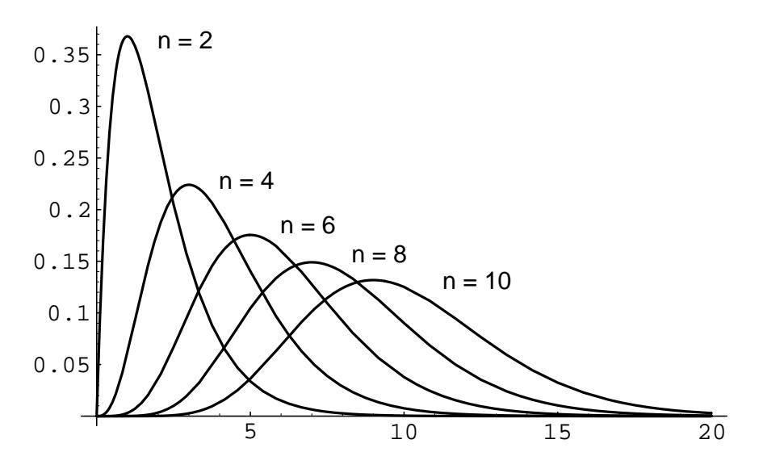

Figure 7.8: Convolution of *n* exponential densities with  $\lambda = 1$ .

 $f_X(x) = f_Y(x) = \begin{cases} 1/2, & \text{if } -1 \le x \le +1, \\ 0, & \text{otherwise.} \end{cases}$ 

 $(b)$ 

 $(a)$ 

$$
f_X(x) = f_Y(x) = \begin{cases} 1/2, & \text{if } 3 \le x \le 5, \\ 0, & \text{otherwise.} \end{cases}
$$

 $(c)$ 

$$
f_X(x) = \begin{cases} 1/2, & \text{if } -1 \le x \le 1, \\ 0, & \text{otherwise.} \end{cases}
$$

$$
f_Y(x) = \begin{cases} 1/2, & \text{if } 3 \le x \le 5, \\ 0, & \text{otherwise.} \end{cases}
$$

(d) What can you say about the set  $E=\{\,z: f_Z(z)>0\,\}$  in each case? 3 Suppose again that  $Z = X + Y$ . Find  $f_Z$  if

$$
\left( \mathrm{a}\right)
$$

$$
f_X(x) = f_Y(x) = \begin{cases} x/2, & \text{if } 0 < x < 2, \\ 0, & \text{otherwise.} \end{cases}
$$

 $(b)$ 

$$
f_X(x) = f_Y(x) = \begin{cases} (1/2)(x-3), & \text{if } 3 < x < 5, \\ 0, & \text{otherwise.} \end{cases}
$$

 $(c)$ 

$$
f_X(x) = \begin{cases} 1/2, & \text{if } 0 < x < 2, \\ 0, & \text{otherwise,} \end{cases}
$$

$$
f_Y(x) = \begin{cases} x/2, & \text{if } 0 < x < 2 \\ 0, & \text{otherwise.} \end{cases}
$$

(d) What can you say about the set  $E = \{ z : f_Z(z) > 0 \}$  in each case?

4 Let  $X, Y$ , and  $Z$  be independent random variables with

$$
f_X(x) = f_Y(x) = f_Z(x) = \begin{cases} 1, & \text{if } 0 < x < 1, \\ 0, & \text{otherwise.} \end{cases}
$$

Suppose that  $W = X + Y + Z$ . Find  $f_W$  directly, and compare your answer with that given by the formula in Example 7.9.  $Hint:$  See Example 7.3.

5 Suppose that X and Y are independent and  $Z = X + Y$ . Find  $f_Z$  if

$$
(\mathrm{a})
$$

$$
f_X(x) = \begin{cases} \lambda e^{-\lambda x}, & \text{if } x > 0, \\ 0, & \text{otherwise.} \end{cases}
$$
$$
f_Y(x) = \begin{cases} \mu e^{-\mu x}, & \text{if } x > 0, \\ 0, & \text{otherwise.} \end{cases}
$$

(b)

$$
f_X(x) = \begin{cases} \lambda e^{-\lambda x}, & \text{if } x > 0, \\ 0, & \text{otherwise.} \end{cases}
$$

$$
f_Y(x) = \begin{cases} 1, & \text{if } 0 < x < 1, \\ 0, & \text{otherwise.} \end{cases}
$$

**6** Suppose again that  $Z = X + Y$ . Find  $f_Z$  if

$$
f_X(x) = \frac{1}{\sqrt{2\pi}\sigma_1} e^{-(x-\mu_1)^2/2\sigma_1^2}
$$
$$
f_Y(x) = \frac{1}{\sqrt{2\pi}\sigma_2} e^{-(x-\mu_2)^2/2\sigma_2^2}
$$

\*7 Suppose that  $R^2 = X^2 + Y^2$ . Find  $f_{R^2}$  and  $f_R$  if

$$
f_X(x) = \frac{1}{\sqrt{2\pi}\sigma_1} e^{-(x-\mu_1)^2/2\sigma_1^2}
$$
  
$$
f_Y(x) = \frac{1}{\sqrt{2\pi}\sigma_2} e^{-(x-\mu_2)^2/2\sigma_2^2}.
$$

8 Suppose that  $R^2 = X^2 + Y^2$ . Find  $f_{R^2}$  and  $f_R$  if

$$
f_X(x) = f_Y(x) = \begin{cases} 1/2, & \text{if } -1 \le x \le 1, \\ 0, & \text{otherwise.} \end{cases}
$$

9 Assume that the service time for a customer at a bank is exponentially distributed with mean service time  $2$  minutes. Let  $X$  be the total service time for 10 customers. Estimate the probability that  $X > 22$  minutes.

 $302\,$ 

## 7.2. SUMS OF CONTINUOUS RANDOM VARIABLES

- 10 Let  $X_1, X_2, \ldots, X_n$  be *n* independent random variables each of which has an exponential density with mean  $\mu$ . Let M be the minimum value of the  $X_i$ . Show that the density for M is exponential with mean  $\mu/n$ . Hint: Use cumulative distribution functions.
- 11 A company buys 100 lightbulbs, each of which has an exponential lifetime of 1000 hours. What is the expected time for the first of these bulbs to burn out? (See Exercise 10.)
- 12 An insurance company assumes that the time between claims from each of its homeowners' policies is exponentially distributed with mean  $\mu$ . It would like to estimate  $\mu$  by averaging the times for a number of policies, but this is not very practical since the time between claims is about 30 years. At Galambos55 suggestion the company puts its customers in groups of 50 and observes the time of the first claim within each group. Show that this provides a practical way to estimate the value of  $\mu$ .
- 13 Particles are subject to collisions that cause them to split into two parts with each part a fraction of the parent. Suppose that this fraction is uniformly distributed between 0 and 1. Following a single particle through several splittings we obtain a fraction of the original particle  $Z_n = X_1 \cdot X_2 \cdot \ldots \cdot X_n$  where each  $X_j$  is uniformly distributed between 0 and 1. Show that the density for the random variable  $Z_n$  is

$$
f_n(z) = \frac{1}{(n-1)!} (-\log z)^{n-1}.
$$

*Hint*: Show that  $Y_k = -\log X_k$  is exponentially distributed. Use this to find the density function for  $S_n = Y_1 + Y_2 + \cdots + Y_n$ , and from this the cumulative distribution and density of  $Z_n = e^{-S_n}$ .

14 Assume that  $X_1$  and  $X_2$  are independent random variables, each having an exponential density with parameter  $\lambda$ . Show that  $Z = X_1 - X_2$  has density

$$
f_Z(z) = (1/2)\lambda e^{-\lambda |z|}.
$$

15 Suppose we want to test a coin for fairness. We flip the coin  $n$  times and record the number of times  $X_0$  that the coin turns up tails and the number of times  $X_1 = n - X_0$  that the coin turns up heads. Now we set

$$
Z = \sum_{i=0}^{1} \frac{(X_i - n/2)^2}{n/2}
$$

Then for a fair coin  $Z$  has approximately a chi-squared distribution with  $2-1=1$  degree of freedom. Verify this by computer simulation first for a fair coin ( $p = 1/2$ ) and then for a biased coin ( $p = 1/3$ ).

&lt;sup>5J. Galambos, *Introductory Probability Theory* (New York: Marcel Dekker, 1984), p. 159.

- **16** Verify your answers in Exercise  $2(a)$  by computer simulation: Choose X and Y from  $[-1,1]$  with uniform density and calculate  $Z = X + Y$ . Repeat this experiment 500 times, recording the outcomes in a bar graph on  $[-2, 2]$  with 40 bars. Does the density  $f_Z$  calculated in Exercise 2(a) describe the shape of your bar graph? Try this for Exercises  $2(b)$  and Exercise  $2(c)$ , too.
- 17 Verify your answers to Exercise 3 by computer simulation.
- 18 Verify your answer to Exercise 4 by computer simulation.
- 19 The *support* of a function  $f(x)$  is defined to be the set

$$
\{x : f(x) > 0\}.
$$

Suppose that  $X$  and  $Y$  are two continuous random variables with density functions  $f_X(x)$  and  $f_Y(y)$ , respectively, and suppose that the supports of these density functions are the intervals [a, b] and [c, d], respectively. Find the support of the density function of the random variable  $X + Y$ .

- **20** Let  $X_1, X_2, \ldots, X_n$  be a sequence of independent random variables, all having a common density function  $f_X$  with support [a, b] (see Exercise 19). Let  $S_n = X_1 + X_2 + \cdots + X_n$ , with density function  $f_{S_n}$ . Show that the support of  $f_{S_n}$  is the interval [na, nb]. Hint: Write  $f_{S_n} = f_{S_{n-1}} * f_X$ . Now use Exercise 19 to establish the desired result by induction.
- 21 Let  $X_1, X_2, \ldots, X_n$  be a sequence of independent random variables, all having a common density function  $f_X$ . Let  $A = S_n/n$  be their average. Find  $f_A$  if
  - (a)  $f_X(x) = (1/\sqrt{2\pi})e^{-x^2/2}$  (normal density).
  - (b)  $f_X(x) = e^{-x}$  (exponential density). *Hint*: Write  $f_A(x)$  in terms of  $f_{S_n}(x)$ .

304