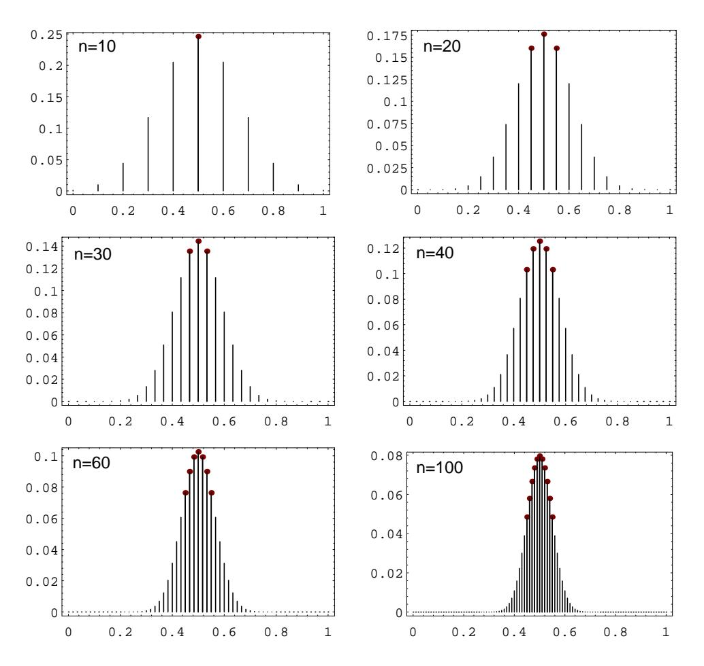

Figure 8.1: Bernoulli trials distributions.

**Example 8.3** Let  $X_1, X_2, \ldots, X_n$  be a Bernoulli trials process with probability .3 for success and .7 for failure. Let  $X_j = 1$  if the jth outcome is a success and 0 otherwise. Then,  $E(X_j) = .3$  and  $V(X_j) = (.3)(.7) = .21$ . If

$$
A_n = \frac{S_n}{n} = \frac{X_1 + X_2 + \dots + X_n}{n}
$$

is the *average* of the  $X_i$ , then  $E(A_n) = .3$  and  $V(A_n) = V(S_n)/n^2 = .21/n$ . Chebyshev's Inequality states that if, for example,  $\epsilon = .1$ ,

$$
P(|A_n - .3| \ge .1) \le \frac{.21}{n(.1)^2} = \frac{21}{n}
$$

Thus, if  $n = 100$ ,

$$
P(|A_{100} - .3| \ge .1) \le .21
$$

or if  $n = 1000$ ,

$$
P(|A_{1000} - .3| \ge .1) \le .021.
$$

These can be rewritten as

$$
P(.2 < A_{100} < .4) \ge .79 ,
$$
  
$$
P(.2 < A_{1000} < .4) \ge .979 .
$$

These values should be compared with the actual values, which are (to six decimal places)

$$
P(.2 < A_{100} < .4) \approx .962549
$$
  
$$
P(.2 < A_{1000} < .4) \approx 1.
$$

The program Law can be used to carry out the above calculations in a systematic  $\Box$ way.

## **Historical Remarks**

The Law of Large Numbers was first proved by the Swiss mathematician James Bernoulli in the fourth part of his work Ars Conjectandi published posthumously in  $1713$ 2 As often happens with a first proof, Bernoulli's proof was much more difficult than the proof we have presented using Chebyshev's inequality. Chebyshev developed his inequality to prove a general form of the Law of Large Numbers (see Exercise 12). The inequality itself appeared much earlier in a work by Bienaymé, and in discussing its history Maistrov remarks that it was referred to as the Bienaymé-Chebyshev Inequality for a long time.3

In Ars Conjectandi Bernoulli provides his reader with a long discussion of the meaning of his theorem with lots of examples. In modern notation he has an event

&lt;sup>2J. Bernoulli, The Art of Conjecturing IV, trans. Bing Sung, Technical Report No. 2, Dept. of Statistics, Harvard Univ., 1966

&lt;sup>3L. E. Maistrov, *Probability Theory: A Historical Approach*, trans. and ed. Samual Kotz, (New York: Academic Press, 1974), p. 202

## 8.1. DISCRETE RANDOM VARIABLES

that occurs with probability  $p$  but he does not know  $p$ . He wants to estimate  $p$ by the fraction  $\bar{p}$  of the times the event occurs when the experiment is repeated a number of times. He discusses in detail the problem of estimating, by this method, the proportion of white balls in an urn that contains an unknown number of white and black balls. He would do this by drawing a sequence of balls from the urn, replacing the ball drawn after each draw, and estimating the unknown proportion of white balls in the urn by the proportion of the balls drawn that are white. He shows that, by choosing  $n$  large enough he can obtain any desired accuracy and reliability for the estimate. He also provides a lively discussion of the applicability of his theorem to estimating the probability of dying of a particular disease, of different kinds of weather occurring, and so forth.

In speaking of the number of trials necessary for making a judgement, Bernoulli observes that the "man on the street" believes the "law of averages."

Further, it cannot escape anyone that for judging in this way about any event at all, it is not enough to use one or two trials, but rather a great number of trials is required. And sometimes the stupidest man—by some instinct of nature *per se* and by no previous instruction (this is truly amazing)— knows for sure that the more observations of this sort that are taken, the less the danger will be of straving from the mark.4

But he goes on to say that he must contemplate another possibility.

Something futher must be contemplated here which perhaps no one has thought about till now. It certainly remains to be inquired whether after the number of observations has been increased, the probability is increased of attaining the true ratio between the number of cases in which some event can happen and in which it cannot happen, so that this probability finally exceeds any given degree of certainty; or whether the problem has, so to speak, its own asymptote—that is, whether some degree of certainty is given which one can never exceed.5

Bernoulli recognized the importance of this theorem, writing:

Therefore, this is the problem which I now set forth and make known after I have already pondered over it for twenty years. Both its novelty and its very great usefulness, coupled with its just as great difficulty, can exceed in weight and value all the remaining chapters of this thesis.6

Bernoulli concludes his long proof with the remark:

Whence, finally, this one thing seems to follow: that if observations of all events were to be continued throughout all eternity, (and hence the ultimate probability would tend toward perfect certainty), everything in

 $4$ Bernoulli, op. cit., p. 38.

 $5$ ibid., p. 39.

 $6$ ibid., p. 42.

the world would be perceived to happen in fixed ratios and according to a constant law of alternation, so that even in the most accidental and fortuitous occurrences we would be bound to recognize, as it were, a certain necessity and, so to speak, a certain fate.

I do now know whether Plato wished to aim at this in his doctrine of the universal return of things, according to which he predicted that all things will return to their original state after countless ages have past.7

## Exercises

- 1 A fair coin is tossed 100 times. The expected number of heads is 50, and the standard deviation for the number of heads is  $(100 \cdot 1/2 \cdot 1/2)^{1/2} = 5$ . What does Chebyshev's Inequality tell you about the probability that the number of heads that turn up deviates from the expected number 50 by three or more standard deviations (i.e., by at least 15)?
- 2 Write a program that uses the function binomial $(n, p, x)$  to compute the exact probability that you estimated in Exercise 1. Compare the two results.
- **3** Write a program to toss a coin 10,000 times. Let  $S_n$  be the number of heads in the first  $n$  tosses. Have your program print out, after every 1000 tosses,  $S_n - n/2$ . On the basis of this simulation, is it correct to say that you can expect heads about half of the time when you toss a coin a large number of times?
- 4 A 1-dollar bet on craps has an expected winning of  $-.0141$ . What does the Law of Large Numbers say about your winnings if you make a large number of 1-dollar bets at the craps table? Does it assure you that your losses will be small? Does it assure you that if  $n$  is very large you will lose?
- 5 Let X be a random variable with  $E(X) = 0$  and  $V(X) = 1$ . What integer value k will assure us that  $P(|X| \ge k) \le .01$ ?
- 6 Let  $S_n$  be the number of successes in *n* Bernoulli trials with probability *p* for success on each trial. Show, using Chebyshev's Inequality, that for any  $\epsilon > 0$

$$
P\left(\left|\frac{S_n}{n}-p\right|\geq \epsilon\right)\leq \frac{p(1-p)}{n\epsilon^2}.
$$

7 Find the maximum possible value for  $p(1-p)$  if  $0 < p < 1$ . Using this result and Exercise 6, show that the estimate

$$
P\left(\left|\frac{S_n}{n} - p\right| \ge \epsilon\right) \le \frac{1}{4n\epsilon^2}
$$

is valid for any  $p$ .

 $7$ ibid., pp. 65–66.